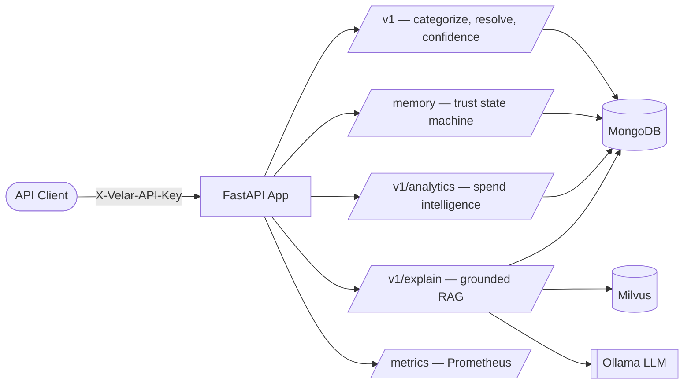

<div align="center">


**Transaction Intelligence Engine — turning noisy financial text into explainable, structured insight.**

Velar ingests raw, messy transaction strings (UPI references, bank SMS, POS narrations) and turns them into canonical merchant identity, spend category, behavioral fingerprints, anomaly signals, and natural-language explanations — grounded in retrieved data, not guesswork.

[](https://www.python.org/)
[](https://fastapi.tiangolo.com/)
[](https://www.mongodb.com/)
[](https://milvus.io/)
[](https://www.docker.com/)
[](./docs/16-known-issues-tech-debt.md)

[Documentation](./docs/README.md) · [API Reference](./docs/api/README.md) · [Architecture](./docs/01-architecture.md) · [Known Issues](./docs/16-known-issues-tech-debt.md)

</div>

---

## Project Status

> **Pre-production, stabilized and hardened.** Velar's architecture is genuinely ambitious — a 15-phase pipeline from ingestion through explainability. Every critical/high/medium defect previously tracked in [`docs/16-known-issues-tech-debt.md`](./docs/16-known-issues-tech-debt.md) has been fixed and verified. On top of that, a full production-hardening/security audit — [`docs/21-production-hardening-audit.md`](./docs/21-production-hardening-audit.md) — closed real gaps: request-size limits, a concurrency race in the memory/trust engine, zero-to-real MongoDB indexes, a non-root multi-stage Docker build, CI with lint/test/dependency/secret/container scanning, and every known CVE in the pinned dependencies patched (verified via `pip-audit`). What remains open is genuine feature work requiring an infrastructure decision — a task queue for retraining, an ML observability platform — not bugs or hardening gaps; see that audit's §10 for the honest list of what's still ahead.

---

## Table of Contents

- [Overview](#overview)
- [Architecture](#architecture)
- [Features](#features)
- [Tech Stack](#tech-stack)
- [Folder Structure](#folder-structure)
- [Getting Started](#getting-started)
  - [Prerequisites](#prerequisites)
  - [Installation](#installation)
  - [Environment Variables](#environment-variables)
  - [Running Locally](#running-locally)
- [Development Workflow](#development-workflow)
- [Testing](#testing)
- [Deployment](#deployment)
- [API Overview](#api-overview)
- [Screenshots / API Preview](#screenshots--api-preview)
- [Known Limitations](#known-limitations)
- [Roadmap](#roadmap)
- [Contributing](#contributing)
- [License](#license)

---

## Overview

Most transaction-categorization systems either rely on brittle string matching or hand the whole problem to a single opaque LLM call. Velar takes a different approach: a layered pipeline where each stage has a single, well-defined responsibility —

- **Deterministic rules** handle the obvious cases fast and cheaply.
- **A trust/memory state machine** means a merchant isn't treated as reliable the first time it's seen — trust is earned over repeated encounters.
- **A confidence wall** actively rejects low-confidence or out-of-vocabulary predictions rather than letting a bad guess pollute analytics — *"Unknown" is treated as a valid, honest answer.*
- **A grounded RAG layer** explains categorizations in natural language, but is architecturally forbidden from answering unless it has real retrieved data to point to.

Velar is built as a single async FastAPI service backed by MongoDB (system of record) and Milvus (semantic vector search), with Ollama providing local/self-hosted embeddings and generation.

## Architecture



Velar's own code comments describe the system as a sequence of numbered **phases** — this isn't a documentation invention, it's how the codebase actually labels itself:

| Phase | Capability | Status |
|---|---|---|
| 1–3 | Rule-based categorization + noisy-text merchant resolution | Working |
| 4 | Memory / trust state machine (`EPHEMERAL → TEMPORARY → PERMANENT`) | Working |
| 5 | Confidence wall (reject low-confidence predictions) | Working |
| 6 | Behavioral feature extraction (amount, timing, frequency, periodicity) | Working; trigger via `POST /v1/pipelines/behavior/run-all` |
| 7 | Embeddings + Milvus vector search | Working; trigger via `POST /v1/pipelines/embeddings/sync` |
| 8 | UMAP + HDBSCAN clustering | Fixed; trigger via `POST /v1/pipelines/clustering/run` |
| 9 | Baseline ML model benchmarking | Script-only, synthetic data (real-data training is scoped future work) |
| 10 | Human feedback + active learning queue | Mounted at `POST /v1/feedback/`; retraining executor still pending (needs a task queue) |
| 11 | LoRA fine-tuning (FinBERT) | Script-only, synthetic data (real-data training is scoped future work) |
| 12 | Grounded RAG explainability | Working end-to-end |
| 13 | Spend analytics (patterns, subscriptions, trends, anomalies) | Working |
| 14 | Observability / drift monitoring | Stubbed — needs Evidently/MLflow integration (infra decision, not a bug) |
| 15 | API key authentication + rate limiting | Working — key is enforced, rate limit is live on `/v1/categorize` |

**Full architecture deep-dive, sequence diagrams, and per-folder/per-file references live in [`/docs`](./docs/README.md).**

## Features

| Feature | Endpoint(s) | Status |
|---|---|---|
| Deterministic merchant/category rule matching | `POST /v1/categorize` | Stable |
| Noisy UPI/bank text → canonical merchant resolution | `POST /v1/resolve` | Stable |
| Confidence-wall prediction gating | `POST /v1/confidence/evaluate` | Stable |
| Merchant trust/memory state tracking | `POST /memory/update`, `GET /memory/profile/{name}`, `GET /memory/state/{name}` | Stable |
| Spend breakdown by category & top merchants | `GET /v1/analytics/patterns/*` | Stable |
| Subscription detection | `GET /v1/analytics/subscriptions` | Needs backfill — run `POST /v1/pipelines/behavior/run-all` first |
| Real-time anomaly detection (z-score) | `POST /v1/analytics/anomaly/check` | Needs backfill — run `POST /v1/pipelines/behavior/run-all` first |
| Month-over-month trend | `GET /v1/analytics/trends/mom` | Stable |
| Human feedback + active learning queue | `POST /v1/feedback/` | Stable (retraining executor still pending — see Known Limitations) |
| Batch pipelines (behavior, embeddings, decay, graph, clustering) | `POST /v1/pipelines/*` | Stable; manually triggered (no scheduler yet) |
| Grounded, hallucination-resistant explanations | `POST /v1/explain` | Stable |
| Health check & Prometheus metrics | `GET /health`, `GET /metrics` | Stable |

Legend: **Stable** — working correctly and verified · **Needs backfill** — works, but depends on a manual step

## Tech Stack

| Layer | Technology |
|---|---|
| API Framework | [FastAPI](https://fastapi.tiangolo.com/) + [Uvicorn](https://www.uvicorn.org/) |
| Primary Database | [MongoDB](https://www.mongodb.com/) via [Motor](https://motor.readthedocs.io/) (async) |
| Vector Database | [Milvus](https://milvus.io/) via `pymilvus` |
| LLM / Embeddings | [Ollama](https://ollama.com/) (self-hosted inference) |
| Rate Limiting | [SlowAPI](https://github.com/laurentS/slowapi) |
| Metrics | [prometheus-fastapi-instrumentator](https://github.com/trallnag/prometheus-fastapi-instrumentator) |
| Classical ML | scikit-learn, LightGBM, XGBoost, SHAP |
| Deep Learning | PyTorch, HuggingFace Transformers, PEFT (LoRA) |
| Dimensionality Reduction / Clustering | UMAP, HDBSCAN |
| Graph Modeling | NetworkX |
| Configuration | Pydantic Settings (`.env`-driven) |
| Containerization | Docker, Docker Compose |
| Testing | pytest, FastAPI `TestClient` |

## Folder Structure

```
backend/
├── app.py                    # FastAPI entry point, lifespan, router mounting
├── core/                     # Config, security (auth), rate limiting, Ollama client
├── database/                 # MongoDB + Milvus connection singletons
├── models/                   # Shared Pydantic schemas & enums
├── routers/                  # HTTP controllers (v1, memory, analytics, rag, observability)
├── engines/                  # Rule engine (Phase 1-2) + confidence wall (Phase 5)
├── services/                 # Noisy-text merchant resolver (Phase 3)
├── memory/                   # Trust state machine + decay engine (Phase 4)
├── repositories/             # Data-access layer for merchant profiles
├── features/                 # Statistical feature extractors (Phase 6)
├── behaviour/                # Behavior-profiling orchestrator (Phase 6)
├── embeddings/                # Text → vector generation (Phase 7)
├── milvus/                   # Vector store insert/search (Phase 7)
├── clustering/                # UMAP + HDBSCAN discovery pipeline (Phase 8)
├── training/                  # Baseline ML + LoRA fine-tuning pipelines (Phase 9, 11)
├── evaluation/                 # Shared ML metrics (accuracy, F1, ECE, SHAP)
├── feedback/                   # Human feedback + retraining queue (Phase 10)
├── rag/                        # Grounded explainability pipeline (Phase 12)
├── analytics/                  # Spend patterns, subscriptions, trends, anomalies (Phase 13)
├── graphs/                     # Cross-collection knowledge graph (NetworkX)
├── scripts/                    # Seed data, mock data, manual E2E smoke test
├── docs/                       # Full documentation portal (architecture, API, per-file/folder deep dives)
├── test_api.py                 # pytest suite
├── merchant_aliases.json       # Static rule-engine lookup table
├── Dockerfile
├── docker-compose_local.yaml
└── docker-compose_production.yaml
```

**For a deep dive into any single folder or file** — purpose, classes, dependency graphs, interview questions, and what breaks if it's removed — see [`docs/folders/`](./docs/folders/README.md) and [`docs/files/`](./docs/files/README.md).

## Getting Started

### Prerequisites

- Python **3.12** (the `Dockerfile` is pinned to `python:3.12-slim`)
- [Docker](https://www.docker.com/) & Docker Compose (recommended path)
- An [Ollama](https://ollama.com) install on your host, with an embedding model and a generation model pulled (e.g. `ollama pull nomic-embed-text && ollama pull llama3`)

> **Note:** `docker-compose_local.yaml` provisions MongoDB **and** a full Milvus standalone stack (etcd + minio + milvus) — `docker compose -f docker-compose_local.yaml up --build` is enough on its own for those two. Only Ollama is left to run on the host: GPU passthrough into a container isn't worth it for local dev, and the compose file wires `host.docker.internal` so the backend container can reach it.

### Installation

```bash
git clone https://github.com/lokeshramchand-ctrl/backend.git velar
cd velar

python -m venv .venv
source .venv/bin/activate        # Windows: .venv\Scripts\activate
```

`requirements.txt` now lists this project's actual runtime dependencies (previously it only listed unrelated OS/`apt`-level packages):

```bash
pip install -r requirements.txt
```

The `torch`/`transformers`/`peft`/`datasets` fine-tuning stack is included but only needed if you plan to run `training/finetune.py`; it's a large download, so skip it if you're just running the API.

### Environment Variables

Copy the committed template and fill in the blanks:

```bash
cp .env.example .env
```

[`.env.example`](./.env.example) documents every setting `core/config.py` reads, with local-dev-appropriate defaults already filled in (Docker service hostnames, TLS disabled for the local Mongo container, `ENFORCE_HTTPS=false`, etc.) and the handful you must still replace yourself (`VELAR_API_KEY`, `JWT_SECRET_KEY`, `EMBED_MODEL`/`LLM_MODEL`) called out inline. The subset that's actually required — no default, app refuses to start without it — is:

| Variable | Notes |
|---|---|
| `MONGODB_URI` | Full MongoDB connection string |
| `MILVUS_URI` | |
| `EMBED_MODEL` | Ollama embedding model name — must be pulled in your local Ollama already |
| `LLM_MODEL` | Ollama generation model name — must be pulled in your local Ollama already |
| `VELAR_API_KEY` | Enforced on every non-public route via `X-Velar-API-Key`; any non-empty string works locally |
| `JWT_SECRET_KEY` | Must be ≥ 32 chars — generate with `openssl rand -hex 32` |

Everything else in `.env.example` (rate limits, upload size caps, device attestation, request signing, …) has a safe default and can be left as-is for local development.

The app **fails fast at startup** if any required variable is missing — this is deliberate, not a bug.

### Running Locally

**Option A — Docker Compose (MongoDB + Milvus + the backend itself; bring your own Ollama on the host):**
```bash
docker compose -f docker-compose_local.yaml up --build
```

**Option B — Manual (infra in Docker, backend on the host):**
```bash
# 1. Start just the infra containers
docker compose -f docker-compose_local.yaml up mongodb etcd minio milvus

# 2. Seed canonical merchant data (optional but recommended)
python scripts/seed.py

# 3. Start the server — remember to switch MONGODB_URI/MILVUS_URI to the
#    `localhost` variants in your .env (see comments in .env.example)
uvicorn app:app --reload --host 0.0.0.0 --port 8000
```

**Verify it's up:**
```bash
curl http://localhost:8000/health
```

**Explore the interactive API docs** (auto-generated by FastAPI) at **http://localhost:8000/docs**.

## Development Workflow

This repository doesn't currently ship a linter config, formatter config, or CI pipeline — the recommendations below are conventional best practice for a project at this stage, not enforced tooling:

1. **Branch from `main`** — `git checkout -b feature/your-change`.
2. **Make focused commits** — one logical change per commit, with a message describing *why*, not just *what*.
3. **Run the test suite** before opening a PR (see [Testing](#testing)) — note the suite currently requires live MongoDB and Milvus connections.
4. **Cross-check `docs/16-known-issues-tech-debt.md`** before touching a file — several modules have documented, non-obvious defects; fixing one is a great first contribution.
5. **Open a pull request** against `main` with a clear description of the change and its motivation.

Consider adding `ruff`/`black` + a pre-commit hook and a CI workflow (`.github/workflows/`) as immediate, high-value process improvements — see [Roadmap](#roadmap).

## Testing

```bash
# Full suite (requires live MongoDB + Milvus)
pytest test_api.py -v

# Manual, narrated end-to-end smoke test against a running server
bash scripts/test_pipeline.sh
```

The `pytest` suite uses FastAPI's `TestClient` against the real app object, so it genuinely exercises the app's `lifespan` (real database connections) rather than mocking them — see [`docs/15-testing.md`](./docs/15-testing.md) for a full breakdown of what each test covers and its current pass/fail status.

## Deployment

**Build and run with Docker:**
```bash
docker build -t velar-backend .
docker run -p 8000:8000 --env-file .env velar-backend
```

**Or via Compose** (`docker-compose_production.yaml` targets an external Coolify network — adapt for your own infrastructure):
```bash
docker compose -f docker-compose_production.yaml up -d --build
```

> **Important:** `docker-compose_production.yaml` no longer contains a hardcoded credential or mismatched env var names — it now reads `MONGODB_URI`, `MILVUS_URI`, `EMBED_MODEL`, `LLM_MODEL`, and `VELAR_API_KEY` from a compose `.env` file or your CI/host secret store, matching `core/config.py` exactly. **If you have ever deployed the previous version of this file**, treat the credential it contained as compromised and rotate it on your MongoDB server — removing it from the tracked file does not undo its exposure in git history.

## API Overview

All endpoints except `/health` and `/metrics` require the header `X-Velar-API-Key`.

| Method | Endpoint | Purpose |
|---|---|---|
| `GET` | `/health` | Liveness + dependency status |
| `GET` | `/metrics` | Prometheus metrics |
| `POST` | `/v1/categorize` | Rule-based categorization |
| `POST` | `/v1/resolve` | Noisy-text → canonical merchant |
| `POST` | `/v1/confidence/evaluate` | Confidence-wall evaluation |
| `POST` | `/memory/update` | Record a merchant encounter |
| `GET` | `/memory/profile/{name}` | Fetch a merchant's full trust profile |
| `GET` | `/memory/state/{name}` | Fetch just trust state + frequency |
| `GET` | `/v1/analytics/patterns/categories` | Spend by category |
| `GET` | `/v1/analytics/patterns/merchants` | Top merchants by visits |
| `GET` | `/v1/analytics/subscriptions` | Detected recurring subscriptions |
| `GET` | `/v1/analytics/trends/mom` | Month-over-month spend trend |
| `POST` | `/v1/analytics/anomaly/check` | Real-time anomaly check |
| `POST` | `/v1/explain` | Grounded RAG explanation |
| `POST` | `/v1/feedback/` | Submit human correction feedback |
| `POST` | `/v1/pipelines/behavior/run`, `/run-all` | Run behavior profiling (one merchant / all) |
| `POST` | `/v1/pipelines/embeddings/sync` | Generate + store Milvus embeddings for behavior patterns |
| `POST` | `/v1/pipelines/decay/sweep` | Archive stale (180+ day) merchant profiles |
| `POST` | `/v1/pipelines/graph/build` | Rebuild the in-memory knowledge graph |
| `GET` | `/v1/pipelines/graph/neighborhood/{merchant_name}` | Ego-graph around a merchant |
| `POST` | `/v1/pipelines/clustering/run` | Run the UMAP + HDBSCAN discovery pipeline |
| `POST` | `/v1/observability/drift/analyze` | Drift analysis (stub) |
| `GET` | `/v1/observability/reports/latest` | Latest drift report (stub) |

**Full per-endpoint documentation** — headers, validation rules, exact database queries, sequence diagrams, and example requests/responses — lives in [`docs/api/`](./docs/api/README.md).

## Screenshots / API Preview

Velar is a headless JSON API with no bundled frontend, so there's no UI to screenshot. The closest equivalent:

**Interactive API docs** — every endpoint is explorable and testable live at `/docs` (Swagger UI) and `/redoc` once the server is running:
```
http://localhost:8000/docs
```

**Example interaction:**
```bash
$ curl -s -X POST http://localhost:8000/v1/resolve \
    -H "X-Velar-API-Key: your-secret-key-here" \
    -H "Content-Type: application/json" \
    -d '{"text": "UPI/CR/3152671239/BUNDL TECHNOLOGIES/HDFC"}'
```
```json
{
  "raw_text": "UPI/CR/3152671239/BUNDL TECHNOLOGIES/HDFC",
  "cleaned_text": "BUNDL TECHNOLOGIES",
  "canonical_merchant": "Swiggy",
  "confidence": 0.99,
  "is_resolved": true,
  "resolution_method": "exact_alias"
}
```

## Known Limitations

Velar is transparent about its own maturity. The full, continuously-maintained list lives in [`docs/16-known-issues-tech-debt.md`](./docs/16-known-issues-tech-debt.md) — every previously-tracked defect there has been fixed and verified. What's left is genuine feature work requiring an infrastructure decision, not bugs:

- **The retraining queue has no executor.** Corrections accumulate and get marked `"processing"` once the threshold is hit, but nothing actually retrains a model yet — that needs a task queue (Celery + broker), which is an infra decision for whoever operates this.
- **`training/train.py` and `training/finetune.py` train on synthetic data**, not real feedback/transaction data — their docstrings describe the intended MongoDB queries, but that data-assembly pipeline isn't built yet.
- **Observability endpoints are stubs** — no Evidently AI / MLflow integration exists yet.
- **No caching layer yet** — nothing in current traffic patterns demonstrably needs one; MongoDB indexes now exist (see [21 · Production Hardening Audit](./docs/21-production-hardening-audit.md)), a cache is separate follow-up work once a real hot path is measured.
- **The new `/v1/pipelines/*` endpoints are manually triggered** — nothing schedules them yet (no cron/Celery beat in this repo).
- **No per-caller authorization** — every request bearing the single shared `VELAR_API_KEY` gets identical access; real multi-tenancy is a scoped feature, not a hardening tweak.

## Roadmap

- [ ] Stand up a task queue (Celery + broker) and wire the retraining executor to it
- [ ] Build a real MongoDB-backed training data pipeline for `training/train.py` and `training/finetune.py`
- [ ] Schedule `/v1/pipelines/*` (behavior, embeddings, decay, graph, clustering) on a cron/Celery beat instead of manual triggers
- [ ] Wire real Evidently AI / MLflow observability instead of the current stubs
- [ ] Add a LICENSE (CI — lint/test/dependency/secret/container scanning — is now in place, see [21 · Production Hardening Audit](./docs/21-production-hardening-audit.md))
- [ ] Introduce a caching layer once a real hot query pattern is measured
- [ ] Real multi-tenancy: per-caller API keys with actual scoping, instead of one shared key

## Contributing

Contributions are welcome. Since this project doesn't yet have a formal `CONTRIBUTING.md` or CI gate:

1. Fork the repository and create a feature branch off `main`.
2. Cross-reference [`docs/16-known-issues-tech-debt.md`](./docs/16-known-issues-tech-debt.md) — many great first contributions are already identified and scoped there.
3. Add or update tests in `test_api.py` for any behavioral change.
4. Open a pull request with a clear description of the problem and the fix.
5. Be explicit in your PR description about what you tested and how, given the current lack of CI.

## License

**No license file is currently present in this repository.** Until one is added, all rights are reserved by default under standard copyright law — this code should not be assumed to be open-source-licensed for reuse, modification, or redistribution. If open-source distribution is intended, adding a `LICENSE` file (e.g., MIT, Apache 2.0) is a recommended near-term action — see [Roadmap](#roadmap).

---

<div align="center">

Built as a demonstration of layered, explainable financial ML architecture.
For the complete technical documentation set, start at [`docs/README.md`](./docs/README.md).

</div>
