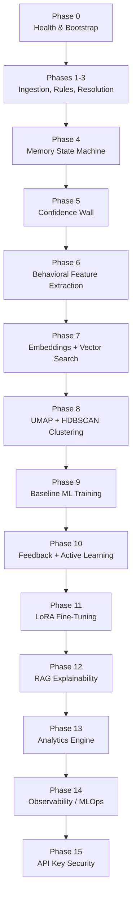
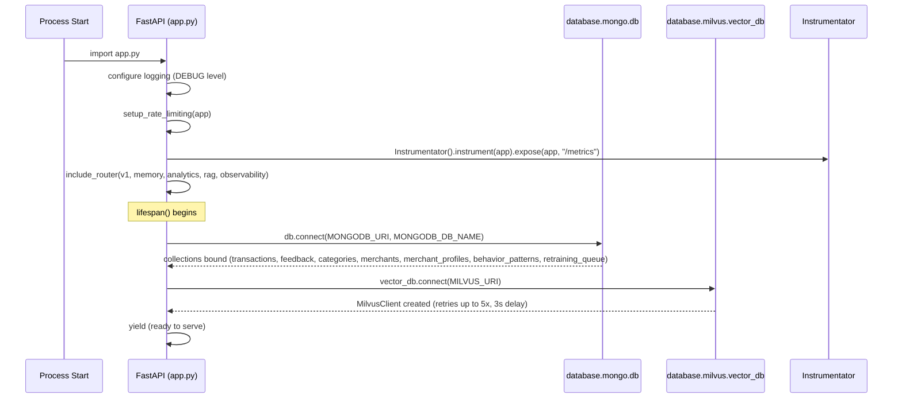
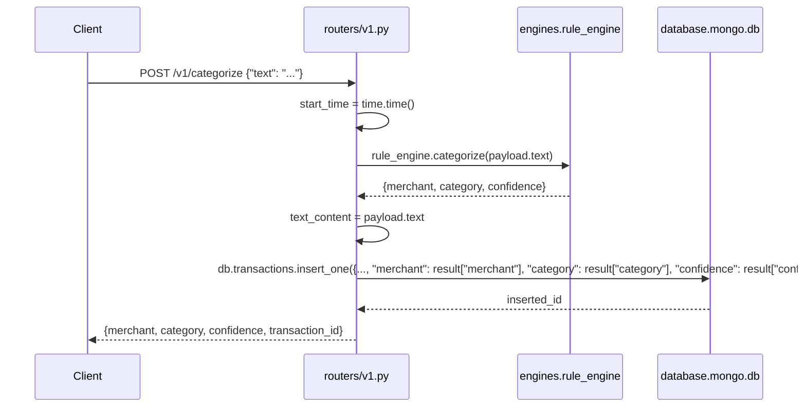
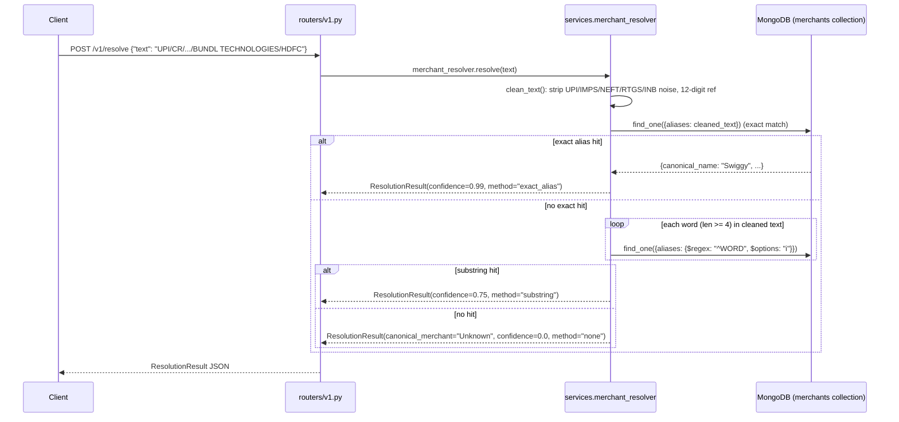
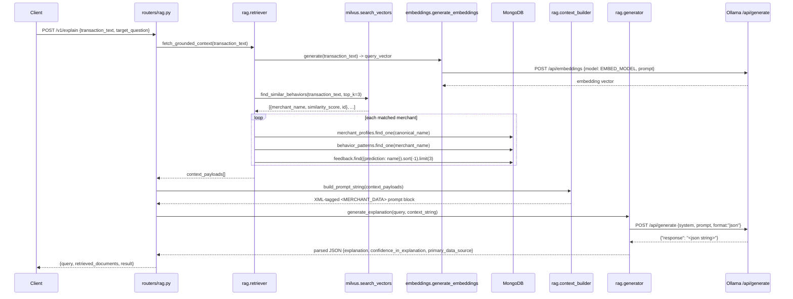
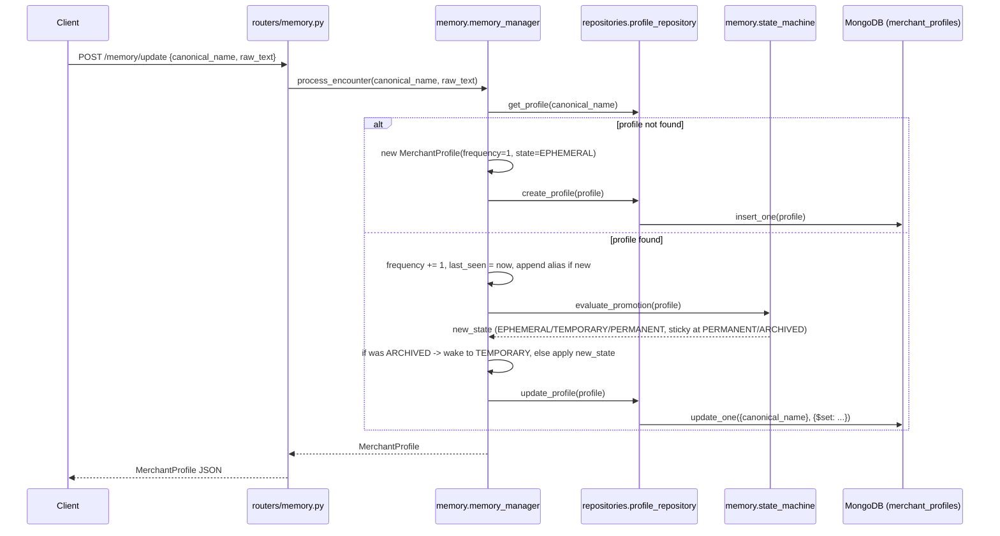

# 01 · Architecture

## 1.1 Overview

Velar is a single FastAPI service (`app.py`) that fronts two datastores (MongoDB, Milvus) and one external inference server (Ollama). It is **not** a microservice mesh — every router, engine, and ML component documented here runs in the same Python process, in the same container. There is no message queue, no Celery worker, and no separate training service actually wired up in this codebase, despite comments referencing them (see [16 · Known Issues](./16-known-issues-tech-debt.md)).

The codebase is organized as a linear sequence of "Phases," visible directly in source comments. Each phase builds on data produced by the previous one:

Only a subset of these phases are reachable over HTTP today. The rest exist as importable Python modules intended to be invoked by scripts, cron jobs, or a future orchestrator (Celery is referenced in comments but is not a dependency of this codebase, and no scheduler is wired up).

## 1.2 Process topology

`app.py`'s `lifespan` context manager is the composition root: on startup it calls `db.connect(...)` (`database/mongo.py`), then `vector_db.connect(...)` (`database/milvus.py`), then `vector_store.ensure_collections()` (`milvus/insert_vectors.py`); on shutdown it calls the corresponding `disconnect()` methods. `db` and `vector_db` are process-wide singletons (class-level attributes on `MongoDB` and `VectorDB`), so there is exactly one Mongo client and one Milvus client per process, shared by every request via plain module import (`from database.mongo import db`), not FastAPI dependency injection.

✅ **FIXED** — `milvus/insert_vectors.py`'s `VectorStoreManager` previously constructed its **own** independent `MilvusClient` at import time, reading `MILVUS_URI` directly from `os.getenv` rather than `core.config.settings`, giving the process two separate, differently-configured Milvus connections. `VectorStoreManager` no longer opens a connection itself — its `client` property now delegates to `vector_db.client`, the single lifespan-managed connection, and `ensure_collections()` (called once from `lifespan`, after `vector_db.connect()`) replaces the old eager-connect-at-import behavior. This also closed a real startup-stability gap: the old code made a blocking network call with no retry the moment any module importing it was loaded (e.g. via `routers.rag`), so a briefly-unreachable Milvus used to crash the whole app at import time, not just the vector-search feature. See [16 · Known Issues §16.3](./16-known-issues-tech-debt.md#163-medium-previously-disconnected-features-dead-code-silent-no-ops--fixed).

## 1.3 Request flow — application startup

## 1.4 Request flow — `/v1/categorize` (rule-based categorization)

This is the primary ingestion endpoint. ✅ Previously it raised an exception on every call (documented in [16 · Known Issues](./16-known-issues-tech-debt.md#161-critical-previously-broke-the-application-or-a-whole-feature--all-fixed)) — that's fixed; the flow below reflects the current, working code.

`RuleEngine.categorize` itself (`engines/rule_engine.py`) is a clean, deterministic implementation:

1. On startup, loads `merchant_aliases.json` into memory and pre-compiles a `\b<alias>\b` case-insensitive regex per alias.
2. `categorize(text)` scans compiled patterns in dict-insertion order and returns the **first** alias match with `confidence: 0.95`.
3. No match → `{"merchant": "Unknown", "category": "Uncategorized", "confidence": 0.0}`.

## 1.5 Request flow — `/v1/resolve` (merchant resolution)

This is the working, well-formed counterpart to `/v1/categorize` for noisy bank/UPI text.

## 1.6 Request flow — `/v1/explain` (RAG explainability)

If Milvus returns zero hits, `fetch_grounded_context` returns `[]`, `build_prompt_string` returns the literal string `"NO_CONTEXT_AVAILABLE"`, and `generate_explanation` short-circuits with `{"error": "No historical behavior found to explain this transaction."}` **without calling Ollama** — this is the system's core hallucination-prevention guarantee.

## 1.7 Request flow — `/memory/update` (state machine)

State thresholds (`memory/state_machine.py`): `frequency >= 10` → `PERMANENT`; `frequency >= 3` → `TEMPORARY`; otherwise `EPHEMERAL`. `PERMANENT` and `ARCHIVED` are treated as non-demotable by `evaluate_promotion`, but `MemoryManager.process_encounter` explicitly overrides an `ARCHIVED` profile back to `TEMPORARY` on any new encounter (bypassing `evaluate_promotion`'s own state machine for that one transition).

## 1.8 Security & rate limiting

- **Auth — two independent layers**: every router except `/health`, `/live`, `/ready`, and `/metrics` is mounted with `dependencies=[Depends(validate_api_key)]` in `app.py`, unchanged from before. `validate_api_key` (`core/security.py`) checks the `X-Velar-API-Key` header against `settings.VELAR_API_KEY` — this authenticates the *calling application* (the one trusted client consuming this backend), not an individual end user.

  A second, independent layer authenticates the *end user* within that application boundary: `core/jwt_auth.py::get_current_user` validates a `Authorization: Bearer <JWT>` access token and resolves it to a `User` document. Unlike the API key (attached once per router via `dependencies=[...]`), this is bound explicitly as a handler parameter — `current_user: User = Depends(get_current_user)` — only on the specific endpoints that need to know *which* user is calling: `POST /auth/me`/`/auth/logout` implicitly via the token, `POST /v1/categorize`, every `GET /v1/analytics/*`, and `POST /v1/feedback/`. Endpoints that operate on data that isn't scoped to one user (`/v1/resolve`, `/v1/confidence/evaluate`, `/v1/explain`, `/memory/*`, `/v1/pipelines/*`, `/v1/observability/*`, `/v1/analytics/anomaly/check`) stay API-key-only, exactly as before.

  The two layers compose independently and are both enforced whenever both are declared: the router-level API-key dependency runs regardless of what any individual handler additionally requires, so a genuine JWT presented without the API key is rejected before a handler runs, and a valid API key alone is not sufficient on a JWT-protected handler. See [22 · Authentication](./22-authentication.md) for the full endpoint-by-endpoint breakdown, token lifecycle, and password/refresh-token storage design.

- **Rate limiting**: SlowAPI (`core/rate_limiter.py`) applies a global default of `1000/day` and `100/minute` per client IP (`get_remote_address`). `POST /v1/categorize` additionally declares `@limiter.limit("50/minute")`. `POST /auth/register`, `/auth/login`, and `/auth/refresh`/`/auth/logout` declare their own tighter limits (`5/minute`, `10/minute`, `20/minute` respectively) — see [22 · Authentication §22.6](./22-authentication.md#226-rate-limiting).
- **Metrics**: `prometheus_fastapi_instrumentator` auto-instruments every route and exposes `GET /metrics` with no auth dependency.

## 1.9 Batch pipelines — now reachable via `/v1/pipelines/*`

The following modules are fully implemented but have no natural scheduler in this repo (no Celery/cron exists here). Rather than leaving them reachable only via direct import/script invocation, each is now exposed as a manually-triggered endpoint under `routers/pipelines.py` (mounted at `/v1/pipelines`, same auth as every other router) — see [02 · API Reference §2.9](./02-api-reference.md#29-batch-pipelines-routerspipelinespy-prefix-v1pipelines) for full request/response detail:

| Module | Singleton | Reachable via |
|---|---|---|
| `behaviour/behavior_engine.py` | `behavior_engine` | `POST /v1/pipelines/behavior/run`, `/run-all` |
| `clustering/cluster_engine.py` | `cluster_engine` | `POST /v1/pipelines/clustering/run` (imported lazily so a missing `umap-learn`/`scikit-learn` install only breaks this endpoint) |
| `memory/decay_engine.py` | `decay_engine` | `POST /v1/pipelines/decay/sweep` |
| `graphs/graph_builder.py` | `graph_engine` | `POST /v1/pipelines/graph/build`, `GET /v1/pipelines/graph/neighborhood/{name}` |
| `embeddings/*` + `milvus/insert_vectors.py` | n/a | `POST /v1/pipelines/embeddings/sync` |
| `feedback/api_router.py` | `router` | Mounted in `app.py`; reachable at `/v1/feedback/` |
| `training/train.py` | `BaselineTrainer` (script entry point only) | Manual `python training/train.py` — intentionally not exposed as an endpoint; see below |
| `training/finetune.py` | `FinetuneEngine` (script entry point only) | Manual `python training/finetune.py` — intentionally not exposed as an endpoint; see below |

`training/*` are deliberately **not** wired to an endpoint: both currently train on synthetic/mock data rather than real feedback, and `BaselineTrainer.run_benchmarks()` is a long-running, CPU-heavy synchronous job that would block the event loop if called from a request handler. Exposing either as-is would look "fixed" while actually being misleading — see [16 · Known Issues §16.5](./16-known-issues-tech-debt.md#165-whats-intentionally-still-open-productinfra-decisions-not-bugs).

Operationally: in a fresh environment, run `POST /v1/pipelines/behavior/run-all` before expecting real results from `/v1/analytics/subscriptions` or `/v1/analytics/anomaly/check`, and run it followed by `POST /v1/pipelines/embeddings/sync` before expecting `/v1/explain` to retrieve real grounded context. Nothing runs these automatically yet — that requires a scheduler, which is a separate infra decision.
