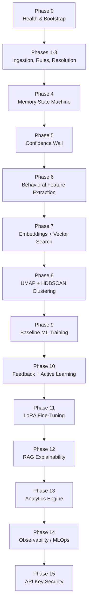
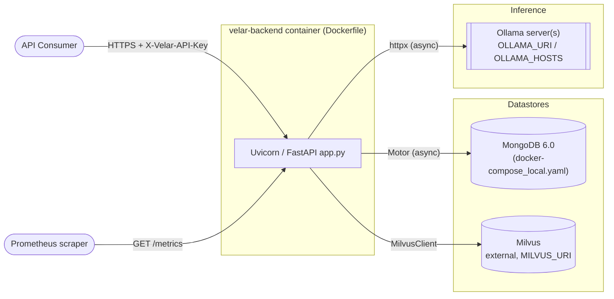
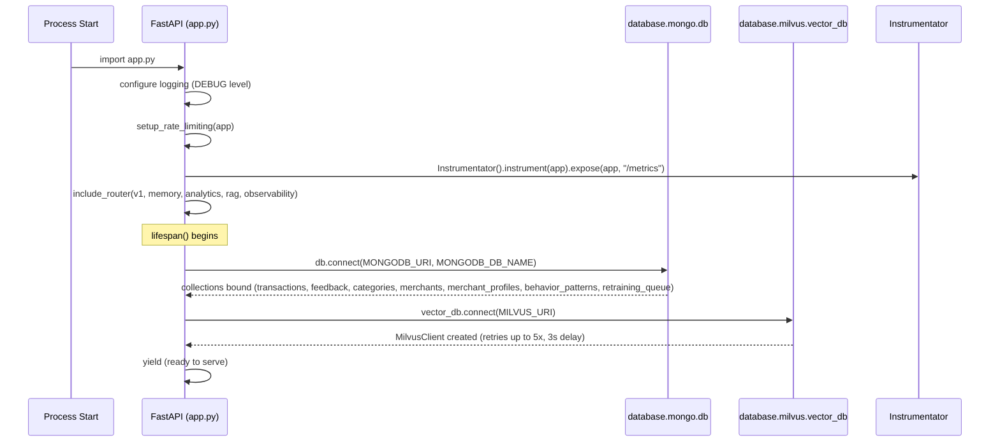
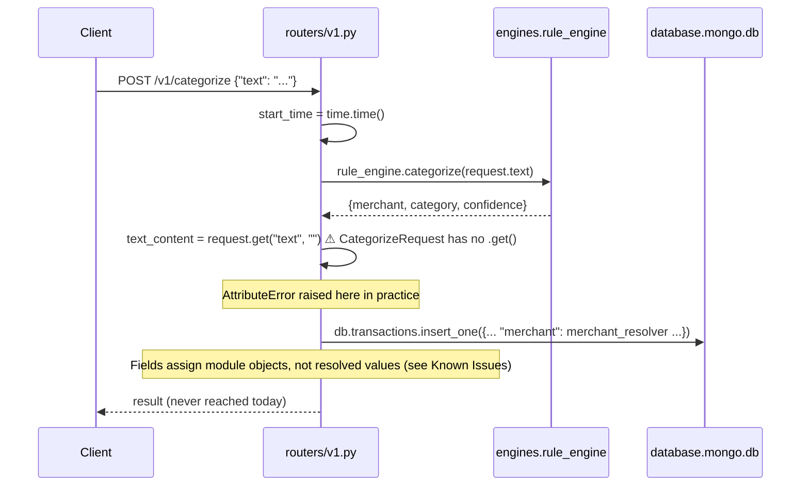
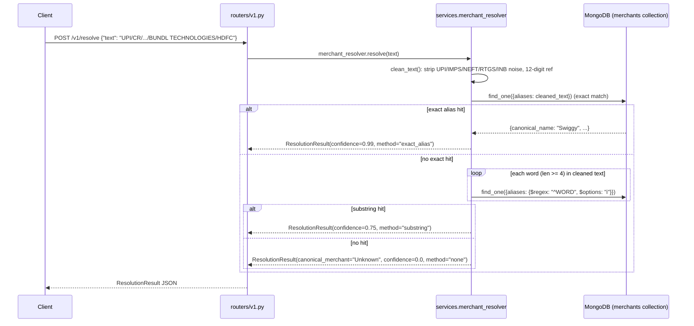
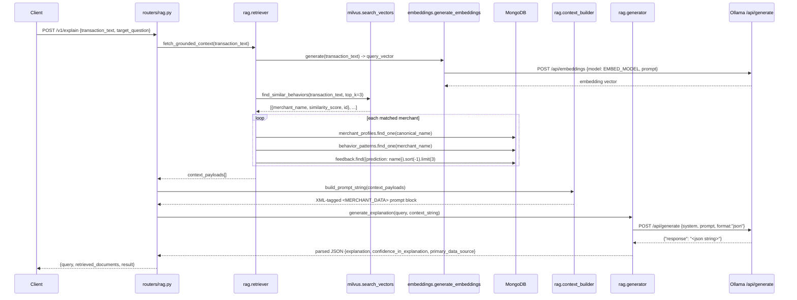
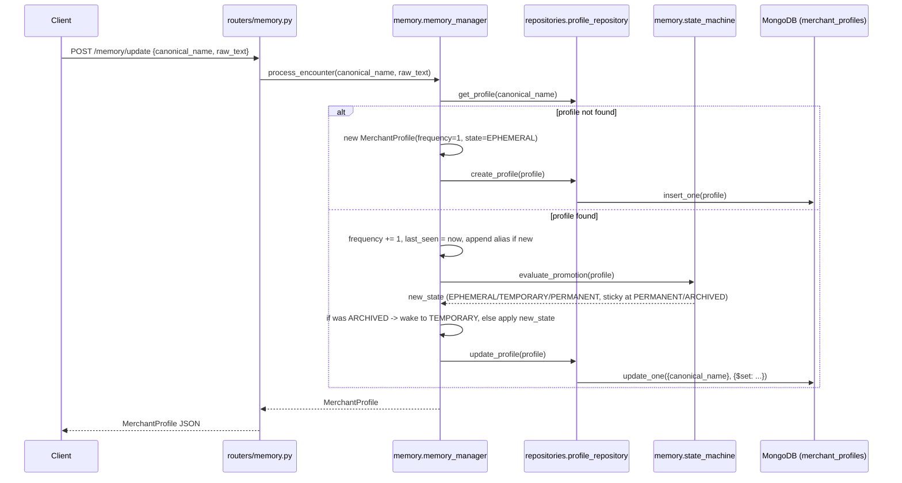

# 01 · Architecture

## 1.1 Overview

Velar is a single FastAPI service (`app.py`) that fronts two datastores (MongoDB, Milvus) and one external inference server (Ollama). It is **not** a microservice mesh — every router, engine, and ML component documented here runs in the same Python process, in the same container. There is no message queue, no Celery worker, and no separate training service actually wired up in this codebase, despite comments referencing them (see [16 · Known Issues](./16-known-issues-tech-debt.md)).

The codebase is organized as a linear sequence of "Phases," visible directly in source comments. Each phase builds on data produced by the previous one:

Only a subset of these phases are reachable over HTTP today. The rest exist as importable Python modules intended to be invoked by scripts, cron jobs, or a future orchestrator (Celery is referenced in comments but is not a dependency of this codebase, and no scheduler is wired up).

## 1.2 Process topology

`app.py`'s `lifespan` context manager is the composition root: on startup it calls `db.connect(...)` (`database/mongo.py`) and `vector_db.connect(...)` (`database/milvus.py`); on shutdown it calls the corresponding `disconnect()` methods. Both `db` and `vector_db` are process-wide singletons (class-level attributes on `MongoDB` and `VectorDB`), so there is exactly one Mongo client and one Milvus client per process, shared by every request via plain module import (`from database.mongo import db`), not FastAPI dependency injection.

Note: `milvus/insert_vectors.py` constructs its **own** independent `MilvusClient` at import time (`vector_store = VectorStoreManager()`), reading `MILVUS_URI` directly from `os.getenv` rather than from `core.config.settings` or the `database.milvus.vector_db` singleton. This means the application can end up with **two separate Milvus client connections** — one managed by the app lifespan (`vector_db`, currently unused by any router) and one created eagerly at import time by `VectorStoreManager` (actually used by clustering and vector search). See [16 · Known Issues](./16-known-issues-tech-debt.md#duplicate-milvus-clients).

## 1.3 Request flow — application startup

## 1.4 Request flow — `/v1/categorize` (rule-based categorization)

This is the primary ingestion endpoint. **It currently contains a fatal implementation bug** (documented below and in [16 · Known Issues](./16-known-issues-tech-debt.md#v1-categorize-is-broken)) that will raise an exception before returning a response; the flow below reflects the code as written.

`RuleEngine.categorize` itself (`engines/rule_engine.py`) is a clean, deterministic implementation:

1. On startup, loads `merchant_aliases.json` into memory and pre-compiles a `\b<alias>\b` case-insensitive regex per alias.
2. `categorize(text)` scans compiled patterns in dict-insertion order and returns the **first** alias match with `confidence: 0.95`.
3. No match → `{"merchant": "Unknown", "category": "Uncategorized", "confidence": 0.0}`.

## 1.5 Request flow — `/v1/resolve` (merchant resolution)

This is the working, well-formed counterpart to `/v1/categorize` for noisy bank/UPI text.

## 1.6 Request flow — `/v1/explain` (RAG explainability)

If Milvus returns zero hits, `fetch_grounded_context` returns `[]`, `build_prompt_string` returns the literal string `"NO_CONTEXT_AVAILABLE"`, and `generate_explanation` short-circuits with `{"error": "No historical behavior found to explain this transaction."}` **without calling Ollama** — this is the system's core hallucination-prevention guarantee.

## 1.7 Request flow — `/memory/update` (state machine)

State thresholds (`memory/state_machine.py`): `frequency >= 10` → `PERMANENT`; `frequency >= 3` → `TEMPORARY`; otherwise `EPHEMERAL`. `PERMANENT` and `ARCHIVED` are treated as non-demotable by `evaluate_promotion`, but `MemoryManager.process_encounter` explicitly overrides an `ARCHIVED` profile back to `TEMPORARY` on any new encounter (bypassing `evaluate_promotion`'s own state machine for that one transition).

## 1.8 Security & rate limiting

- **Auth**: every router except `/health` and `/metrics` is mounted with `dependencies=[Depends(validate_api_key)]` in `app.py`. `validate_api_key` (`core/security.py`) checks the `X-Velar-API-Key` header against a single **hardcoded** string, `"velar_test_key_123"` — it does not read `settings.VELAR_API_KEY` from config at all, despite that setting existing in `core/config.py` and being required in `.env`. See [16 · Known Issues](./16-known-issues-tech-debt.md#hardcoded-api-key).
- **Rate limiting**: SlowAPI (`core/rate_limiter.py`) applies a global default of `1000/day` and `100/minute` per client IP (`get_remote_address`). `POST /v1/categorize` (the top-level public route registered directly on `app`, not the router-mounted one) additionally declares `@limiter.limit("50/minute")`.
- **Metrics**: `prometheus_fastapi_instrumentator` auto-instruments every route and exposes `GET /metrics` with no auth dependency.

## 1.9 What is *not* wired into the HTTP surface

The following modules are fully implemented Python classes with module-level singletons, but **no router calls them**. They are reachable only by importing them directly (e.g., from a script, notebook, or future endpoint):

| Module | Singleton | Would be invoked by |
|---|---|---|
| `behaviour/behavior_engine.py` | `behavior_engine` | Phase 6 batch job to populate `behavior_patterns` |
| `clustering/cluster_engine.py` | `cluster_engine` | Phase 8 discovery pipeline |
| `memory/decay_engine.py` | `decay_engine` | A scheduled sweep (no scheduler exists in this repo) |
| `training/train.py` | `BaselineTrainer` (script entry point only) | Manual `python training/train.py` |
| `training/finetune.py` | `FinetuneEngine` (script entry point only) | Manual `python training/finetune.py` |
| `graphs/graph_builder.py` | `graph_engine` | No caller found anywhere in the repo |
| `feedback/api_router.py` | mounted `router`, but **never `include_router`'d in `app.py`** | Not reachable over HTTP at all today |

This matters operationally: analytics endpoints (`/v1/analytics/subscriptions`, `/v1/analytics/anomaly/check`) read from the `behavior_patterns` collection, but nothing in the live HTTP path ever populates it — only the disconnected `behavior_engine.profile_merchant_behavior()` does. In a fresh environment, these analytics endpoints will return empty/degenerate results until someone runs the behavior engine out-of-band.
