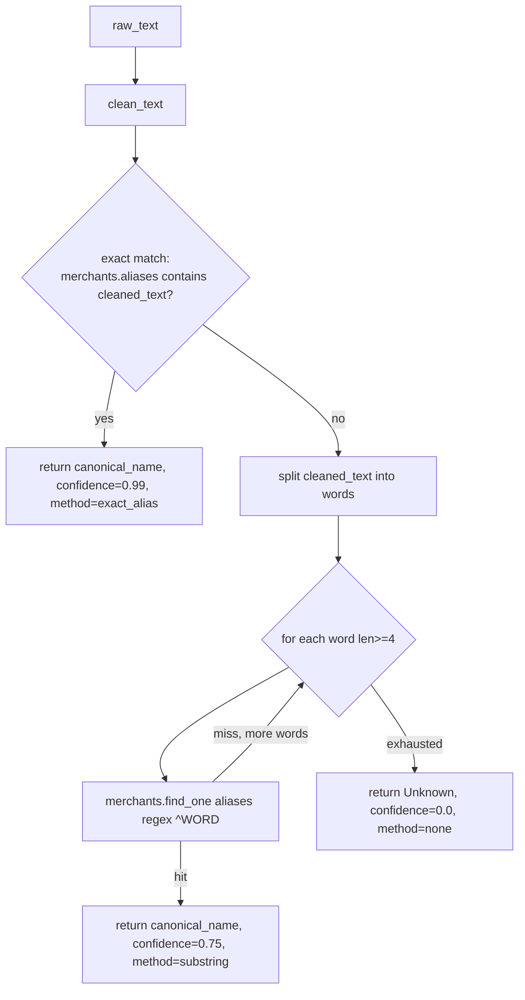
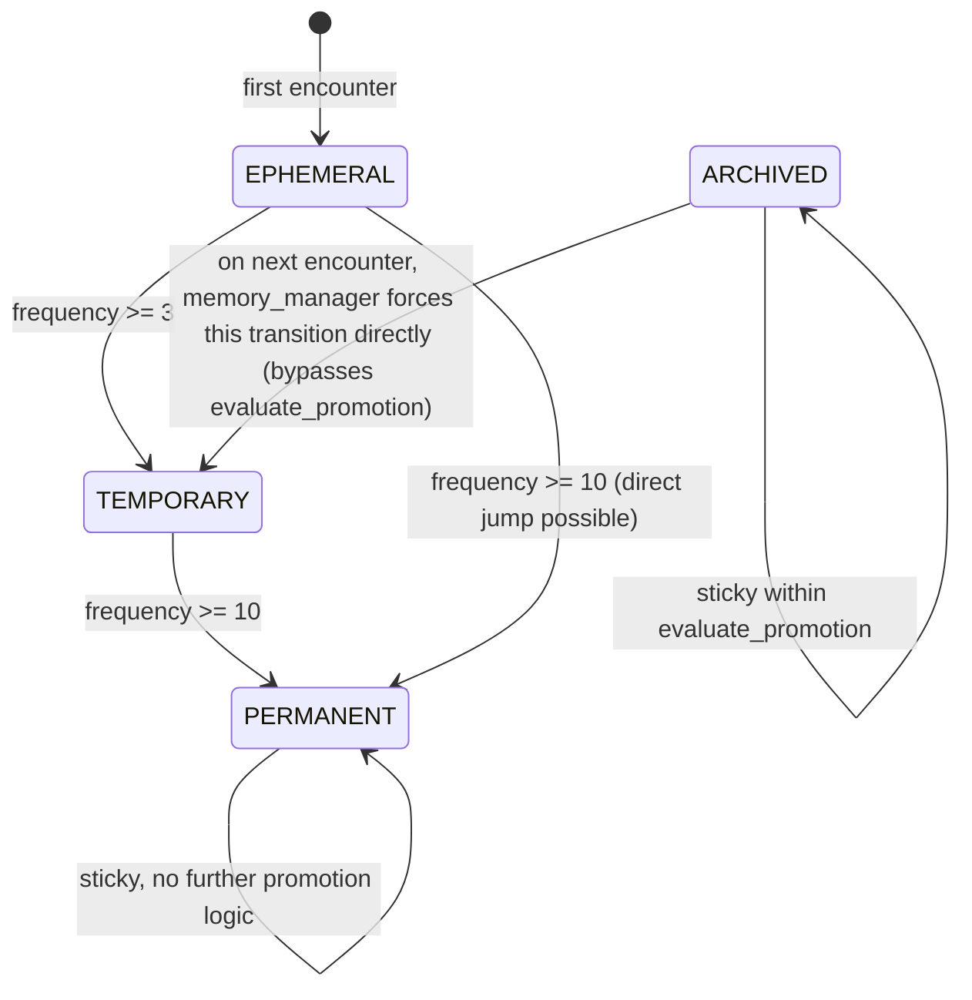

# 05 · Ingestion, Resolution & Memory (Phases 1–4)

## 5.1 Phase 1–2: Rule Engine — `engines/rule_engine.py`

The `RuleEngine` is a deterministic dictionary-lookup classifier, seeded from `merchant_aliases.json` (repo root):

```json
{
  "swiggy": { "merchant": "Swiggy", "category": "Food" },
  "zomato": { "merchant": "Zomato", "category": "Food" },
  "uber": { "merchant": "Uber", "category": "Travel" },
  "ola": { "merchant": "Ola", "category": "Travel" },
  "netflix": { "merchant": "Netflix", "category": "Subscription" },
  "spotify": { "merchant": "Spotify", "category": "Subscription" },
  "amazon": { "merchant": "Amazon", "category": "Shopping" },
  "starbucks": { "merchant": "Starbucks", "category": "Food" },
  "bundl": { "merchant": "Swiggy", "category": "Food" }
}
```

**Startup behavior** (`RuleEngine.__init__` → `_load_rules` → `_compile_patterns`):
1. Load the JSON file (resolved relative to the module's grandparent directory, i.e. repo root, via `Path(__file__).resolve().parent.parent`). Missing file → empty rule set (logged as a warning, not fatal).
2. For every alias key, pre-compile `re.compile(rf"\b{re.escape(alias)}\b", re.IGNORECASE)`. This is a one-time cost paid at process/import time (`rule_engine = RuleEngine()` singleton).

**Runtime behavior** (`categorize(text)`):
- Iterates `compiled_rules` (a plain `dict`, so **iteration order is insertion order** — i.e., the order keys appear in the JSON file) and returns the first pattern that matches anywhere in the text.
- Match → `{"merchant": ..., "category": ..., "confidence": 0.95}` (confidence is a flat constant, not derived from match quality).
- No match → `{"merchant": "Unknown", "category": "Uncategorized", "confidence": 0.0}`.

Because `bundl` maps to `Swiggy`/`Food`, and `\bbundl\b` will match "BUNDL TECHNOLOGIES" text, this engine already implicitly handles one common Indian payment-aggregator alias case that overlaps with what `services/merchant_resolver.py` does independently via MongoDB lookups — these two resolution mechanisms are not integrated with each other (the rule engine never consults the `merchants` collection, and the resolver never consults `merchant_aliases.json`).

## 5.2 Phase 3: Merchant Resolution — `services/merchant_resolver.py`

`MerchantResolver` is the noise-tolerant counterpart used by `POST /v1/resolve`. Unlike the rule engine, it is **database-backed** (queries the `merchants` collection) and designed for messy bank/UPI narration strings.

### Cleaning pipeline (`clean_text`)
Applied in order:
1. Strip banking noise tokens via one combined regex: `UPI` (optionally `/CR` or `/DR`), `IMPS`, `NEFT`, `RTGS`, `INB`, any 12-character alphanumeric reference number (`\b[A-Z0-9]{12}\b`), and known UPI handle suffixes (`@icici`, `@okaxis`, `@okhdfcbank`, `@ybl`, `@sbi`, `@paytm`).
2. Strip all remaining non-alphanumeric, non-space characters (slashes, hyphens, etc.).
3. Collapse whitespace and uppercase the result.

### Resolution algorithm (`resolve`)


Design rationale (from code comments): substring matching intentionally skips words shorter than 4 characters to avoid false positives on common corporate-suffix noise (`LTD`, `PVT`, `INC`). The comment in the source also notes that this per-word `$regex` scan is a Phase-3-appropriate placeholder — "In production with millions of rows, text-indexing or Milvus (Phase 7) handles this faster" — i.e., the team's own stated intent is to eventually replace this with the vector-search path built in Phase 7, not to keep two resolution systems long-term.

Seed data for the `merchants` collection lives in `scripts/seed.py` (`Swiggy`, `Zomato`, `Netflix` with a handful of alias variants) — this must be run manually (`python scripts/seed.py`) before `/v1/resolve` will find anything beyond the "Unknown" fallback.

## 5.3 Phase 4: Memory Engine

Three cooperating pieces: `memory/memory_manager.py`, `memory/state_machine.py`, `repositories/profile_repository.py`, plus the decay sweep in `memory/decay_engine.py`.

### State machine — `memory/state_machine.py`

`StateMachine.evaluate_promotion(profile)` only ever *promotes* — it never demotes a profile out of `PERMANENT` based on frequency, and it treats `ARCHIVED` as sticky *within itself*. The one exception is in `MemoryManager.process_encounter`, which special-cases `ARCHIVED` profiles directly: any new encounter wakes an archived profile straight to `TEMPORARY`, regardless of its accumulated `frequency` (which is never reset on archival).

### Orchestration — `memory/memory_manager.py`
`process_encounter(canonical_name, raw_text)`:
1. Look up existing profile by `canonical_name`.
2. **New entity**: create `MerchantProfile(canonical_name=..., aliases=[raw_text], frequency=1, memory_state=EPHEMERAL)` and insert.
3. **Existing entity**: increment `frequency`, bump `last_seen`, append `raw_text` to `aliases` if novel, run `evaluate_promotion`, apply the `ARCHIVED → TEMPORARY` wake-up override described above, then persist via `update_profile`.

### Persistence — `repositories/profile_repository.py`
- `get_profile`: `find_one({"canonical_name": ...}, {"_id": 0})` — projects out `_id` entirely, so round-tripped `MerchantProfile.id` is always `None` for fetched profiles (this is a deliberate simplification, not a bug per se, but means the Mongo `_id` is never exposed to API consumers).
- `create_profile`: `model_dump(by_alias=True, exclude={"id"})` then `insert_one`.
- `update_profile`: `model_dump(by_alias=True, exclude={"id", "first_seen", "canonical_name"})` then `update_one({"canonical_name": ...}, {"$set": ...})` — `first_seen` and `canonical_name` are deliberately immutable after creation.
- `get_stale_profiles(cutoff_date)`: finds all profiles with `last_seen < cutoff_date` and `memory_state != "ARCHIVED"`.
- **Missing import**: this file uses `Optional[MerchantProfile]` as a return-type annotation on `get_profile` but never imports `Optional` from `typing`. Because Python evaluates function annotations eagerly at `def` time (no `from __future__ import annotations` is present in this file), **this raises `NameError: name 'Optional' is not defined` the moment the module is imported** — meaning `repositories/profile_repository.py` cannot currently be imported at all, which transitively breaks `memory/memory_manager.py`, `routers/memory.py`, and therefore the entire `/memory/*` router and `app.py` itself (since `app.py` imports `routers.memory`). See [Known Issues](./16-known-issues-tech-debt.md#profile-repository-missing-import) — **this is the single highest-severity defect found in the codebase**, as it likely prevents the application from starting at all.

### Decay sweep — `memory/decay_engine.py`
`DecayEngine.run_archive_sweep()`: finds profiles with `last_seen` older than `ARCHIVE_DAYS = 180` (that aren't already `ARCHIVED`) and flips them to `ARCHIVED`. **Nothing calls this method anywhere in the codebase** — no cron, no scheduled task, no API endpoint. It would need to be invoked manually or wired into a scheduler to have any effect.
