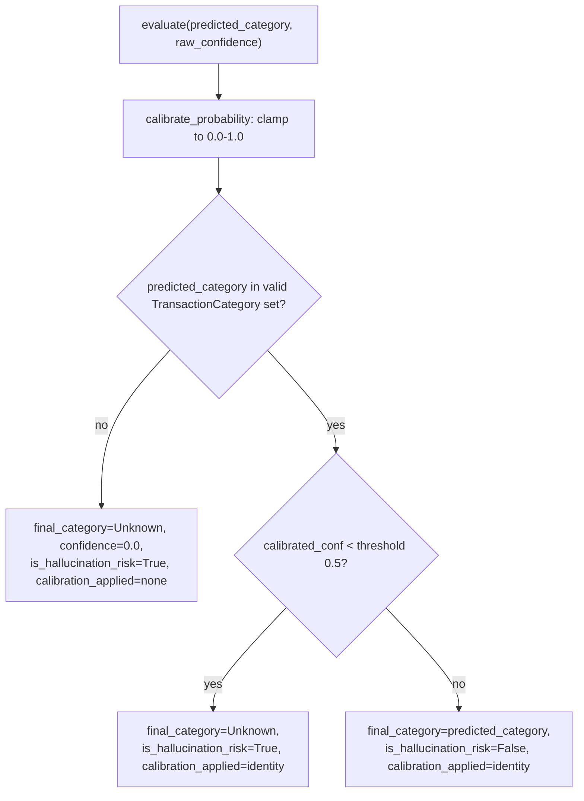

# 06 · Confidence Wall & Behavioral Intelligence (Phases 5–6)

## 6.1 Phase 5: Confidence Engine — `engines/confidence_engine.py`

Core design principle (also stated in `README.md`): **"Unknown is a valid answer."** Rather than let a low-confidence ML prediction propagate into analytics or RAG, `ConfidenceEngine.evaluate()` enforces a hard floor.

- `valid_categories` is computed once at construction as every `TransactionCategory` enum member **except** `UNKNOWN` itself — i.e. a model is never allowed to directly predict "Unknown" and have it pass through as a non-risk result; that path is only reachable via rejection.
- `calibrate_probability` is presently an **identity clamp** (`max(0.0, min(1.0, raw_confidence))`) — the docstring states intent to later apply "Platt scaling or isotonic regression," but no such calibration exists yet. `calibration_applied` is always either `"identity"` or `"none"`, never anything richer.
- `threshold` defaults to `0.5` and is set once at module load (`confidence_engine = ConfidenceEngine(threshold=0.5)`) — there is no per-category or runtime-configurable threshold.
- See [03 · Data Model §3.1](./03-data-model.md#transactioncategory-enum) for the vocabulary mismatch between this enum and category strings actually produced elsewhere in the system (`Subscription`, `Shopping`, `Utility`, `Income` are not valid members and would be force-rejected to `Unknown` if ever routed through this engine).

## 6.2 Phase 6: Behavioral Feature Extraction — `features/*.py`

Four independent, stateless extractor classes, each exposed as a module-level singleton, combined by `behaviour/behavior_engine.py` into a single `BehaviorPattern` per merchant.

### `features/amount_features.py` — `AmountExtractor.extract_statistical_metrics(amounts)`
- Mean, median (average of the two middle values via `sorted[mid]` and `sorted[~mid]`, correct for both odd/even `n`), population variance (`/n`, not `/n-1`) and its square root.
- **Amount entropy**: rounds each amount to the nearest 10 (`round(x, -1)`), buckets by that rounded value, then computes Shannon entropy (`-Σ p·log2(p)`) over the bucket distribution. This measures how "spread out" spend amounts are at a coarse ₹10 granularity — a merchant always charged exactly ₹499 has entropy ≈ 0; one with wildly varying amounts has higher entropy.
- ✅ **FIXED** — the empty-input (`n == 0`) branch now returns the same keys as the normal path (`avg_amount`, `median_amount`, `entropy_score`) — previously it returned a differently-named set (`avg`, `median`, `entropy`) that would have `KeyError`'d any caller without `behaviour/behavior_engine.py`'s empty-set guard. See [03 · Data Model §3.4](./03-data-model.md#34-fieldvocabulary-inconsistencies-worth-knowing-before-writing-new-code).

### `features/temporal_features.py` — `TemporalExtractor`
- `get_time_bucket(hour)`: `morning` 05–11, `afternoon` 12–16, `evening` 17–20, `night` 21–04 (static method, also usable standalone).
- `extract_temporal_metrics(timestamps)`: mode of the hour-of-day (`preferred_hour`, ties broken by whichever hour Python's `max(..., key=hours.count)` encounters first in set iteration — not deterministic across runs for a genuine tie, since `set` ordering isn't guaranteed for arbitrary ints in general, though CPython small-int sets are typically stable), normalized time-bucket distribution, and normalized weekday distribution (`Monday=0` per `datetime.weekday()`).

### `features/frequency_features.py` — `FrequencyExtractor`
- `daily_frequency = n / max(total_span_days, 1.0)`, `weekly_frequency = daily_frequency * 7`.
- Guards `n < 2` by returning all-zero metrics (no meaningful frequency with fewer than 2 data points).
- Also computes `avg_days_between` (not currently consumed by `BehaviorPattern`, since that schema has no such field — computed but discarded by `behaviour/behavior_engine.py`).

### `features/periodicity.py` — `PeriodicityExtractor.calculate_periodicity`
- Requires `n >= 3` timestamps; otherwise returns `periodicity_score: 0.0`.
- Computes inter-transaction intervals (days), then the **coefficient of variation** `cv = std_dev(intervals) / mean(intervals)`.
- `periodicity_score = 1 / (1 + cv)` — bounded in `(0, 1]`, `1.0` meaning perfectly evenly spaced intervals.
- Subscription heuristic: `periodicity_score > 0.85` **and** average interval in `[27, 33]` days (monthly) or `[360, 370]` days (annual) → `is_likely_subscription: True`. Note this field is computed here but **not part of the `BehaviorPattern` schema** and not propagated by `behaviour/behavior_engine.py` — the actual subscription-detection logic used by the live `/v1/analytics/subscriptions` endpoint (`analytics/subscriptions.py`) re-derives its own threshold (`periodicity_score >= 0.85`, with no interval-range check) directly against stored `behavior_patterns` documents rather than reusing `is_likely_subscription`.

## 6.3 Phase 6: Behavior Engine — `behaviour/behavior_engine.py`

`BehaviorEngine.profile_merchant_behavior(merchant_name)`:
1. Fetches **all** `transactions` documents where `merchant == merchant_name` (no time window, no pagination — full collection scan filtered by an unindexed field).
2. Raises `ValueError` if none found.
3. Runs all four feature extractors above against the amount/timestamp lists.
4. Assembles a `BehaviorPattern` and **upserts** it into `behavior_patterns` keyed by `merchant_name`.

This is the sole producer of the `behavior_patterns` collection that `analytics/anomaly_detection.py` and `analytics/subscriptions.py` depend on — but as noted in [01 · Architecture §1.9](./01-architecture.md#19-what-is-not-wired-into-the-http-surface), **no router calls this engine**. It must be invoked manually (e.g. a one-off script or REPL call to `behavior_engine.profile_merchant_behavior(name)` per merchant) for those analytics endpoints to return anything meaningful.
