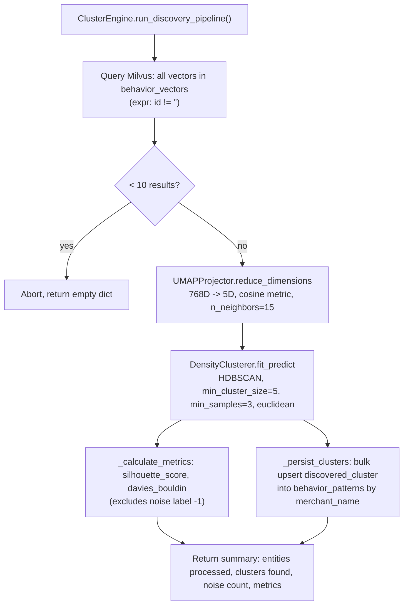

# 07 · Embeddings, Vector Search & Clustering (Phases 7–8)

## 7.1 Phase 7: Embedding generation — `embeddings/generate_embeddings.py`

`EmbeddingGenerator.generate(text)` POSTs `{"model": EMBED_MODEL, "prompt": text}` to `{OLLAMA_HOST}/api/embeddings` (Ollama's native embeddings endpoint) with a 15-second timeout, and returns `response.json()["embedding"]` — a plain `List[float]`. HTTP errors are logged and re-raised (`raise`), so callers must handle `httpx.HTTPError` themselves; none currently wrap this call in a try/except except `milvus/search_vectors.py`, which catches the broad `Exception` around the whole search flow.

## 7.2 Semantic stringification — `embeddings/vectorizer.py`

Before anything is embedded, structured data is flattened into natural-language sentences — this is what actually gets sent to the embedding model, not raw JSON:

- `stringify_profile(profile: MerchantProfile)`: `"Entity: {name}. Known aliases include: {aliases}. Memory State: {state}. Transaction Frequency: Seen {n} times. Type: {entity_type}."`
- `stringify_behavior(pattern: BehaviorPattern)`: `"Behavior footprint for {name}: Average transaction amount is {avg:.2f} with a standard deviation of {std:.2f}. Preferred time of day is {hour}:00. Weekly transaction frequency is {freq:.2f}. Periodicity score is {score:.2f} (1.0 means highly predictable)."`

Neither method is currently called from any other module in the repository — no code path connects `MerchantProfile`/`BehaviorPattern` objects to `vectorizer` to `embedding_generator` to `vector_store.insert_behavior_vector`. The embedding-generation → Milvus-insertion pipeline exists as **building blocks without an orchestrating caller** (unlike the reverse, query-time path, which *is* wired — see §7.3).

## 7.3 Milvus vector store — `milvus/insert_vectors.py` and `milvus/search_vectors.py`

`VectorStoreManager` (singleton `vector_store`) owns the `behavior_vectors` collection (schema detailed in [03 · Data Model §3.3](./03-data-model.md#33-milvus-vector-schema)). It is instantiated at **import time**, which means importing `milvus.insert_vectors` anywhere immediately attempts a live connection to Milvus and, if the collection doesn't exist, creates it and its HNSW index synchronously.

`insert_behavior_vector(pattern_id, merchant_name, vector)` performs an `upsert` — safe to call repeatedly for the same `pattern_id` to overwrite a stale embedding.

`VectorSearchEngine.find_similar_behaviors(query_text, top_k=3)` (singleton `vector_search`) is the **query-time path that is actually wired into production traffic**, via `rag/retriever.py` (see [10 · RAG & Explainability](./10-rag-explainability.md)):
1. Embed `query_text` via `embedding_generator.generate(...)`.
2. `vector_store.client.search(...)` with `COSINE` metric, `ef=64`, requesting the `merchant_name` output field.
3. Reshape hits into `{"merchant_name", "similarity_score", "id"}` dicts (`similarity_score` is actually the raw cosine **distance** value returned by Milvus, rounded to 4 decimals — for COSINE metric in Milvus, higher is more similar, but the field is not renamed or inverted, so consumers should not assume "lower is more similar" the way they might for a Euclidean distance).
4. Any exception anywhere in this flow (embedding failure, Milvus down, empty collection) is caught and logged, returning `[]` — callers (the RAG retriever) treat an empty list as "no grounded context available" rather than an error.

## 7.4 Phase 8: Clustering pipeline — `clustering/*.py`



- **UMAP** (`clustering/umap_projection.py`): reduces the 768-dim Ollama embedding space to 5 dimensions using cosine metric, `random_state=42` for reproducibility across runs on the same input.
- **HDBSCAN** (`clustering/hdbscan_cluster.py`): density-based clustering on the UMAP output, `min_cluster_size=5` (a group needs at least 5 similar merchants to be considered a real cluster), `min_samples=3`, euclidean metric (appropriate post-UMAP since UMAP's output space is not itself cosine-comparable in the same way).
- **Metrics** (`_calculate_metrics`): silhouette score and Davies-Bouldin index, computed only over non-noise (`label != -1`) points, and only if at least 2 clusters exist.
- **Persistence** (`_persist_clusters`): bulk `UpdateOne` upserts writing `discovered_cluster: "cluster_{label}"` (or `"noise"` for label `-1`) into `behavior_patterns`, keyed by `merchant_name`. This is how `graphs/graph_builder.py` later reads `discovered_cluster` to build `BELONGS_TO` edges.

### Bug: `sklearn.metrics` import
`clustering/cluster_engine.py` imports:
```python
from sklearn.metrics import silhouette_score, davies_bouldin_index
```
Scikit-learn's actual function is named **`davies_bouldin_score`**, not `davies_bouldin_index` — no such name exists in `sklearn.metrics`. This import will raise `ImportError` the moment `clustering/cluster_engine.py` is loaded, which means `cluster_engine` (and therefore the entire Phase 8 discovery pipeline) **cannot currently be imported or run**. See [Known Issues](./16-known-issues-tech-debt.md#davies-bouldin-import-error). Since nothing in the live HTTP surface imports `clustering.cluster_engine` today (it's only reachable by direct script/REPL invocation per [01 · Architecture §1.9](./01-architecture.md#19-what-is-not-wired-into-the-http-surface)), this does not currently break `app.py` startup — but it does mean Phase 8 is non-functional as committed.

## 7.5 Why this matters for RAG and analytics

The vector-search **query** path (§7.3, used by `/v1/explain`) depends entirely on the `behavior_vectors` Milvus collection already being populated — but as shown above, the **write** path (embedding generation → `vectorizer` → `insert_behavior_vector`) has no orchestrating caller anywhere in the codebase. In a freshly deployed environment with no manual data-loading step, `/v1/explain` will always retrieve zero hits and short-circuit to `"NO_CONTEXT_AVAILABLE"` (see [10 · RAG & Explainability](./10-rag-explainability.md)).
