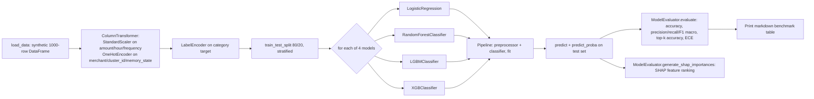

# 08 · ML Training & Evaluation (Phases 9, 11)

Both pipelines in this document are **offline, script-invoked tools** — neither is reachable via HTTP. They are run with `python training/train.py` or `python training/finetune.py` respectively, each guarded by `if __name__ == "__main__":`.

## 8.1 Phase 9: Baseline classifier benchmark — `training/train.py`

`BaselineTrainer` trains and compares four classical ML models on a **synthetic, randomly generated dataset** — `load_data()` does not query MongoDB despite its docstring ("In production, this queries your MongoDB `transactions` collection, joining with `behavior_patterns`"). It generates 1000 rows of `np.random.exponential`/`randint`/`poisson`/`choice` data with no relationship to real transaction history. This module is a **benchmark harness template**, not a production training job.

### Pipeline

- Features: numeric `['amount', 'hour', 'frequency']`, categorical `['merchant', 'cluster_id', 'memory_state']` — this feature set directly mirrors what `behaviour/behavior_engine.py` and `clustering/cluster_engine.py` would produce if wired up, suggesting this trainer is meant to consume their combined output once the pipeline is connected end-to-end.
- All four models use `class_weight='balanced'` (or XGBoost's implicit handling) to counter class imbalance in transaction category distributions.
- `XGBClassifier` is constructed with `use_label_encoder=False` — a parameter removed in modern XGBoost versions; depending on the installed XGBoost version this may raise a `TypeError` at model construction. Verify against the pinned XGBoost version before running.
- Results are printed as a Markdown table via `pandas.DataFrame.to_markdown()` (requires the `tabulate` package to be installed — not present in `requirements.txt`, see [14 · Deployment](./14-deployment-operations.md#141-python-dependencies)).
- The comment "In Phase 14, we will push these results directly to MLflow" confirms no MLflow integration exists yet despite `README.md` listing MLflow in the tech stack.

## 8.2 Evaluation metrics — `evaluation/metrics.py`

`ModelEvaluator` (singleton `evaluator`) is shared by both `training/train.py` and `training/finetune.py`.

### `evaluate(model_name, y_true, y_pred, y_prob, classes)`
Computes `accuracy`, macro `precision`/`recall`/`f1` (zero-division safe), `top_k_accuracy` (k = `min(3, len(classes))`, so it degrades gracefully to top-1 when fewer than 3 classes exist), and `calibration_error_ece`.

### `expected_calibration_error(y_true, y_prob, n_bins=10)`
Standard ECE implementation: bins predictions by max-softmax confidence into 10 equal-width buckets, and for each non-empty bucket accumulates `|avg_confidence - accuracy| * bucket_weight`. This is the metric referenced by name in `README.md`'s "Confidence Wall" discussion and directly informs whether the 0.5 threshold hardcoded in `engines/confidence_engine.py` (see [06 · Confidence & Behavioral Intelligence](./06-confidence-behavioral-intelligence.md#61-phase-5-confidence-engine--enginesconfidence_enginepy)) is well-calibrated — though no code currently feeds ECE results back into that threshold automatically.

### `generate_shap_importances(model, X_test, model_name)`
Picks `shap.TreeExplainer` for `RandomForest`/`XGBoost`/`LightGBM`, `shap.LinearExplainer` for anything else (i.e., `LogisticRegression`). Handles the differing SHAP output shapes across tree libraries (list-of-arrays for older multi-class tree SHAP, 3D array for newer versions) by normalizing to a mean-absolute-importance-per-feature dict, sorted descending. Any exception is swallowed and logged, returning `{}` — a SHAP failure does not fail the training run.

## 8.3 Phase 11: LoRA fine-tuning — `training/finetune.py`

`FinetuneEngine` fine-tunes a HuggingFace sequence-classification model using **LoRA** (Low-Rank Adaptation via `peft`), targeting financial text categorization.

| Setting | Value | Rationale (from code) |
|---|---|---|
| Base model | `ProsusAI/finbert` (configurable) | Domain-pretrained financial BERT |
| LoRA rank `r` | 8 | |
| LoRA `alpha` | 16 | |
| LoRA dropout | 0.1 | |
| Target modules | `["query", "value"]` | Attention projections in BERT-style architectures |
| Learning rate | `2e-4` | "Higher LR is safe for LoRA compared to full fine-tuning" |
| Epochs | 3 | |
| Batch size | 32 (train and eval) | |
| Best-model selection | `metric_for_best_model="f1"`, `load_best_model_at_end=True` | |

### Training data
Like `train.py`, `load_training_data()` uses **hardcoded mock data** (4 example texts × 100 repetitions) rather than a real MongoDB query, despite the docstring describing the intended production source: `db.feedback.find({"is_correction": True})` combined with baseline data "to prevent catastrophic forgetting." This is explicitly a template pending real data-pipeline integration.

### `compute_metrics(p: EvalPrediction)`
Converts logits to probabilities via softmax, then reports weighted `f1`, `roc_auc` (with a `try/except ValueError` fallback to `0.0` if a batch happens to be missing a class — common with small/imbalanced batches), and `calibration_error` via the same `evaluator.expected_calibration_error` used in Phase 9.

### Output
Saves the trained LoRA adapter (not the full base model) to `{output_dir}/final_adapter` via `model.save_pretrained` / `tokenizer.save_pretrained`. Default `output_dir` is `./models/velar-finbert-lora`.

### Dependencies note
This module imports `torch`, `datasets`, `transformers`, and `peft` — **none of these appear in `requirements.txt`** (see [14 · Deployment §14.1](./14-deployment-operations.md#141-python-dependencies)). Running `training/finetune.py` against the checked-in dependency list will fail with `ModuleNotFoundError` until those packages are installed separately.
