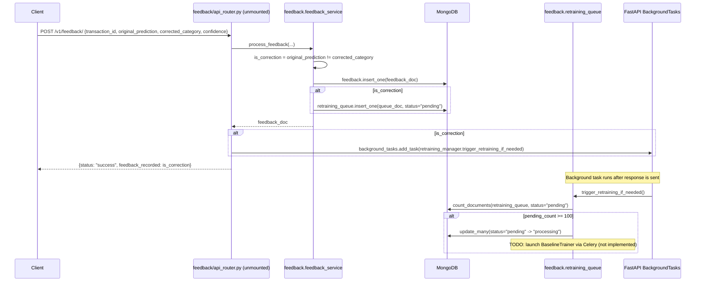

# 09 · Feedback & Active Learning (Phase 10)

> ✅ **FIXED — this subsystem is now mounted and reachable over HTTP.** `app.py` imports `feedback.router` and calls `app.include_router(feedback_router, dependencies=[Depends(validate_api_key)])`. Additionally, `process_feedback` now resolves and stores a real `merchant_name` field (by looking up the transaction via `transaction_id`), fixing the `feedback.prediction`-holds-a-category bug described in [18 · Database Analysis §2.2](./18-database-analysis.md#22-the-feedbackprediction-field-mismatch--a-real-previously-undocumented-bug) — `rag/retriever.py` and `graphs/graph_builder.py` now both query/match on `merchant_name`. See [Known Issues §16.2–16.3](./16-known-issues-tech-debt.md).

## 9.1 Intended request flow

## 9.2 `feedback/feedback_service.py`

`FeedbackService.process_feedback(transaction_id, original_prediction, corrected_category, confidence, user_id="system_user")`:
- Determines `is_correction` by simple string inequality between the original prediction and the human-corrected category.
- Always writes a `feedback` document (both corrections *and* confirmations are logged — this is the full audit trail, not just the disagreements).
- Only pushes to `retraining_queue` when `is_correction` is `True` — confirmations don't consume retraining budget.
- `user_id` defaults to `"system_user"` and is never overridden by any caller — there is no authenticated-user threading through this pipeline; every feedback record looks like it came from the same system account, regardless of who submitted it.

## 9.3 `feedback/retraining_queue.py`

`RetrainingQueueManager(batch_threshold=100)`:
- `check_retraining_status()`: counts `retraining_queue` documents with `status: "pending"` and compares against `batch_threshold` (100).
- `trigger_retraining_if_needed()`: if the threshold is met, marks all pending records `"processing"` (with a timestamp) to prevent double-processing, then... stops. The comment `# TODO: Launch BaselineTrainer().run_benchmarks() via Celery asynchronously here.` marks the boundary of what's actually implemented — **no training job is ever launched**. Records will sit in `"processing"` state indefinitely with no code path that ever moves them to `"completed"` or feeds them into `training/train.py` (which, as noted in [08 · ML Training & Evaluation](./08-ml-training-evaluation.md#81-phase-9-baseline-classifier-benchmark--trainingtrainpy), doesn't query this collection anyway — it uses synthetic data).

## 9.4 Design intent vs. current reality

| Intended (per comments/README) | Actual implementation |
|---|---|
| Human corrections feed an Active Learning loop | Corrections are durably logged and queued, but the queue is a dead end |
| Celery task launches retraining at threshold | No Celery dependency, no task launched — just a status flip in Mongo |
| Retraining consumes real feedback data | `training/train.py` and `training/finetune.py` both use synthetic/mock data, not `db.feedback` |
| Endpoint reachable at `/v1/feedback/` | Router exists but is never mounted on `app` |

If you are asked to "wire up Phase 10 end-to-end," the concrete gaps to close are: (1) `app.include_router(feedback.router, dependencies=[Depends(validate_api_key)])` in `app.py`; (2) replace the `TODO` in `trigger_retraining_if_needed` with an actual call into a training pipeline; (3) make `training/train.py::load_data` and `training/finetune.py::load_training_data` query `db.feedback`/`db.retraining_queue` instead of generating synthetic data.
