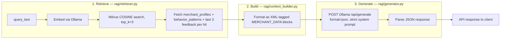

# 10 · RAG & Explainability (Phase 12)

This is the one Ollama-dependent pipeline that is fully wired end-to-end and reachable via `POST /v1/explain` (`routers/rag.py`). It is designed around a strict **grounding contract**: the LLM must never answer from its own knowledge, only from data explicitly retrieved and injected into its context.

## 10.1 Three-stage pipeline



## 10.2 Stage 1 — `rag/retriever.py::ContextRetriever.fetch_grounded_context`

1. `vector_search.find_similar_behaviors(query_text, top_k=3)` — see [07 · Embeddings, Vector Search & Clustering §7.3](./07-embeddings-vectorsearch-clustering.md#73-milvus-vector-store--milvusinsert_vectorspy-and-milvussearch_vectorspy). Returns `[]` immediately if Milvus/embedding fails or the collection is empty.
2. For each matched `merchant_name`, three parallel-in-intent (actually sequential `await`) lookups:
   - `merchant_profiles.find_one({canonical_name})` — memory state, frequency, etc.
   - `behavior_patterns.find_one({merchant_name})` — statistical fingerprint.
   - `feedback.find({prediction: name}).sort("timestamp", -1).limit(3)` — most recent human corrections/confirmations that named this merchant as the prediction.
3. Each result is bundled into `{"merchant_name", "profile": {...}, "behavior": {...}, "recent_feedback": [...]}`, with missing profile/behavior defaulting to `{}` (never `None`, which matters for stage 2's `.get()` chains).

**Consequence of §7.5**: since nothing currently populates the Milvus `behavior_vectors` collection in a running deployment, `find_similar_behaviors` will return `[]`, and this entire stage produces an empty context list in practice until that gap is closed.

## 10.3 Stage 2 — `rag/context_builder.py::ContextBuilder.build_prompt_string`

Deliberately **not** JSON — the prompt uses hand-rolled pseudo-XML tags per merchant:

```xml
<MERCHANT_DATA ID="1">
    <NAME>Swiggy</NAME>
    <MEMORY_STATE>PERMANENT</MEMORY_STATE>
    <FREQUENCY>14 total transactions</FREQUENCY>
    <BEHAVIOR_SIGNATURE>
        Average Amount: 412.30
        Periodicity Score: 0.22 (1.0 = Highly predictable)
        Preferred Hour: 20:00
    </BEHAVIOR_SIGNATURE>
    <HUMAN_CORRECTIONS>
        2 recent manual corrections found.
    </HUMAN_CORRECTIONS>
</MERCHANT_DATA>
```

Rationale for this format choice isn't stated in comments, but the effect is a clearly-delimited, low-ambiguity block structure that's easy for an LLM to parse and hard to confuse with conversational text — a common prompt-engineering technique for keeping a model "on rails." If `context_data` is empty, the function short-circuits to the literal string `"NO_CONTEXT_AVAILABLE"`, which stage 3 checks for explicitly to avoid ever calling the LLM with nothing to ground it.

Note: `<HUMAN_CORRECTIONS>` only reports a **count** of recent feedback records, not their actual content (predicted vs. corrected category) — the LLM cannot use *what* was corrected, only *how many times* something was corrected, which limits how useful this section can be for genuinely explaining a re-categorization.

## 10.4 Stage 3 — `rag/generator.py::ExplanationGenerator.generate_explanation`

### System prompt contract
The system prompt (`self.system_prompt`) is the mechanism enforcing groundedness:
1. No conversational framing ("Do not say 'Hello', 'Sure'...").
2. Explicit hallucination refusal instruction: if context doesn't contain the answer, output `{"error": "Insufficient data to explain."}`.
3. A fixed output schema: `{"explanation": str, "confidence_in_explanation": "HIGH|MEDIUM|LOW", "primary_data_source": str}`.

### Request
```json
{
  "model": "<LLM_MODEL from .env>",
  "system": "<the contract above>",
  "prompt": "CONTEXT:\n<xml blocks>\n\nUSER QUERY: <target_question>\n\nOUTPUT STRICT JSON:",
  "stream": false,
  "format": "json"
}
```
`"format": "json"` is Ollama's structured-output mode, which constrains the model's decoding to emit syntactically valid JSON — this is a model-level guarantee, not just a prompt instruction, and is the main defense against malformed output (on top of the human-readable instructions in the system prompt).

### Failure handling
- If `context_string == "NO_CONTEXT_AVAILABLE"`: returns `{"error": "No historical behavior found to explain this transaction."}` **without any network call**.
- Any exception during the HTTP call or `json.loads` of the model's `response` field: logged and converted to `{"error": "Failed to generate explanation due to internal model error."}`.
- 30-second timeout on the Ollama call (longer than the 15s used for embeddings, reflecting that generation is slower than embedding).

## 10.5 Where this fits in the broader system

`/v1/explain` is the only place `core.ollama_client`'s `LLM_MODEL` constant is used for generation (as opposed to `EMBED_MODEL`, used only by `embeddings/generate_embeddings.py`). ✅ **FIXED** — `core/ollama_client.py` previously resolved and validated the Ollama host **at import time** (see [04 · Core Infrastructure §4.2](./04-core-infrastructure.md#42-ollama-host-resolution--coreollama_clientpy)), so an unreachable Ollama host would prevent the entire application from starting rather than just degrading `/v1/explain`. Host resolution is now deferred to first actual use (`get_ollama_host()`), so an unreachable Ollama host only degrades this endpoint (and embedding generation) — the rest of the app keeps running.
