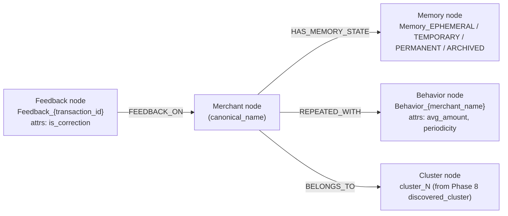

# 13 · Knowledge Graph Layer (cross-phase)

`graphs/graph_builder.py` implements `KnowledgeGraphBuilder` (singleton `graph_engine`), a `networkx.DiGraph`-based model tying together every other subsystem's output. ✅ **Now reachable** via `POST /v1/pipelines/graph/build` and `GET /v1/pipelines/graph/neighborhood/{merchant_name}` (see [02 · API Reference §2.13](./02-api-reference.md#213-batch-pipelines-routerspipelinespy-prefix-v1pipelines)) — previously nothing in the repository called `build_graph()` or `get_merchant_neighborhood()` at all. The graph is still in-memory only (rebuilt from MongoDB on each `/build` call, not persisted), and nothing schedules a rebuild automatically — that still requires a cron/Celery beat, which doesn't exist in this repo (see [16 · Known Issues §16.5](./16-known-issues-tech-debt.md#165-whats-intentionally-still-open-productinfra-decisions-not-bugs)).

## 13.1 Graph schema

## 13.2 `build_graph()` construction order

1. `self.graph.clear()` — the graph is rebuilt from scratch every call, not incrementally updated.
2. Fetch **all** documents from `merchant_profiles`, `behavior_patterns`, `feedback` (three full unfiltered collection scans).
3. For each merchant profile: add a `Merchant` node (attrs: `entity_type`) and a `Memory_{state}` node, edged `HAS_MEMORY_STATE`. Profiles without a `canonical_name` are skipped.
4. For each behavior pattern: **only if the merchant node already exists** (i.e., only for merchants that also have a profile — a behavior record for a merchant with no profile is silently dropped), add a `Behavior_{merchant_name}` node (attrs: `avg_amount`, `periodicity`) edged `REPEATED_WITH`. If `discovered_cluster` is present and not `"noise"`, also add a `Cluster` node edged `BELONGS_TO`.
5. For each feedback record: **only if the predicted merchant name is already a node**, add a `Feedback_{transaction_id}` node (attrs: `is_correction`) edged `FEEDBACK_ON` **into** the merchant (direction: feedback → merchant, the only edge in the graph that doesn't originate from a merchant node).
6. Return topology summary: `total_nodes`, `total_edges`, `density` (`networkx.density`, i.e. actual edges / possible edges for a directed graph of this size).

Because steps 4 and 5 both require the merchant node to pre-exist from step 3, **this graph can only ever represent merchants that already have a `merchant_profiles` document** — behavior or feedback data for a merchant that was never routed through the (also unwired) memory engine will never appear in the graph at all.

## 13.3 `get_merchant_neighborhood(merchant_name, radius=2)`

Returns `networkx.ego_graph(self.graph, merchant_name, radius=2)` serialized to plain dicts (`nodes: [{id, ...attrs}]`, `edges: [{source, target, relation}]`) — a JSON-friendly local subgraph suitable for visualization or, per the code comment, "extracting context for the Phase 12 RAG LLM." No such extraction actually occurs in `rag/retriever.py` today — the RAG context builder (see [10 · RAG & Explainability](./10-rag-explainability.md)) sources its data directly from MongoDB queries, not from this graph. Returns `{"error": "..."}`  if the merchant isn't present in the (in-memory, never-persisted) graph — note the graph itself is **never persisted**; it exists only in the `graph_engine` instance's memory for the lifetime of whatever process calls `build_graph()`, and is rebuilt from zero on every call.

## 13.4 If asked to wire this up

There is no obvious integration point yet — no endpoint, no scheduled job. To make this useful, at minimum: (1) add a router (e.g. `/v1/graph/neighborhood/{merchant}`) that lazily calls `build_graph()` if the in-memory graph is empty or stale, since rebuilding on every request would be expensive at scale; (2) decide on a staleness/refresh policy, since `build_graph()` does a full triple collection scan each time; (3) consider whether this should feed `rag/context_builder.py` as an additional context source, since the code comments suggest that was the original intent.
