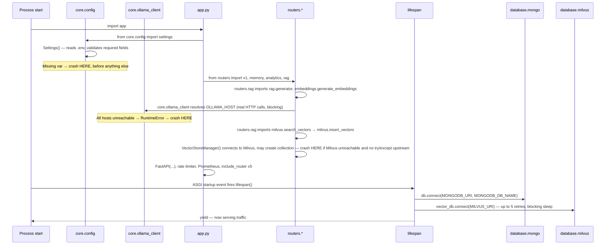
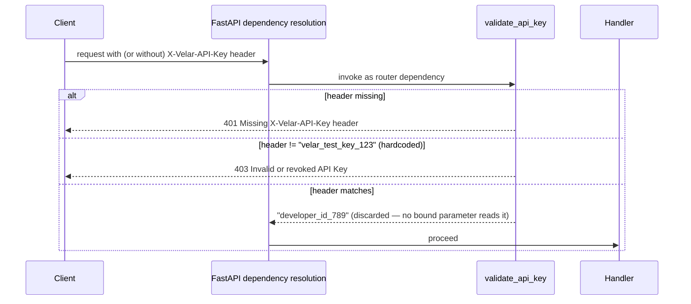
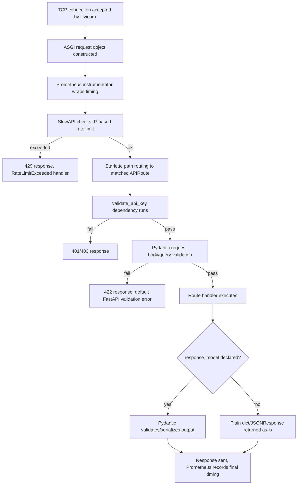

# 17 · Senior Backend Architect Review

This document analyzes Velar as a working system — not feature-by-feature, but across the cross-cutting concerns that determine whether a backend is production-grade: startup, configuration, request handling, data access, error handling, security, and scalability. Every claim below is grounded in the actual code (cited by file/line-level behavior); where something is *absent* rather than broken, that's stated as plainly as where something is broken.

**Bottom line up front**: Velar has good architectural instincts in places — a genuine confidence-wall philosophy, a real memory/trust state machine, a properly-designed grounded RAG pipeline — but it is not production-ready. It has one bug that likely prevents the process from starting at all, no authorization model beyond a single shared secret, zero caching, zero database indexes, no dependency injection beyond one auth check, and roughly half of its "15 phases" are disconnected from the live system. Treat this review as a punch list as much as an analysis.

---

## 1. Startup Flow

Startup is entirely import-driven, not explicitly orchestrated — Python's own import machinery does most of the sequencing, which is a meaningful architectural fact in itself (see §2 for why that's risky).

**Architectural assessment**: three separate subsystems (`core.config`, `core.ollama_client`, `milvus.insert_vectors`) can each independently abort the entire process *during import*, before FastAPI's own lifespan even begins. This means "the app failed to start" could mean five different things, and none of them produce a clean, actionable startup error — they surface as raw Python tracebacks from deep inside an import chain. A senior architect would flag this as a **startup fragility** issue: critical infrastructure resolution (Ollama host failover, Milvus collection provisioning) should happen inside `lifespan`, alongside Mongo/Milvus-via-`database/`, where failures are structured, logged consistently, and (ideally) don't necessarily prevent serving traffic that doesn't need that dependency.

## 2. Server Initialization

- **Local dev**: `app.py`'s `if __name__ == "__main__":` block calls `uvicorn.run("app:app", host="0.0.0.0", port=8000, reload=True)`.
- **Containerized**: `Dockerfile`'s `CMD ["uvicorn", "app:app", "--host", "0.0.0.0", "--port", "8000"]` — no `--reload`, no `--workers`, so **exactly one worker process** by default.
- **No process manager**: no Gunicorn, no `uvicorn --workers N`, no supervisor — a crash means the container exits and relies entirely on the orchestrator's restart policy (`restart: always` in both compose files).
- **No graceful shutdown handling beyond `lifespan`**: `lifespan`'s post-`yield` code (disconnecting Mongo/Milvus) only runs if the ASGI server delivers a clean shutdown signal; there's no explicit signal handling for `SIGTERM` draining in-flight requests.

**Assessment**: single-worker, no explicit concurrency model beyond `asyncio`'s single event loop. This is fine for the current traffic profile implied by the code (a small internal API), but it means CPU-bound work (feature extraction math, SHAP computation if that pipeline were ever wired to a request) would block the entire event loop for every concurrent request, not just the one that triggered it.

## 3. Dependency Injection

FastAPI's `Depends()` mechanism is used for exactly one thing in this entire codebase: `Depends(validate_api_key)`, attached at `app.include_router(..., dependencies=[...])`. That's it — confirmed by grep, there is no other `Depends(...)` call anywhere in `routers/`.

Everything else — the database clients, every engine, every service, every repository — is a **module-level singleton** imported directly (`from database.mongo import db`, `from engines.rule_engine import rule_engine`, etc.), not injected. This is sometimes called "the poor man's DI container": it works, and it's simple, but it has real costs:

- **No test isolation**: you cannot swap `db` for a fake/in-memory implementation without monkeypatching the module itself — there's no seam for FastAPI's `app.dependency_overrides`, which is the standard, clean way to inject test doubles.
- **No per-request scoping**: every request shares the exact same `MongoDB`/`VectorDB`/engine instances — fine for stateless engines, but it means there's no way to, say, inject a per-request Mongo session/transaction context without a structural change.
- **Hidden coupling**: any module can reach into `database.mongo.db` directly, so the true dependency graph is only visible by reading imports, not by inspecting a function signature — which is exactly why this review (and the two preceding documentation passes) needed to trace imports file-by-file rather than reading route signatures alone.

**What a DI-first version would look like**: `db` and every engine/service would be provided via `Depends(get_db)`-style factory functions, injected into route handlers as parameters — enabling `app.dependency_overrides[get_db] = lambda: fake_db` in tests, and making every handler's true dependencies visible in its signature.

## 4. Environment Variables

All configuration flows through one Pydantic `Settings` model (`core/config.py`):

| Variable | Required? | Default | Actually used consistently? |
|---|---|---|---|
| `MONGODB_URI` | Yes | — | Yes — `database/mongo.py` |
| `MONGODB_DB_NAME` | No | `"velar"` | Yes |
| `MILVUS_URI` | Yes | — | **No** — `database/milvus.py` uses it correctly, but `milvus/insert_vectors.py` (the client actually used for real traffic) reads `os.getenv("MILVUS_URI", "http://localhost:19530")` directly, bypassing `settings` entirely |
| `OLLAMA_URI` | No | `None` | Yes, takes precedence if set |
| `OLLAMA_HOSTS` | No | `None` | Yes, fallback failover list |
| `EMBED_MODEL` | Yes | — | Yes |
| `LLM_MODEL` | Yes | — | Yes |
| `VELAR_API_KEY` | Yes | — | **No** — declared and required, but `core/security.py` never reads it; the accepted key is a hardcoded literal |

**Two of eight configured variables are effectively decorative** — declared, validated as required at startup, and then ignored by the code that should consume them. This is worse than not having the variable at all, because it actively misleads an operator into believing that setting `VELAR_API_KEY` in `.env` controls authentication.

`docker-compose_production.yaml` compounds this: it sets `MONGO_URI`/`MONGO_DB_NAME`/`MILVUS_HOST`/`MILVUS_PORT` — none of which match `Settings`' actual field names (`MONGODB_URI`, `MONGODB_DB_NAME`, `MILVUS_URI`). Deploying with only that compose file's environment would fail `Settings()` validation immediately.

## 5. Configuration Loading

Configuration loading is **eager and centralized** for the happy path (`Settings()` instantiated once at `core/config.py` import time, fail-fast on missing required fields) — a good pattern in principle. But it's undermined by three separate places in the codebase that read configuration a different way:

1. `milvus/insert_vectors.py` — `os.getenv("MILVUS_URI", ...)` directly.
2. `core/security.py` — a hardcoded literal instead of `settings.VELAR_API_KEY`.
3. `scripts/mock_seeder.py` — a fully hardcoded `mongodb://localhost:27017`, ignoring configuration entirely (acceptable for a throwaway script, but worth knowing).

**Architectural principle being violated**: "one source of truth for configuration." Right now there are effectively three sources of truth for "where is Milvus" and "what is the valid API key," and they can silently diverge without any error — the kind of bug that's invisible in a code review that only reads one file at a time, which is exactly why cross-file dependency tracing (as done across this documentation series) matters.

## 6. Middleware Pipeline

The actual ASGI middleware stack, in registration order, is short:

What's **not** in this pipeline, and normally would be in a production API:

- **No CORS middleware** — confirmed absent by grep. If any browser-based frontend is ever meant to call this API directly, every request will fail CORS preflight. If this is purely server-to-server, this is a non-issue — but nothing in the codebase documents that assumption.
- **No GZip/compression middleware** — response bodies (especially analytics aggregations or RAG explanations) are sent uncompressed.
- **No request-ID / correlation-ID middleware** — there's no way to trace a single request across the multiple log lines it generates (rule engine → resolver → Mongo → response), since nothing tags log lines with a shared request identifier.
- **No trusted-host middleware** — no `Host` header validation.
- **No global timeout middleware** — an individual slow downstream call (e.g., Ollama generation) can hold a request open for the full 30s timeout with nothing at the ASGI layer capping total request duration.

## 7. Authentication Flow

This is **single-factor, single-secret, static-key authentication** — there is no user model, no per-client key issuance, no key expiry, no OAuth2/JWT, no rotation mechanism beyond editing source code and redeploying. The comparison itself (`!=` on plain strings) is not constant-time (`hmac.compare_digest`/`secrets.compare_digest` would be the hardened choice) — a real, if currently low-severity-given-the-key-is-effectively-public, timing side-channel.

**Every valid caller is indistinguishable from every other valid caller** — the returned identity string is a fixed literal, not derived from the key at all, and no caller in the codebase even consumes it (every router attaches this via `dependencies=[...]`, discarding the return value). This means there is currently no way to audit "who did this," rate-limit per-client (as opposed to per-IP), or revoke one compromised key without revoking all access.

## 8. Authorization Flow

There effectively **is no authorization layer** — only authentication. Once a caller has *any* valid key, they have complete, undifferentiated access to every endpoint and every piece of data:

- `routers/analytics.py` hardcodes `TEST_USER = "user_123"` for *every* caller — there's no concept of "this caller may only see their own data." Every authenticated client sees the exact same analytics, regardless of identity.
- `routers/memory.py` and `routers/v1.py` have no resource-ownership checks — any caller can query or mutate any merchant profile by name.
- No role distinction exists anywhere (admin vs. read-only vs. write-scoped keys) — `validate_api_key` returns a binary yes/no, nothing more granular.

**This is the most significant security/architecture gap in the system if it's ever exposed beyond a single trusted internal caller.** Authentication answers "is this a legitimate caller"; authorization answers "what is this specific caller allowed to see or do" — Velar has built the former and entirely skipped the latter.

## 9. API Lifecycle

Notable lifecycle gaps: there is no application-level request/response logging middleware (no "incoming request X, responded Y in Zms" log line for every request) — the only visibility into individual request outcomes is whatever each handler/engine happens to log internally, which is inconsistent (see §15).

## 10. Controller Flow

Routers are Velar's "controllers." The dominant, and correct, pattern is **thin delegation**: parse input → call exactly one domain function → return its result, with no business logic in the router itself. `routers/v1.py`'s `resolve_transaction_merchant` and `evaluate_prediction_confidence`, and `routers/memory.py`'s handlers, all follow this cleanly.

Two deviations worth flagging:
- **`routers/v1.py`'s `categorize_transaction`** breaks the pattern by embedding real (if broken) business logic — regex amount extraction and a direct Mongo write — directly in the controller, rather than delegating to a service. This is exactly the kind of code that should live in a service/engine, and its being in the router is likely *why* it was never properly finished (no clear ownership boundary).
- **`routers/rag.py`'s `explain_transaction`** inlines a three-stage pipeline orchestration rather than delegating to a single facade function — functionally fine, but inconsistent with the one-call-per-handler convention everywhere else.

## 11. Service Flow

The "service layer" is real but **inconsistently named and organized** across five different folders performing the same conceptual role: `engines/` (rule_engine, confidence_engine), `services/` (merchant_resolver), `memory/` (memory_manager — arguably a service), `analytics/` (four independent engines), `rag/` (three pipeline-stage classes). There is no shared base class, no common interface, no consistent naming convention (`Engine`, `Resolver`, `Manager`, `Analyzer`, `Detector`, `Builder` are all used for what is architecturally the same layer). A new engineer has to learn five different naming conventions to find "where does business logic live" instead of one.

Every service is a **singleton instantiated at import time** — consistent across the codebase, which is a genuine strength: predictable, no lazy-init races, no per-request construction overhead. The cost (as discussed in §3) is the total absence of a DI seam for testing.

## 12. Repository Flow

Exactly **one** true repository exists: `repositories/profile_repository.py`, wrapping `MerchantProfile` CRUD against `merchant_profiles`. Every other data access in the codebase — `analytics/*.py`'s aggregation pipelines, `services/merchant_resolver.py`'s `merchants` queries, `rag/retriever.py`'s three-collection lookups, `feedback/*.py`'s writes, `graphs/graph_builder.py`'s full-collection scans, `behaviour/behavior_engine.py`'s upserts — talks to `database.mongo.db.<collection>` **directly**, with raw dicts and inline aggregation pipeline literals.

**This is an inconsistent data-access architecture.** The one repository that exists correctly hides Mongo-specific concerns (projection, `$set` semantics, alias mapping) behind a typed interface — exactly the pattern that should have been applied to `merchants`, `transactions`, `feedback`, and `behavior_patterns` as well. As it stands, a schema change to any of those four collections requires hunting down every file that queries them directly, rather than updating one repository.

## 13. Database Interaction

- **Driver**: Motor (`AsyncIOMotorClient`) for MongoDB — correct choice for an async FastAPI app. No ODM (no Beanie, no MongoEngine) — every document is a plain dict, validated only at the Pydantic-model boundary when a repository happens to exist, and not at all otherwise.
- **Vector store**: `pymilvus.MilvusClient` — but **two independent client instances** exist (`database/milvus.py`'s unused `vector_db`, and `milvus/insert_vectors.py`'s actually-used `vector_store`), reading configuration through two different mechanisms (`settings.MILVUS_URI` vs. `os.getenv`). This is a real operational risk: an operator fixing "Milvus connectivity" by updating `.env` could reasonably believe they've fixed both clients, when only one is actually affected.
- **Indexes**: **zero MongoDB indexes exist anywhere in this codebase** (confirmed by grep — no `create_index` calls against Mongo collections at all; Milvus's HNSW vector index is the only index defined anywhere). Every query — `find_one({"canonical_name": ...})`, `find_one({"aliases": cleaned_text})`, every analytics aggregation's `$match` — runs as a collection scan under real load.
- **Transactions**: **never used** — confirmed by grep, no `start_session`/`with_transaction` anywhere. This matters concretely in `feedback/feedback_service.py`, which writes to `feedback` and then, conditionally, to `retraining_queue` as two separate, non-atomic operations — a crash between the two would leave a correction logged but never queued for retraining, with no way to detect or reconcile that gap.
- **Connection pooling**: no explicit `maxPoolSize`/`minPoolSize` tuning anywhere — Motor's defaults apply, untested against this application's actual concurrency profile.

## 14. Error Handling

There is **no application-defined exception hierarchy** anywhere in the codebase (confirmed by grep — zero custom exception classes). Error handling relies entirely on:
- FastAPI's `HTTPException` for deliberate 401/403/404 responses.
- Python built-ins (`ValueError`, `RuntimeError`) raised in a few specific places (`behaviour/behavior_engine.py` on empty data, `core/ollama_client.py` on total host failure) with no consistent catching strategy — some of these propagate all the way to an unhandled 500, others (`milvus/search_vectors.py`, `rag/generator.py`) are caught broadly and converted to soft, degraded responses.
- **One** global exception handler is registered anywhere in the app: `RateLimitExceeded → _rate_limit_exceeded_handler` (confirmed by grep). There is no global `Exception` handler, no custom 404/422 formatting, no consistent error-response envelope (`{"error": {"code": ..., "message": ...}}`-style) across the API.

**Consequence**: error response *shape* is inconsistent across endpoints — some return `{"detail": "..."}` (FastAPI's default `HTTPException` shape), some return `{"message": "..."}` (`routers/observability.py`'s manual `JSONResponse`), some return `{"error": "..."}` (`rag/generator.py`'s degraded responses). A client integrating against this API cannot write one generic error handler; it needs to know, per-endpoint, which shape to expect.

## 15. Logging

- **Global configuration**: `logging.basicConfig(level=logging.DEBUG, ...)` in `app.py`, applied once, to the root logger — every module's `logging.getLogger(__name__)` inherits `DEBUG` verbosity, with no environment-based override (no `LOG_LEVEL` env var read anywhere).
- **No structured logging**: plain text format string (`%(asctime)s [%(levelname)s] %(name)s: %(message)s`) — no JSON output, meaning log aggregation platforms (Datadog, ELK, CloudWatch Insights) can't easily parse fields out without custom parsing rules.
- **No correlation IDs**: a single request touching the rule engine, the resolver, and Mongo produces multiple unrelated log lines with no shared identifier tying them together.
- **Inconsistent adoption**: several modules create a logger and never use it (`services/merchant_resolver.py` — confirmed: `logger` is defined but never called anywhere in that file). Some modules log extensively (`memory/state_machine.py`, `clustering/*.py`), others not at all (`models/schemas.py`, `features/*.py` — appropriately, since they're pure functions).
- **No log sampling or rate limiting** — under load, `DEBUG`-level logging across every module could produce very high log volume with no throttle.

## 16. Validation

Validation is **Pydantic-only, type-level, with no custom business-rule validators anywhere** (confirmed — zero `@field_validator`/`@model_validator` decorators exist in `models/schemas.py`). This means:
- `CategorizeRequest.text: str` accepts an empty string, a 10MB string, or a string of pure whitespace — nothing prevents it.
- `routers/analytics.py`'s `days: int = Query(30, ...)` accepts negative numbers (confirmed by `test_api.py::test_analytics_categories_negative_days`, which explicitly expects this to *not* be rejected) — there's no `ge=0` constraint on the query parameter.
- `MockModelPrediction.raw_confidence: float` has no `ge=0.0, le=1.0` bound — a caller could pass `raw_confidence=500`, and `calibrate_probability`'s clamp would silently treat it as `1.0` rather than rejecting the clearly-invalid input at the API boundary.

**Assessment**: type validation (is this a string, is this a float) is solid thanks to Pydantic; **semantic** validation (is this a *reasonable* string, is this confidence value actually in a valid probability range) is almost entirely absent, pushed down into business logic that quietly clamps or ignores bad input rather than rejecting it with a clear 422.

## 17. Response Generation

Response contracts are **inconsistently typed** across the API:
- **Strongly typed** (`response_model` declared, Pydantic-validated and OpenAPI-documented): `routers/v1.py`'s three endpoints, `routers/memory.py`'s two endpoints.
- **Untyped** (plain `dict`/`JSONResponse` returned, no `response_model`): every endpoint in `routers/analytics.py`, `routers/rag.py`, `routers/observability.py`.

This means roughly half the API's generated OpenAPI schema (and therefore any auto-generated client SDK) is accurate and useful, and the other half shows up as a generic, untyped response — a real cost for API consumers and for anyone relying on `/docs` to understand the contract without reading source.

No response envelope pattern is used consistently (no `{"data": ..., "meta": ...}` wrapper) — some endpoints return a bare list, some a bare object, some an object with a `details`/`result` sub-key — meaning client code can't write one generic response unwrapper.

## 18. Caching

**There is no caching anywhere in this codebase** — confirmed by grep for `lru_cache`/`redis`/`Redis` (the only hit is the aspirational comment in `core/security.py` claiming Redis is used "in production," which it is not). Concretely absent:
- No HTTP caching headers (`ETag`, `Cache-Control`, `Last-Modified`) on any response, including clearly cacheable ones like `GET /memory/state/{name}`.
- No in-memory memoization of repeated computation (e.g., `engines/rule_engine.py`'s compiled patterns are cached correctly at startup, but that's the *only* caching pattern in the whole system).
- No embedding cache — calling `/v1/explain` twice with identical `transaction_text` re-embeds the exact same string via a real network call to Ollama both times.
- No query-result caching for expensive analytics aggregations, which recompute from scratch on every call even if called repeatedly within seconds.

**This is a direct cost driver** for any endpoint touching Ollama (both `/v1/explain`'s embedding and generation steps are billed in latency and, if Ollama were a paid hosted service, in real cost) and a direct latency cost for repeated identical analytics queries.

## 19. Performance Optimizations (what's actually done well)

To be fair to the codebase, several genuinely good performance decisions exist:
- **Regex pre-compilation** in `engines/rule_engine.py` — compiled once at startup, not per-request.
- **Server-side aggregation** in `analytics/*.py` — grouping/summing/sorting happens in MongoDB, not by pulling raw documents into Python.
- **Bulk writes** in `clustering/cluster_engine.py::_persist_clusters` — a single `bulk_write` rather than N individual `update_one` calls (in contrast to `memory/decay_engine.py`, which does exactly that anti-pattern — see §20).
- **Milvus HNSW indexing** with reasonable `ef`/`M`/`efConstruction` parameters for approximate nearest-neighbor search.
- **Singletons for all engines/services** — avoids per-request construction overhead for stateless business logic.

## 20. Potential Bottlenecks

| Bottleneck | Location | Why it matters |
|---|---|---|
| Unindexed Mongo queries | Every collection, every query | Every lookup (`canonical_name`, `merchant_name`, `aliases`) is a collection scan; grows linearly worse with data volume |
| Sequential, non-concurrent I/O in RAG retrieval | `rag/retriever.py`'s per-merchant loop | Up to `top_k × 3` sequential Mongo round trips per `/v1/explain` call, none parallelized despite being independent |
| Blocking `time.sleep` in async lifespan | `database/milvus.py::VectorDB.connect` | Up to 15s of fully blocked event loop during startup if Milvus is slow |
| One-at-a-time updates in a batch job | `memory/decay_engine.py::run_archive_sweep` | N individual `update_one` calls instead of one `update_many`, for potentially every stale profile in the system |
| Full, unbounded collection fetch | `behaviour/behavior_engine.py`, `graphs/graph_builder.py` | No time window, no pagination — fetches and materializes entire result sets into memory |
| In-memory, per-process rate limiting | `core/rate_limiter.py` | Won't share state across horizontally-scaled replicas — see §22 |
| No connection pool tuning | `database/mongo.py` | Untested default pool size under real concurrent load |
| Serial, high-timeout external calls | `/v1/explain`'s full pipeline | Worst case: 15s (embed) + Milvus search + up to 9 sequential Mongo calls + 30s (generate) — tens of seconds worst-case latency, single request thread |
| Duplicate Milvus clients | `database/milvus.py` vs. `milvus/insert_vectors.py` | Doubles connection overhead and configuration surface for no functional benefit |

## 21. Security Considerations

| Finding | Severity | Detail |
|---|---|---|
| Hardcoded API key, config ignored | **Critical** | `core/security.py` accepts only `"velar_test_key_123"` regardless of `.env`'s `VELAR_API_KEY` — rotating the configured key has zero effect |
| No authorization model | **Critical** | Any valid key grants full, undifferentiated access to all data and all merchants — no per-caller scoping anywhere |
| Plaintext credential committed to git | **Critical** | `docker-compose_production.yaml` has a MongoDB connection string with an embedded username/password checked into version control |
| Non-constant-time key comparison | Low | `core/security.py` uses `!=` rather than `hmac.compare_digest` — a timing side-channel, low real-world impact only because the current key is effectively public in this repo |
| No CORS policy | Informational | Confirmed absent — fine for pure server-to-server use, a hard blocker if a browser client is ever intended |
| No rate limiting differentiation for auth failures | Low | Failed-auth attempts share the same 100/min-per-IP budget as legitimate traffic — no separate, tighter throttle on repeated 401/403s |
| No security response headers | Low | No HSTS, `X-Content-Type-Options`, or CSP headers added anywhere — likely acceptable if a reverse proxy handles this, but not verified in-repo |
| Regex built from user input in merchant resolution | **Verified not exploitable** | `services/merchant_resolver.py` builds `{"$regex": f"^{word}", ...}` from user-supplied text, but `clean_text` strips all non-alphanumeric characters *before* the text is split into words — so no regex metacharacters ever reach the query. Still an unindexed regex-prefix query (performance concern, not injection risk) |
| No dependency vulnerability scanning | Medium (indirect) | `requirements.txt` doesn't even list the app's real dependencies (see `docs/16-known-issues-tech-debt.md`), so there's currently no way to `pip-audit`/Dependabot-scan the *actual* dependency set at all |
| No request size limits | Low-Medium | No explicit body-size cap on any endpoint — large payloads could be sent to `/v1/categorize` or `/v1/explain` with no rejection at the framework level |
| Verbose `DEBUG` logging in all environments | Low | Could log more request/response detail than intended into shared log infrastructure, though no evidence of secrets being logged directly |

## 22. Future Scalability

Assuming Velar needs to grow from "single internal caller, single process" toward "multiple tenants, horizontally scaled":

**Must-fix before scaling horizontally at all:**
1. **Rate limiting must move off in-memory storage** (`core/rate_limiter.py`) to a shared backend (Redis-backed SlowAPI storage) — otherwise N replicas effectively multiply the real allowed rate by N, and per-client throttling becomes meaningless.
2. **The knowledge graph (`graphs/graph_builder.py`) must not stay in-process memory** if it's ever wired to a live endpoint — it would need either a shared cache (Redis, a materialized view in Mongo) or to be rebuilt identically and expensively on every replica.
3. **Two Milvus clients must become one** — configuration drift between replicas running slightly different code paths is a real risk otherwise.

**Must-fix before real multi-tenancy:**
4. **Authentication must resolve a real per-caller identity** (not a static string) before authorization can exist at all.
5. **Every hardcoded `TEST_USER`/`user_123` reference must become a real, authenticated user ID** threaded through from the request — the underlying engine functions in `analytics/` already accept `user_id` as a parameter, so this is a router-layer fix, not a rewrite.
6. **MongoDB indexes must be added** on every field used in a `$match`/`find_one` filter (`user_id`, `timestamp`, `merchant`, `canonical_name`, `aliases`) before data volume makes unindexed scans a hard latency wall.

**Should-fix for cost and latency at scale:**
7. **An embedding/generation cache** (even a simple TTL cache keyed on exact query text) would materially cut Ollama load and `/v1/explain` latency for repeated queries.
8. **The RAG retrieval loop should parallelize its per-merchant Mongo lookups** (`asyncio.gather`) rather than awaiting them sequentially.
9. **A real background job system** (the codebase's own comments already point at Celery) is needed before `feedback/retraining_queue.py`'s trigger logic or `training/*.py`'s pipelines can safely run without blocking request-handling processes.
10. **A proper data-access layer** (repositories for `transactions`, `merchants`, `behavior_patterns`, `feedback`, not just `merchant_profiles`) would make future schema evolution and query optimization tractable instead of requiring a full-codebase grep-and-fix exercise.

**Structural scalability note**: the "15-phase" design itself is actually a reasonable foundation for scaling out later — the phases are already loosely coupled by collection boundaries (Mongo) rather than tight in-process coupling, which means several of them (behavior profiling, clustering, training) could become independent workers/services consuming from a real queue with comparatively little redesign, *once* the currently-broken and currently-disconnected pieces (see `docs/16-known-issues-tech-debt.md`) are fixed and wired up. The system's biggest scalability risk today isn't its shape — it's that half of that shape doesn't work yet.

---

## Related documents
For implementation-level detail behind any claim in this review: [01 · Architecture](./01-architecture.md), [04 · Core Infrastructure](./04-core-infrastructure.md), [16 · Known Issues & Tech Debt](./16-known-issues-tech-debt.md), and the [Folder-by-Folder](./folders/README.md) / [File-by-File](./files/README.md) references for the exact code backing every finding above.
