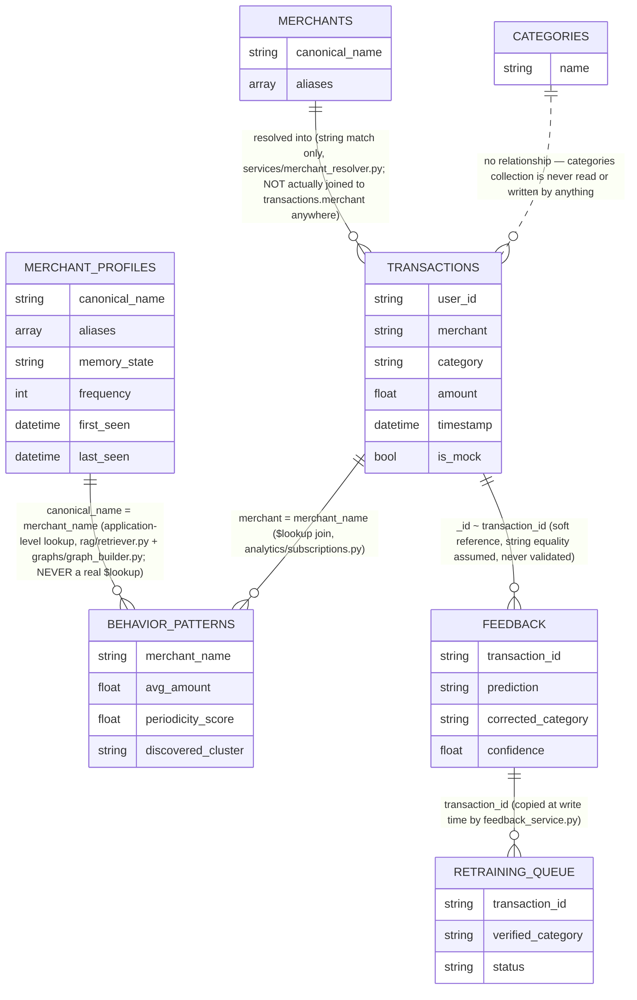
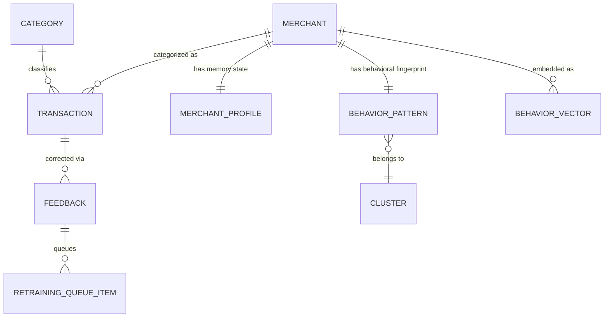
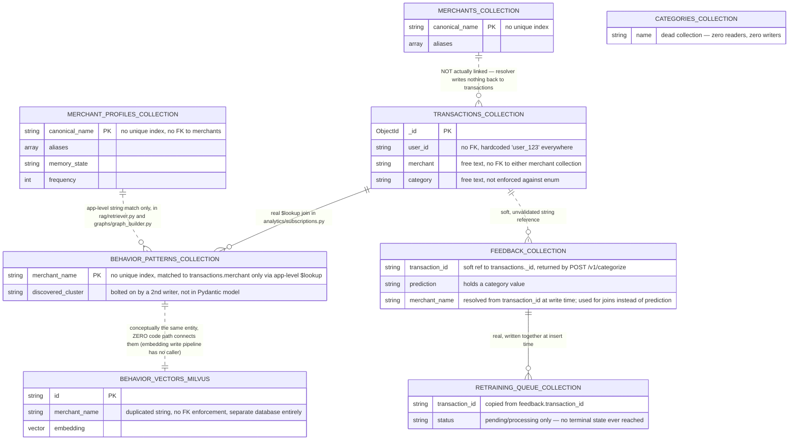
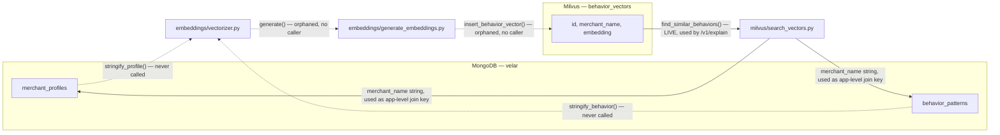

# 18 · Database Analysis

Velar uses **two** databases with fundamentally different data models: **MongoDB** (document store, system of record for everything except vectors) and **Milvus** (vector database, semantic similarity search only). There is no relational database anywhere in this stack. This document analyzes both as a Senior Database/Backend Architect would — schema, relationships, indexing, constraints, normalization, query patterns, transactions, bottlenecks, scalability, and concrete improvements — grounded entirely in the actual queries and writes found in the codebase, not the aspirational schema in `models/schemas.py` alone (the two diverge in specific, important ways documented below).

---

## 1. Schema

### 1.1 MongoDB — `velar` database, 7 collections

All seven are declared in `database/mongo.py::MongoDB.connect`. Field lists below reflect **what the code actually reads and writes**, not just what `models/schemas.py` declares — the two differ for several collections.

#### `transactions`
| Field | Type | Written by | Notes |
|---|---|---|---|
| `_id` | ObjectId | auto | |
| `user_id` | string | `scripts/mock_seeder.py` (intended also by `routers/v1.py`) | No caller currently writes real transactions successfully — `POST /v1/categorize` is broken |
| `merchant` | string | mock seeder | Free-text merchant name, not a reference to `merchants` or `merchant_profiles` |
| `category` | string | mock seeder | Free-text category, not enforced against `TransactionCategory` |
| `amount` | float | mock seeder | |
| `timestamp` | datetime | mock seeder | |
| `is_mock` | bool | mock seeder only | Absent on any hypothetical real transaction |
| `raw_text`, `source` | — | **never actually written** | Declared in the `Transaction` Pydantic model but no live write path populates them |

#### `feedback`
| Field | Type | Written by | Notes |
|---|---|---|---|
| `_id` | ObjectId | auto | |
| `transaction_id` | string | `feedback/feedback_service.py` (router now mounted at `/v1/feedback`) | Should be the `transaction_id` returned by `POST /v1/categorize`; not database-constrained |
| `prediction` | string | same | Holds a category value (e.g. `"Unknown"`, `"Travel"`) |
| `merchant_name` | string \| null | same | ✅ Added — resolved by looking up `transaction_id` in `transactions`; this is what §2's fix uses instead of `prediction` |
| `corrected_category` | string | same | |
| `confidence` | float | same | |
| `is_correction` | bool | same | `prediction != corrected_category` |
| `user_id` | string | same | Always `"system_user"` in practice — no real identity ever threaded through |
| `timestamp` | datetime | same | |

#### `categories`
**Completely dead.** Created on connect; never written to and never queried by any module in the codebase. `models/schemas.py::Category` exists but is never instantiated anywhere outside its own declaration.

#### `merchants`
| Field | Type | Written by | Notes |
|---|---|---|---|
| `_id` | ObjectId | auto | |
| `canonical_name` | string | `scripts/seed.py` | Logical key, no unique index |
| `aliases` | array of strings | `scripts/seed.py` | Queried both for exact match and `$regex` prefix match |

#### `merchant_profiles`
| Field | Type | Written by | Notes |
|---|---|---|---|
| `_id` | ObjectId | auto | Always projected out (`{"_id": 0}`) on read, so every `MerchantProfile.id` in the app is `None` |
| `canonical_name` | string | `repositories/profile_repository.py` | Logical key, no unique index — immutable after creation by convention (excluded from `$set` on update) but not enforced |
| `display_name`, `entity_type`, `notes`, `category`, `subcategory` | string/optional | same | Rarely populated — no code path sets `display_name`, `entity_type` beyond its `"Unknown"` default, `category`, or `subcategory` |
| `aliases` | array of strings | same | Appended to on each new raw-text variant seen |
| `memory_state` | string enum | same | `EPHEMERAL`/`TEMPORARY`/`PERMANENT`/`ARCHIVED` |
| `frequency` | int | same | Monotonically increasing, never reset |
| `first_seen`, `last_seen` | datetime | same | `first_seen` immutable after creation |
| `confidence` | float | same | Declared but never actually set to anything other than its `0.0` default anywhere in the codebase |

#### `behavior_patterns`
| Field | Type | Written by | Notes |
|---|---|---|---|
| `_id` | ObjectId | auto | |
| `merchant_name` | string | `behaviour/behavior_engine.py` | Logical key, upsert target |
| `avg_amount`, `median_amount`, `variance`, `std_dev`, `entropy_score` | float | same | |
| `preferred_hour` | int | same | |
| `time_bucket_distribution` | embedded object | same | `{morning, afternoon, evening, night}` |
| `weekday_distribution` | array[7] of float | same | |
| `daily_frequency`, `weekly_frequency` | float | same | |
| `periodicity_score` | float | same | |
| `last_updated` | datetime | same | |
| `discovered_cluster` | string | `clustering/cluster_engine.py` | **Not in the `BehaviorPattern` Pydantic model at all** — a schema-less extension bolted on by a separate writer; only present if Phase 8 clustering has ever successfully run (currently it cannot — see `docs/16-known-issues-tech-debt.md`) |

#### `retraining_queue`
| Field | Type | Written by | Notes |
|---|---|---|---|
| `_id` | ObjectId | auto | |
| `transaction_id` | string | `feedback/retraining_queue.py` (reachable via `/v1/feedback/`) | |
| `verified_category`, `failed_prediction` | string | same | |
| `status` | string | same | `"pending"` → `"processing"` (bulk `update_many`); **never transitions to `"completed"` or anything terminal** — launching a real training job still requires a task queue (Celery), which doesn't exist in this repo yet; see [16 · Known Issues §16.5](./16-known-issues-tech-debt.md#165-whats-intentionally-still-open-productinfra-decisions-not-bugs) |
| `added_at` | datetime | same | |
| `processing_started_at` | datetime | same | Only set on the `"pending" → "processing"` transition |

### 1.2 Milvus — `behavior_vectors` collection

| Field | Type | Notes |
|---|---|---|
| `id` | VARCHAR(255), primary key | |
| `merchant_name` | VARCHAR(255) | The only payload field returned alongside search hits |
| `embedding` | FLOAT_VECTOR(768) | Must match the dimensionality of whatever Ollama model `EMBED_MODEL` points to — never validated in code |

Index: HNSW, `metric_type=COSINE`, `M=8`, `efConstruction=200`. This is the **only index of any kind, in either database, anywhere in this codebase.**

---

## 2. Relationships

MongoDB has no foreign keys — every "relationship" below is an **application-level convention**: matching string values across collections, joined either by sequential queries in Python or by an aggregation `$lookup`. None of these are enforced by the database.

### 2.1 The `merchants` / `merchant_profiles` split — two uncoordinated identity silos

These two collections both claim to represent "canonical merchant identity," but **no code anywhere reads or writes both**. `services/merchant_resolver.py` only ever touches `merchants`. `memory/memory_manager.py` and `repositories/profile_repository.py` only ever touch `merchant_profiles`. A merchant resolved via `/v1/resolve` (found in `merchants`) is never automatically registered in `merchant_profiles`, and vice versa — a caller has to separately call `/memory/update` with the same canonical name to create the trust-tracking side of the same real-world entity. There is no shared identity, no cross-reference field, and no synchronization mechanism between them.

### 2.2 The `feedback.prediction` field mismatch — ✅ FIXED

This was a genuine data-integrity defect: `feedback/feedback_service.py::process_feedback` stored `"prediction": original_prediction` (a category string like `"Travel"`), while `rag/retriever.py` and `graphs/graph_builder.py` both queried/matched that same field as if it held a merchant name — meaning real feedback essentially never joined to the right merchant.

**Fix applied**: `process_feedback` now looks up the source transaction via `transaction_id` (which `POST /v1/categorize` returns) and writes a genuine `merchant_name` field on the feedback document. `rag/retriever.py` now runs `db.feedback.find({"merchant_name": name})`, and `graphs/graph_builder.py` now checks `f.get("merchant_name") in self.graph` before wiring a `FEEDBACK_ON` edge. `models/schemas.py::Feedback` was updated to include `merchant_name` (plus `is_correction` and `user_id`, which are also actually written but were previously missing from the schema). Verified end-to-end: a categorize → feedback round-trip correctly stores `"merchant_name": "Swiggy"` in the `feedback` collection. See [16 · Known Issues §16.2](./16-known-issues-tech-debt.md#162-high-previously-security--correctness-with-real-user-impact--all-fixed).

### 2.3 `feedback.transaction_id` is now a real, resolvable reference

`POST /v1/categorize` now returns the inserted transaction's `_id` (as `transaction_id`), so a real caller has a genuine id to pass to `POST /v1/feedback/` — previously `/v1/categorize` returned no id at all, and `test_api.py`'s own test data used fabricated values like `f"tx_{random.randint(1000, 9999)}"` with no corresponding transaction. There is still no database-level foreign-key constraint (Mongo doesn't enforce this natively, and `_lookup_merchant_name` simply returns `None` if the id doesn't resolve to a real transaction), but the intended real-world flow (categorize → capture `transaction_id` → feedback) now works end-to-end.

---

## 3. ER Diagrams

### 3.1 Intended / conceptual model (what the Pydantic schemas suggest)

This is the clean, normalized-looking mental model the schema names imply: one merchant entity, with one profile, one behavior fingerprint, one embedding, many transactions, many feedback records.

### 3.2 Actual model (what the code really does)

(`||--o{` denotes a relationship actually exercised by a real query in the codebase; `||..o{` denotes a relationship that exists only conceptually/by naming convention, with no query or code path actually enforcing or traversing it.)

### 3.3 Cross-database relationship (MongoDB ↔ Milvus)

The **write path** (Mongo → embed → Milvus) is fully built but has no orchestrating caller anywhere — dotted lines above. The **read path** (Milvus → Mongo, powering `/v1/explain`) is fully live — solid lines. This asymmetry means the vector index is permanently empty in any deployment that hasn't had someone manually script the write side.

---

## 4. Indexes

**Current state**: MongoDB has **zero indexes** beyond the automatic `_id` index on every collection (confirmed by grepping the entire codebase for `create_index` — the only hit anywhere is Milvus's vector index). Every query in the application — every `find_one`, every `$match`, every `$lookup` — runs as a collection scan.

| Collection | Field(s) actually queried | Recommended index |
|---|---|---|
| `transactions` | `user_id`, `timestamp` (range), `merchant` | Compound `{user_id: 1, timestamp: -1}`; separate `{merchant: 1}` for the subscriptions `$lookup` |
| `merchant_profiles` | `canonical_name` (exact match, every read/write) | **Unique** index on `{canonical_name: 1}` — also enforces the entity-uniqueness constraint that's currently missing entirely (see §5) |
| `behavior_patterns` | `merchant_name` (exact match, every read/write, and the `$lookup` foreign key) | **Unique** index on `{merchant_name: 1}` |
| `merchants` | `aliases` (array containment, and `$regex` prefix match) | Multikey index on `{aliases: 1}` — helps the exact-match query directly; the `$regex` prefix query can also use this index efficiently *only* because the pattern is left-anchored (`^word`) with no leading wildcard |
| `feedback` | `merchant_name` (join key used by `rag/retriever.py` and `graphs/graph_builder.py` as of the §2.2 fix), `transaction_id` | Index on `{merchant_name: 1}` |
| `retraining_queue` | `status` (`count_documents`, `update_many`) | Index on `{status: 1}` — cheap and directly speeds up the one query pattern this collection has |
| `categories` | — | None needed — dead collection, candidate for removal entirely |

**Milvus**: the existing HNSW/COSINE index is reasonable and correctly configured (`M=8`, `efConstruction=200`) for the current, presumably small, vector count.

---

## 5. Constraints

MongoDB enforces **no constraints** in this codebase beyond what the driver/BSON layer guarantees implicitly (e.g., `_id` uniqueness). Specifically absent:

- **No unique constraints** on any logical key — `merchant_profiles.canonical_name` and `behavior_patterns.merchant_name` can each have duplicate documents inserted with no error, since nothing (no unique index, no upsert-with-check logic in `create_profile`) prevents it. `create_profile` in `repositories/profile_repository.py` is a plain `insert_one`, not an `update_one(..., upsert=True)` — meaning two near-simultaneous first-encounters for the same new merchant (a real race condition, discussed in `docs/folders/memory.md`) can produce two profile documents for the same logical entity.
- **No schema validation** — MongoDB supports `$jsonSchema` collection validators; none are configured anywhere. Every document shape is enforced only at the Pydantic-model boundary, and only for the one collection (`merchant_profiles`) that has a repository — every other collection accepts arbitrary-shaped documents with no validation at the database level at all.
- **No referential integrity** — nothing prevents inserting a `feedback` document whose `transaction_id` matches no real transaction, or a `behavior_patterns` document whose `merchant_name` matches no real merchant.
- **No check constraints** — a `MerchantProfile.frequency` of `-5` or a `BehaviorPattern.periodicity_score` of `47.0` (well outside its documented `0.0–1.0` range) would be accepted without complaint by MongoDB; only Pydantic's basic type checking applies, and only where a repository exists.

**What this means practically**: data integrity in this system is entirely a *convention*, upheld only as long as every write path is careful and consistent — which, as §2.2 demonstrates, is not actually the case today.

---

## 6. Normalization

Applying relational normalization concepts to a document database requires translation, but the underlying questions (is data duplicated inconsistently? Is data grouped by natural access pattern?) still apply:

- **`behavior_patterns` is an appropriately denormalized read-model** — it caches precomputed statistics (avg amount, periodicity score) that would otherwise require expensive recomputation from `transactions` on every read. This is the *correct* use of denormalization in a document store: optimize for read patterns, accept that the cache can go stale (it does — nothing refreshes it automatically).
- **`merchants` and `merchant_profiles` are an example of *harmful* duplication** — both store `canonical_name` and `aliases` for what is conceptually the same entity, with zero synchronization. This isn't denormalization for performance; it's an accidental split with no coordinating logic, functionally two different, disconnected "sources of truth" for merchant identity (see §2.1).
- **`transactions.merchant` and `transactions.category` are stored as free-text strings, not references** — normal and expected for a document database (avoiding a join for the hot read path is often desirable), but combined with the total absence of any validation against `merchants`/`merchant_profiles`/`TransactionCategory`, this means the "merchant" and "category" on a transaction can be any arbitrary string, with no data-quality backstop.
- **`discovered_cluster` on `behavior_patterns`** is a legitimate example of schema evolution via a second writer bolting on a field — acceptable in a schemaless store, but undocumented in the Pydantic model, which is a maintainability gap (a future engineer reading `models/schemas.py` would have no idea this field exists on real documents).

---

## 7. Query Optimization

Walking through every real query pattern in the codebase:

| Query | Location | Optimization opportunity |
|---|---|---|
| `find_one({"canonical_name": name})` | `repositories/profile_repository.py` | Add unique index (§4) — currently a full collection scan |
| `find_one({"aliases": cleaned_text})` then per-word `$regex` | `services/merchant_resolver.py` | Multikey index on `aliases`; also consider replacing the whole substring-fallback approach with the already-built Milvus semantic search, per the code's own comments |
| `$match` + `$group` + `$sort` (no supporting index) | `analytics/spending_patterns.py` (both methods) | Compound index `{user_id, timestamp}` for the category breakdown; `{user_id}` alone (or `{user_id, merchant}`) for merchant frequency |
| `$group` + `$lookup` + `$unwind` + `$match`, **no `$sort` before `$group`** | `analytics/subscriptions.py` | Add `{$sort: {timestamp: 1}}` before `$group` so `$last`/`$max` are chronologically correct (a correctness fix, not just performance); index `behavior_patterns.merchant_name` to speed the `$lookup` |
| `find({"merchant": merchant_name})` with no time bound | `behaviour/behavior_engine.py` | Index on `merchant`; consider bounding by a time window and computing incrementally instead of full recomputation every run |
| Three sequential `find_one`/`find` per matched merchant, not parallelized | `rag/retriever.py` | Use `asyncio.gather` to run the three lookups concurrently per merchant, and consider batching across merchants with `$in` queries instead of N separate round trips |
| `find()` with no filter at all (three full collection scans) | `graphs/graph_builder.py::build_graph` | At minimum, project only the fields actually used (`canonical_name`, `memory_state`, `entity_type`, etc.) rather than fetching entire documents; ideally, incremental/delta rebuilding instead of full scans every call |
| One `update_one` per document in a loop | `memory/decay_engine.py::run_archive_sweep` | Replace with a single `update_many({"last_seen": {"$lt": cutoff}, "memory_state": {"$ne": "ARCHIVED"}}, {"$set": {"memory_state": "ARCHIVED"}})` — no per-document Python loop needed at all |
| `count_documents({"status": "pending"})` | `feedback/retraining_queue.py` | Index on `status` |

General over-fetching pattern: several read paths (`get_profile`, the RAG retriever's profile/behavior lookups) fetch entire documents when only 2–3 fields are ever used downstream — adding a projection (`{"memory_state": 1, "frequency": 1}`-style) would reduce network payload and Mongo's working-set pressure at scale, though this matters far less than the missing indexes above.

---

## 8. Transactions

**MongoDB multi-document ACID transactions are never used anywhere in this codebase** (confirmed by grep — no `start_session`, `with_transaction`, or `ClientSession` usage exists at all). This creates concrete, identifiable risk in three places:

1. **`feedback/feedback_service.py::process_feedback`** writes to `feedback` and then, conditionally, to `retraining_queue` as two independent operations. A crash or network failure between the two leaves a correction permanently logged but never queued for retraining, with no reconciliation mechanism to detect or repair the gap.
2. **`memory/memory_manager.py::process_encounter`** performs a read (`get_profile`) → in-memory mutation → write (`update_profile`/`create_profile`) with no optimistic concurrency control (no version field, no `findOneAndUpdate` with a filter guarding against concurrent modification). Two simultaneous encounters for the same merchant can race, and one's `frequency` increment can be silently lost — a classic read-modify-write hazard that a transaction (or, more idiomatically for this specific case, an atomic `$inc` operation) would close.
3. **The Mongo/Milvus dual-write problem**, if the embedding pipeline were ever wired up: writing a `behavior_patterns` document (Mongo) and its corresponding vector (Milvus) are two entirely separate systems with no distributed transaction or saga pattern connecting them — a partial failure would leave the two permanently out of sync, with nothing to detect or reconcile it.

**Why this matters more than it might first appear**: none of these are hypothetical edge cases — #2 is trivially reproducible under any real concurrent load (two transactions for the same merchant arriving close together, which is the *common* case for a popular merchant, not a rare one).

---

## 9. Potential Bottlenecks

| Bottleneck | Root cause | Impact as data grows |
|---|---|---|
| Every query is a collection scan | Zero indexes (§4) | Linear-or-worse degradation with collection size; the single biggest scalability risk in the entire system |
| `graphs/graph_builder.py::build_graph` | Three full, unfiltered collection scans, materialized entirely into Python lists, on every single call | Memory and latency both scale directly with total row counts across three collections at once |
| `behaviour/behavior_engine.py::profile_merchant_behavior` | Fetches *all* transactions for a merchant with no time bound or pagination | A high-volume merchant's profile recomputation gets slower and more memory-hungry indefinitely over time |
| `memory/decay_engine.py::run_archive_sweep` | One `update_one` per stale document, in a Python loop | N round trips to MongoDB instead of one bulk operation — directly proportional to backlog size |
| `services/merchant_resolver.py`'s substring fallback | Up to one `$regex` query per word in the input text, sequential | Latency scales with both input text length and the size of the (unindexed) `merchants` collection |
| `rag/retriever.py`'s per-merchant lookups | Three sequential (not concurrent) queries per matched merchant | `/v1/explain` latency scales linearly with `top_k`, compounding with the already-slow embedding/generation calls |
| Two independent Milvus clients | `database/milvus.py` and `milvus/insert_vectors.py` maintain separate connections | Doubles connection overhead for no functional benefit, and risks configuration drift (see `docs/16-known-issues-tech-debt.md#duplicate-milvus-clients`) |
| `retraining_queue` records stuck in `"processing"` forever | The training-launch step was never implemented | The collection accumulates permanently-orphaned records over time, since nothing ever moves them to a terminal state or requeues them |

---

## 10. Scalability

**MongoDB**:
- **Sharding candidates** (once this becomes necessary): `transactions` on `{user_id: 1}` (or a hashed shard key on `user_id` to avoid hotspotting a single heavy user) would align with the dominant query pattern (`$match: {user_id: ...}` in every analytics query); `merchant_profiles`/`behavior_patterns` on `{canonical_name: 1}`/`{merchant_name: 1}` respectively, since every query filters on that field.
- **Read scaling**: no read preference is configured anywhere (`AsyncIOMotorClient(uri)` uses driver defaults) — a replica set with `secondaryPreferred` read preference for the read-heavy analytics endpoints would reduce primary load, but requires the application to tolerate slightly stale reads for those specific queries (acceptable for analytics, less so for the memory state machine's read-modify-write pattern).
- **Growth trajectory concern**: `transactions` and `feedback` are the two collections with no natural upper bound — both will grow indefinitely with usage, and neither has any archival, TTL, or partitioning strategy today. `merchant_profiles`/`behavior_patterns` are naturally bounded by the number of distinct merchants, which grows far more slowly.

**Milvus**:
- Currently a single collection, single node implied by the connection setup — no partitioning strategy is configured (Milvus supports partitions, e.g., by time window or merchant category, which isn't used here).
- Scaling the HNSW index to millions of vectors would need `M`/`efConstruction` re-tuning and likely a move to Milvus's distributed/cluster deployment mode rather than the standalone mode implied by `docker-compose`'s referenced setup in `README.md`.
- The dual-client issue (§4 of `docs/17-senior-architect-review.md`) must be resolved before any serious scaling effort, since two independently-configured clients pointed at what's assumed to be "the same" Milvus deployment is already fragile at the current, tiny scale.

**Cross-cutting**: none of the above matters until the zero-index problem (§4) and the missing-transaction-safety problem (§8) are addressed — sharding an unindexed collection just distributes the same collection-scan cost across more shards; it doesn't remove it.

---

## 11. Future Improvements — prioritized

1. **Add the indexes in §4.** This alone is the single highest-leverage change available — every other optimization is secondary to fixing collection scans on every query path.
2. **Fix the `feedback.prediction` field-semantics bug (§2.2).** This is silently starving both the RAG explanation pipeline and the knowledge graph of real feedback data today, with no error or warning anywhere to indicate it.
3. **Add unique indexes/constraints on `merchant_profiles.canonical_name` and `behavior_patterns.merchant_name`**, and change `create_profile` to an upsert to close the duplicate-profile race condition.
4. **Reconcile or merge `merchants` and `merchant_profiles`** into one coordinated identity model — the current split means the rule-based resolver and the memory/trust system have no way to share what they each know about the same real-world merchant.
5. **Add MongoDB `$jsonSchema` validators** on at least `merchant_profiles` and `behavior_patterns`, so malformed documents are rejected at the database layer, not just optimistically assumed to be well-formed because a repository happens to exist for one of them.
6. **Wrap the feedback + retraining-queue writes in a MongoDB session/transaction** (or, more simply, make the retraining-queue write idempotent and reconcilable from the `feedback` collection alone, removing the need for atomicity).
7. **Replace the read-modify-write pattern in `memory/memory_manager.py`** with an atomic `findOneAndUpdate`/`$inc` for the frequency counter, closing the concurrent-encounter race condition.
8. **Add a TTL or reconciliation job for `retraining_queue`** so records don't accumulate in `"processing"` forever once that step is eventually implemented for real.
9. **Consolidate the two Milvus clients** into one, configured consistently through `core.config.settings`.
10. **Build the missing embedding-write orchestrator** (§3.3) so the vector index is actually populated in a running deployment, making `/v1/explain` reliably useful rather than frequently returning "no context available."
11. **Introduce a proper archival/retention policy for `transactions` and `feedback`** before either grows large enough for the missing-index problem to become an outage rather than a performance annoyance.

---

## Related documents
[03 · Data Model](./03-data-model.md) for the Pydantic-schema-level view, [17 · Senior Architect Review §13–14](./17-senior-architect-review.md#13-repository-flow) for repository/data-access-layer analysis, and [16 · Known Issues & Tech Debt](./16-known-issues-tech-debt.md) for the full defect list including the `feedback.prediction` mismatch newly documented here.
