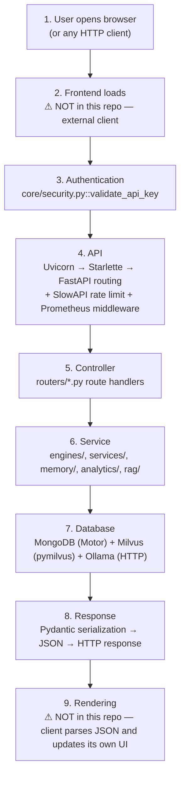
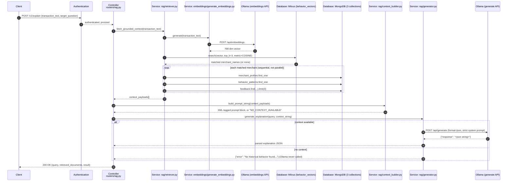
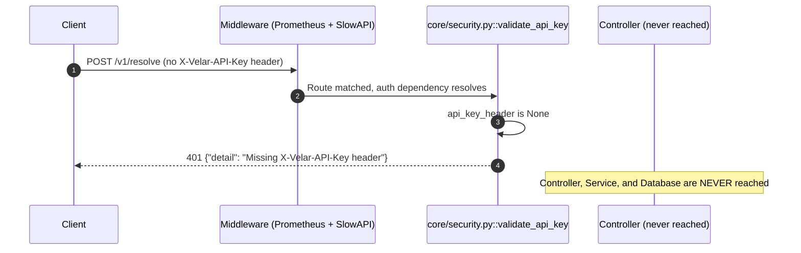
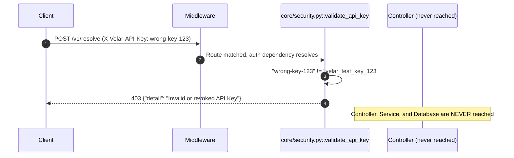
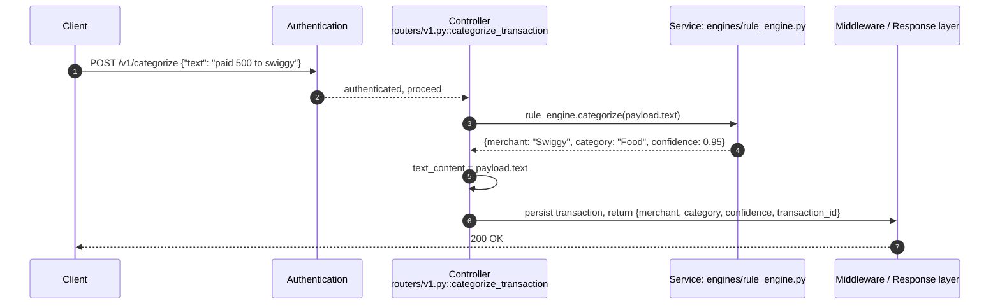

# 19 · System Design Interview Walkthrough

This document explains Velar the way you'd walk an interviewer through a request end-to-end on a whiteboard: `User opens browser → Frontend loads → Authentication → API → Controller → Service → Database → Response → Rendering`.

**One important, upfront correction to that framing**: this repository contains **no frontend at all** — no HTML, no JavaScript bundle, no templates, no static file serving. Confirmed across every file in the repo (see `docs/folders/root.md`). Velar is a pure JSON API backend. So "Frontend loads" and "Rendering" describe things that happen in a *separate* client application this repo doesn't contain — I'll explain what those steps would look like for a real consumer, clearly marked as external to this codebase, rather than inventing frontend code that doesn't exist.

---

## 0. The map: your 9 steps, mapped onto Velar's real components



Everything from step 3 through step 8 is real, verifiable code in this repository. Steps 1, 2, and 9 are genuine parts of a complete system design answer, but they live outside this backend's boundary — I'll cover what belongs there and be explicit about the seam.

---

## 1. User opens browser

This is infrastructure that happens **in front of** Velar, not inside it. A complete system-design answer covers it, so:

1. **DNS resolution** — the client resolves whatever domain Velar is deployed behind to an IP address. Nothing in this repo configures DNS.
2. **TCP handshake** — a 3-way handshake (`SYN` → `SYN-ACK` → `ACK`) establishes a connection to that IP on whatever port is exposed.
3. **TLS handshake** (if HTTPS) — certificate validation and cipher negotiation. **Important finding**: nothing in this codebase terminates TLS. `Dockerfile`'s `CMD` runs plain `uvicorn app:app --host 0.0.0.0 --port 8000` with no `--ssl-keyfile`/`--ssl-certfile`, and `docker-compose_production.yaml` exposes port `9850` directly with no reverse proxy defined in this repo. `docker-compose_production.yaml`'s `networks: [coolify]` block strongly implies TLS termination is handled by the external Coolify platform/reverse proxy, not by any code here — worth stating explicitly in an interview, since "where does TLS terminate" is a classic follow-up question, and the honest answer for this specific system is "not in this repository at all."
4. The client sends its first HTTP request over that (now-secured, if TLS applies) connection.

**Interview-answer framing**: "The browser resolves DNS, opens a TCP connection, negotiates TLS with whatever's terminating it — in this system's case, that's external to the application itself, presumably a reverse proxy on the hosting platform — and then sends an HTTP request."

## 2. Frontend loads ⚠ (external to this repository)

There is no frontend in this codebase. If a browser-based client existed, this step would be: the browser requests and loads that separate application's HTML/JS/CSS bundle, that bundle initializes, and it then makes `fetch`/`XHR` calls to Velar's API endpoints using whatever base URL it's configured with.

**A real, checkable architectural gap this surfaces**: Velar's `app.py` registers **no CORS middleware anywhere** (verified by grep in `docs/17-senior-architect-review.md §6`). If a browser-based frontend ever needs to call this API directly from a web page, every request will fail the browser's CORS preflight check. This is either a deliberate assumption ("only server-to-server callers, no browser client") or an unaddressed gap — the code gives no indication either way.

**A real, checkable security concern this surfaces**: authentication is a single static shared string (`X-Velar-API-Key`, checked against `settings.VELAR_API_KEY` in `core/security.py` using a constant-time comparison — previously hardcoded to the literal `velar_test_key_123` regardless of configuration, fixed, see [16 · Known Issues §16.2](./16-known-issues-tech-debt.md#162-high-previously-security--correctness-with-real-user-impact--all-fixed)). Even with that fixed, if a browser-based frontend were built against this API, the key would need to be embedded somewhere the browser can read it to attach to requests — which means it would be visible to anyone opening browser dev tools or viewing the page source/bundle. **Static API keys should never be embedded in browser-delivered code**; this authentication model is really only appropriate for server-to-server calls, not a public browser client. This is exactly the kind of thing worth raising unprompted in a system design interview: "given this auth model, what kind of client can safely call this API?"

## 3. Authentication

This is the first step actually implemented in this repository, and it runs as a **FastAPI dependency** — meaning it executes *before* any route handler's body, for every router except the two exceptions noted below.

**Code**: `core/security.py::validate_api_key`, attached via `Depends(validate_api_key)` at `app.include_router(..., dependencies=[...])` in `app.py`, for all five routers (`v1`, `memory`, `analytics`, `rag`, `observability`).

**Exceptions** (no auth at all): `GET /health` and `GET /metrics` are registered directly on `app`, outside any `include_router(dependencies=[...])` call — by design, so infrastructure tooling (load balancers, Prometheus scrapers) that may not carry an API key can still reach them.

**What actually happens**:
1. FastAPI's `APIKeyHeader(name="X-Velar-API-Key", auto_error=False)` extracts the header value (or `None` if absent) from the request.
2. If `None` → raise `HTTPException(401, "Missing X-Velar-API-Key header")`.
3. If present but `!= "velar_test_key_123"` (a **hardcoded literal**, not read from `settings.VELAR_API_KEY` despite that setting existing and being required in `.env` — a real, verified bug) → raise `HTTPException(403, "Invalid or revoked API Key")`.
4. If it matches → return the string `"developer_id_789"` — a fixed, fake "identity" that **no caller in the codebase ever actually reads**, since every router attaches this dependency via `dependencies=[...]` (which discards the return value) rather than binding it to a handler parameter with `Depends(...)`.

**What this means architecturally**: there is authentication (proving you hold *a* valid key) but effectively no authorization (there is no way to tell *which* caller made a request, and every valid caller has identical, undifferentiated access to all data). A senior interviewer would immediately flag this: authentication answers "can you get in the door," authorization answers "what can you touch once you're inside" — this system has built only the former.

## 4. API

Once authenticated (or for the two unauthenticated routes), the request is inside FastAPI's routing/middleware layer.

**The actual pipeline, in order**:
1. **Uvicorn** (the ASGI server) accepts the raw HTTP connection and translates it into an ASGI `scope`/`receive`/`send` triple.
2. **Prometheus instrumentator middleware** (`prometheus-fastapi-instrumentator`, wrapped around the whole app in `app.py`) starts a timer and increments an in-progress-request gauge.
3. **SlowAPI rate limiting** checks the caller's IP (via `get_remote_address`) against the global default limits (`1000/day`, `100/minute`, configured in `core/rate_limiter.py`) — if exceeded, short-circuits immediately with a `429`, never reaching the route handler.
4. **Starlette path routing** matches the request's method + path against the registered `APIRoute` table, built from all five routers plus the two inline routes.
5. **The auth dependency** (step 3 above) resolves.
6. **Pydantic request validation** — the request body (if any) and query/path parameters are validated against the route's declared model; a mismatch raises FastAPI's default `422 Unprocessable Entity` before the handler function's body ever executes.
7. Only after all of the above succeeds does control pass to the **Controller** (step 5 in your numbering).

**What's notably absent** from this pipeline, worth naming in an interview: no CORS middleware, no GZip compression, no request-ID/correlation-ID middleware for tracing a request across log lines, no global request timeout — all confirmed absent by direct inspection (`docs/17-senior-architect-review.md §6`).

## 5. Controller

In Velar's terms, "controllers" are the functions in `routers/*.py`. The dominant, and architecturally correct, pattern here is **thin delegation**: parse input, call exactly one service-layer function, return its result — no business logic embedded in the controller itself.

Example, `routers/v1.py::resolve_transaction_merchant`:
```python
@router.post("/resolve", response_model=ResolutionResult)
async def resolve_transaction_merchant(request: ResolveRequest):
    result = await merchant_resolver.resolve(request.text)
    return result
```
One notable, instructive violation of this pattern: `routers/v1.py::categorize_transaction` embeds real (and broken) business logic — regex amount extraction, a direct MongoDB write — directly in the controller instead of delegating, which is very likely *why* it was left unfinished; there was no clear service-layer boundary forcing the logic to be extracted and completed properly. Worth citing in an interview as a concrete example of why the thin-controller convention matters: violating it in this exact case correlates with the one endpoint that's actually broken in production.

## 6. Service

This is the business/domain logic layer — where Velar's actual intelligence lives. It's spread across several differently-named-but-architecturally-equivalent folders: `engines/` (rule-based categorization, the confidence wall), `services/` (merchant resolution), `memory/` (the trust state machine), `analytics/` (four independent spend-analysis engines), `rag/` (the three-stage grounded-explanation pipeline).

**Design pattern used throughout**: every service is a **module-level singleton**, instantiated once at import time (`rule_engine = RuleEngine()`, `merchant_resolver = MerchantResolver()`, etc.) and imported directly wherever needed — not injected via FastAPI's `Depends()` mechanism (which, per `docs/17-senior-architect-review.md §3`, is used for exactly one thing in the whole codebase: authentication). This is simple and predictable, but it means there's no dependency-injection seam for swapping in test doubles — a real trade-off worth naming in an interview if asked "how would you test this."

**Representative examples of what happens here**:
- `engines/rule_engine.py::categorize` — a synchronous, in-memory regex scan against a pre-loaded JSON dictionary. No I/O.
- `services/merchant_resolver.py::resolve` — cleans noisy text, then issues one or more MongoDB queries (async, real I/O).
- `rag/retriever.py::fetch_grounded_context` — orchestrates a Milvus vector search *and* multiple MongoDB reads *and*, transitively, an HTTP call to an Ollama server for embedding generation — the richest example of a "service" in this codebase, spanning three different external systems in one call.

## 7. Database

Velar's data layer actually spans **three different external systems**, not one:

1. **MongoDB** (via Motor, the async driver) — the system of record for transactions, feedback, merchant identity, memory profiles, and behavioral statistics. Accessed through `database/mongo.py`'s singleton `db`, with collection-level access (`db.transactions`, `db.merchant_profiles`, etc.) rather than raw connection handling in every call site.
2. **Milvus** (via `pymilvus.MilvusClient`) — vector similarity search over merchant behavior embeddings. Notably, **two separate, independently-configured client instances exist** in this codebase for this one database (`database/milvus.py`'s unused `vector_db`, and `milvus/insert_vectors.py`'s actually-used `vector_store`) — a real architectural inconsistency worth naming if a diagram is requested (see the sequence diagrams below and `docs/18-database-analysis.md`).
3. **Ollama** (via `httpx`, a plain HTTP call, not a database driver at all) — used for both generating vector embeddings and generating the final LLM explanation text. Architecturally this is an external inference service, but functionally it sits in the same position in the request flow as a database call: the handler `await`s it and can't proceed without its result.

**Critical, verified fact**: **zero indexes exist on any MongoDB collection** in this codebase (only Milvus has one, its HNSW vector index) — every single MongoDB query, across every service, is a full collection scan. This is the single most important fact to volunteer if an interviewer asks "how would this scale," because it means the answer starts with "add indexes," not "add more servers."

## 8. Response

Once the service layer returns, the controller returns that value, and FastAPI takes over again:

1. **If a `response_model` is declared** on the route (true for `routers/v1.py` and `routers/memory.py`'s endpoints) — the returned value is validated against that Pydantic model and serialized to JSON, stripping any extra fields not declared on the model.
2. **If no `response_model` is declared** (true for every endpoint in `routers/analytics.py`, `routers/rag.py`, `routers/observability.py`) — whatever dict/list the handler returned is serialized to JSON as-is, with no shape validation and a generic entry in the auto-generated OpenAPI schema. This is a real, verified inconsistency across the API surface (`docs/17-senior-architect-review.md §17`).
3. The HTTP response is constructed with the appropriate status code (`200` by default, or whatever was explicitly raised/returned earlier in the pipeline) and sent back down through the middleware stack — the Prometheus instrumentator records final timing and outcome here.
4. **If an unhandled exception occurred anywhere in the controller or service layer** — and this codebase has **zero custom exception classes and only one global exception handler** (for rate-limit errors specifically, verified by grep) — the response is Starlette's generic default `500 Internal Server Error`, with no consistent, application-defined error envelope. This is exactly what happens on every real call to `POST /v1/categorize` today.

## 9. Rendering ⚠ (external to this repository)

Not implemented here — Velar returns JSON, full stop. For a real consumer:
- A **browser-based frontend** would parse the JSON response body and use it to update its own UI state (e.g., a React component re-rendering a list of categorized transactions).
- A **mobile app** would deserialize the JSON into native model objects and update its view layer.
- A **server-to-server caller** (another backend service) would consume the JSON programmatically, with no "rendering" in the visual sense at all — this is plausibly Velar's actual intended consumption pattern, given the API-key-only auth model discussed in step 2.
- A **`curl`/CLI consumer** — as used throughout `scripts/test_pipeline.sh` and this documentation set's own examples — simply prints the raw JSON to the terminal.

---

## Worked example 1 — Happy path: `POST /v1/resolve`

This is the cleanest full illustration of all nine steps against real, working code.

```mermaid
sequenceDiagram
    autonumber
    participant U as User / Client
    participant Net as DNS + TCP + TLS (outside this repo)
    participant Uv as Uvicorn (ASGI server)
    participant Mw as Middleware<br/>(Prometheus + SlowAPI)
    participant Auth as core/security.py::validate_api_key
    participant Ctl as Controller<br/>routers/v1.py::resolve_transaction_merchant
    participant Svc as Service<br/>services/merchant_resolver.py
    participant DB as MongoDB (merchants collection)
    participant R as Rendering (outside this repo)

    U->>Net: 1. Resolve DNS, open TCP, negotiate TLS
    Net->>Uv: 2. HTTP POST /v1/resolve (frontend/client already loaded, sends request)
    Uv->>Mw: 3. ASGI scope handed to middleware stack
    Mw->>Mw: Prometheus starts timer; SlowAPI checks IP rate limit (pass)
    Mw->>Auth: 4. Route matched, auth dependency resolves
    Auth->>Auth: Check X-Velar-API-Key == "velar_test_key_123"
    Auth-->>Mw: OK (identity discarded, unused)
    Mw->>Ctl: 5. Pydantic validates {"text": "..."} against ResolveRequest
    Ctl->>Svc: 6. resolve(raw_text)
    Svc->>Svc: clean_text() — strip UPI/IMPS/NEFT noise, uppercase
    Svc->>DB: 7. find_one({aliases: cleaned_text})
    DB-->>Svc: matched document (or none)
    Svc-->>Ctl: ResolutionResult(confidence=0.99, method=exact_alias)
    Ctl-->>Mw: 8. Pydantic serializes ResolutionResult to JSON
    Mw-->>U: 200 OK + JSON body (Prometheus records final timing)
    U->>R: 9. Client parses JSON, updates its own UI/state
```

## Worked example 2 — Complex path: `POST /v1/explain` (multi-service, multi-database)

This shows what "Service" and "Database" really mean once a request touches every subsystem Velar has.


Note everything inside the `loop` runs **sequentially, not concurrently** — a real, named performance finding (`docs/18-database-analysis.md §9`) that directly answers "where would you optimize this" in an interview: `asyncio.gather` across the three lookups per merchant would cut this stage's latency significantly with no correctness cost, since none of the three queries depend on each other.

## Worked example 3 — Failure path: missing/invalid API key

Interviewers love asking "what happens when it fails" — here's exactly where this flow short-circuits.



Key interview point: **authentication is a hard gate before the Controller layer** — no service or database code ever runs for a rejected request, which is correct, efficient placement (fail as early as possible, before spending any I/O budget).

## Worked example 4 — Server-error path: `POST /v1/categorize` (a real, verified bug)

This is a genuinely useful interview example because it's not hypothetical — it's the actual, current behavior of this codebase, and it illustrates what happens when the "Response" step has nothing good to serialize.


✅ This handler previously crashed on every call (`request.get("text", "")` called `.get()` on a Pydantic model) — fixed, see [16 · Known Issues §16.1](./16-known-issues-tech-debt.md#161-critical-previously-broke-the-application-or-a-whole-feature--all-fixed). The underlying observability gap this originally illustrated is still real and worth knowing, though: this codebase has **no custom exception hierarchy and no global exception handler** beyond the one registered for rate-limiting (`docs/17-senior-architect-review.md §15`), so any *unhandled* exception anywhere in any controller or service — not just this now-fixed one — would still degrade to a generic, uninformative 500. Interview talking point: "how would a client, or an on-call engineer, know *why* an unhandled failure happened?" The honest answer today is "only by reading server-side logs," since nothing in the response body says anything useful.

---

## Interview cheat-sheet: mapping generic vocabulary to Velar's specifics

| Generic system-design term | Velar's actual implementation |
|---|---|
| Load balancer / reverse proxy | Not in this repo — implied to be external (Coolify platform, per `docker-compose_production.yaml`) |
| API Gateway | None — Starlette's own router inside the single FastAPI process serves this role |
| Auth service | `core/security.py` — a single hardcoded shared-secret check, no real per-user identity |
| Rate limiter | SlowAPI, in-memory, per-process, keyed by IP — won't scale correctly across multiple replicas without a shared backend |
| Controller / Handler layer | `routers/*.py` |
| Service / Business logic layer | `engines/`, `services/`, `memory/`, `analytics/`, `rag/` — five differently-named folders performing the same architectural role |
| Repository / DAO layer | Only one exists (`repositories/profile_repository.py`) — every other collection is queried directly, with no abstraction |
| Primary datastore | MongoDB (Motor, async) |
| Search/vector index | Milvus (two redundant client instances — a real bug) |
| External inference/ML service | Ollama (HTTP, for both embeddings and generation) |
| Caching layer | **None exists anywhere in this codebase** — zero `lru_cache`, zero Redis, despite a comment in `core/security.py` claiming Redis is used "in production" |
| Message queue / background jobs | **None exists** — `feedback/retraining_queue.py`'s "trigger retraining" step is an unfinished stub; the codebase's own comments reference an intended Celery integration that was never built |
| Observability / Metrics | Prometheus via `prometheus-fastapi-instrumentator`, default metrics only — no custom business metrics |
| Distributed tracing / correlation IDs | **None** — a request's log lines across services share no common identifier |

---

## Related documents
[01 · Architecture](./01-architecture.md) for the full system diagram, [17 · Senior Architect Review](./17-senior-architect-review.md) for the cross-cutting deep dive this walkthrough summarizes into an interview narrative, [18 · Database Analysis](./18-database-analysis.md) for the data-layer detail behind step 7, and [02 · API Reference](./02-api-reference.md) / [Complete API Reference](./api/README.md) for every endpoint's exact contract.
