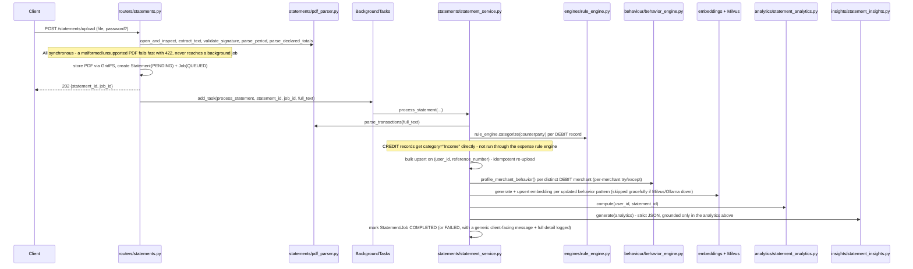

# 23 · Statement Ingestion Pipeline (Google Pay PDF → Transactions → Analytics → Insights)

## 23.1 What this is

The product surface a Flutter frontend actually consumes: a user uploads a Google Pay "Transaction statement" PDF, and the backend owns every processing step - parsing, categorization, persistence, behavioral profiling, embedding/vector sync, analytics, and AI insight generation - before the frontend ever needs to make a second request. The frontend polls one job for status and then reads four already-computed views (statement detail, transactions, analytics, insights).

This sits alongside the pre-existing single-transaction pipeline (`POST /v1/categorize`, raw SMS/UPI text ingestion) rather than replacing it - a statement upload is a bulk, PDF-sourced ingestion path that writes into the same `transactions` collection, tagged with a `statement_id`.

## 23.2 Domain model

```
User
 └── Statement (one PDF upload)
      ├── Job (processing status/progress/errors - polled via GET /jobs/{id})
      ├── Transaction[] (statement_id-tagged, extends the existing Transaction model)
      ├── StatementAnalytics (embedded, computed once)
      └── InsightItem[] (embedded, computed once)
```

`Job` is deliberately its own collection, not just a status field on `Statement` - `resource_type`/`resource_id`/`job_type` are generic so a future job type (e.g. a manual reprocess) can reuse the exact same polling contract without a schema change. `Statement.current_job_id` + `processing_status` are a denormalized convenience so simple list/detail views don't need a join.

## 23.3 The real Google Pay statement format

The parser (`statements/pdf_parser.py`) is grounded in an actual, anonymized Google Pay statement (`mock/gpay_statement_20260101_20260630.pdf`, 19 pages, 184 transactions, 01 Jan – 30 Jun 2026), not assumptions. Parsing it and summing DEBIT/CREDIT amounts reconciles **exactly** against the statement's own declared Sent/Received totals (₹80,634.04 / ₹28,975) - this is exercised directly as a test assertion, not just a one-time manual check.

Key format findings:

- **pdfplumber's default word `x_tolerance` (3) collapses inter-word spacing entirely** on this statement's font - `"Paid to Toni and Guy"` extracts as `"PaidtoToniandGuy"` at the default. `extract_text(x_tolerance=1)` recovers correct spacing. This was discovered by extracting the real file at several tolerances and comparing output, not assumed.
- Every transaction is a strict **3-line record** once extracted correctly:
  ```
  01 Jan, 2026 Paid to Toni and Guy ₹252
  04:47 PM UPI Transaction ID: 116512346960
  Paid by HDFC Bank 5488
  ```
  `statements/pdf_parser.py::_RECORD_RE` matches this directly with a multi-line regex - no table/column-position heuristics needed.
- The literal wordmark "Google Pay" is **not** a text-layer page title (it's a logo image) - it only appears inside the repeated disclaimer paragraph ("...payments made by you on the Google Pay app..."). `validate_signature()` checks for that substring specifically, plus "Transaction statement" and at least one "UPI Transaction ID:" occurrence.
- The statement period can span **multiple calendar months** (this sample: Jan-Jun). There is deliberately no "statement_month"/"statement_year" field - `Statement.period_start`/`period_end` (exact dates parsed from the document) is the correct, general field.
- This statement type **never encodes a transaction-level failure/status** - only settled transactions appear. `TransactionStatus` defaults to `SUCCESS`; `StatementAnalytics.failed_transaction_count` honestly reports 0 for Google-Pay-sourced data rather than being fabricated.
- The sample is **not** password-protected, confirming that's the exception - `open_and_inspect()` supports an optional password but doesn't require one.
- `UPI Transaction ID` is always a 12-digit number - this independently matches the noise-stripping assumption already baked into `services/merchant_resolver.py` from the pre-existing single-transaction pipeline.

## 23.4 Processing pipeline



Any failure inside `process_statement` is caught, logged in full server-side (`logger.exception`), and only a generic message is persisted onto `Job.error_message`/`Statement.error_message` - this runs outside the request/response cycle as a `BackgroundTask`, so it can never go through `core/error_handlers.py`, and must not leak internal detail through the polling endpoint either.

## 23.5 Reuse of the existing AI/analytics engines

Nothing here is a parallel implementation - it's the existing engines, called from a new orchestration layer:

| Step | Reused from |
|---|---|
| Merchant/category resolution | `engines/rule_engine.py::categorize` - the exact same call `routers/v1.py`'s `/v1/categorize` already makes |
| Per-merchant behavioral profiling | `behaviour/behavior_engine.py::profile_merchant_behavior` - same per-merchant try/except resilience already used by `routers/pipelines.py`'s `run-all` |
| Embeddings + vector storage | `embeddings/generate_embeddings.py` + `milvus/insert_vectors.py` - the same collection (`behavior_vectors`) `/v1/pipelines/embeddings/sync` writes to |
| Ollama calling convention | `core/ollama_client.py::get_ollama_host` + the same httpx/`format:"json"`/strict-system-prompt pattern as `rag/generator.py`, but with `insights/statement_insights.py`'s own prompt - grounded in computed analytics, not merchant behavior context, which is a different task from what `rag/generator.py::ExplanationGenerator` does |

`behavior_patterns` and the Milvus `behavior_vectors` collection stay a **global, cross-user, cross-statement** merchant knowledge base, exactly as they were before this feature - a statement's processing *contributes to* that shared knowledge (for its touched merchants) but the statement's own analytics/insights are computed from its own transactions only (`analytics/statement_analytics.py` filters by `{user_id, statement_id}`).

## 23.6 Analytics scope: per-statement vs. global

The pre-existing `/v1/analytics/*` endpoints (date-range-scoped, across a user's entire history) are untouched. `GET /statements/{id}/analytics` is a separate, statement-bounded view - a statement's transaction set is already exact, so there's no date-range guessing involved. `top_merchants` and `daily_trend` are DEBIT-only (spending views); `category_breakdown` includes all categories (including `Income`, for CREDIT transactions); `recurring_payments` reuses the same periodicity-score join `analytics/subscriptions.py` already does, scoped to this statement's merchants.

## 23.7 Data safety and idempotency

- **Dedup**: a unique partial index on `transactions.(user_id, reference_number)` (`database/mongo.py::ensure_indexes`) means re-uploading the same statement, or two statements whose date ranges overlap, upserts existing transactions in place instead of duplicating them.
- **Ownership**: every statement/transaction/analytics/insights/job endpoint 404s (not 403) if the resource doesn't exist *or* belongs to another user - same posture already used for `/memory/*`, so a caller can't distinguish "not yours" from "doesn't exist."
- **Cascading delete**: `DELETE /statements/{id}` removes the statement, its transactions, its job history, and its retained GridFS PDF. It deliberately does **not** touch `behavior_patterns`/Milvus vectors, since those are shared knowledge that may be backed by other statements or users too.
- **PDF retention**: the original upload is stored via MongoDB GridFS (`repositories/statement_repository.py`) - reuses the existing Mongo connection, no new storage infrastructure.

## 23.8 Async processing

Job execution is in-process (FastAPI `BackgroundTasks`) rather than a separate task queue - this repo has no Celery/Redis today, and the brief explicitly asked to add one only "if necessary." Because the client-facing contract is "create a job, then poll `GET /jobs/{id}`," the execution mechanism is fully decoupled from the API shape - a real task queue could replace `BackgroundTasks` later (e.g. if statement processing needs to survive a process restart, or scale across workers) with zero change to any endpoint. `Job.stage` carries a human-readable progress label (`"parsing"`, `"categorizing"`, `"persisting_transactions"`, `"profiling_merchants"`, `"generating_embeddings"`, `"computing_analytics"`, `"generating_insights"`) alongside `progress_percent`, so a Flutter client can show real incremental progress, not just a spinner.

## 23.9 Endpoints

See [02 · API Reference](./02-api-reference.md) for full request/response contracts. Summary: `POST /statements/upload`, `GET /statements` (paginated), `GET /statements/{id}`, `DELETE /statements/{id}`, `GET /statements/{id}/transactions` (paginated/filterable/sortable), `GET /statements/{id}/analytics`, `GET /statements/{id}/insights`, `GET /jobs/{id}`. All require both the API key and a JWT (see [22 · Authentication](./22-authentication.md)) - every one of these operates on data scoped to the calling user.

## 23.10 Known, deliberate limitations

- Only Google Pay's "Transaction statement" PDF export is supported - this is a domain-specific parser by design, not a generic document ingestion system.
- No "reprocess" endpoint exists yet; delete + re-upload achieves the same result and is safe (idempotent upsert on `reference_number`). The `Job.job_type` field exists specifically so this can be added later without a schema change.
- `analytics`/`insights` are computed once at processing time and are not automatically recomputed if, say, `merchant_aliases.json` changes after the fact - `GET /statements/{id}/analytics` always reflects what was true when the job ran, per `analytics_version`.
