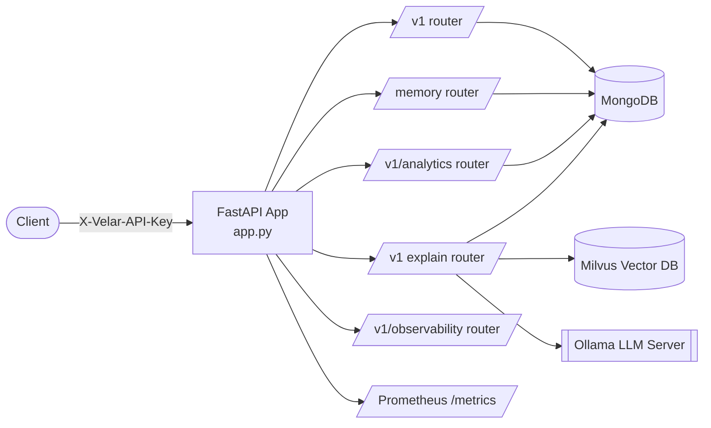

# Velar Transaction Intelligence Engine — Engineering Documentation

Welcome to the internal engineering documentation for **Velar**, the transaction-intelligence backend. This portal is written for engineers joining the team who need to understand the system deeply enough to operate, extend, or debug it without asking around first.

> **Scope note:** Every statement in these documents is derived directly from the code in this repository as of the current `three` branch. Where the implementation is incomplete, inconsistent, or contains a defect, it is called out explicitly rather than glossed over — see [16 · Known Issues & Tech Debt](./16-known-issues-tech-debt.md). Nothing here describes aspirational or planned behavior unless the source comments themselves describe it as a future phase.

## What is Velar?

Velar ingests raw, noisy financial transaction strings (UPI references, bank SMS text, POS narrations) and turns them into structured, explainable financial intelligence: canonical merchant identity, spend category, behavioral fingerprints, anomalies, subscriptions, and natural-language explanations grounded in retrieved data.

The codebase is organized as a series of **numbered "Phases"** — this isn't a documentation invention, it's how the engineers who built it labeled the system in code comments (`# Phase 3 Endpoint`, `# Phase 9 Specific Features`, `PHASE 0 & 15: SYSTEM HEALTH & SECURITY`, etc.). This documentation set follows that same phase structure because it is the most accurate map of intent to implementation.

## How to use this documentation

| Doc | Read this when you need to... |
|---|---|
| [01 · Architecture](./01-architecture.md) | Understand the overall system shape, service topology, and how a request moves through the stack |
| [02 · API Reference](./02-api-reference.md) | Integrate with or call any HTTP endpoint Velar exposes |
| [03 · Data Model](./03-data-model.md) | Understand Pydantic schemas, MongoDB collections, and the Milvus vector schema |
| [04 · Core Infrastructure](./04-core-infrastructure.md) | Understand config, security, rate limiting, the Ollama client, and DB connection lifecycle |
| [05 · Ingestion, Resolution & Memory (Phases 1–4)](./05-ingestion-resolution-memory.md) | Understand how raw text becomes a merchant identity with a persistent memory state |
| [06 · Confidence & Behavioral Intelligence (Phases 5–6)](./06-confidence-behavioral-intelligence.md) | Understand the confidence wall and statistical behavior profiling |
| [07 · Embeddings, Vector Search & Clustering (Phases 7–8)](./07-embeddings-vectorsearch-clustering.md) | Understand semantic search over merchant behavior and unsupervised discovery |
| [08 · ML Training & Evaluation (Phases 9, 11)](./08-ml-training-evaluation.md) | Understand the baseline classifier benchmark suite and LoRA fine-tuning pipeline |
| [09 · Feedback & Active Learning (Phase 10)](./09-feedback-active-learning.md) | Understand how human corrections are captured and queued for retraining |
| [10 · RAG & Explainability (Phase 12)](./10-rag-explainability.md) | Understand the grounded, hallucination-resistant explanation pipeline |
| [11 · Analytics Engine (Phase 13)](./11-analytics-engine.md) | Understand spend analytics, subscriptions, trends, and anomaly detection |
| [12 · Observability & MLOps (Phase 14)](./12-observability-mlops.md) | Understand Prometheus metrics and the drift-analysis stubs |
| [13 · Knowledge Graph](./13-knowledge-graph.md) | Understand the cross-phase graph layer built on NetworkX |
| [14 · Deployment & Operations](./14-deployment-operations.md) | Build, configure, and run Velar locally or in production |
| [15 · Testing](./15-testing.md) | Understand the automated test suite and manual E2E script |
| [16 · Known Issues & Tech Debt](./16-known-issues-tech-debt.md) | Understand which parts of the system are broken, disconnected, or mocked |
| [17 · Senior Architect Review](./17-senior-architect-review.md) | Get a cross-cutting analysis of startup, DI, auth/authz, error handling, caching, bottlenecks, security, and scalability |
| [18 · Database Analysis](./18-database-analysis.md) | Understand schema, ER diagrams, relationships, indexes, constraints, normalization, transactions, and scalability across MongoDB and Milvus |
| [Folder-by-Folder Reference](./folders/README.md) | Get a deep dive on one specific folder — purpose, classes, dependency/call graphs, interview questions, common mistakes, and blast radius if it disappeared |
| [File-by-File Reference](./files/README.md) | Get a deep dive on one specific file — every import, every function explained in plain English, side effects, performance notes, and interview questions |
| [Complete API Reference (per-endpoint)](./api/README.md) | Get the full contract for one specific endpoint — headers, validation, exact DB queries, execution flow diagram, examples, and interview questions |

## System snapshot

## Tech stack (as implemented)

| Layer | Technology | Where in code |
|---|---|---|
| Web framework | FastAPI | `app.py` |
| ASGI server | Uvicorn | `app.py`, `Dockerfile` |
| Rate limiting | SlowAPI | `core/rate_limiter.py` |
| Primary datastore | MongoDB via Motor (async) | `database/mongo.py` |
| Vector datastore | Milvus via `pymilvus.MilvusClient` | `database/milvus.py`, `milvus/*.py` |
| LLM / embeddings inference | Ollama HTTP API | `core/ollama_client.py`, `rag/generator.py`, `embeddings/generate_embeddings.py` |
| Dimensionality reduction | UMAP | `clustering/umap_projection.py` |
| Density clustering | HDBSCAN (scikit-learn) | `clustering/hdbscan_cluster.py` |
| Classical ML baselines | scikit-learn, LightGBM, XGBoost | `training/train.py` |
| Explainability (ML) | SHAP | `evaluation/metrics.py` |
| Fine-tuning | HuggingFace Transformers + PEFT (LoRA) | `training/finetune.py` |
| Graph modeling | NetworkX | `graphs/graph_builder.py` |
| Metrics/observability | `prometheus-fastapi-instrumentator` | `app.py` |
| Config | Pydantic Settings (`.env`) | `core/config.py` |
| Testing | pytest + FastAPI `TestClient` | `test_api.py` |
