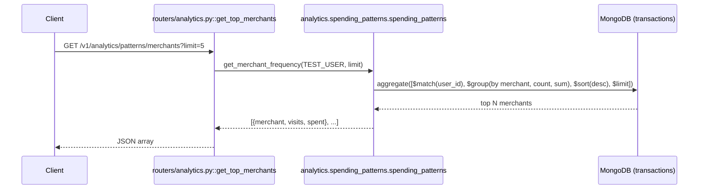

# GET `/v1/analytics/patterns/merchants`

## Method
`GET`

## URL
`/v1/analytics/patterns/merchants?limit=5`

## Purpose
Returns a user's most-visited merchants, ranked by transaction count, across their entire transaction history (no time window).

## Authentication
**Required.** `X-Velar-API-Key: velar_test_key_123`.

## Headers
| Header | Required | Value |
|---|---|---|
| `X-Velar-API-Key` | Yes | `velar_test_key_123` |

## Request body
None.

## Validation
`limit: int = 5` — a plain function-default parameter (not wrapped in `Query(...)` with any constraint declaration), type-coerced to an integer. No upper bound — `limit=999999` is accepted and would simply cap at however many distinct merchants actually exist.

## Response
`200 OK`, untyped JSON array:
```json
[
  { "merchant": "Swiggy", "visits": 14, "spent": 3820.0 },
  { "merchant": "Uber", "visits": 9, "spent": 2760.0 }
]
```

## Error codes
| Code | When |
|---|---|
| `401` | Missing API key |
| `403` | Wrong API key |
| `422` | `limit` present but not coercible to an integer |

## Internal execution flow


## Controller
`get_top_merchants(limit: int = 5)` in `routers/analytics.py` — direct delegation, no date-range computation (unlike its sibling category-patterns endpoint).

## Service
`analytics.spending_patterns.spending_patterns.get_merchant_frequency(user_id, limit)`.

## Database queries
```js
db.transactions.aggregate([
  { $match: { user_id: "user_123" } },
  { $group: { _id: "$merchant", visit_count: { $sum: 1 }, total_spent: { $sum: "$amount" } } },
  { $sort: { visit_count: -1 } },
  { $limit: 5 }
])
```
Unlike the category-breakdown endpoint, there's no `timestamp` filter at all here — this always scans the user's *entire* transaction history. No supporting index exists.

## Example request
```bash
curl -s "http://localhost:8000/v1/analytics/patterns/merchants?limit=3" \
  -H "X-Velar-API-Key: velar_test_key_123"
```

## Example response
```json
[
  { "merchant": "Swiggy", "visits": 14, "spent": 3820.0 },
  { "merchant": "Uber", "visits": 9, "spent": 2760.0 },
  { "merchant": "Netflix", "visits": 6, "spent": 2994.0 }
]
```

## Interview questions
- "Why does this endpoint not accept a date-range filter the way `/v1/analytics/patterns/categories` does?" (An inconsistency in the API's design — nothing technically prevents adding one; it may reflect an assumption that 'who do I visit most, ever' is a more useful all-time question than a windowed one, though that assumption isn't documented anywhere.)
- "What happens if `limit=0`?" (MongoDB's `$limit: 0` stage returns zero documents, so the response would be an empty array — not an error, just a degenerate but valid result.)
- "This endpoint always scans the user's entire transaction history with no time bound. What's the scaling concern?" (As a user's transaction history grows unboundedly over years, this aggregation's cost grows with it, with no way to bound the work — unlike the category endpoint, which at least limits itself to a recent window.)
- "How would you rank merchants by total spend instead of visit count, and what would need to change?" (Swap the `$sort` stage's key from `visit_count` to `total_spent` — a one-line change in `analytics/spending_patterns.py::get_merchant_frequency`, since the aggregation already computes both metrics per merchant.)
