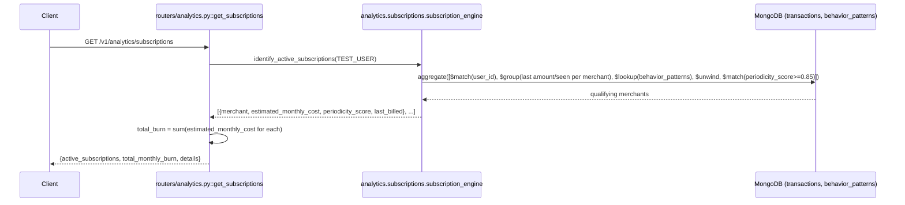

# GET `/v1/analytics/subscriptions`

## Method
`GET`

## URL
`/v1/analytics/subscriptions`

## Purpose
Identifies merchants that behave like recurring subscriptions (highly regular billing intervals) and reports their estimated combined monthly cost.

## Authentication
**Required.** `X-Velar-API-Key: velar_test_key_123`.

## Headers
| Header | Required | Value |
|---|---|---|
| `X-Velar-API-Key` | Yes | `velar_test_key_123` |

## Request body
None. No query parameters either.

## Validation
Not applicable — no inputs.

## Response
`200 OK`, untyped JSON object:
```json
{
  "active_subscriptions": 2,
  "total_monthly_burn": 998.0,
  "details": [
    { "merchant": "Netflix", "estimated_monthly_cost": 499.0, "periodicity_score": 0.94, "last_billed": "2026-07-01T00:00:00Z" },
    { "merchant": "Spotify", "estimated_monthly_cost": 499.0, "periodicity_score": 0.91, "last_billed": "2026-07-05T00:00:00Z" }
  ]
}
```

## Error codes
| Code | When |
|---|---|
| `401` | Missing API key |
| `403` | Wrong API key |
| `200` (not an error, but degenerate) | `behavior_patterns` collection empty/unpopulated → always returns `{"active_subscriptions": 0, "total_monthly_burn": 0, "details": []}` — see below |

## Internal execution flow


## Controller
`get_subscriptions()` in `routers/analytics.py` — delegates, then sums costs into the summary fields.

## Service
`analytics.subscriptions.subscription_engine.identify_active_subscriptions(user_id)`.

## Database queries
```js
db.transactions.aggregate([
  { $match: { user_id: "user_123" } },
  { $group: { _id: "$merchant", last_amount: { $last: "$amount" }, last_seen: { $max: "$timestamp" } } },
  { $lookup: { from: "behavior_patterns", localField: "_id", foreignField: "merchant_name", as: "behavior" } },
  { $unwind: "$behavior" },
  { $match: { "behavior.periodicity_score": { $gte: 0.85 } } }
])
```
**Critical dependency**: this join only produces results for merchants that have a corresponding `behavior_patterns` document — which is only ever written by `behaviour/behavior_engine.py::profile_merchant_behavior`, a function **nothing in the live HTTP surface ever calls**. In a fresh deployment, this endpoint will always return zero subscriptions until someone manually runs the behavior-profiling pipeline per merchant. Also note: there is **no `$sort` before the `$group`**, so `last_amount`/`last_seen` aren't guaranteed to reflect true chronological order.

## Example request
```bash
curl -s http://localhost:8000/v1/analytics/subscriptions \
  -H "X-Velar-API-Key: velar_test_key_123"
```

## Example response
```json
{
  "active_subscriptions": 1,
  "total_monthly_burn": 499.0,
  "details": [
    { "merchant": "Netflix", "estimated_monthly_cost": 499.0, "periodicity_score": 0.94, "last_billed": "2026-07-01T00:00:00Z" }
  ]
}
```
Fresh-deployment / no baseline data example:
```json
{ "active_subscriptions": 0, "total_monthly_burn": 0, "details": [] }
```

## Interview questions
- "Why would this endpoint return zero subscriptions even for a user with genuinely recurring Netflix/Spotify charges in their transaction history?" (Because subscription detection depends entirely on `behavior_patterns` documents that only `behaviour/behavior_engine.py` produces, and nothing in the live application ever calls that function automatically — someone would need to manually run it per merchant first.)
- "Why is `estimated_monthly_cost` just the last observed charge amount rather than an average?" (Simplicity, assuming subscriptions charge a fixed recurring amount — this would misrepresent a subscription whose price recently changed, or one with genuinely variable billing.)
- "The aggregation has no `$sort` before its `$group` stage. What's the practical risk?" (`$last`/`$max` accumulators don't have a guaranteed chronological ordering without an explicit sort first — `last_amount`/`last_seen` could reflect an arbitrary transaction rather than the truly most recent one. Adding `{$sort: {timestamp: 1}}` before the `$group` would fix this.)
- "Why is the periodicity threshold hardcoded at `0.85` here, separately from the similar (but not identical) subscription heuristic computed in `features/periodicity.py`?" (Two independent, slightly divergent subscription-detection heuristics exist in this codebase: `features/periodicity.py::calculate_periodicity` also computes an `is_likely_subscription` flag using both a score threshold *and* an interval-range check (27–33 or 360–370 days), but that field is never persisted into `BehaviorPattern` or consulted here — this endpoint independently re-derives a simpler, score-only threshold.)
