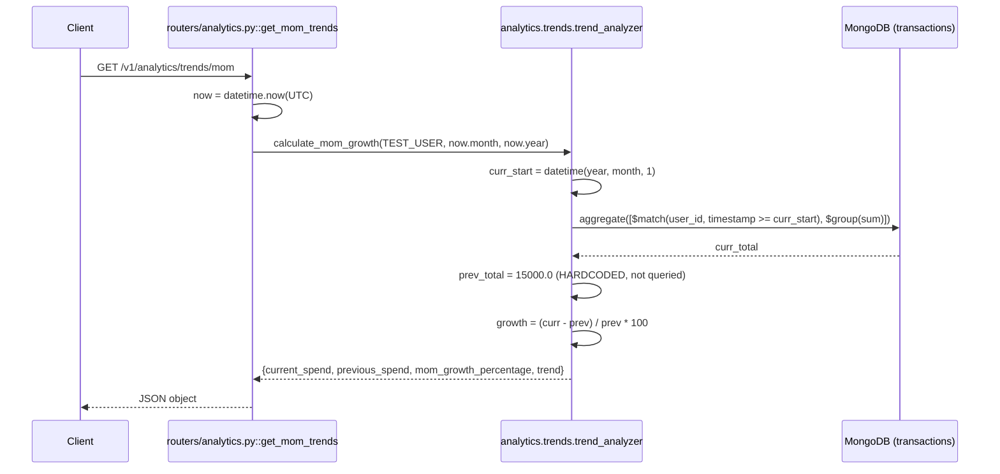

# GET `/v1/analytics/trends/mom`

## Method
`GET`

## URL
`/v1/analytics/trends/mom`

## Purpose
Intended to report month-over-month spending growth. **Currently half-mocked**: the current month's figure is a real query; the previous month's figure is a hardcoded constant.

## Authentication
**Required.** `X-Velar-API-Key: velar_test_key_123`.

## Headers
| Header | Required | Value |
|---|---|---|
| `X-Velar-API-Key` | Yes | `velar_test_key_123` |

## Request body
None. No query parameters.

## Validation
Not applicable — no inputs.

## Response
`200 OK`, untyped JSON object:
```json
{
  "current_spend": 8213.5,
  "previous_spend": 15000.0,
  "mom_growth_percentage": -45.24,
  "trend": "down"
}
```
`previous_spend` is **always `15000.0`** in the current implementation, regardless of the user's actual historical data.

## Error codes
| Code | When |
|---|---|
| `401` | Missing API key |
| `403` | Wrong API key |
| No error case for zero previous spend | Guarded explicitly (`if prev_total == 0: growth = 0.0`) — moot currently since `prev_total` is a fixed non-zero constant, but the guard exists for when this is eventually made real |

## Internal execution flow


## Controller
`get_mom_trends()` in `routers/analytics.py` — computes "now," delegates.

## Service
`analytics.trends.trend_analyzer.calculate_mom_growth(user_id, current_month, current_year)`.

## Database queries
```js
db.transactions.aggregate([
  { $match: { user_id: "user_123", timestamp: { $gte: curr_start } } },
  { $group: { _id: null, total: { $sum: "$amount" } } }
])
```
**Only the current month is actually queried.** No query is ever run for the previous month — `prev_total = 15000.0` is a Python literal in `analytics/trends.py`, with a code comment reading `# Replace with actual DB query`.

## Example request
```bash
curl -s http://localhost:8000/v1/analytics/trends/mom \
  -H "X-Velar-API-Key: velar_test_key_123"
```

## Example response
```json
{
  "current_spend": 8213.5,
  "previous_spend": 15000.0,
  "mom_growth_percentage": -45.24,
  "trend": "down"
}
```
**⚠ Do not treat this response as reflecting real month-over-month behavior** — see Purpose above.

## Interview questions
- "Is the `mom_growth_percentage` this endpoint returns trustworthy?" (No — it compares a real current-month total against a hardcoded constant (₹15,000), not the user's actual previous month's spend. This should not be surfaced to end users as real analytics until fixed; see `docs/16-known-issues-tech-debt.md#mom-trend-is-mocked`.)
- "What would the correct fix look like?" (Compute the previous month's start/end date boundaries — correctly handling the January-wraps-to-prior-December edge case — and run the same kind of aggregation query used for the current month against that range, replacing the `15000.0` literal with the real result.)
- "Why does the function guard against `prev_total == 0`?" (To avoid a `ZeroDivisionError` in the growth-percentage calculation — currently unreachable in practice since `prev_total` is a non-zero constant, but the guard would become load-bearing the moment the query is made real, since a user with zero spend in the comparison month is a plausible real scenario.)
- "How would you detect that this endpoint is returning mocked data without reading the source code?" (Call it with two different real users or at two different points in a billing cycle and notice `previous_spend` never changes — a fixed, unchanging value across otherwise-varying calls is a strong signal of a hardcoded placeholder; this is exactly the kind of thing integration/contract tests with real assertions on values, rather than just key-presence checks, would catch.)
