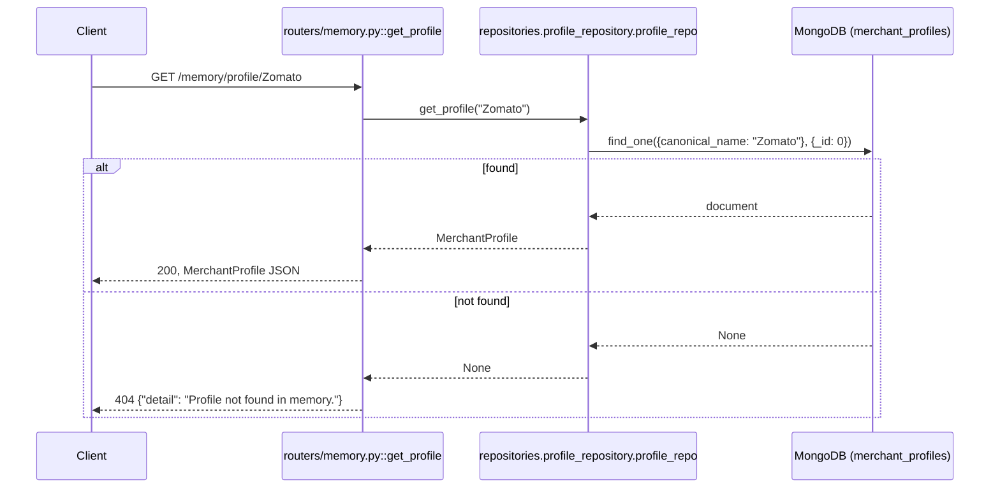

# GET `/memory/profile/{canonical_name}`

## Method
`GET`

## URL
`/memory/profile/{canonical_name}` — `canonical_name` is a path parameter, e.g. `/memory/profile/Zomato`.

## Purpose
Fetches the complete stored memory profile for a named entity — its trust level, seen-count, aliases, and timestamps.

## Authentication
**Required.** `X-Velar-API-Key: velar_test_key_123`.

## Headers
| Header | Required | Value |
|---|---|---|
| `X-Velar-API-Key` | Yes | `velar_test_key_123` |

## Request body
None — bodiless `GET`.

## Validation
`canonical_name` is a plain path string with no format constraint — any string, including one with URL-unsafe characters (if percent-encoded) or one that has never been seen before, is accepted as a valid request; the "not found" case is handled by the business logic (a 404), not request validation.

## Response
`200 OK`, validated against `MerchantProfile`, identical shape to [`POST /memory/update`](./post-memory-update.md)'s response.

## Error codes
| Code | When |
|---|---|
| `401` | Missing API key |
| `403` | Wrong API key |
| `404` | No profile exists for the given `canonical_name` — response body: `{"detail": "Profile not found in memory."}` |
| `500` | Prerequisite failure — same import-chain concern as `/memory/update`, since this router shares the same broken dependency |

## Internal execution flow


## Controller
`get_profile(canonical_name: str)` in `routers/memory.py` — note this router-level function shares its name with, but is distinct from, `repositories.profile_repository.ProfileRepository.get_profile`, which it calls.

## Service
No separate service layer here — the controller calls the repository directly, skipping the `memory_manager` orchestration layer entirely (appropriate, since this is a pure read with no state transition to evaluate).

## Database queries
`db.merchant_profiles.find_one({"canonical_name": canonical_name}, {"_id": 0})` — a single read, unindexed on `canonical_name`.

## Example request
```bash
curl -s http://localhost:8000/memory/profile/Zomato \
  -H "X-Velar-API-Key: velar_test_key_123"
```

## Example response
```json
{
  "id": null,
  "canonical_name": "Zomato",
  "display_name": null,
  "aliases": ["paid to zomato media pvt", "zomato media"],
  "entity_type": "Unknown",
  "memory_state": "TEMPORARY",
  "frequency": 3,
  "first_seen": "2026-07-20T09:15:00Z",
  "last_seen": "2026-07-26T12:00:00Z",
  "notes": null,
  "confidence": 0.0,
  "category": null,
  "subcategory": null
}
```
Not-found example:
```http
HTTP/1.1 404 Not Found
{"detail": "Profile not found in memory."}
```

## Interview questions
- "Why does this endpoint return `id: null` even for a real, persisted profile?" (`ProfileRepository.get_profile` explicitly projects out `_id` (`{"_id": 0}`) when querying MongoDB, so the constructed `MerchantProfile` object never has a real ID populated — a deliberate simplification in the repository, not a bug specific to this endpoint.)
- "Why does this endpoint bypass `memory_manager` and call the repository directly?" (There's no state to evaluate or mutate on a pure read — `memory_manager.process_encounter` exists specifically to handle the encounter-processing side effects (frequency increment, promotion check, persistence); a read-only lookup has no need for that orchestration.)
- "What's returned if `canonical_name` contains characters needing URL encoding, like a slash?" (FastAPI's default path parameter matching does not consume additional path segments — a literal `/` in the value would need to be percent-encoded (`%2F`) by the client, or it would be interpreted as a different path segment / cause a route-matching failure rather than being passed through as part of the parameter.)
- "How would you paginate or list *all* profiles, given this endpoint only fetches one by exact name?" (No such endpoint exists anywhere in this codebase — you'd need to add a new route backed by a paginated `db.merchant_profiles.find()` query, since `ProfileRepository` currently has no "list all" or "search" method, only exact-name lookup.)
