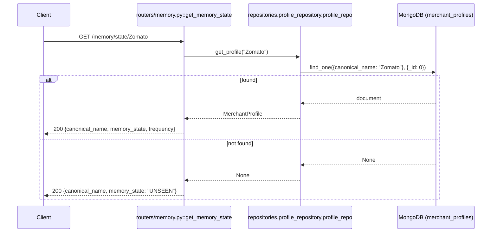

# GET `/memory/state/{canonical_name}`

## Method
`GET`

## URL
`/memory/state/{canonical_name}` — path parameter, e.g. `/memory/state/Zomato`.

## Purpose
A lightweight variant of the profile lookup — returns just the trust state and seen-count, without the full profile payload, and treats "never seen" as a normal `200` response rather than a `404`.

## Authentication
**Required.** `X-Velar-API-Key: velar_test_key_123`.

## Headers
| Header | Required | Value |
|---|---|---|
| `X-Velar-API-Key` | Yes | `velar_test_key_123` |

## Request body
None.

## Validation
Same as `GET /memory/profile/{canonical_name}` — no format constraint on the path parameter.

## Response
`200 OK` in both cases (found and not-found), but two different shapes:

**Known entity**:
```json
{ "canonical_name": "Zomato", "memory_state": "TEMPORARY", "frequency": 3 }
```
**Unknown entity** — a synthetic value, `"UNSEEN"`, that does **not** exist in the actual `MemoryState` enum (`EPHEMERAL`, `TEMPORARY`, `PERMANENT`, `ARCHIVED`) — it's a response-only sentinel invented specifically for this endpoint:
```json
{ "canonical_name": "SomeNeverSeenMerchant", "memory_state": "UNSEEN" }
```
Note the unknown-entity response has no `frequency` field at all, while the known-entity response does — the two response shapes are not a strict superset/subset of each other.

## Error codes
| Code | When |
|---|---|
| `401` | Missing API key |
| `403` | Wrong API key |
| `500` | Prerequisite import-chain failure (same as the rest of this router) |

Notably, **no `404` is ever returned by this endpoint** — the "not found" case is represented as data (`memory_state: "UNSEEN"`), a deliberate contrast with the sibling `GET /memory/profile/{name}` endpoint, which does 404.

## Internal execution flow


## Controller
`get_memory_state(canonical_name: str)` in `routers/memory.py`.

## Service
No separate service — calls `profile_repo.get_profile` directly, same pattern as `GET /memory/profile/{name}`. Internally, this means both endpoints do **identical** database work (fetching the *entire* profile document) — the "lighter-weight" framing only applies to the response payload size, not the actual query cost.

## Database queries
`db.merchant_profiles.find_one({"canonical_name": canonical_name}, {"_id": 0})` — identical query to `GET /memory/profile/{name}`.

## Example request
```bash
curl -s http://localhost:8000/memory/state/Zomato \
  -H "X-Velar-API-Key: velar_test_key_123"
```

## Example response
```json
{ "canonical_name": "Zomato", "memory_state": "TEMPORARY", "frequency": 3 }
```
Never-seen example:
```json
{ "canonical_name": "BrandNewMerchant", "memory_state": "UNSEEN" }
```

## Interview questions
- "Why does this endpoint return `200` with `memory_state: 'UNSEEN'` for a missing profile, while the sibling `/memory/profile/{name}` endpoint returns `404` for the exact same underlying condition?" (A deliberate API design choice treating the two endpoints' "not found" cases differently: the full-profile endpoint treats absence as an error condition worth a status code, while this lightweight endpoint treats it as a normal, expected, representable state — worth discussing whether this inconsistency is good API design or should be unified.)
- "Does this endpoint actually save any database work compared to fetching the full profile?" (No — it calls the exact same `get_profile` method, fetching the entire document from MongoDB; only the *response payload* is smaller, not the underlying query cost. A truly optimized version would use a MongoDB projection to fetch only `memory_state` and `frequency` server-side.)
- "Why might `'UNSEEN'` cause a problem for a client that tries to deserialize this response into a strict `MemoryState` enum type?" (`'UNSEEN'` is not a member of the actual `MemoryState` enum used elsewhere in the system — a strongly-typed client expecting one of `EPHEMERAL`/`TEMPORARY`/`PERMANENT`/`ARCHIVED` would fail to parse this value unless it specifically accounts for this synthetic, endpoint-specific sentinel.)
- "How would you redesign this endpoint's response to be more consistent with the full-profile endpoint's shape?" (Options include always including a `frequency: 0` for unseen entities to keep the shape consistent, or returning `404` here too and letting the client handle 'unseen' as an absence rather than a data value — either would remove the current shape inconsistency.)
