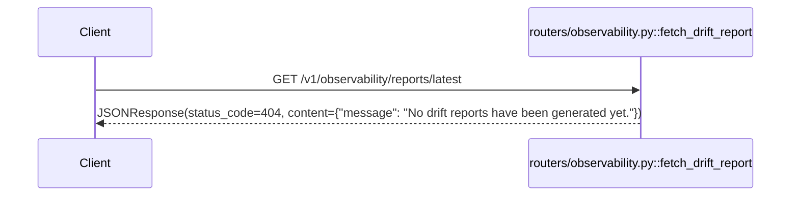

# GET `/v1/observability/reports/latest`

## Method
`GET`

## URL
`/v1/observability/reports/latest`

## Purpose
Intended to serve the most recently generated HTML drift report. **Currently a pure stub that always returns 404 — no report can ever be generated or served, since there is no code path anywhere that produces one.**

## Authentication
**Required.** `X-Velar-API-Key: velar_test_key_123`.

## Headers
| Header | Required | Value |
|---|---|---|
| `X-Velar-API-Key` | Yes | `velar_test_key_123` |

## Request body
None.

## Validation
Not applicable — no inputs.

## Response
**Always** `404 Not Found`:
```json
{ "message": "No drift reports have been generated yet." }
```
There is no success-path response documented, because none is reachable — no code anywhere in this repository could cause this handler to return anything other than this fixed 404.

## Error codes
| Code | When |
|---|---|
| `401` | Missing API key |
| `403` | Wrong API key |
| `404` | **Every** otherwise-authenticated request — this is the endpoint's only possible authenticated outcome |

## Internal execution flow

Implemented via an explicit `fastapi.responses.JSONResponse(status_code=404, ...)` rather than raising `HTTPException(404, ...)` — a different, less idiomatic-for-FastAPI pattern than the 404 used in `routers/memory.py::get_profile`, though the client-observable result is identical.

## Controller
`fetch_drift_report()` in `routers/observability.py`.

## Service
None.

## Database queries
None. No filesystem access either — despite the concept of "serving a report," there is no `FileResponse`, no report-storage path, and no report-generation mechanism anywhere in the codebase that this could ever read from.

## Example request
```bash
curl -s http://localhost:8000/v1/observability/reports/latest \
  -H "X-Velar-API-Key: velar_test_key_123"
```

## Example response
```http
HTTP/1.1 404 Not Found
{"message": "No drift reports have been generated yet."}
```

## Interview questions
- "Why use `JSONResponse(status_code=404, ...)` here instead of raising `HTTPException(404, ...)`, as is done elsewhere in the codebase for similar 'not found' cases?" (Functionally equivalent from the client's perspective — both produce a 404 with a JSON body — but a different, less idiomatic-for-FastAPI pattern; likely just a different developer's habit rather than a deliberate choice, worth flagging as a minor consistency issue.)
- "If asked to make this endpoint actually work, what would the minimum viable implementation look like?" (A report-generation step (in the sibling `drift/analyze` endpoint or a background job) that writes an HTML file to a known location or object store, plus this handler reading and returning that file via `FileResponse` (or a redirect to a pre-signed URL if using object storage) when one exists, falling back to this same 404 only when genuinely no report has ever been generated.)
- "Does this endpoint leak any information by always returning the exact same 404 message regardless of history?" (No meaningful information disclosure risk here, but it is slightly misleading in tone — 'have not been generated *yet*' implies generation is expected to eventually happen, which is currently never true given the sibling trigger endpoint doesn't actually generate anything.)
- "How would a monitoring/alerting system distinguish 'drift analysis is healthy and found no drift' from 'drift analysis has never actually run'?" (It currently can't — there's no distinct response for 'analysis ran, no report needed' versus 'analysis has never run at all'; both would need to be representable once this is implemented for real.)
