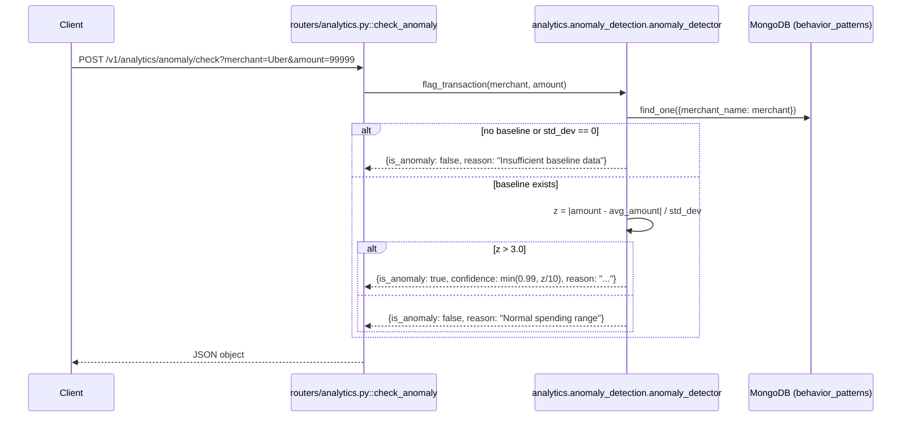

# POST `/v1/analytics/anomaly/check`

## Method
`POST`

## URL
`/v1/analytics/anomaly/check?merchant=Uber&amount=99999`

## Purpose
Real-time check of whether a given transaction amount is statistically unusual for a specific merchant, based on that merchant's precomputed historical average and standard deviation.

## Authentication
**Required.** `X-Velar-API-Key: velar_test_key_123`.

## Headers
| Header | Required | Value |
|---|---|---|
| `X-Velar-API-Key` | Yes | `velar_test_key_123` |

## Request body
**None** — despite being a `POST`, this endpoint takes its two parameters (`merchant: str`, `amount: float`) as **query string parameters**, not a JSON body. This is an inconsistency with every other `POST` endpoint in the codebase.

## Validation
Type-level only — `merchant` must be a non-empty query string, `amount` must be coercible to `float`. No range checks on `amount` (negative amounts are accepted and processed without a semantic-validity check).

## Response
`200 OK`, untyped JSON object. Two possible shapes:

**Baseline exists, normal range**:
```json
{ "is_anomaly": false, "reason": "Normal spending range" }
```
**Baseline exists, anomalous**:
```json
{ "is_anomaly": true, "confidence": 0.99, "reason": "Amount is significantly higher than the typical 350.20 spent here." }
```
**No baseline data**:
```json
{ "is_anomaly": false, "reason": "Insufficient baseline data" }
```

## Error codes
| Code | When |
|---|---|
| `401` | Missing API key |
| `403` | Wrong API key |
| `422` | `merchant` or `amount` missing, or `amount` not coercible to a number |

## Internal execution flow


## Controller
`check_anomaly(merchant: str, amount: float)` in `routers/analytics.py` — a direct, single-line delegation.

## Service
`analytics.anomaly_detection.anomaly_detector.flag_transaction(merchant_name, amount)`.

## Database queries
`db.behavior_patterns.find_one({"merchant_name": merchant})` — a single read, unindexed on `merchant_name`. **Depends entirely on `behaviour/behavior_engine.py` having previously run for this merchant** — otherwise this always returns `"Insufficient baseline data"`.

## Example request
```bash
curl -s -X POST "http://localhost:8000/v1/analytics/anomaly/check?merchant=Uber&amount=99999" \
  -H "X-Velar-API-Key: velar_test_key_123"
```

## Example response
```json
{
  "is_anomaly": true,
  "confidence": 0.99,
  "reason": "Amount is significantly higher than the typical 350.20 spent here."
}
```
No-baseline example (fresh deployment, `Uber`'s `behavior_patterns` document never created):
```json
{ "is_anomaly": false, "reason": "Insufficient baseline data" }
```

## Interview questions
- "Why does this `POST` endpoint take its inputs as query parameters instead of a JSON body?" (An inconsistency with the rest of the codebase's `POST` conventions — nothing technically prevents a `POST` from using query params, but every other `POST` endpoint here (`/v1/categorize`, `/v1/resolve`, `/memory/update`, `/v1/feedback/`) uses a JSON body; a more RESTful/consistent design would likely make this a JSON body too, or arguably make it a `GET` since it's a read-only check with no side effects.)
- "Why does the function treat `std_dev == 0` as 'insufficient data' rather than flagging any different amount as infinitely anomalous?" (A merchant with zero historical variance has never demonstrated any variability — treating any deviation as infinite-sigma would be statistically meaningless and risks a division-by-zero; 'insufficient baseline' is the more honest response.)
- "Why is `confidence` capped at `0.99` rather than reaching `1.0`?" (A deliberate choice to never claim absolute certainty, consistent with the confidence-wall philosophy applied elsewhere in the system.)
- "This endpoint has zero write side effects — it doesn't record that an anomaly was flagged anywhere. Should it?" (Worth discussing — currently there's no audit trail of anomaly checks performed or their outcomes; if this were meant to drive alerting or user notifications, a persistence step would need to be added, e.g., writing flagged anomalies to a dedicated collection.)
