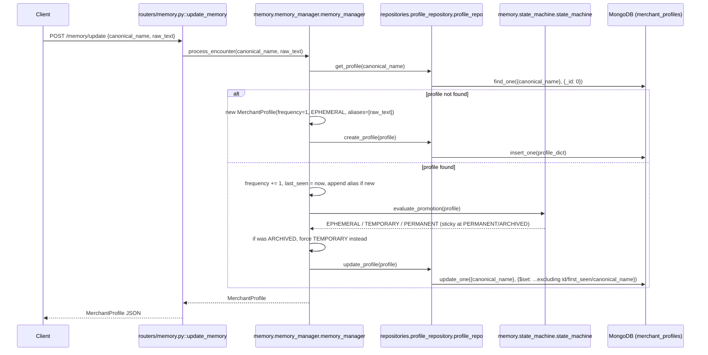

# POST `/memory/update`

## Method
`POST`

## URL
`/memory/update`

## Purpose
Records an encounter with a merchant entity, incrementing its seen-count and running the trust state machine to decide whether it has earned promotion to a higher memory state (`EPHEMERAL → TEMPORARY → PERMANENT`).

## Authentication
**Required.** `X-Velar-API-Key: velar_test_key_123`.

## Headers
| Header | Required | Value |
|---|---|---|
| `X-Velar-API-Key` | Yes | `velar_test_key_123` |
| `Content-Type` | Yes | `application/json` |

## Request body
```json
{ "canonical_name": "Zomato", "raw_text": "paid to zomato media pvt" }
```
Validated against the router-local `MemoryUpdateRequest` model (`routers/memory.py`): `canonical_name: str`, `raw_text: str`, both required.

## Validation
Type-level only — no uniqueness or format constraints on `canonical_name`; any string is accepted as a valid entity identifier, including one that doesn't correspond to any real, resolved merchant.

## Response
`200 OK`, validated against `MerchantProfile` (`models/schemas.py`) — full schema documented in [03 · Data Model](../03-data-model.md#merchantprofile). Example for a first-time encounter:
```json
{
  "id": null,
  "canonical_name": "Zomato",
  "display_name": null,
  "aliases": ["paid to zomato media pvt"],
  "entity_type": "Unknown",
  "memory_state": "EPHEMERAL",
  "frequency": 1,
  "first_seen": "2026-07-26T12:00:00Z",
  "last_seen": "2026-07-26T12:00:00Z",
  "notes": null,
  "confidence": 0.0,
  "category": null,
  "subcategory": null
}
```

## Error codes
| Code | When |
|---|---|
| `401` | Missing API key |
| `403` | Wrong API key |
| `422` | `canonical_name` or `raw_text` missing or wrong type |
| `500` | Prerequisite failure — this entire router currently cannot even be imported due to the `Optional` missing-import bug in `repositories/profile_repository.py`; if unfixed, the application may not start at all, making this a moot point until resolved |

## Internal execution flow


## Controller
`update_memory(request: MemoryUpdateRequest)` in `routers/memory.py` — single-line delegation.

## Service
`memory.memory_manager.memory_manager.process_encounter(canonical_name, raw_text)` — the full encounter orchestration; internally calls `memory.state_machine.state_machine.evaluate_promotion(profile)` (pure, no I/O).

## Database queries
- `db.merchant_profiles.find_one({"canonical_name": canonical_name}, {"_id": 0})` — read, via `repositories/profile_repository.py::get_profile`.
- `db.merchant_profiles.insert_one(profile_dict)` **or** `db.merchant_profiles.update_one({"canonical_name": ...}, {"$set": ...})` — exactly one write, depending on whether the profile already existed. Neither operation is backed by an index on `canonical_name`.

## Example request
```bash
curl -s -X POST http://localhost:8000/memory/update \
  -H "X-Velar-API-Key: velar_test_key_123" \
  -H "Content-Type: application/json" \
  -d '{"canonical_name": "Zomato", "raw_text": "paid to zomato media pvt"}'
```

## Example response
First encounter (as shown above, `memory_state: "EPHEMERAL"`, `frequency: 1`). After 3 total encounters for the same `canonical_name`:
```json
{
  "canonical_name": "Zomato",
  "aliases": ["paid to zomato media pvt"],
  "memory_state": "TEMPORARY",
  "frequency": 3,
  "...": "..."
}
```

## Interview questions
- "Two concurrent requests arrive for the same brand-new `canonical_name` at nearly the same instant. What happens?" (Both could see 'not found' from `get_profile`, both construct a fresh profile with `frequency=1`, and both call `create_profile` — since `canonical_name` has no unique index or constraint in MongoDB, this could result in two separate documents for the same logical entity, or a race depending on exact timing; there's no locking or upsert-based deduplication in `process_encounter`.)
- "What happens if this endpoint is called repeatedly for a merchant that was previously `ARCHIVED`?" (`process_encounter` explicitly overrides the state machine's own (sticky) output for archived profiles, forcing them directly to `TEMPORARY` on the very next encounter — 'being seen again' is treated as a distinct signal of renewed relevance, separate from the frequency-based promotion ladder.)
- "Does `frequency` ever reset?" (No — it only ever increments, even across archival and reactivation cycles, meaning a reactivated high-frequency profile could very quickly re-qualify for `PERMANENT` again.)
- "This entire router currently can't be imported. Trace exactly why." (`routers/memory.py` imports `memory.memory_manager`, which imports `repositories.profile_repository`, which references `Optional[MerchantProfile]` as a type annotation without ever importing `Optional` from `typing` — raising `NameError` the instant that module loads, breaking the whole import chain back up through `app.py`.)
