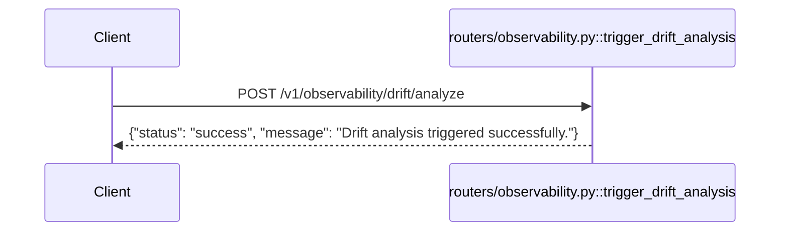

# POST `/v1/observability/drift/analyze`

## Method
`POST`

## URL
`/v1/observability/drift/analyze`

## Purpose
Intended to trigger a data/target drift analysis comparing current production data against a baseline reference dataset. **Currently a pure stub — does nothing.**

## Authentication
**Required.** `X-Velar-API-Key: velar_test_key_123`.

## Headers
| Header | Required | Value |
|---|---|---|
| `X-Velar-API-Key` | Yes | `velar_test_key_123` |

## Request body
None — the handler takes no parameters at all, and no request body is read or validated regardless of what's sent.

## Validation
Not applicable — no inputs are consumed.

## Response
`200 OK`, always identical, regardless of any request content:
```json
{ "status": "success", "message": "Drift analysis triggered successfully." }
```

## Error codes
| Code | When |
|---|---|
| `401` | Missing API key |
| `403` | Wrong API key |

No other error condition is coded — there is no logic in this handler that could fail, since it does nothing beyond returning a fixed dict.

## Internal execution flow

There is no step 2 — no background task is scheduled, no Evidently AI call is made, no data is read or written anywhere, despite the docstring's claim: *"In production, this triggers an async Celery task."* No Celery dependency exists anywhere in this codebase.

## Controller
`trigger_drift_analysis()` in `routers/observability.py`.

## Service
None — no domain-layer module for observability/drift exists anywhere in the codebase; all "logic" (such as it is) lives in the controller itself.

## Database queries
None.

## Example request
```bash
curl -s -X POST http://localhost:8000/v1/observability/drift/analyze \
  -H "X-Velar-API-Key: velar_test_key_123"
```

## Example response
```json
{ "status": "success", "message": "Drift analysis triggered successfully." }
```
(Identical for every call, with any request body, at any time.)

## Interview questions
- "How would you determine that this endpoint is a stub, purely from behavior, without reading source code?" (Call it repeatedly and immediately query `/v1/observability/reports/latest` — if a real drift job had run, you'd expect to eventually see a report; since it always 404s (see the sibling endpoint's doc), and the response here never varies, that's a strong behavioral signal nothing real is happening.)
- "What would a real implementation need?" (A reference dataset snapshot to compare against, an actual drift-detection library integration (the codebase's own naming suggests Evidently AI), a background task or job queue to run the (potentially slow) comparison asynchronously, and a persistence mechanism for the resulting report that the sibling `reports/latest` endpoint could then actually serve.)
- "Why might a stub like this be dangerous in a real deployment, compared to the endpoint simply not existing at all?" (It gives false confidence — a caller (human or automated) triggering this and seeing `\"status\": \"success\"` would reasonably believe drift monitoring is actually happening, when no analysis of any kind has occurred.)
- "This endpoint has no service layer at all, unlike almost every other feature in the codebase. What does that suggest?" (It's the least-developed feature area in the system — every other router delegates to at least one real domain module; this one has nothing behind it, signaling it was scaffolded as a placeholder for future work rather than partially implemented.)
