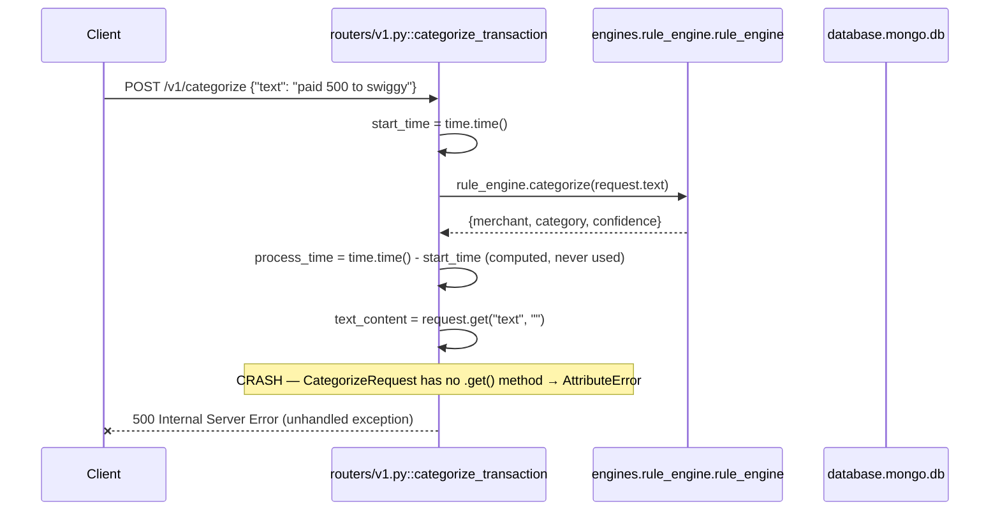

# POST `/v1/categorize`

## Method
`POST`

## URL
`/v1/categorize`

## Purpose
Intended to run raw transaction text through the deterministic rule engine, persist the categorized transaction, and return the resulting merchant/category/confidence. **This is currently broken and cannot complete successfully — see below.**

## Authentication
**Required.** `X-Velar-API-Key: velar_test_key_123`, enforced via `Depends(validate_api_key)` attached at `app.include_router(v1.router, dependencies=[...])`. Note: authentication succeeds and runs *before* the handler body executes, so the auth check itself works correctly even though the handler crashes afterward.

## Headers
| Header | Required | Value |
|---|---|---|
| `X-Velar-API-Key` | Yes | `velar_test_key_123` |
| `Content-Type` | Yes | `application/json` |

## Request body
```json
{ "text": "paid 500 to swiggy" }
```
Validated against `CategorizeRequest` (`models/schemas.py`): one required field, `text: str`.

## Validation
Only Pydantic type-level validation: `text` must be present and a string. No length limits, no non-empty check — an empty string or arbitrarily long text would pass validation and reach the (broken) handler body.

## Response
**Intended** (`CategorizeResponse`):
```json
{ "merchant": "Swiggy", "category": "Food", "confidence": 0.95 }
```
**Actual**: the request will fail with a `500 Internal Server Error` before any response body resembling the above can be constructed — see Internal Execution Flow.

## Error codes
| Code | When |
|---|---|
| `401` | Missing `X-Velar-API-Key` header |
| `403` | Wrong API key value |
| `422` | `text` field missing or wrong type |
| `500` | **Every otherwise-valid request** — the handler raises `AttributeError` internally (see below); FastAPI's default exception handling converts this to a generic 500 response with no informative body returned to the client (though the full traceback is logged server-side, since logging is at `DEBUG`) |

## Internal execution flow

If that line were fixed, execution would still fail two steps later at `datetime.now(time.timezone.utc)` (`time.timezone` is a plain int, not an object with a `.utc` attribute — a second `AttributeError`), and even past that, the intended `db.transactions.insert_one(...)` call assigns the resolver *object*, the handler *function itself*, and the confidence *engine object* into document fields meant to hold resolved string/float values — placeholder code marked with `# CHANGE THIS to...` comments that was never finished.

## Controller
`categorize_transaction(request: CategorizeRequest)` in `routers/v1.py`. Unusually for this codebase, real (if broken) business logic — regex amount extraction, direct Mongo persistence — is embedded directly in the controller rather than delegated to a service, which is likely part of why it was never finished.

## Service
`engines.rule_engine.rule_engine.categorize(text)` — this one call succeeds correctly; it's everything *after* it in the handler that's broken.

## Database queries
**Intended**: `db.transactions.insert_one({...})` — a single document insert into the `transactions` collection. **Actual**: never reached, since the handler crashes beforehand.

## Example request
```bash
curl -s -X POST http://localhost:8000/v1/categorize \
  -H "X-Velar-API-Key: velar_test_key_123" \
  -H "Content-Type: application/json" \
  -d '{"text": "paid 500 to swiggy"}'
```

## Example response
**Actual, current behavior**:
```http
HTTP/1.1 500 Internal Server Error
```
(No structured JSON body is guaranteed here — Starlette's default behavior for an unhandled exception with no custom exception handler registered.)

## Interview questions
- "Walk through every bug in this handler in the exact order they'd be encountered." (1. `request.get("text", "")` — `CategorizeRequest` is a Pydantic model, not a dict, so `.get()` raises `AttributeError` immediately. 2. If patched, `datetime.now(time.timezone.utc)` raises a second `AttributeError`, since `time.timezone` is an integer, not an object with a `.utc` attribute — the correct call is `datetime.now(timezone.utc)` using `datetime.timezone`, already imported in the file. 3. If patched, the Mongo document would still store `merchant_resolver` (an object), `categorize_transaction` (this very function), and `confidence_engine` (an object) instead of resolved values — these are clearly unfinished placeholder assignments.)
- "This is the primary public ingestion endpoint per the router's own tag (`\"Transaction Intelligence\"`). What's the operational impact of it being broken?" (Total — there is currently no working way to submit a transaction for rule-based categorization and have it persisted; `POST /v1/resolve` (a separate, working endpoint) only resolves a merchant name, it doesn't categorize or persist a transaction.)
- "Why does a duplicate, non-broken stub for this exact path exist in `app.py`, and why doesn't it save this endpoint?" (`app.py`'s `public_categorize` inline route is registered *after* `routers.v1.router` is included, so Starlette's route table matches the router's (broken) handler first — the stub is dead code that never actually executes for real traffic.)
- "Given `text_content` was never successfully extracted, would the amount-extraction regex (`re.search(r'₹\\s*([0-9.,]+)', text_content)`) ever even run?" (No — the crash on `request.get(...)` happens on the line immediately before the regex extraction, so execution never reaches that far; the regex logic itself has no bugs, it's simply unreachable.)
