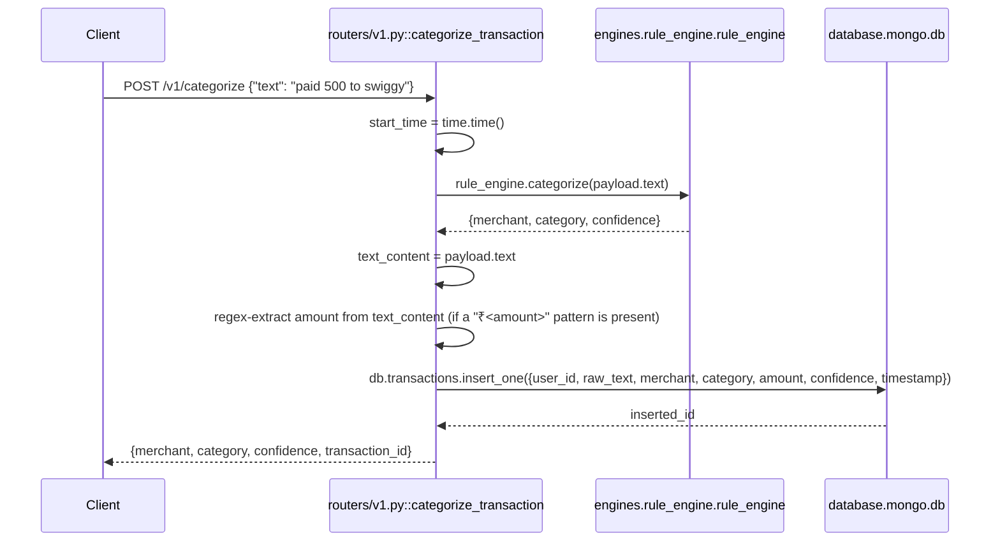

# POST `/v1/categorize`

## Method
`POST`

## URL
`/v1/categorize`

## Purpose
Runs raw transaction text through the deterministic rule engine, persists the categorized transaction, and returns the resulting merchant/category/confidence plus the inserted transaction's id (for later use with `POST /v1/feedback/`).

> ✅ **This endpoint previously raised `AttributeError` on every call and could not complete successfully.** That's fixed — see [16 · Known Issues §16.1](../16-known-issues-tech-debt.md#161-critical-previously-broke-the-application-or-a-whole-feature--all-fixed) for the full history of what was wrong.

## Authentication
**Required.** `X-Velar-API-Key: <settings.VELAR_API_KEY>`, enforced via `Depends(validate_api_key)` attached at `app.include_router(v1.router, dependencies=[...])`, using a constant-time comparison against the configured key.

## Rate limit
`50/minute` per client IP — tighter than the app's global default of `100/minute`. Exceeding it returns `429`.

## Headers
| Header | Required | Value |
|---|---|---|
| `X-Velar-API-Key` | Yes | Your configured `VELAR_API_KEY` |
| `Content-Type` | Yes | `application/json` |

## Request body
```json
{ "text": "paid 500 to swiggy" }
```
Validated against `CategorizeRequest` (`models/schemas.py`): one required field, `text: str`.

## Validation
Only Pydantic type-level validation: `text` must be present and a string. No length limits, no non-empty check — an empty string or arbitrarily long text would pass validation and reach the handler body.

## Response
`CategorizeResponse`:
```json
{ "merchant": "Swiggy", "category": "Food", "confidence": 0.95, "transaction_id": "666f6f2d6261722d71757578" }
```
`transaction_id` is the stringified Mongo `_id` of the inserted `transactions` document — pass it to `POST /v1/feedback/` to let feedback resolve back to this merchant.

## Error codes
| Code | When |
|---|---|
| `401` | Missing `X-Velar-API-Key` header |
| `403` | Wrong API key value |
| `422` | `text` field missing or wrong type |
| `429` | More than 50 requests/minute from the same client |
| `500` | Unexpected internal error (e.g. a database connectivity failure) |

## Internal execution flow


## Controller
`categorize_transaction(request: Request, payload: CategorizeRequest)` in `routers/v1.py`. Unusually for this codebase, real business logic — regex amount extraction, direct Mongo persistence — is embedded directly in the controller rather than delegated to a service (a fair architectural critique that remains true even though the bugs are fixed). The `request: Request` parameter exists solely so SlowAPI's `@limiter.limit("50/minute")` decorator can bind to it; the actual request body is `payload`.

## Service
`engines.rule_engine.rule_engine.categorize(text)` — deterministic regex-based merchant/category matching against `merchant_aliases.json`.

## Database queries
`db.transactions.insert_one({...})` — a single document insert into the `transactions` collection, including `user_id` (hardcoded to `"user_123"`), `raw_text`, the resolved `merchant`/`category`/`confidence`, extracted `amount`, and `timestamp`.

## Example request
```bash
curl -s -X POST http://localhost:8000/v1/categorize \
  -H "X-Velar-API-Key: $VELAR_API_KEY" \
  -H "Content-Type: application/json" \
  -d '{"text": "paid 500 to swiggy"}'
```

## Example response
```http
HTTP/1.1 200 OK
Content-Type: application/json

{ "merchant": "Swiggy", "category": "Food", "confidence": 0.95, "transaction_id": "666f6f2d6261722d71757578" }
```

## Interview questions
- "This endpoint used to crash on every call — walk through what was wrong and how each bug was fixed." (1. `request.get("text", "")` called `.get()` on a Pydantic model, which has no such method — fixed by reading `payload.text` directly, after renaming the body parameter from `request` to `payload` so a real `Request` object could occupy the `request` name SlowAPI requires. 2. `datetime.now(time.timezone.utc)` — `time.timezone` is a plain int, not an object with a `.utc` attribute — fixed to `datetime.now(timezone.utc)`. 3. The Mongo insert previously wrote `merchant_resolver` (an object), `categorize_transaction` (the function itself), and `confidence_engine` (an object) into fields meant to hold resolved values — fixed to write `result["merchant"]`, `result["category"]`, `result["confidence"]`.)
- "Why did a duplicate, non-broken stub for this exact path used to exist in `app.py`, and why didn't it save this endpoint?" (`app.py`'s `public_categorize` inline route was registered *after* `routers.v1.router` was included, so Starlette's route table matched the router's handler first — the stub was dead code that never executed for real traffic. It's been removed, and its rate limit was moved onto the real handler here instead of being lost.)
- "Why does this endpoint return a `transaction_id` now when it didn't before?" (`POST /v1/feedback/` needs a way to look up which merchant a piece of feedback is about. Previously, feedback stored the *category prediction* in a field that other code mistakenly queried as if it were a merchant name — see [18 · Database Analysis §2.2](../18-database-analysis.md#22-the-feedbackprediction-field-mismatch--fixed). Returning `transaction_id` here lets the feedback service look up the real transaction and resolve its actual merchant.)
