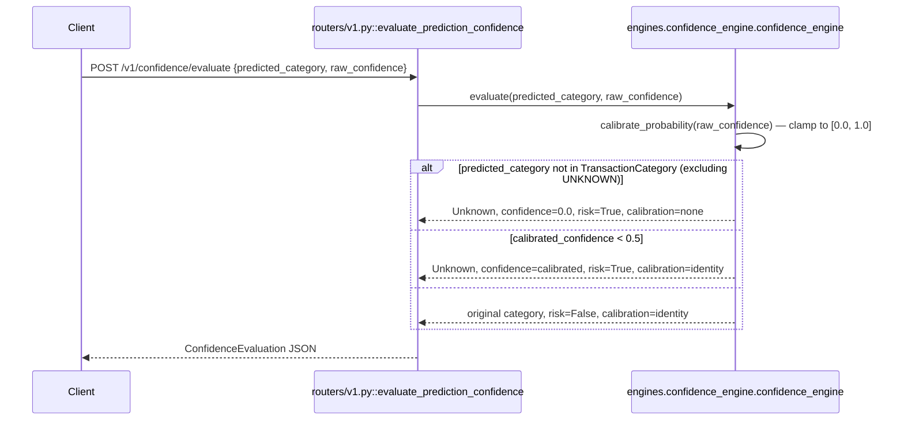

# POST `/v1/confidence/evaluate`

## Method
`POST`

## URL
`/v1/confidence/evaluate`

## Purpose
Applies the system's "confidence wall": evaluates an upstream (would-be ML model) category prediction and forces it to `Unknown` if the category is invalid or the confidence is below the trust threshold, preventing low-quality guesses from propagating downstream.

## Authentication
**Required.** `X-Velar-API-Key: velar_test_key_123`.

## Headers
| Header | Required | Value |
|---|---|---|
| `X-Velar-API-Key` | Yes | `velar_test_key_123` |
| `Content-Type` | Yes | `application/json` |

## Request body
```json
{ "predicted_category": "Travel", "raw_confidence": 0.40 }
```
Validated against the router-local `MockModelPrediction` model (`routers/v1.py`): `predicted_category: str`, `raw_confidence: float`.

## Validation
Type-level only — `raw_confidence` has **no `ge=0.0, le=1.0` bound declared**, so a caller can submit `raw_confidence: 500` or `raw_confidence: -3` and it will pass request validation; `ConfidenceEngine.calibrate_probability` silently clamps out-of-range values into `[0.0, 1.0]` rather than the API rejecting them with a `422`.

## Response
`200 OK`, validated against `ConfidenceEvaluation` (`models/schemas.py`):
```json
{
  "raw_category": "Travel",
  "final_category": "Unknown",
  "confidence": 0.40,
  "is_hallucination_risk": true,
  "calibration_applied": "identity"
}
```
Three possible outcome shapes:
1. **Invalid category** (not in `TransactionCategory` enum): `final_category: "Unknown"`, `confidence: 0.0`, `is_hallucination_risk: true`, `calibration_applied: "none"`.
2. **Valid category, low confidence** (`< 0.5`): `final_category: "Unknown"`, `confidence` = the calibrated (clamped) value, `is_hallucination_risk: true`, `calibration_applied: "identity"`.
3. **Valid category, sufficient confidence**: `final_category` = the original category, `is_hallucination_risk: false`, `calibration_applied: "identity"`.

## Error codes
| Code | When |
|---|---|
| `401` | Missing API key |
| `403` | Wrong API key |
| `422` | `predicted_category` or `raw_confidence` missing or wrong type |
| `500` | Not expected under any normal input — this handler has no external I/O and no code path that raises unhandled |

## Internal execution flow


## Controller
`evaluate_prediction_confidence(request: MockModelPrediction)` in `routers/v1.py` — a single-line delegation.

## Service
`engines.confidence_engine.confidence_engine.evaluate(predicted_category, raw_confidence)` — pure, synchronous, in-memory logic with no I/O.

## Database queries
**None.** This is the only working endpoint in the `/v1` router that touches no database at all — purely in-memory computation.

## Example request
```bash
curl -s -X POST http://localhost:8000/v1/confidence/evaluate \
  -H "X-Velar-API-Key: velar_test_key_123" \
  -H "Content-Type: application/json" \
  -d '{"predicted_category": "Travel", "raw_confidence": 0.40}'
```

## Example response
```json
{
  "raw_category": "Travel",
  "final_category": "Unknown",
  "confidence": 0.40,
  "is_hallucination_risk": true,
  "calibration_applied": "identity"
}
```
High-confidence example (`raw_confidence: 0.85`):
```json
{
  "raw_category": "Travel",
  "final_category": "Travel",
  "confidence": 0.85,
  "is_hallucination_risk": false,
  "calibration_applied": "identity"
}
```

## Interview questions
- "What's the core design philosophy this endpoint enforces, and why does it matter for a financial system?" ('Unknown is a valid answer' — the system deliberately refuses to let a low-confidence or out-of-vocabulary prediction masquerade as a trustworthy categorization, because a wrong-but-confident-looking category is worse for downstream analytics/RAG than an honest 'we don't know.')
- "Why isn't `raw_confidence` constrained to `[0.0, 1.0]` at the API validation layer, given the business logic clearly expects a probability?" (A validation gap — `Field(ge=0.0, le=1.0)` on the Pydantic model would reject nonsensical input with a clear `422` at the boundary, rather than silently clamping it deep inside `calibrate_probability`, which currently masks bad upstream input as if it were merely borderline.)
- "Why does the endpoint distinguish `calibration_applied: 'none'` (invalid category) from `'identity'` (valid category, any confidence outcome)?" (Diagnostic value — 'none' signals the upstream model returned something fundamentally out of spec, a different failure mode worth tracking separately from 'the model was just unsure,' which is what 'identity' calibration on a low-confidence-but-valid category represents.)
- "Is `threshold=0.5` empirically justified anywhere in this codebase?" (No — it's a hardcoded default in `ConfidenceEngine.__init__` with no accompanying calibration study; `evaluation/metrics.py`'s `expected_calibration_error` is exactly the kind of metric that should inform whether 0.5 is actually the right cutoff, but nothing currently connects the two.)
