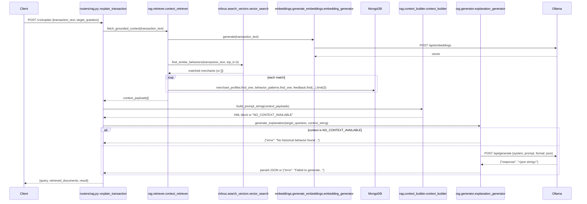

# POST `/v1/explain`

## Method
`POST`

## URL
`/v1/explain`

## Purpose
Generates a grounded, hallucination-resistant natural-language explanation of a transaction categorization, by retrieving semantically relevant merchant data and constraining an LLM to reason only over that retrieved evidence.

## Authentication
**Required.** `X-Velar-API-Key: velar_test_key_123`.

## Headers
| Header | Required | Value |
|---|---|---|
| `X-Velar-API-Key` | Yes | `velar_test_key_123` |
| `Content-Type` | Yes | `application/json` |

## Request body
```json
{ "transaction_text": "Swiggy order", "target_question": "Why was this transaction categorized this way?" }
```
Validated against the router-local `ExplainRequest` model (`routers/rag.py`): `transaction_text: str` (required), `target_question: str` (optional, defaults to `"Why was this transaction categorized this way?"`).

## Validation
Type-level only — no length limits on `transaction_text`, no constraint that `target_question` be a genuine question. An empty `transaction_text` is accepted and would simply produce (most likely) zero semantic matches.

## Response
`200 OK`, untyped JSON object:
```json
{
  "query": "Swiggy order",
  "retrieved_documents": 2,
  "result": {
    "explanation": "This transaction was categorized as Food because Swiggy has a PERMANENT memory state with 14 prior transactions, averaging ₹412.30, consistent with food delivery spending patterns.",
    "confidence_in_explanation": "HIGH",
    "primary_data_source": "Swiggy"
  }
}
```
Three possible shapes for `result`:
1. **Grounded success** — the shape above, produced by the LLM under strict system-prompt constraints.
2. **No context found**: `{"error": "No historical behavior found to explain this transaction."}`, `retrieved_documents: 0` — produced entirely without calling the LLM.
3. **Generation failure** (Ollama down, timeout, malformed response): `{"error": "Failed to generate explanation due to internal model error."}`.

## Error codes
| Code | When |
|---|---|
| `401` | Missing API key |
| `403` | Wrong API key |
| `422` | `transaction_text` missing or wrong type |
| `500` | Unexpected — every known failure mode in this pipeline (empty context, Ollama failure) is caught and converted to a soft `200` response with an `"error"` key inside `result`, rather than propagating as an HTTP error |

## Internal execution flow


## Controller
`explain_transaction(request: ExplainRequest)` in `routers/rag.py` — unusually for this codebase, inlines all three pipeline-stage calls directly rather than delegating to a single facade function.

## Service
Three cooperating services, called in sequence: `rag.retriever.context_retriever.fetch_grounded_context`, `rag.context_builder.context_builder.build_prompt_string` (pure, no I/O), `rag.generator.explanation_generator.generate_explanation`.

## Database queries
Per matched merchant (up to `top_k=3`, sequentially, not concurrently):
- `db.merchant_profiles.find_one({"canonical_name": name}, {"_id": 0})`
- `db.behavior_patterns.find_one({"merchant_name": name}, {"_id": 0})`
- `db.feedback.find({"prediction": name}).sort("timestamp", -1).limit(3)`

Plus one Milvus vector search (`vector_store.client.search(...)`) and one Ollama embedding call and (usually) one Ollama generation call — this is the most I/O-heavy endpoint in the entire application.

## Example request
```bash
curl -s -X POST http://localhost:8000/v1/explain \
  -H "X-Velar-API-Key: velar_test_key_123" \
  -H "Content-Type: application/json" \
  -d '{"transaction_text": "Swiggy order", "target_question": "Why was this categorized as Food?"}'
```

## Example response
```json
{
  "query": "Swiggy order",
  "retrieved_documents": 1,
  "result": {
    "explanation": "Swiggy is a well-established merchant (PERMANENT memory state, 14 transactions) with an average spend of ₹412.30, strongly consistent with food delivery.",
    "confidence_in_explanation": "HIGH",
    "primary_data_source": "Swiggy"
  }
}
```
No-context example (common in a fresh deployment, since the embedding-write pipeline is never automatically run — see `docs/07-embeddings-vectorsearch-clustering.md`):
```json
{
  "query": "Swiggy order",
  "retrieved_documents": 0,
  "result": { "error": "No historical behavior found to explain this transaction." }
}
```

## Interview questions
- "Explain, layer by layer, how this endpoint prevents the LLM from hallucinating." (1. If Milvus finds no semantic matches, retrieval returns `[]`. 2. `build_prompt_string` converts that into the sentinel `\"NO_CONTEXT_AVAILABLE\"`. 3. `generate_explanation` checks for that sentinel and skips calling the LLM entirely — no network call, no chance for the model to invent an answer. 4. If the LLM *is* called, its system prompt explicitly instructs it to output an error if the context is insufficient. 5. `format: \"json\"` constrains Ollama's decoding to syntactically valid JSON, a model-level guarantee, not just an instruction.)
- "Why would this endpoint frequently return 'no historical behavior found' in a freshly deployed environment, even with real transaction data present?" (Because the Milvus `behavior_vectors` collection that semantic search depends on is never populated automatically — the embedding-generation-and-insertion pipeline (`embeddings/vectorizer.py` → `embeddings/generate_embeddings.py` → `milvus/insert_vectors.py`) exists as building blocks with no orchestrating script or scheduled job connecting them.)
- "What's the worst-case latency for this endpoint, and why?" (Roughly the sum of the embedding timeout (15s), Milvus search time, up to 9 sequential Mongo round trips (3 per matched merchant, not parallelized), and the generation timeout (30s) — potentially tens of seconds in the worst case, since nothing in this pipeline runs concurrently.)
- "Why does `retrieved_documents` count matched merchants rather than, say, total feedback records or behavior data points considered?" (It's a coarse proxy for 'how much context did we actually have,' counting distinct entities the semantic search found, not the total volume of underlying data assembled about them.)
