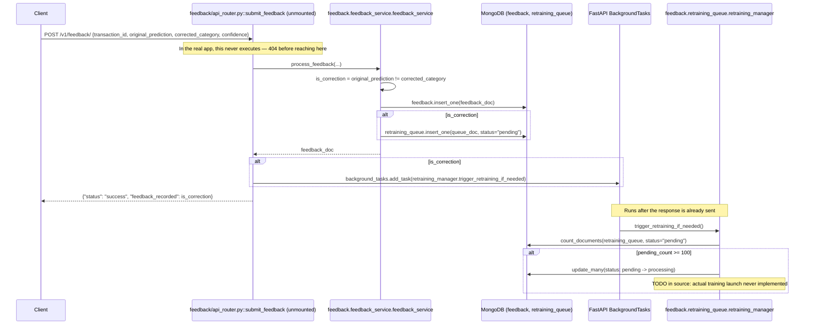

# POST `/v1/feedback/`

## Method
`POST`

## URL
`/v1/feedback/`

## ⚠ Reachability status
**This endpoint is fully implemented but is currently unreachable over HTTP.** `feedback/api_router.py` defines the router correctly, but `app.py` never imports `feedback` and never calls `app.include_router(feedback.router, ...)`. Any request to this path against the real running application receives a plain `404 Not Found` from Starlette's default "no matching route" handling — not the 404 documented for other endpoints in this system, but a generic routing-level 404 with no custom body. Everything below describes what this endpoint does **if and when it is mounted**, since the code itself is correct and complete.

## Purpose
Accepts human feedback on a model prediction (correction or confirmation), persists it, and — for actual corrections — checks in the background whether enough corrections have accumulated to justify triggering a retraining run.

## Authentication
**Would require** `X-Velar-API-Key: velar_test_key_123`, if mounted following the same pattern as every other router (`dependencies=[Depends(validate_api_key)]` at `include_router` time) — but since it is never mounted at all, no auth dependency is currently attached to this path in the running application either.

## Headers
| Header | Required (once mounted) | Value |
|---|---|---|
| `X-Velar-API-Key` | Yes | `velar_test_key_123` |
| `Content-Type` | Yes | `application/json` |

## Request body
```json
{
  "transaction_id": "tx_1234",
  "original_prediction": "Unknown",
  "corrected_category": "Travel",
  "confidence": 0.40
}
```
Validated against the router-local `FeedbackRequest` model (`feedback/api_router.py`): all four fields required.

## Validation
Type-level only — no constraint that `original_prediction`/`corrected_category` be valid `TransactionCategory` enum values, and `confidence` has no `[0, 1]` bound.

## Response
**Intended** `200 OK`:
```json
{ "status": "success", "feedback_recorded": true }
```
`feedback_recorded` reflects whether `original_prediction != corrected_category` (i.e., whether this was an actual correction versus a confirmation).

**Actual**, in the current build: `404 Not Found` (generic Starlette routing 404, no JSON body guaranteed) for every request, regardless of content.

## Error codes
| Code | When (as designed) |
|---|---|
| `401` | Missing API key |
| `403` | Wrong API key |
| `422` | Any of the four required fields missing or wrong type |
| **`404`** | **Actual, current behavior for every request** — the route simply doesn't exist in the running application's route table |

## Internal execution flow


## Controller
`submit_feedback(request: FeedbackRequest, background_tasks: BackgroundTasks)` in `feedback/api_router.py`.

## Service
`feedback.feedback_service.feedback_service.process_feedback(...)` (persistence), and — deferred to a background task — `feedback.retraining_queue.retraining_manager.trigger_retraining_if_needed()` (threshold check).

## Database queries
- `db.feedback.insert_one(feedback_doc)` — always, one write.
- `db.retraining_queue.insert_one(queue_doc)` — only if `is_correction` is true.
- (Background, deferred) `db.retraining_queue.count_documents({"status": "pending"})` and, conditionally, `db.retraining_queue.update_many({"status": "pending"}, {"$set": {"status": "processing", ...}})`.

## Example request
```bash
curl -s -X POST http://localhost:8000/v1/feedback/ \
  -H "X-Velar-API-Key: velar_test_key_123" \
  -H "Content-Type: application/json" \
  -d '{"transaction_id": "tx_1234", "original_prediction": "Unknown", "corrected_category": "Travel", "confidence": 0.40}'
```

## Example response
**As designed**:
```json
{ "status": "success", "feedback_recorded": true }
```
**Actual, current behavior**:
```http
HTTP/1.1 404 Not Found
```

## Interview questions
- "This code is fully correct and would work exactly as designed — so why doesn't it?" (`app.py` never imports the `feedback` package and never calls `app.include_router(feedback.router, ...)` — a pure wiring omission, not a code defect. This is the kind of gap that's invisible from reading `feedback/api_router.py` alone; you have to check `app.py`'s router-inclusion list to notice it.)
- "What's the exact one-line-equivalent fix to make this reachable?" (Add `from feedback import api_router as feedback` to `app.py`'s imports and `app.include_router(feedback.router, dependencies=[Depends(validate_api_key)])` alongside the other five `include_router`/route declarations, matching the existing auth pattern exactly.)
- "Why does `test_api.py::test_feedback_triggers_retraining_queue` pass in CI despite this endpoint being completely unreachable?" (Its assertion is nested inside `if response.status_code == 200:` — since the real response is 404, the `if` block's body never executes, and the test passes trivially without ever verifying the feature actually works.)
- "Why use `BackgroundTasks` for the retraining-threshold check instead of awaiting it directly before responding?" (The caller submitting feedback doesn't need to wait for — or know about — whether their submission happened to cross a global retraining threshold; deferring it keeps the response fast and decouples an unrelated batch-processing concern from the individual feedback-submission request.)
