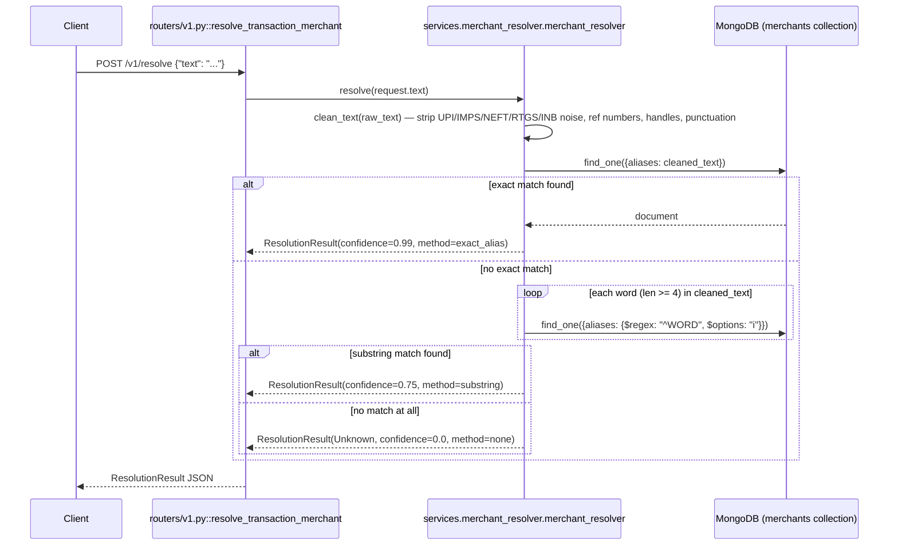

# POST `/v1/resolve`

## Method
`POST`

## URL
`/v1/resolve`

## Purpose
Cleans a noisy bank/UPI transaction narration and resolves it to a canonical merchant name via a database-backed, graded-confidence lookup. One of the cleanest, fully-working endpoints in the system.

## Authentication
**Required.** `X-Velar-API-Key: velar_test_key_123`, enforced via `Depends(validate_api_key)`.

## Headers
| Header | Required | Value |
|---|---|---|
| `X-Velar-API-Key` | Yes | `velar_test_key_123` |
| `Content-Type` | Yes | `application/json` |

## Request body
```json
{ "text": "UPI/CR/3152671239/BUNDL TECHNOLOGIES/HDFC" }
```
Validated against the router-local `ResolveRequest` model (`routers/v1.py`): one required field, `text: str`.

## Validation
Pydantic type validation only — `text` must be a non-missing string. No length or content restrictions; an empty string is accepted and simply resolves to `"Unknown"`.

## Response
`200 OK`, validated against `ResolutionResult` (`models/schemas.py`):
```json
{
  "raw_text": "UPI/CR/3152671239/BUNDL TECHNOLOGIES/HDFC",
  "cleaned_text": "BUNDL TECHNOLOGIES",
  "canonical_merchant": "Swiggy",
  "confidence": 0.99,
  "is_resolved": true,
  "resolution_method": "exact_alias"
}
```
`resolution_method` is one of `"exact_alias"` (0.99 confidence), `"substring"` (0.75), or `"none"` (0.0, `canonical_merchant: "Unknown"`, `is_resolved: false`) — never `"rule_engine"`, despite that value being listed in the field's docstring in `models/schemas.py`.

## Error codes
| Code | When |
|---|---|
| `401` | Missing API key |
| `403` | Wrong API key |
| `422` | `text` missing or wrong type |
| `500` | Only on an unexpected MongoDB connectivity failure — not a normal-path outcome |

## Internal execution flow


## Controller
`resolve_transaction_merchant(request: ResolveRequest)` in `routers/v1.py` — a clean, single-line delegation with no logic of its own.

## Service
`services.merchant_resolver.merchant_resolver.resolve(raw_text)` — the entire resolution algorithm (text cleaning + two-tier lookup) lives here.

## Database queries
- `db.merchants.find_one({"aliases": cleaned_text})` — exact match, one query.
- `db.merchants.find_one({"aliases": {"$regex": f"^{word}", "$options": "i"}})` — substring match, up to one query per qualifying word (≥4 characters) in the cleaned text, executed sequentially until a match is found or the words are exhausted. Neither query is backed by an index in this codebase.

## Example request
```bash
curl -s -X POST http://localhost:8000/v1/resolve \
  -H "X-Velar-API-Key: velar_test_key_123" \
  -H "Content-Type: application/json" \
  -d '{"text": "UPI/CR/3152671239/BUNDL TECHNOLOGIES/HDFC"}'
```

## Example response
```json
{
  "raw_text": "UPI/CR/3152671239/BUNDL TECHNOLOGIES/HDFC",
  "cleaned_text": "BUNDL TECHNOLOGIES",
  "canonical_merchant": "Swiggy",
  "confidence": 0.99,
  "is_resolved": true,
  "resolution_method": "exact_alias"
}
```
(Assumes `scripts/seed.py` has already been run — `BUNDL TECHNOLOGIES` is one of the seeded aliases for `Swiggy`.)

## Interview questions
- "Why does this endpoint work correctly while `/v1/categorize` (which looks superficially similar) is completely broken?" (This handler is a single clean delegation with no inline business logic or leftover placeholder code — `categorize_transaction`, by contrast, embeds unfinished logic directly in the controller. A good signal that code quality in this codebase varies significantly by how "finished" a given feature was left.)
- "What happens if the `merchants` collection has never been seeded (`scripts/seed.py` never run)?" (Every request resolves to `{"canonical_merchant": "Unknown", "confidence": 0.0, "is_resolved": false, "resolution_method": "none"}` — not an error, just an honest 'no match' response, since both Mongo queries simply return no results against an empty collection.)
- "Why does the substring-matching loop skip words shorter than 4 characters?" (To avoid false-positive matches against common short corporate-suffix noise like `LTD`, `PVT`, or `INC` that could coincidentally prefix-match unrelated merchant aliases.)
- "This endpoint issues up to N sequential database queries (one per qualifying word) in the worst case. How would you reduce that to a single query?" (A single `$regex`-based `$or` query across all candidate word-prefixes, or — as the code's own comments suggest — replacing this substring-matching approach entirely with the Milvus-based semantic search built for Phase 7, which is a single vector query regardless of input length.)
