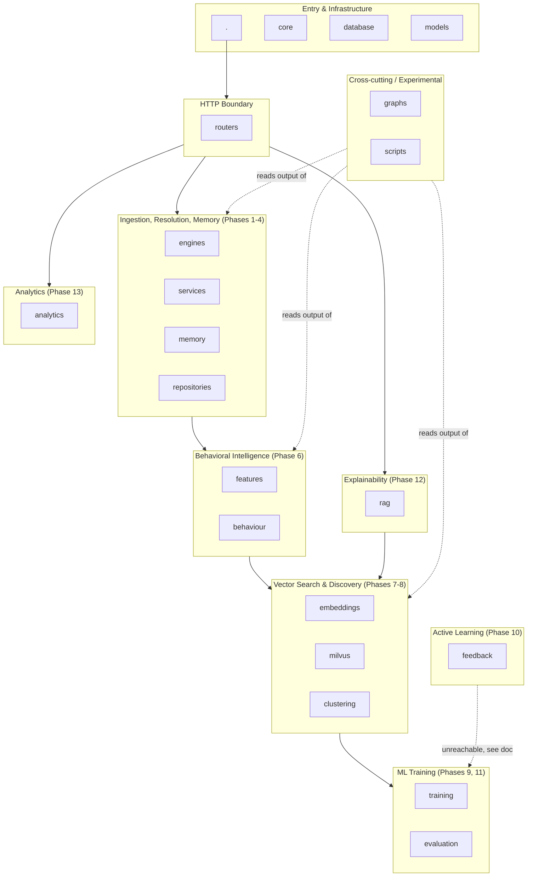

# Folder-by-Folder Reference

> **Note on currency**: these pages were written against an earlier snapshot of the codebase and may describe bugs (import errors, unmounted routers, hardcoded values, etc.) that have since been fixed. [`docs/16-known-issues-tech-debt.md`](../16-known-issues-tech-debt.md) is the current, up-to-date source of truth for what's fixed vs. still open — check it before treating any specific defect described below as still present.

Deep-dive documentation for every source folder in the repository, generated by reading each file directly. Each page covers: purpose, responsibilities, why the folder exists, how it interacts with other folders, major files, important classes/functions, execution order, dependency graph, call graph, potential interview questions, common mistakes, why the design is good, and the blast radius if the folder disappeared.

Excluded from this set (not application source): `.venv/`, `__pycache__/`, `.git/`, `.pytest_cache/`, `.claude/`, and `docs/` itself.

## Layer map

## Index

| Folder | One-line summary | Reachable from HTTP? |
|---|---|---|
| [`.` (root)](./root.md) | Entry point, deployment manifests, dependency lists | N/A (contains the entry point itself) |
| [`core/`](./core.md) | Config, auth, rate limiting, Ollama host resolution | Indirectly (used by every request) |
| [`database/`](./database.md) | MongoDB + Milvus connection singletons | Indirectly |
| [`models/`](./models.md) | Every Pydantic schema and enum | Indirectly |
| [`routers/`](./routers.md) | Every mounted FastAPI router | Yes — the HTTP boundary itself |
| [`engines/`](./engines.md) | Rule-based categorizer, confidence wall | Yes, via `/v1` |
| [`services/`](./services.md) | Database-backed merchant resolution | Yes, via `/v1/resolve` |
| [`memory/`](./memory.md) | Entity trust state machine | Yes, via `/memory` |
| [`repositories/`](./repositories.md) | Merchant profile persistence | Yes, via `/memory` (currently import-broken — see doc) |
| [`features/`](./features.md) | Statistical feature extractors | No — only via disconnected `behaviour/` |
| [`behaviour/`](./behaviour.md) | Behavior profiling orchestrator | No — no caller anywhere |
| [`embeddings/`](./embeddings.md) | Text stringification + Ollama embedding calls | Indirectly, via `/v1/explain`'s query path only |
| [`milvus/`](./milvus.md) | Live vector store insert/search | Yes, via `/v1/explain` (search only; insert path unwired) |
| [`clustering/`](./clustering.md) | UMAP + HDBSCAN discovery pipeline | No — no caller, and currently broken |
| [`training/`](./training.md) | Classical ML benchmark + LoRA fine-tuning | No — script-only |
| [`evaluation/`](./evaluation.md) | Shared ML metrics (accuracy, F1, ECE, SHAP) | No — only used by `training/` |
| [`feedback/`](./feedback.md) | Human correction capture + retraining queue | No — router exists but is never mounted |
| [`rag/`](./rag.md) | Grounded RAG explanation pipeline | Yes, via `/v1/explain` |
| [`analytics/`](./analytics.md) | Spend patterns, subscriptions, trends, anomalies | Yes, via `/v1/analytics/*` |
| [`graphs/`](./graphs.md) | NetworkX knowledge graph over all collections | No — no caller anywhere |
| [`scripts/`](./scripts.md) | Manual seed/smoke-test utilities | No — operator-invoked only |

## How to read these pages

Every page follows the same structure so you can scan for the section you need. The "Common Mistakes" and "If this folder disappeared" sections are written from direct code inspection, not speculation — where a folder is disconnected from the live system or contains a defect, that's stated plainly and cross-referenced to [`../16-known-issues-tech-debt.md`](../16-known-issues-tech-debt.md), which is the master list of every defect found across the whole codebase.
