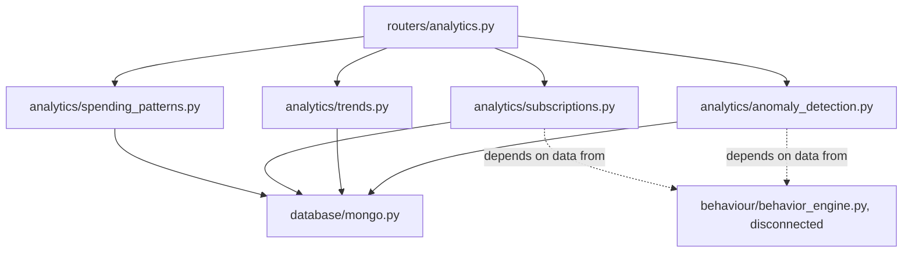
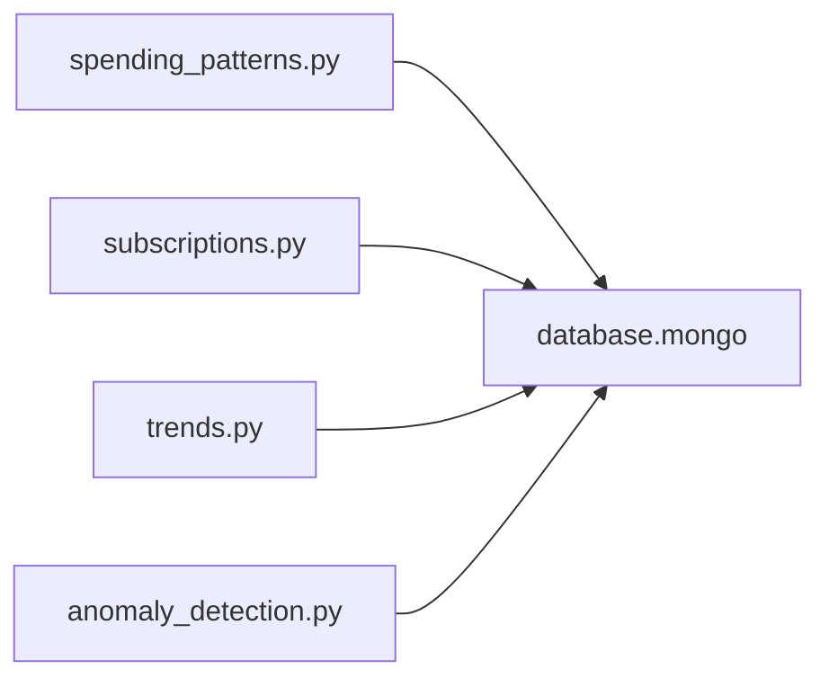
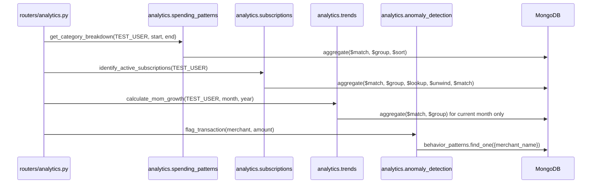

# Folder: `analytics/`

## Purpose
Phase 13's user-facing spend intelligence: category breakdowns, top-merchant rankings, subscription detection, month-over-month trends, and real-time anomaly flagging. This is the folder with the most endpoints wired directly and reachably to HTTP of any feature area in the codebase.

## Responsibilities
- Aggregate raw `transactions` into category and merchant summaries (`spending_patterns.py`).
- Detect likely recurring subscriptions using precomputed periodicity scores (`subscriptions.py`).
- Compute (or, currently, semi-mock) month-over-month spend growth (`trends.py`).
- Flag anomalous transaction amounts in real time using z-score against a merchant's behavioral baseline (`anomaly_detection.py`).

## Why this folder exists
Each file answers one distinct analytical question a user might ask about their spending, and each is implemented as an independent MongoDB aggregation-pipeline wrapper. Splitting by question (rather than one monolithic `AnalyticsEngine` class) keeps each file small and lets `routers/analytics.py` map cleanly one-to-one (mostly) between endpoints and engine files.

## How it interacts with other folders
All four files depend on `database/mongo.py` directly (no repository abstraction layer here, unlike `memory/`'s use of `repositories/`). `subscriptions.py` and `anomaly_detection.py` both depend on data (`behavior_patterns`) produced exclusively by the disconnected `behaviour/behavior_engine.py` — meaning half of this folder's functionality is gated on a manual, out-of-band step happening first. `routers/analytics.py` is the sole consumer, with a direct one-to-one mapping from router function to analytics singleton, except that `spending_patterns.py` backs two separate endpoints (`patterns/categories` and `patterns/merchants`).

## Major files
| File | Engine class | Singleton | Data dependency |
|---|---|---|---|
| `spending_patterns.py` | `SpendingPatternsEngine` | `spending_patterns` | `transactions` only |
| `subscriptions.py` | `SubscriptionEngine` | `subscription_engine` | `transactions` + `behavior_patterns` |
| `trends.py` | `TrendAnalyzer` | `trend_analyzer` | `transactions` (current month) + hardcoded constant (previous month) |
| `anomaly_detection.py` | `AnomalyDetector` | `anomaly_detector` | `behavior_patterns` only |

## Important classes
- **`SpendingPatternsEngine`** — two aggregation methods, no shared state between them.
- **`SubscriptionEngine`** — one method combining a `$lookup` join between `transactions` and `behavior_patterns`.
- **`TrendAnalyzer`** — one method, partially mocked (see below).
- **`AnomalyDetector`** — one method implementing a 3-sigma z-score test.

## Important functions
- **`get_category_breakdown(user_id, start_date, end_date)`** — `$match` by date range → `$group` by category, summing amount and counting → `$sort` descending by total.
- **`get_merchant_frequency(user_id, limit)`** — `$group` by merchant, counting visits and summing spend → `$sort` by visit count → `$limit`.
- **`identify_active_subscriptions(user_id)`** — `$group` last amount/timestamp per merchant → `$lookup` into `behavior_patterns` → `$unwind` → `$match` on `periodicity_score >= 0.85`.
- **`calculate_mom_growth(user_id, month, year)`** — real query for current month; **`prev_total = 15000.0` is a hardcoded literal**, not queried.
- **`flag_transaction(merchant_name, amount)`** — `z = |amount - avg| / std_dev`; `is_anomaly` if `z > 3.0`; confidence `min(0.99, z / 10.0)`.

## Execution order
Each function is called independently, synchronously-per-request, with no shared execution order between the four files — they don't call each other and have no shared setup/teardown. Within `identify_active_subscriptions`, MongoDB executes the aggregation stages in the declared order (`$match → $group → $lookup → $unwind → $match`), which matters because there is **no `$sort` before the `$group`**, meaning the `$last`/`$max` accumulators don't reliably reflect chronological order (see Common Mistakes).

## Dependency graph

All four files are mutually independent — zero intra-folder imports.

## Call graph

## Potential interview questions
- "`identify_active_subscriptions` uses `$last`/`$max` inside a `$group` with no preceding `$sort`. What's wrong with that, and how would you fix it?" (MongoDB doesn't guarantee document order into a `$group` stage without an explicit `$sort` beforehand, so `last_amount`/`last_seen` aren't reliably "most recent" — fix: add `{$sort: {timestamp: 1}}` before the `$group` stage.)
- "Why does `calculate_mom_growth` hardcode `prev_total = 15000.0`? What would a correct implementation look like?" (It's an unfinished placeholder per its own comment — a correct version would run the same aggregation as the current-month query but with a date range for the prior calendar month.)
- "Why does `flag_transaction` guard on `std_dev == 0` as 'insufficient data' rather than treating any deviation as infinitely anomalous?" (Division by zero would otherwise occur; a merchant with zero variance historically (e.g., always charges exactly the same amount) hasn't demonstrated enough variability to make a z-score meaningful — treating it as "insufficient baseline" is safer than a divide-by-zero crash or a nonsensical infinite z-score.)
- "Every endpoint in this folder operates against a hardcoded `TEST_USER = 'user_123'` defined in `routers/analytics.py`, not in this folder. What would real multi-tenancy require here?" (Every aggregation's `$match: {user_id: ...}` stage would need the real authenticated user's ID threaded through from the router — these engine functions already accept `user_id` as a parameter, so the router-layer fix (deriving a real user ID from auth) wouldn't require changing this folder at all.)
- "Two of these four analytics capabilities silently produce degenerate output in a fresh deployment. Which, and why?" (`subscriptions.py` and `anomaly_detection.py`, because both depend on `behavior_patterns`, which nothing populates automatically — see `docs/folders/behaviour.md`.)

## Common mistakes
- Assuming `identify_active_subscriptions`'s `estimated_monthly_cost` is an average bill amount — it's literally the last observed transaction amount for that merchant, which could be atypical.
- Assuming `/v1/analytics/trends/mom` reflects real month-over-month analytics — the previous-month figure is a hardcoded constant, not a live query.
- Assuming `/v1/analytics/subscriptions` or `/v1/analytics/anomaly/check` will return meaningful results in a freshly seeded environment — both require `behaviour/behavior_engine.py` to have been manually run per merchant first.
- Calling `POST /v1/analytics/anomaly/check` with a JSON body — the router passes `merchant`/`amount` as query parameters, not a request body, despite being a `POST`.

## Why this design is good
- Each analytics question is answered by a focused, single-purpose aggregation pipeline that's easy to read top-to-bottom and reason about independently — no shared mutable state or cross-file coordination to worry about.
- The z-score anomaly detector's "insufficient data" fallback (rather than a false positive/negative on thin data) reflects appropriate statistical caution.
- Structuring each engine method to accept `user_id` as an explicit parameter (rather than baking in a global constant inside this folder) means the hardcoded `TEST_USER` is confined to the router layer and could be replaced there without touching any analytics logic — a good separation even though the current caller doesn't take advantage of it.

## If this folder disappeared
`routers/analytics.py` would fail to import all four analytics modules, removing every `/v1/analytics/*` endpoint from the API. There would be no spend-pattern breakdowns, no subscription detection, no trend reporting, and no real-time anomaly flagging — the entire user-facing "financial intelligence" half of the product (as distinct from the ingestion/resolution/memory/RAG "processing" half) would cease to exist.
