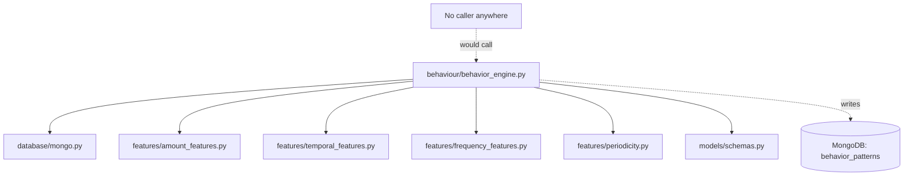
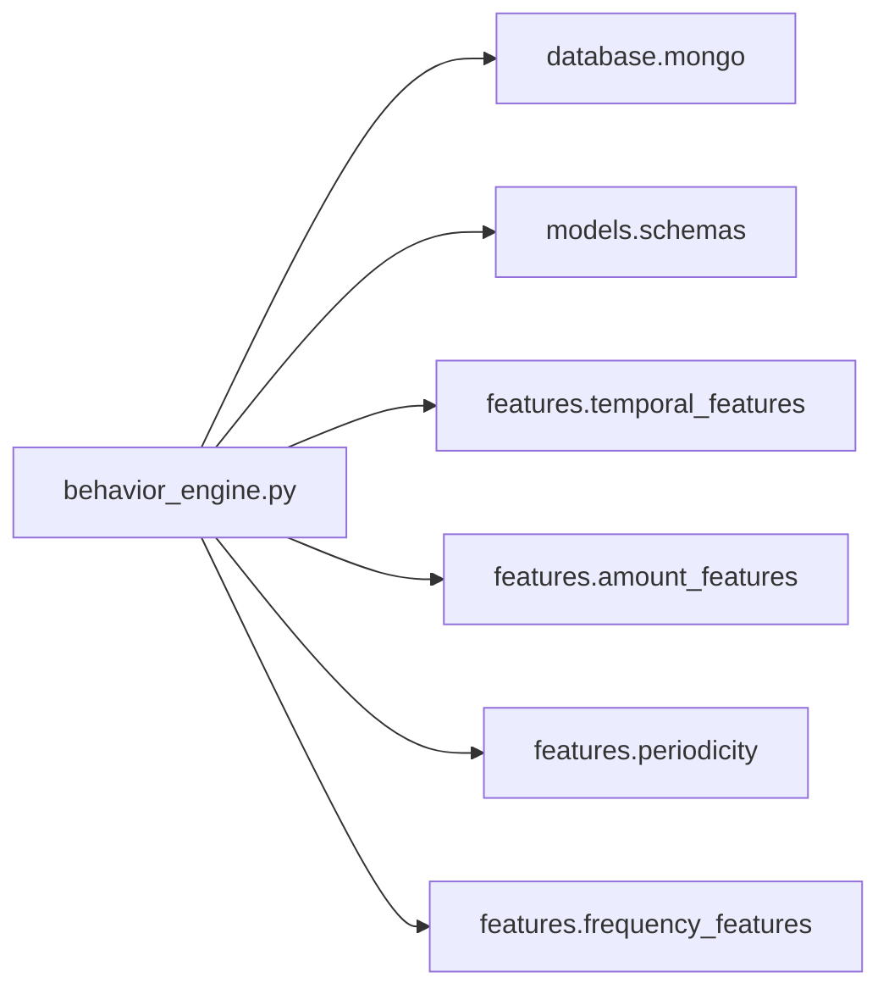
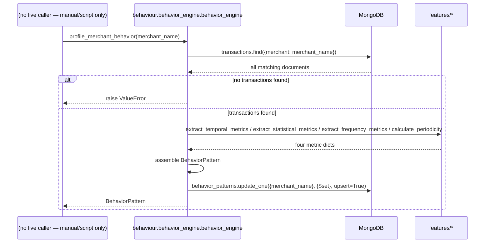

# Folder: `behaviour/`

## Purpose
The Phase 6 orchestrator: pulls every transaction for a merchant, runs all four `features/` extractors against it, and persists the combined result as a `BehaviorPattern` document. This is the single producer of the `behavior_patterns` collection that the analytics engine depends on.

## Responsibilities
- Fetch all historical transactions for a given merchant name from MongoDB.
- Delegate statistical computation entirely to `features/*.py` — this folder contains no math of its own.
- Assemble the four extractors' outputs into one `BehaviorPattern` and upsert it.

## Why this folder exists
Named "behaviour" (British spelling, distinct from `behavior_patterns` the collection name and `BehaviorPattern` the schema — a minor naming inconsistency worth noting) to capture the idea of "how does this merchant behave," as opposed to `features/`, which is "how do we measure behavior." The orchestrator/extractor split means adding a fifth feature dimension later only requires adding one more `features/` module and one more line in this folder's assembly step — the orchestration logic itself doesn't need to change shape.

## How it interacts with other folders
Depends on `database/mongo.py` (reads `transactions`, writes `behavior_patterns`), all four `features/*.py` extractors, and `models/schemas.py` (`BehaviorPattern`). It has **no caller anywhere in the codebase** — not `routers/`, not a script, not a scheduled job. It is a fully self-contained, fully functional pipeline stage that simply isn't wired to anything upstream.

## Major files
| File | Role |
|---|---|
| `behavior_engine.py` | `BehaviorEngine` class, singleton `behavior_engine` |

## Important classes
- **`BehaviorEngine`** — one public async method, no constructor state.

## Important functions
- **`profile_merchant_behavior(merchant_name) -> BehaviorPattern`** — fetches all `transactions` matching `merchant_name` (unfiltered by time window, unindexed field), raises `ValueError` if none exist, extracts amounts/timestamps, calls all four feature extractors, assembles a `BehaviorPattern`, and `update_one(..., upsert=True)`s it into `behavior_patterns` keyed by `merchant_name`.

## Execution order
This is a single, synchronous-looking (but `async def`) pipeline with no branching beyond the empty-transactions guard: fetch → extract (four independent calls, in the fixed order temporal → amount → frequency → periodicity as written) → assemble → upsert. There is no batching or looping over multiple merchants within this module — it processes exactly one merchant per call, so profiling an entire merchant base requires an external loop (which doesn't exist anywhere in this codebase).

## Dependency graph

## Call graph

## Potential interview questions
- "This is the sole writer of `behavior_patterns`, and two live analytics endpoints depend on that collection — but nothing calls this engine. How would you notice this gap during a code review?" (Trace every reader of `behavior_patterns` back to its writers, and every writer back to its callers — a dependency-graph audit, not something visible from reading `routers/analytics.py` alone.)
- "Why does `profile_merchant_behavior` fetch *all* transactions for a merchant with no time bound?" (Simplicity for a Phase 6 first pass; at scale this is an unbounded, unindexed collection scan with no pagination — a clear place a real production system would need a time window or incremental/streaming update strategy instead of full recomputation.)
- "What happens if this is called twice concurrently for the same merchant?" (Both calls independently fetch, compute, and `update_one(upsert=True)` — the second write simply overwrites the first; no lost-update protection is needed here specifically since the whole document is recomputed from source data each time, unlike the read-modify-write pattern in `memory/memory_manager.py`.)
- "Why upsert rather than always update or always insert?" (The first profiling run for a merchant needs to insert; every subsequent run needs to update the same document — `upsert=True` cleanly handles both without the caller needing to know which case applies.)

## Common mistakes
- Assuming `behavior_patterns` is kept fresh automatically as new transactions arrive — it's only ever as current as the last manual invocation of this engine for that specific merchant.
- Assuming this engine batches or schedules itself across all known merchants — it operates on exactly one `merchant_name` per call; there is no "profile everyone" entry point anywhere in the codebase.
- Confusing the British-spelled `behaviour/` folder with the American-spelled `behavior_patterns` collection and `BehaviorPattern` model — same domain concept, inconsistent spelling across the codebase.
- Assuming a `ValueError` on no-transactions is caught somewhere upstream — since nothing calls this function today, that error handling has never actually been exercised in production.

## Why this design is good
- Delegating all computation to `features/` keeps this module small, readable, and focused purely on I/O orchestration and assembly — exactly the right amount of responsibility for an "engine" layer sitting between raw storage and pure computation.
- The upsert-on-full-recompute strategy is simple and correct (if not efficient at scale) — there's no possibility of a `behavior_patterns` document reflecting a stale partial merge of old and new statistics, since every field is recomputed from scratch each run.
- Raising `ValueError` on no data (rather than silently writing a degenerate all-zero pattern) is a good defensive choice — it makes "we have no data for this merchant yet" an explicit, catchable condition rather than a misleading zero-valued document.

## If this folder disappeared
The `behavior_patterns` collection would never be populated or updated by any mechanism in the codebase (there is no other writer). `analytics/anomaly_detection.py` and `analytics/subscriptions.py` would permanently report "insufficient baseline data" / zero subscriptions for every merchant, `rag/retriever.py`'s context payloads would always have an empty `behavior: {}` field, and `graphs/graph_builder.py` would never create any `Behavior_*` or `Cluster` nodes. Given this folder is already unreferenced by any live caller, its removal would have **zero immediate runtime impact** on the currently-running HTTP surface — the impact is entirely on anyone who would have manually invoked it to backfill behavioral data.
