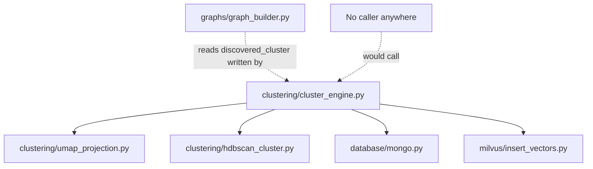
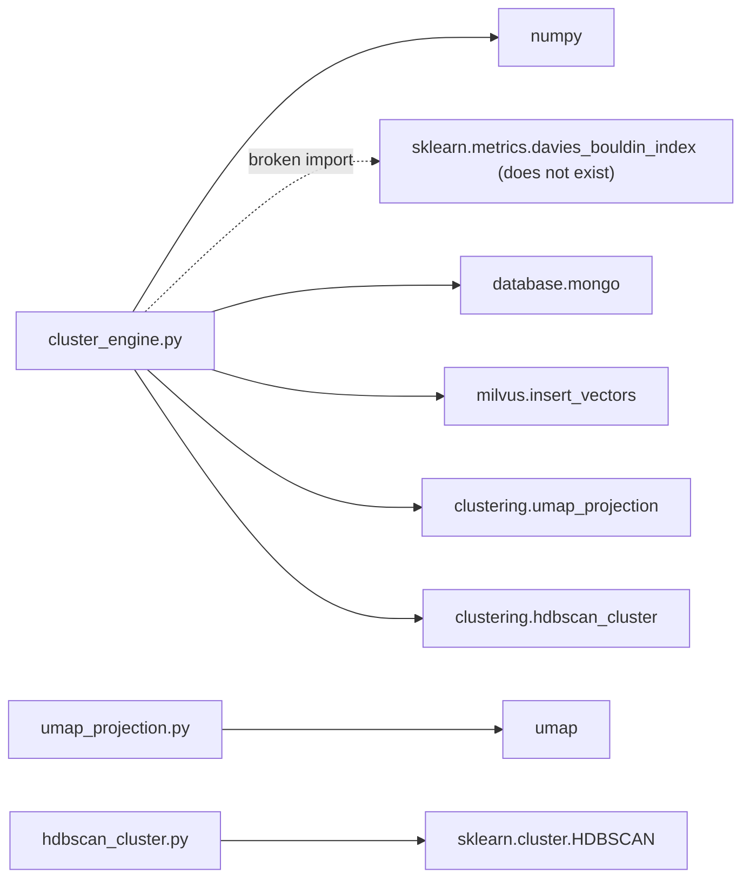
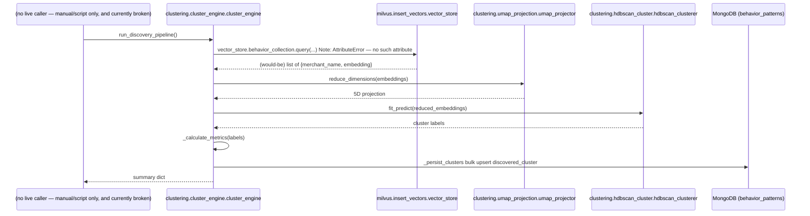

# Folder: `clustering/`

## Purpose
Phase 8's unsupervised discovery pipeline: reduce high-dimensional behavior embeddings to a manageable space and find natural groupings of similar merchants without any labeled data.

## Responsibilities
- Reduce 768-dimensional Ollama embeddings to a lower-dimensional space for clustering (`umap_projection.py`).
- Find dense groups (clusters) in that reduced space, tolerating noise/outliers (`hdbscan_cluster.py`).
- Orchestrate the full pipeline: fetch vectors → reduce → cluster → evaluate → persist (`cluster_engine.py`).

## Why this folder exists
UMAP and HDBSCAN are each substantial, independently-configurable algorithms; wrapping each in its own thin class (`UMAPProjector`, `DensityClusterer`) keeps their hyperparameters isolated and named, while `ClusterEngine` owns the sequencing and side effects (Mongo/Milvus I/O) that the two algorithm wrappers themselves are free of. This separation mirrors the `features/` vs `behaviour/` split elsewhere in the codebase: pure algorithm wrappers underneath, one stateful orchestrator on top.

## How it interacts with other folders
`cluster_engine.py` depends on `database/mongo.py` (bulk-writes `discovered_cluster` into `behavior_patterns`), `milvus/insert_vectors.py` (reads stored embeddings — via a currently-broken attribute reference, see below), and this folder's own `umap_projection.py`/`hdbscan_cluster.py`. **No other folder calls into `clustering/` at all** — it has no upstream caller (no router, no script). `graphs/graph_builder.py` reads the `discovered_cluster` field this pipeline would write, but only if the pipeline has ever successfully run — which, as documented below, it currently cannot.

## Major files
| File | Role |
|---|---|
| `umap_projection.py` | `UMAPProjector` — dimensionality reduction, singleton `umap_projector` |
| `hdbscan_cluster.py` | `DensityClusterer` — density clustering, singleton `hdbscan_clusterer` |
| `cluster_engine.py` | `ClusterEngine` — full pipeline orchestration, singleton `cluster_engine`. **Currently cannot be imported** (see below). |

## Important classes
- **`UMAPProjector`** — `n_neighbors=15`, `n_components=5`, `metric='cosine'`, `random_state=42` (fixed seed for reproducibility).
- **`DensityClusterer`** — HDBSCAN with `min_cluster_size=5`, `min_samples=3`, `metric='euclidean'`.
- **`ClusterEngine`** — `run_discovery_pipeline()` (the full flow), `_calculate_metrics()` (silhouette + Davies-Bouldin), `_persist_clusters()` (bulk upsert of cluster assignments).

## Important functions
- **`UMAPProjector.reduce_dimensions(embeddings)`** — `fit_transform`, 768D → 5D.
- **`DensityClusterer.fit_predict(data)`** — returns integer cluster labels, `-1` meaning noise.
- **`ClusterEngine.run_discovery_pipeline()`** — aborts early if fewer than 10 vectors exist; otherwise runs UMAP → HDBSCAN → metrics → persistence and returns a summary dict.
- **`ClusterEngine._calculate_metrics(data, labels)`** — computes silhouette score and Davies-Bouldin index over non-noise points only, requiring at least 2 clusters.
- **`ClusterEngine._persist_clusters(names, labels)`** — bulk `UpdateOne` upserts writing `discovered_cluster: "cluster_{label}"` or `"noise"` into `behavior_patterns`.

## Execution order
Intended order: fetch all vectors from Milvus (`vector_store.behavior_collection.query(...)`) → abort if `< 10` results → UMAP reduce → HDBSCAN cluster → compute metrics → bulk-persist cluster IDs → return summary. **In practice, this never gets past the import statement** — see below.

## Dependency graph

## Call graph

## Potential interview questions
- "This module has two separate bugs that would each independently prevent it from running. Walk me through both and the order in which you'd hit them." (First, `from sklearn.metrics import ... davies_bouldin_index` raises `ImportError` at module load — the function is actually named `davies_bouldin_score`. After fixing that, `vector_store.behavior_collection.query(...)` would raise `AttributeError`, since `VectorStoreManager` only exposes `client` and `behavior_col_name`, not `behavior_collection`. This is a good test of whether a candidate traces failure modes past the first error rather than stopping at the first fix.)
- "Why UMAP before HDBSCAN, rather than clustering directly on the raw 768-dimensional embeddings?" (HDBSCAN's density estimates degrade in very high-dimensional spaces — the "curse of dimensionality" makes distance metrics less meaningful; UMAP's nonlinear reduction to 5D preserves local neighborhood structure while making density-based clustering tractable.)
- "Why does `_calculate_metrics` exclude noise points (`label == -1`) before computing silhouette/Davies-Bouldin?" (Both metrics are defined in terms of cluster cohesion/separation — noise points by definition don't belong to any cluster, and including them would distort or invalidate the metric's meaning.)
- "Why guard on `len(results) < 10` before attempting to cluster at all?" (HDBSCAN's `min_cluster_size=5` and `min_samples=3` need enough data points to find any structure at all; clustering a handful of points would produce meaningless or degenerate results.)
- "This pipeline recomputes clusters from scratch every run rather than incrementally updating. What are the trade-offs at scale?" (Simplicity and correctness — no incremental-clustering complexity or drift between partial updates — at the cost of recomputing over the entire vector set every time, which doesn't scale well as the merchant base grows.)

## Common mistakes
- Assuming this module can currently be imported or run — verify both the `davies_bouldin_index`/`davies_bouldin_score` fix and the `behavior_collection` attribute fix are in place first.
- Assuming `discovered_cluster` values are already present in `behavior_patterns` documents — they only appear after a successful (currently impossible) run of this pipeline.
- Assuming HDBSCAN's `-1` noise label means "an error occurred" — it's a valid, expected output meaning "this point didn't fit any dense cluster," not a failure state.
- Assuming the `random_state=42` on UMAP guarantees fully reproducible clustering end-to-end — UMAP's output is reproducible given identical input and library versions, but HDBSCAN's `fit_predict` on that output can still be sensitive to library-version differences in edge cases.

## Why this design is good
- Wrapping UMAP and HDBSCAN in single-purpose classes with named, commented hyperparameters (rather than inline calls scattered through `cluster_engine.py`) makes the pipeline's tuning knobs easy to find and adjust.
- The `< 10` results guard and the `< 2` clusters guard in `_calculate_metrics` are sensible defensive checks against degenerate inputs that would otherwise produce misleading or crashing metric computations.
- Persisting cluster assignments back into the existing `behavior_patterns` collection (rather than a new, separate collection) means downstream consumers (`graphs/graph_builder.py`) only need to know about one place to look for a merchant's full computed profile.

## If this folder disappeared
`graphs/graph_builder.py` would lose its ability to read `discovered_cluster` and build `Cluster`/`BELONGS_TO` graph edges (though it already defends against missing/`"noise"` values, so this degrades gracefully rather than crashing). Given this folder is already non-functional as committed (both bugs above) and has no live caller, its removal would have **no observable impact on the currently running system** — the loss is entirely to future work that would have built on this foundation once the bugs are fixed.
