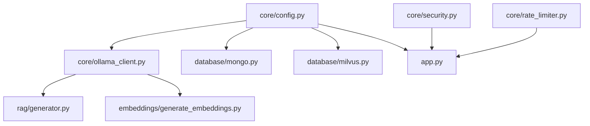
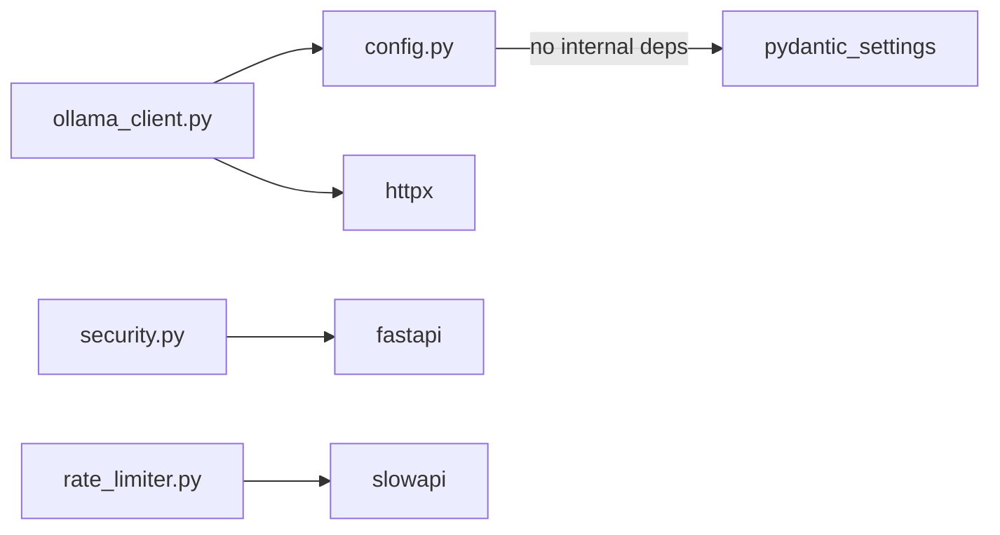
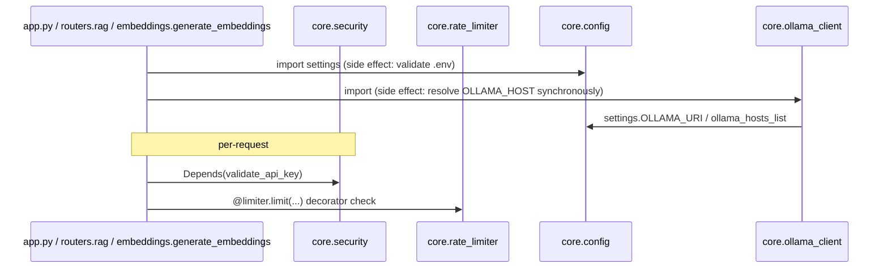

# Folder: `core/`

## Purpose
Cross-cutting infrastructure concerns that every other part of the application depends on but that belong to no single business feature: configuration loading, API-key authentication, rate limiting, and LLM host resolution.

## Responsibilities
- Load and validate environment configuration once, as a typed singleton (`config.py`).
- Enforce API-key authentication on protected routes (`security.py`).
- Configure and expose the global SlowAPI rate limiter (`rate_limiter.py`).
- Resolve which Ollama host to talk to (single URI or failover list) and expose the resolved model names as constants (`ollama_client.py`).

## Why this folder exists
These four concerns are used by many unrelated feature folders (`routers/`, `rag/`, `embeddings/`, `analytics/`, etc.) but don't belong conceptually to any of them. Centralizing them avoids every feature folder reinventing config loading or auth. This is the standard "core/common/shared" layer pattern in service architectures — a deliberate architectural seam between "infrastructure" and "domain logic."

## How it interacts with other folders
`core/config.py`'s `settings` singleton is imported by `core/ollama_client.py`, `database/mongo.py`, `database/milvus.py`, and `app.py`. `core/security.py`'s `validate_api_key` is imported only by `app.py` and attached as a router-level dependency. `core/rate_limiter.py`'s `limiter` is imported by `app.py`. `core/ollama_client.py`'s resolved `OLLAMA_HOST`/`EMBED_MODEL`/`LLM_MODEL` constants are imported by `rag/generator.py` and `embeddings/generate_embeddings.py` — these are the only two consumers, and both are one level removed from `core/` (they don't touch `core.config` directly).

## Major files
| File | Role |
|---|---|
| `config.py` | `Settings(BaseSettings)` — the single source of truth for env-driven configuration |
| `security.py` | `validate_api_key` FastAPI dependency |
| `rate_limiter.py` | SlowAPI `Limiter` instance + `setup_rate_limiting(app)` |
| `ollama_client.py` | Import-time Ollama host resolution + failover logic |

## Important classes
- **`Settings(BaseSettings)`** (`config.py`) — Pydantic Settings model. Fields: `MONGODB_URI`, `MONGODB_DB_NAME` (default `"velar"`), `MILVUS_URI`, `OLLAMA_URI`, `OLLAMA_HOSTS`, `EMBED_MODEL`, `LLM_MODEL`, `VELAR_API_KEY`. Loads from `.env`. Property `ollama_hosts_list` splits `OLLAMA_HOSTS` on commas.

## Important functions
- **`validate_api_key(api_key_header)`** (`security.py`) — 401 if header missing, 403 if it doesn't equal the hardcoded literal `"velar_test_key_123"` (does **not** check `settings.VELAR_API_KEY` — see Common Mistakes / Known Issues), else returns a hardcoded identity string.
- **`setup_rate_limiting(app)`** (`rate_limiter.py`) — attaches `limiter` to `app.state.limiter` and registers the `RateLimitExceeded` exception handler.
- **`resolve_ollama_host(hosts: list[str]) -> str`** (`ollama_client.py`) — iterates candidate hosts, GETs each with a 2s timeout, returns the first that responds `200`. Raises `RuntimeError` if the list is empty or every host fails.

## Execution order
1. `core/config.py` is imported first by nearly everything; `settings = Settings()` runs at import time, meaning **a missing required env var crashes the process immediately on the very first import of this module**, before any FastAPI machinery even starts.
2. `core/ollama_client.py`, when first imported (transitively via `routers.rag` or `embeddings.generate_embeddings`), immediately computes `OLLAMA_HOST` — either taking `settings.OLLAMA_URI` directly or calling `resolve_ollama_host` synchronously (blocking, real network calls) against `settings.ollama_hosts_list`.
3. `core/security.py` and `core/rate_limiter.py` have no import-time side effects beyond instantiating the `Limiter` and compiling the `APIKeyHeader` — their logic only runs per-request.

## Dependency graph

Internally, `core/` has one true intra-folder dependency: `ollama_client.py → config.py`. `security.py` and `rate_limiter.py` are fully independent of the rest of `core/`.

## Call graph

## Potential interview questions
- "Why does `core/security.py` not read `settings.VELAR_API_KEY`? What's the impact of fixing it?" (Tests whether the candidate notices the disconnect between declared config and actual auth logic — fixing it changes behavior for every existing client using the old hardcoded key.)
- "What happens to app startup time if `OLLAMA_HOSTS` has 5 hosts and the first 4 are down?" (Up to `4 * 2s = 8s` of blocking synchronous HTTP calls before resolution succeeds or fails — this happens on module import, blocking whatever triggered the import.)
- "Why use Pydantic `BaseSettings` instead of `os.environ.get()` calls scattered through the codebase?" (Type validation, single source of truth, fails fast with a clear error instead of `None`-related bugs downstream.)
- "SlowAPI keys by `get_remote_address` — what breaks this behind a reverse proxy?" (Client IP becomes the proxy's IP unless `X-Forwarded-For` is trusted and parsed — not configured here.)

## Common mistakes
- Assuming rotating `VELAR_API_KEY` in `.env` changes what key is accepted — it doesn't, because `security.py` ignores it entirely.
- Assuming `OLLAMA_URI` and `OLLAMA_HOSTS` are both consulted — `OLLAMA_URI` short-circuits and `OLLAMA_HOSTS` is ignored if it's set.
- Importing `core.ollama_client` in a context where Ollama isn't reachable yet (e.g., a script run before the Ollama container is up) and being surprised by an immediate `RuntimeError` rather than a lazy failure at first actual use.
- Adding new settings fields without a default and forgetting to update `.env` — this crashes *every* entry point that imports `core.config`, including test collection.

## Why this design is good
- Centralizing config as a validated singleton means configuration errors surface immediately and loudly (fail-fast) rather than as confusing `None`/`KeyError` bugs deep in business logic.
- Separating security, rate limiting, and config into distinct single-responsibility files makes each easy to reason about and test in isolation, despite none of them currently having dedicated unit tests.
- The Ollama failover mechanism (`OLLAMA_HOSTS`) is a sensible pattern for a self-hosted LLM fleet where any single node might be down — trying hosts in order with a short timeout is a reasonable, if simplistic, load-balancing/failover strategy.

## If this folder disappeared
Nothing else in the codebase could load configuration, so `database/mongo.py`, `database/milvus.py`, and `app.py` would all fail to import (`NameError`/`ImportError` on `from core.config import settings`). Every router relying on `Depends(validate_api_key)` would lose its auth mechanism entirely — the app.py `include_router` calls would fail outright since `core.security` wouldn't exist to import. Rate limiting would vanish, leaving every endpoint unthrottled. `rag/generator.py` and `embeddings/generate_embeddings.py` would fail to import since they depend on `OLLAMA_HOST`/`EMBED_MODEL`/`LLM_MODEL` from `core.ollama_client`. In short: total application failure at import time.
