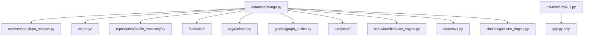
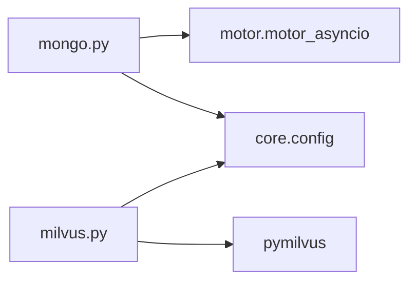
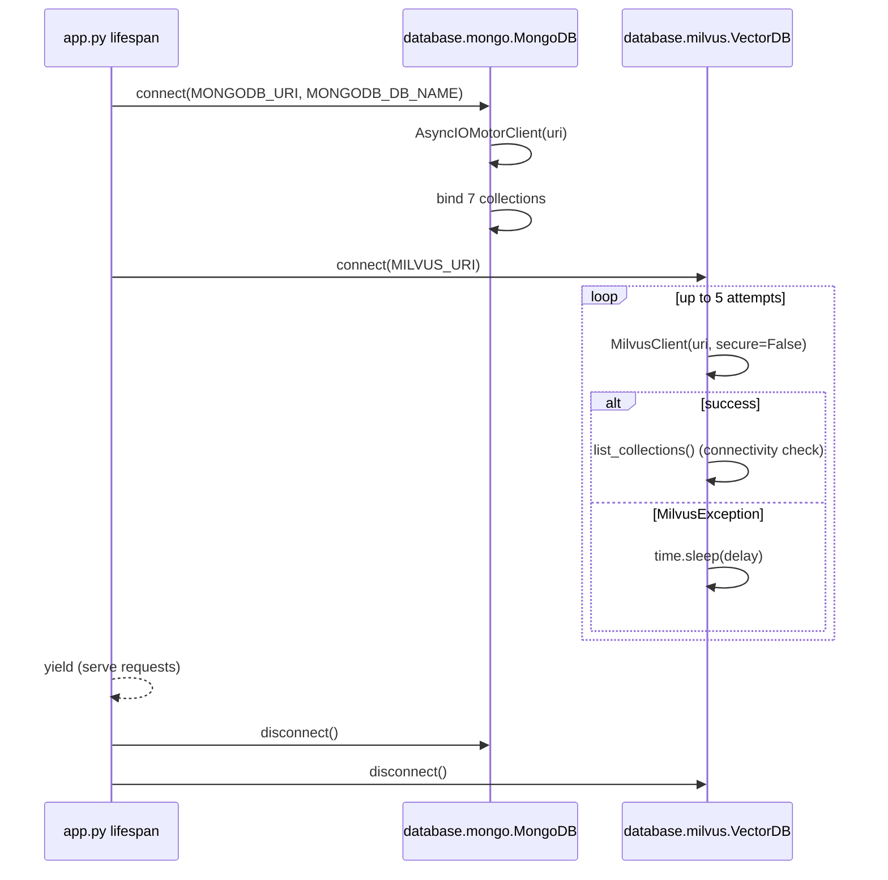

# Folder: `database/`

## Purpose
Owns the two external datastore connections used by the entire application — MongoDB (system of record) and Milvus (vector search) — and exposes each as a process-wide singleton with an explicit connect/disconnect lifecycle.

## Responsibilities
- Establish and tear down the async MongoDB client (`mongo.py`), and bind named collection accessors so the rest of the app never has to know a raw collection name string exists (`db.transactions`, `db.merchant_profiles`, etc.).
- Establish and tear down the Milvus client (`milvus.py`) with startup retry logic, degrading gracefully to a disconnected state rather than crashing if Milvus isn't up yet.

## Why this folder exists
Database connection lifecycle is infrastructure, not business logic — it needs to be initialized once, shared everywhere, and torn down cleanly on shutdown. Isolating it here (rather than instantiating clients ad hoc in every module that needs data) gives the app a single, testable seam for "what does it mean to be connected to storage," and lets `app.py`'s `lifespan` manage both connections symmetrically.

## How it interacts with other folders
Nearly every feature folder imports `database.mongo.db` directly (`analytics/`, `behaviour/`, `engines/` — no, actually only `services/merchant_resolver.py`, `memory/`, `repositories/`, `feedback/`, `rag/retriever.py`, `graphs/`, `routers/v1.py`, `routers/analytics.py`, `clustering/cluster_engine.py`). `database.milvus.vector_db` is imported only by `app.py` — notably, **no other folder uses it**; the real Milvus traffic goes through `milvus/insert_vectors.py` and `milvus/search_vectors.py`, which construct their own independent client (see `docs/folders/milvus.md` and `docs/16-known-issues-tech-debt.md`).

## Major files
| File | Role |
|---|---|
| `mongo.py` | `MongoDB` class (all `@classmethod`), singleton `db` |
| `milvus.py` | `VectorDB` class (all `@classmethod`), singleton `vector_db` |
| `__init__.py` | Empty — package marker only |

## Important classes
- **`MongoDB`** (`mongo.py`) — class-level state (`client`, `db`, and seven collection attributes). `connect(uri, db_name)` creates one `AsyncIOMotorClient` and binds `transactions`, `feedback`, `categories`, `merchants`, `merchant_profiles`, `behavior_patterns`, `retraining_queue` as class attributes. `disconnect()` closes the client.
- **`VectorDB`** (`milvus.py`) — class-level `client` attribute. `connect(uri, retries=5, delay=3)` retries with a **blocking** `time.sleep(delay)` between attempts (up to 15s total), logging warnings on `MilvusException` and falling back to `client = None` after exhausting retries rather than raising. `disconnect()` calls `client.close()` defensively inside a try/except.

## Important functions
All logic lives in the two classes above as classmethods — there are no free functions in this folder.

## Execution order
1. Both modules define their class and singleton at import time — **no network connection happens until `connect()` is explicitly called**, unlike `core/ollama_client.py`, which resolves eagerly at import.
2. `app.py`'s `lifespan` calls `db.connect(...)` first, then `vector_db.connect(...)` — Mongo is prioritized because most routes depend on it more directly.
3. On shutdown, `lifespan` calls `db.disconnect()` then `vector_db.disconnect()`, in the same order as startup (not reversed) — since the two are independent, order doesn't functionally matter here, though reverse-order teardown is the more common convention.

## Dependency graph

## Call graph

## Potential interview questions
- "Why are `MongoDB` and `VectorDB` implemented with `@classmethod`s and class-level attributes instead of normal instances?" (Ensures a true singleton without needing a separate DI framework — but sacrifices testability, since you can't easily instantiate a second isolated instance for a test.)
- "What happens to a request handler if it runs before `lifespan` finishes connecting?" (ASGI guarantees `lifespan` startup completes before the server accepts connections, so this shouldn't happen in normal operation — but any module-level code that touches `db.transactions` before `connect()` runs would hit `None`, since class attributes are only bound inside `connect()`.)
- "Why does `VectorDB.connect` swallow all failures into `client = None` instead of raising, while `core/ollama_client.py`'s equivalent resolution raises `RuntimeError`?" (Inconsistent failure philosophy across the codebase — worth probing whether this was intentional per-service risk tolerance or just inconsistency.)
- "This module's retry loop uses `time.sleep`, not `asyncio.sleep`, inside code invoked from an async lifespan. What's the impact?" (Blocks the entire event loop for up to 15 seconds during startup — no other coroutine can run, though since this happens before the server starts accepting traffic, the practical impact is a slow but not necessarily broken startup.)
- "Why does this folder maintain two separate ways of talking to Milvus (this `vector_db`, and `milvus/insert_vectors.py`'s `vector_store`)?" (No good reason — an artifact of iterative development; see Known Issues.)

## Common mistakes
- Assuming `vector_db` (this folder) is what powers `/v1/explain`'s semantic search — it's actually `milvus/insert_vectors.py`'s independently-constructed client.
- Calling `db.transactions` (or any collection) before `db.connect()` has run — will raise `AttributeError` since the attribute doesn't exist until bound inside `connect()`.
- Assuming a `MilvusException` during connect crashes the app — it doesn't; it silently degrades to `client = None`, which can mask real infrastructure problems if `/health` isn't being actively monitored.

## Why this design is good
- Explicit, symmetric connect/disconnect lifecycle tied to FastAPI's `lifespan` is the correct, idiomatic pattern for managing external resources in an ASGI app — it avoids the anti-pattern of connecting lazily on first request (which can cause a slow, unpredictable first request) or never disconnecting cleanly.
- Binding named collection accessors (`db.transactions` instead of `db.db["transactions"]`) gives the rest of the codebase a discoverable, typo-resistant API surface for what collections exist.
- Retrying Milvus connectivity with backoff (even if naively blocking) is more resilient than a single connection attempt, given container orchestration startup-ordering races are common (app container starting before the Milvus container is ready).

## If this folder disappeared
Every feature folder listed in the interaction diagram above would fail to import (`ModuleNotFoundError: No module named 'database'`), which cascades to `app.py` failing to import `routers.v1`, `routers.memory`, `routers.analytics`, `routers.rag` — the entire HTTP API would be unloadable. There would be no way to persist or query transactions, merchant profiles, behavior patterns, or feedback; the service would have no state at all.
