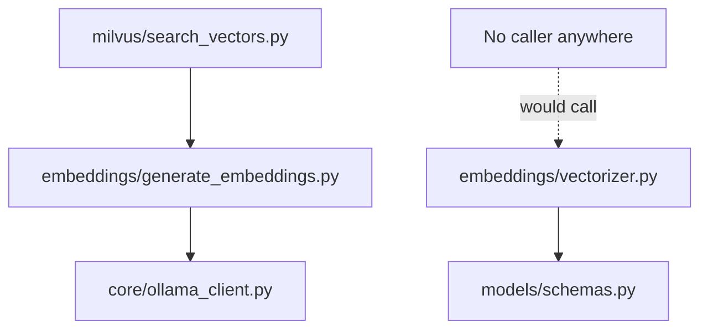
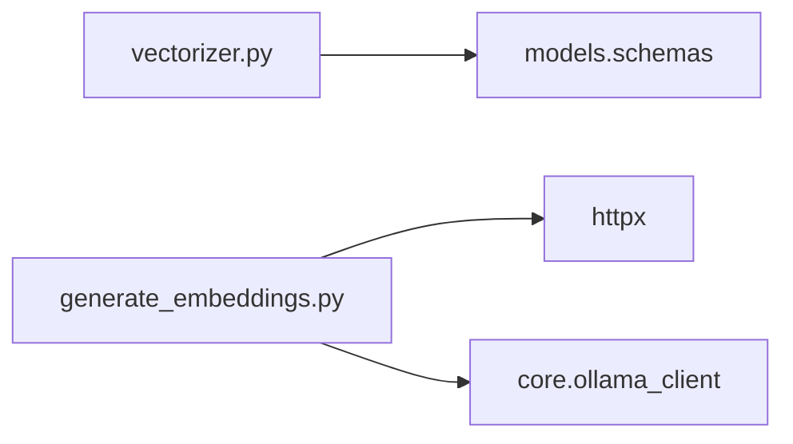
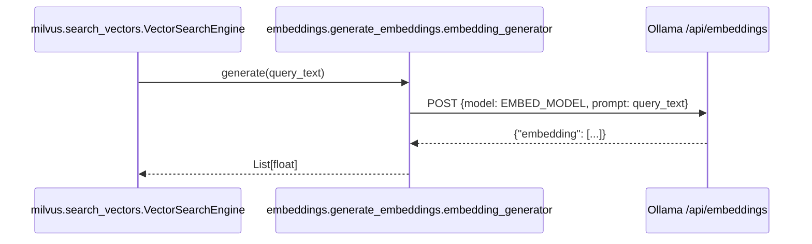

# Folder: `embeddings/`

## Purpose
Phase 7's text-to-vector building blocks: turn structured domain objects (`MerchantProfile`, `BehaviorPattern`) into natural-language strings, then those strings into dense vectors via Ollama.

## Responsibilities
- Flatten structured data into semantically rich sentences suitable for an embedding model (`vectorizer.py`).
- Call the Ollama `/api/embeddings` endpoint to turn text into a vector (`generate_embeddings.py`).

## Why this folder exists
Embedding models take text, not JSON — this folder is the deliberate translation layer that decides *what sentence* best represents a merchant's identity or behavioral fingerprint before it's ever vectorized. Separating "what do we say about this entity" (`vectorizer.py`) from "how do we call the embedding model" (`generate_embeddings.py`) means the prompt/description engineering can evolve independently of the HTTP client mechanics.

## How it interacts with other folders
`generate_embeddings.py` depends on `core/ollama_client.py` for `OLLAMA_HOST`/`EMBED_MODEL`. `vectorizer.py` depends on `models/schemas.py` for the types it stringifies. `milvus/search_vectors.py` imports `embedding_generator` from this folder to embed a query at search time — this is the **only** live, wired-in consumer of anything in this folder. `vectorizer.py` itself has **zero callers anywhere in the codebase** — nothing ever calls `stringify_profile` or `stringify_behavior`.

## Major files
| File | Role |
|---|---|
| `vectorizer.py` | `SemanticVectorizer` — stringification only, no I/O |
| `generate_embeddings.py` | `EmbeddingGenerator` — the actual Ollama HTTP call |

## Important classes
- **`SemanticVectorizer`** — two static methods, no state.
- **`EmbeddingGenerator`** — singleton `embedding_generator`; holds `self.api_url = f"{OLLAMA_HOST}/api/embeddings"` computed once at construction.

## Important functions
- **`SemanticVectorizer.stringify_profile(profile)`** — e.g. `"Entity: Swiggy. Known aliases include: BUNDL, SWIGGY. Memory State: PERMANENT. Transaction Frequency: Seen 14 times. Type: Business."`
- **`SemanticVectorizer.stringify_behavior(pattern)`** — e.g. `"Behavior footprint for Swiggy: Average transaction amount is 412.30 with a standard deviation of 88.10. Preferred time of day is 20:00. Weekly transaction frequency is 3.20. Periodicity score is 0.22 (1.0 means highly predictable)."`
- **`EmbeddingGenerator.generate(text) -> List[float]`** (async) — POSTs `{model: EMBED_MODEL, prompt: text}` to Ollama with a 15s timeout; returns `response.json()["embedding"]`; re-raises `httpx.HTTPError` after logging (no retry logic).

## Execution order
`embedding_generator = EmbeddingGenerator()` is instantiated at import time; its constructor reads `OLLAMA_HOST`/`EMBED_MODEL` from `core.ollama_client`, meaning importing this module transitively triggers `core.ollama_client`'s import-time Ollama host resolution (and its potential `RuntimeError` if no host is reachable). `SemanticVectorizer`'s methods are `@staticmethod`s with no instantiation cost or side effects — safe and cheap regardless of Ollama availability, though currently unreachable in practice.

## Dependency graph

## Call graph

Note: `SemanticVectorizer` has no call graph edges at all in the current codebase — it is written but never invoked.

## Potential interview questions
- "`vectorizer.py` is fully implemented but never called. What would you need to build to actually use it?" (An orchestrating job that iterates `merchant_profiles`/`behavior_patterns`, calls `stringify_profile`/`stringify_behavior`, feeds the result to `embedding_generator.generate`, and calls `milvus.insert_vectors.vector_store.insert_behavior_vector` — none of which exists as a script or scheduled task today.)
- "Why generate an embedding from a hand-written sentence rather than embedding the raw JSON of a `MerchantProfile`?" (Embedding models are trained on natural language; a well-formed descriptive sentence produces a more semantically meaningful vector than serialized JSON syntax, which introduces noise unrelated to meaning.)
- "What happens if `EMBED_MODEL`'s output dimensionality doesn't match Milvus's configured `768`?" (Nothing validates this at the embeddings layer — the mismatch would only surface as an error when `milvus/insert_vectors.py` tries to insert/search a vector of the wrong size.)
- "Why does `EmbeddingGenerator.generate` re-raise on `httpx.HTTPError` instead of returning an empty vector or `None`?" (Fail loudly rather than silently propagate a garbage/empty embedding into Milvus — the one caller, `milvus/search_vectors.py`, wraps this in its own broad `try/except` and degrades to an empty result list instead.)

## Common mistakes
- Assuming `vectorizer.py`'s stringification methods are what's actually embedded into Milvus today — no live code path calls them; only ad hoc query text (raw user input) is ever embedded via `embedding_generator.generate` directly, by `milvus/search_vectors.py`.
- Assuming a failed embedding call degrades gracefully — `EmbeddingGenerator.generate` itself raises; graceful degradation only happens one layer up, in `milvus/search_vectors.py`'s exception handling.
- Forgetting that importing this folder (even just for `vectorizer.py`) transitively imports `core.ollama_client`, which can fail fast if no Ollama host is reachable — even though `vectorizer.py` itself never talks to Ollama.
- Assuming embeddings are cached — every call to `generate` hits the network; there is no caching layer for repeated identical text.

## Why this design is good
- Separating "what text represents this entity" from "how do we call the embedding API" means either half can change independently — a better prompt-engineering approach to stringification wouldn't require touching HTTP logic, and swapping embedding providers wouldn't require touching the stringification logic.
- Using descriptive natural-language templates (rather than raw field concatenation) is a reasonable, interpretable choice that a human could read and sanity-check against what the model "sees."
- Keeping `EmbeddingGenerator` a thin, single-purpose HTTP client (no retry/caching complexity baked in) keeps it easy to reason about, even though it means callers must handle resilience themselves.

## If this folder disappeared
`milvus/search_vectors.py` would fail to import (`from embeddings.generate_embeddings import embedding_generator`), which would break `rag/retriever.py`'s semantic search step, which would break `routers/rag.py`'s `/v1/explain` endpoint — the one fully-wired, working RAG pipeline in the system would stop working entirely. There would also be no way, even manually, to turn a `MerchantProfile` or `BehaviorPattern` into descriptive text for future embedding work.
