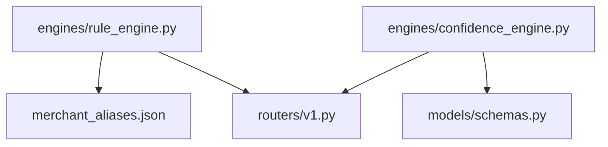
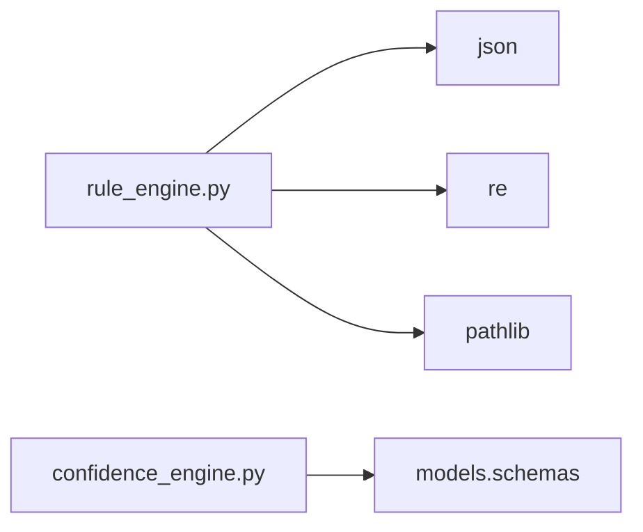
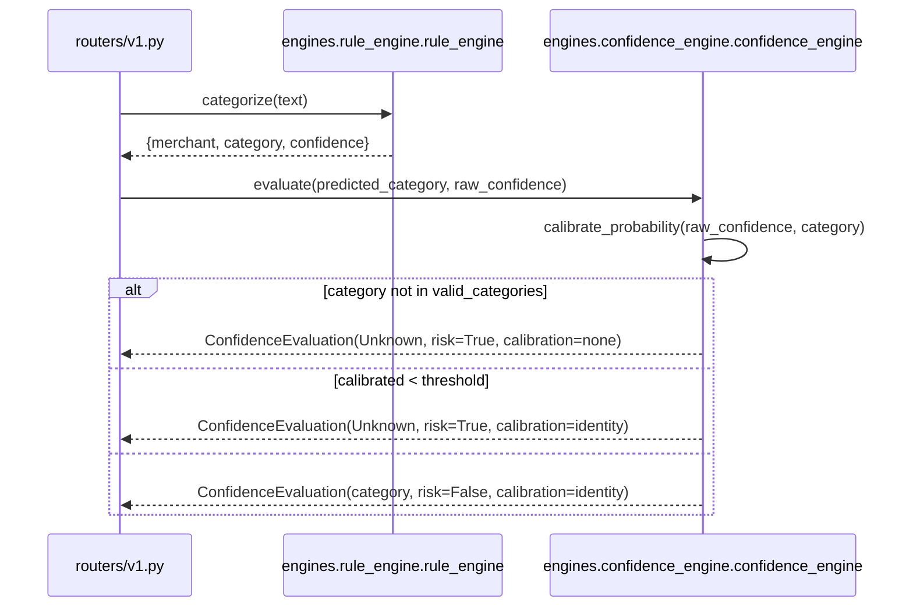

# Folder: `engines/`

## Purpose
Houses the two deterministic decision-making components that don't require a database round trip to reach a verdict: the rule-based categorizer (Phase 1–2) and the confidence wall (Phase 5). Both are pure(-ish), fast, in-memory classifiers.

## Responsibilities
- **`rule_engine.py`**: match raw transaction text against a static, pre-compiled regex dictionary and return a merchant/category/confidence triple.
- **`confidence_engine.py`**: take an upstream (would-be ML) prediction and confidence score, and decide whether to trust it or force it to `Unknown`.

## Why this folder exists
Both modules encode *business rules about trust and certainty* rather than data access or ML mechanics — they're the "policy" layer sitting between raw input/model output and what the rest of the system is allowed to treat as ground truth. Grouping them together (rather than putting `rule_engine` next to `services/merchant_resolver.py`, which does a related job) reflects that both are stateless, singleton, synchronous decision engines with no I/O beyond startup file/config loading — a distinct category from the async, database-backed `services/` and `analytics/` folders.

## How it interacts with other folders
`rule_engine` is consumed only by `routers/v1.py` (and reads `merchant_aliases.json` from the repo root at startup). `confidence_engine` is consumed by `routers/v1.py` directly, and depends on `models.schemas.TransactionCategory`/`ConfidenceEvaluation`. Neither engine calls into `database/`, `services/`, or any other feature folder — they are leaf compute nodes with respect to the rest of the domain layer (their only dependency is `models/`).

## Major files
| File | Role |
|---|---|
| `rule_engine.py` | `RuleEngine` class, singleton `rule_engine` |
| `confidence_engine.py` | `ConfidenceEngine` class, singleton `confidence_engine` |

## Important classes
- **`RuleEngine`** — loads `merchant_aliases.json` at construction, pre-compiles one `\b<alias>\b` case-insensitive regex per entry into `self.compiled_rules` (a dict mapping compiled pattern → `{merchant, category}`).
- **`ConfidenceEngine`** — holds a `threshold` (default `0.5`) and a precomputed `valid_categories` set (every `TransactionCategory` member except `UNKNOWN`).

## Important functions
- **`RuleEngine._load_rules()`** — reads the JSON file; returns `{}` (logged warning, not fatal) if the file is missing.
- **`RuleEngine._compile_patterns()`** — pre-compiles all regexes once at startup, trading a small startup cost for fast per-request matching.
- **`RuleEngine.categorize(text)`** — first-match-wins linear scan over `compiled_rules` (dict iteration order = JSON key insertion order); returns `confidence: 0.95` on match, `Unknown/Uncategorized/0.0` otherwise.
- **`ConfidenceEngine.calibrate_probability(raw_confidence, category)`** — currently an identity clamp to `[0.0, 1.0]`; the name and docstring signal intended future calibration (Platt/isotonic) that doesn't exist yet.
- **`ConfidenceEngine.evaluate(predicted_category, raw_confidence)`** — the confidence wall itself: rejects out-of-vocabulary categories outright, then rejects anything under `threshold`, both paths forcing `TransactionCategory.UNKNOWN`.

## Execution order
`RuleEngine()` and `ConfidenceEngine(threshold=0.5)` are both instantiated at module import time as singletons (`rule_engine = RuleEngine()`, `confidence_engine = ConfidenceEngine(threshold=0.5)`). This means the alias file is read and every regex compiled once, at process startup (via `routers/v1.py`'s import), not per-request. Per-request, `categorize()` and `evaluate()` are both synchronous, in-memory, non-blocking calls — no `await` anywhere in this folder.

## Dependency graph

## Call graph

## Potential interview questions
- "Why pre-compile regex patterns at startup instead of compiling on each call?" (Regex compilation is relatively expensive; since the alias dictionary is static and small, paying the cost once at startup instead of on every `categorize()` call is a straightforward, correct optimization.)
- "The rule engine returns a flat `confidence: 0.95` for every match, regardless of match quality. Is that a problem?" (Yes, potentially — a whole-word match on "uber" in "UBER EATS DELIVERY" gets the same confidence as an exact single-word match; there's no signal for match specificity or ambiguity.)
- "Why does `ConfidenceEngine` special-case `predicted_category not in valid_categories` separately from the threshold check, when both end in the same `Unknown` result?" (Different failure semantics worth distinguishing: one is "the upstream model is broken/out of spec," the other is "the upstream model is unsure" — the `calibration_applied` field (`none` vs `identity`) preserves that distinction for downstream diagnostics/logging.)
- "What's the actual behavioral difference between `calibration_applied: "identity"` and a real calibration method?" (None currently — it's a placeholder name. A real implementation would adjust `raw_confidence` based on a fitted calibration curve, not just clamp it.)

## Common mistakes
- Assuming `rule_engine.categorize()` does substring/fuzzy matching — it's strict `\b...\b` whole-word regex matching, so "swiggys" (misspelled/pluralized) would not match `swiggy`.
- Assuming the rule engine and `services/merchant_resolver.py` share logic or data — they are entirely independent systems (one static-dictionary-based, one database-backed) that happen to solve adjacent problems.
- Adding a new category to `merchant_aliases.json` without adding it to `models.schemas.TransactionCategory` — if that category string is ever passed through `ConfidenceEngine.evaluate()`, it will be forced to `Unknown` as "invalid."
- Assuming `calibrate_probability` does something more sophisticated than clamping — reading the docstring without reading the implementation would give a false impression of calibration quality.

## Why this design is good
- Keeping the rule engine deterministic, in-memory, and file-driven means it's trivially fast (no network I/O per request) and trivially testable (pure function of input text and the loaded JSON).
- The confidence wall's "reject rather than guess" philosophy is a genuinely good design principle for a financial categorization system — a wrong-but-confident-looking answer is worse than an honest "Unknown" for anything downstream (analytics, user-facing categorization) that trusts the category field.
- Both engines are cheap to reason about because they have no side effects beyond returning a value — no writes, no mutation of shared state, no async coordination.

## If this folder disappeared
`routers/v1.py` would fail to import (`from engines.rule_engine import rule_engine`, `from engines.confidence_engine import confidence_engine`), taking down the entire `/v1` router and, transitively, `app.py`'s startup. There would be no deterministic categorization fallback and no confidence-based rejection mechanism — any ML prediction pipeline built later would have no safety net preventing low-confidence or invalid-category predictions from reaching users, analytics, or the RAG explanation layer.
