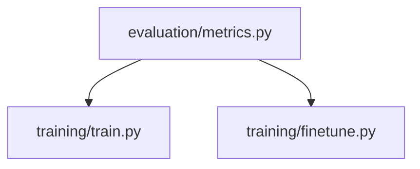
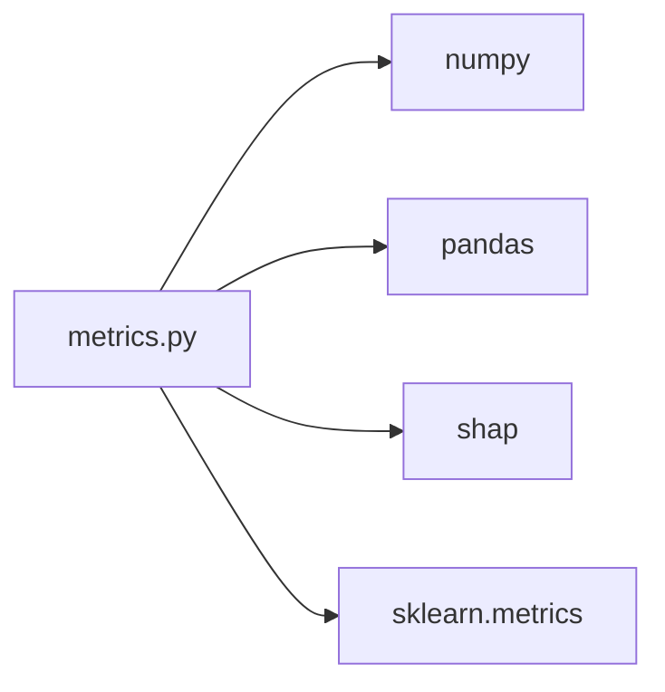
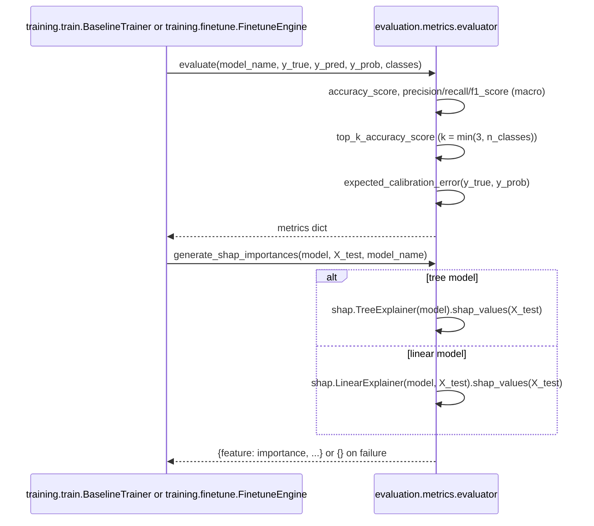

# Folder: `evaluation/`

## Purpose
The shared metrics toolkit for both training pipelines in `training/`: standard classification metrics, calibration measurement, and model-agnostic feature-importance explanation via SHAP.

## Responsibilities
- Compute accuracy, macro precision/recall/F1, and top-k accuracy for a multi-class classifier (`metrics.py`).
- Compute Expected Calibration Error (ECE) — how well a model's confidence scores match its actual accuracy.
- Generate global feature-importance rankings via SHAP, handling the differing output shapes of tree-based vs. linear models.

## Why this folder exists
Metric computation is a cross-cutting concern shared by two otherwise-unrelated training pipelines (classical models in `training/train.py`, a fine-tuned transformer in `training/finetune.py`). Factoring it out prevents duplicating the ECE formula or SHAP-shape-handling logic in two places, and makes it possible to compare a classical model and a fine-tuned transformer on identical metric definitions — essential for a fair "is fine-tuning worth it" comparison.

## How it interacts with other folders
`evaluation/metrics.py` is imported by both `training/train.py` and `training/finetune.py`. It has zero dependencies on any other application folder — only `numpy`, `pandas`, `shap`, and `sklearn.metrics`. This makes it, like `models/` and `features/`, a leaf-level shared utility with multiple consumers and no internal-package dependencies of its own.

## Major files
| File | Role |
|---|---|
| `metrics.py` | `ModelEvaluator` class, singleton `evaluator` |

## Important classes
- **`ModelEvaluator`** — no constructor state; every method is either `@staticmethod` or operates purely on its arguments.

## Important functions
- **`expected_calibration_error(y_true, y_prob, n_bins=10)`** (static) — bins predictions into 10 equal-width confidence buckets, computes `|avg_confidence - accuracy| * bucket_weight` per non-empty bucket, sums to a single ECE score. Lower is better-calibrated.
- **`evaluate(model_name, y_true, y_pred, y_prob, classes)`** — accuracy, macro precision/recall/F1 (all `zero_division=0` safe), `top_k_accuracy` (k auto-reduced to `min(3, len(classes))` so it degrades gracefully with few classes), and ECE via the method above. Returns one flat dict per model, directly rows-appendable into a comparison table.
- **`generate_shap_importances(model, X_test, model_name)`** (static) — `TreeExplainer` for `RandomForest`/`XGBoost`/`LightGBM`, `LinearExplainer` for anything else; normalizes across the differing SHAP output shapes (list-of-arrays, 3D array, or plain 2D array depending on model/library version) into a single mean-absolute-importance-per-feature dict, sorted descending. Any exception is caught and logged, returning `{}` rather than failing the whole training run.

## Execution order
`evaluator = ModelEvaluator()` is instantiated at import time with zero side effects. Per training run, `evaluate()` is called once per model (after that model's predictions are available), and `generate_shap_importances()` is called once per model immediately after, using the same trained model object and its transformed test features.

## Dependency graph

## Call graph

## Potential interview questions
- "Why does ECE matter specifically for this system, beyond being a generic ML metric?" (It directly validates the assumption behind `engines/confidence_engine.py`'s hardcoded `0.5` threshold — if a model is poorly calibrated, "confidence 0.5" doesn't actually mean "50% likely correct," undermining the confidence wall's entire premise.)
- "Why does `top_k_accuracy_score` use `k = min(3, len(classes))` instead of a fixed `k=3`?" (With fewer than 3 classes, `top_3_accuracy` would be trivially 100% or undefined — reducing `k` keeps the metric meaningful across datasets with varying class counts, at the cost of the metric not being directly comparable across differently-sized label sets.)
- "Walk me through why `generate_shap_importances` needs three different code paths for extracting SHAP values." (Different SHAP explainer/model combinations return values in different shapes across library versions: some return a list of per-class arrays, some a single 3D array, some a flat 2D array — the function normalizes all three into one consistent per-feature importance vector.)
- "Why swallow exceptions in `generate_shap_importances` and return `{}` instead of letting a SHAP failure fail the whole training run?" (SHAP explanation is diagnostic/nice-to-have, not required for the model to be valid — treating it as best-effort means a SHAP library incompatibility doesn't block getting the actual trained model and its core metrics.)

## Common mistakes
- Assuming `evaluate()`'s `top_k_accuracy` is always "top-3 accuracy" — it silently becomes top-1 or top-2 when fewer than 3 classes are present, which can be confusing when comparing results across differently-labeled runs.
- Assuming a `{}` result from `generate_shap_importances` means "this model has no important features" — it more likely means SHAP computation failed for an unhandled reason (check logs for the warning).
- Reusing `expected_calibration_error` on raw logits instead of softmax probabilities — the function assumes `y_prob` rows sum to 1 (i.e., true probabilities), which both callers correctly ensure via `predict_proba`/softmax before calling it, but a new caller could easily get this wrong.

## Why this design is good
- A single, shared evaluation module guarantees that "F1 score" or "ECE" means exactly the same computation regardless of which training pipeline produced it — essential for trustworthy model comparison.
- Defensive `zero_division=0` handling on precision/recall/F1 avoids noisy warnings or crashes on classes with no predicted or true samples in a given test split, which is common with small or imbalanced synthetic datasets.
- Treating SHAP explanation as a best-effort, failure-tolerant add-on (rather than a hard requirement) is a pragmatic choice given how version-sensitive SHAP's API surface has historically been.

## If this folder disappeared
Both `training/train.py` and `training/finetune.py` would fail to import (`from evaluation.metrics import evaluator`), so neither training pipeline could run at all, even manually. There would be no calibration measurement anywhere in the codebase, and no way to compare models on standardized metrics — each training script would need to reimplement its own metric logic from scratch, risking inconsistent definitions between the classical and transformer pipelines.
