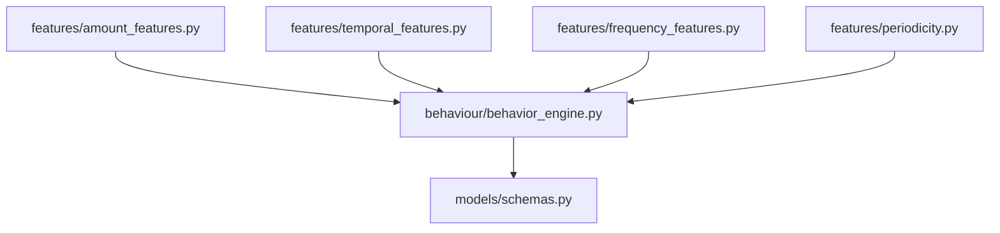
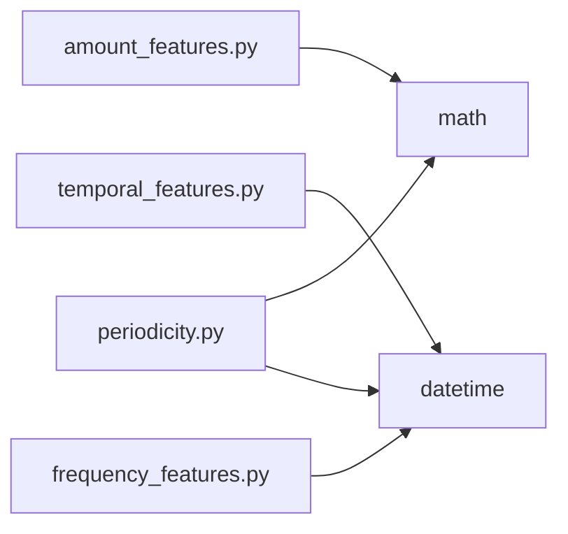
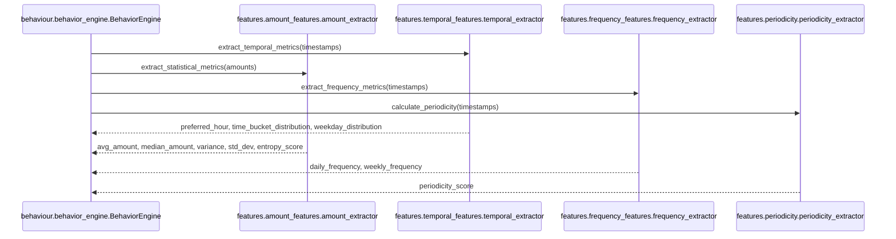

# Folder: `features/`

## Purpose
Pure, stateless statistical feature-extraction functions that turn a raw list of transaction amounts/timestamps for one merchant into numeric behavioral signals. This is the mathematical core of Phase 6 (behavioral intelligence).

## Responsibilities
- Compute amount-based statistics: mean, median, variance, standard deviation, and an entropy measure of amount predictability (`amount_features.py`).
- Compute temporal patterns: preferred hour of day, time-of-day bucket distribution, weekday distribution (`temporal_features.py`).
- Compute visit-frequency statistics: daily/weekly frequency, average days between transactions (`frequency_features.py`).
- Compute interval regularity: coefficient-of-variation-based periodicity score and a subscription heuristic (`periodicity.py`).

## Why this folder exists
Each extractor answers a narrow, independent statistical question, and none of them need to know about MongoDB, Milvus, or each other — they're pure functions of lists of numbers/datetimes. Isolating them here means they can be unit-tested trivially (none currently are) and reused by anything that has amount/timestamp data, not just `behaviour/behavior_engine.py`. This is a textbook "pure computation" layer sitting below an "orchestration" layer (`behaviour/`).

## How it interacts with other folders
All four extractors are imported exclusively by `behaviour/behavior_engine.py`, which combines their outputs into a single `BehaviorPattern` (from `models/schemas.py`). None of the four files import from any other application folder — their only dependencies are the Python standard library (`math`, `datetime`) plus `typing`. This makes `features/` a leaf folder with a single consumer, structurally similar to `models/` but scoped to one caller instead of the whole codebase.

## Major files
| File | Extractor class | Singleton |
|---|---|---|
| `amount_features.py` | `AmountExtractor` | `amount_extractor` |
| `temporal_features.py` | `TemporalExtractor` | `temporal_extractor` |
| `frequency_features.py` | `FrequencyExtractor` | `frequency_extractor` |
| `periodicity.py` | `PeriodicityExtractor` | `periodicity_extractor` |

## Important classes
All four are single-method (or single-primary-method) classes exposing exactly the computation their filename promises. `TemporalExtractor` additionally exposes a `@staticmethod get_time_bucket(hour)` usable independently of the main extraction method.

## Important functions
- **`AmountExtractor.extract_statistical_metrics(amounts)`** — mean, median (correctly handles both odd/even `n` via `sorted[mid]`/`sorted[~mid]`), population variance (`/n`), std dev, and Shannon entropy over amounts rounded to the nearest 10.
- **`TemporalExtractor.extract_temporal_metrics(timestamps)`** — mode of hour-of-day, normalized 4-bucket time-of-day distribution (`morning/afternoon/evening/night`), normalized 7-element weekday distribution.
- **`FrequencyExtractor.extract_frequency_metrics(timestamps)`** — `daily_frequency = n / max(span_days, 1.0)`, `weekly_frequency = daily_frequency * 7`, `avg_days_between` (computed but not consumed downstream — `BehaviorPattern` has no field for it).
- **`PeriodicityExtractor.calculate_periodicity(timestamps)`** — coefficient of variation of inter-transaction intervals, inverted to a `(0, 1]` periodicity score; also computes (but the result is discarded by `behaviour/behavior_engine.py`) an `is_likely_subscription` boolean based on interval-range heuristics.

## Execution order
Each extractor's singleton is instantiated at import time with zero side effects — these are the cheapest, safest modules to import in the entire codebase. All actual computation happens synchronously, per call, with no shared or mutated state between calls (each method takes its full input as an argument and returns a fresh dict).

## Dependency graph

Zero intra-folder dependencies — the four extractors are fully independent of each other.

## Call graph

## Potential interview questions
- "Why round amounts to the nearest 10 before computing entropy in `AmountExtractor`?" (Raw floating-point amounts would almost never repeat exactly, making every "bucket" size 1 and entropy trivially maximal/meaningless — coarse rounding creates meaningful buckets that reveal whether a merchant charges a few fixed amounts repeatedly vs. wildly varying ones.)
- "Why does `calculate_periodicity` require at least 3 timestamps, while `extract_frequency_metrics` only requires 2?" (Periodicity needs at least 2 *intervals* to compute a coefficient of variation meaningfully — 1 interval has zero variance by definition and would trivially score `1.0`, which would be a misleadingly perfect periodicity score for what might just be two random transactions.)
- "The empty-input branches of `AmountExtractor` and `TemporalExtractor` return differently-named keys than their normal-path branches. What's the impact, and why hasn't it caused a production bug yet?" (It's a latent `KeyError` waiting to happen — currently masked because `behaviour/behavior_engine.py` always checks for empty transactions and raises before calling these extractors with empty input.)
- "How would you test `PeriodicityExtractor.calculate_periodicity` without a database?" (Trivially — it's a pure function; feed it a hand-constructed list of `datetime` objects with known spacing and assert the expected score, no mocking required. This is exactly the kind of code that should have unit tests and currently doesn't.)

## Common mistakes
- Assuming `avg_days_between` (computed by `FrequencyExtractor`) ends up in the `BehaviorPattern` schema — it's computed and then silently discarded by `behaviour/behavior_engine.py`, which doesn't have a field for it.
- Assuming `is_likely_subscription` (computed by `PeriodicityExtractor`) is what powers `/v1/analytics/subscriptions` — that endpoint re-derives its own simpler threshold (`periodicity_score >= 0.85`, no interval-range check) directly in `analytics/subscriptions.py`, ignoring this field entirely.
- Calling any extractor with an empty list and assuming a `KeyError`-free result if the caller doesn't already special-case emptiness (see the entropy/temporal key-mismatch issue above).
- Assuming `TemporalExtractor.get_time_bucket`'s hour ranges are configurable — they're hardcoded (`morning` 5–11, `afternoon` 12–16, `evening` 17–20, `night` 21–4) with no parameterization.

## Why this design is good
- Pure functions with no I/O and no shared state are the easiest possible code to reason about, parallelize, and test — this folder is a model example of that, even though the tests themselves don't exist yet.
- Splitting amount/temporal/frequency/periodicity into separate files (rather than one giant `feature_extraction.py`) makes each concern independently reviewable and keeps any one file small and focused.
- Using population variance/std-dev and a well-known coefficient-of-variation-based periodicity formula are standard, defensible statistical choices rather than ad hoc heuristics — someone with a stats background can verify correctness by inspection.

## If this folder disappeared
`behaviour/behavior_engine.py` would fail to import (four separate `from features.* import *_extractor` statements), meaning `BehaviorEngine.profile_merchant_behavior` could never run. Since that method is the sole producer of the `behavior_patterns` collection, `analytics/anomaly_detection.py` and `analytics/subscriptions.py` would have no baseline data to query against even if the rest of the system were intact (though, as noted elsewhere, `behaviour/` is already disconnected from the live HTTP surface, so this would only matter to anyone manually invoking the behavior pipeline).
