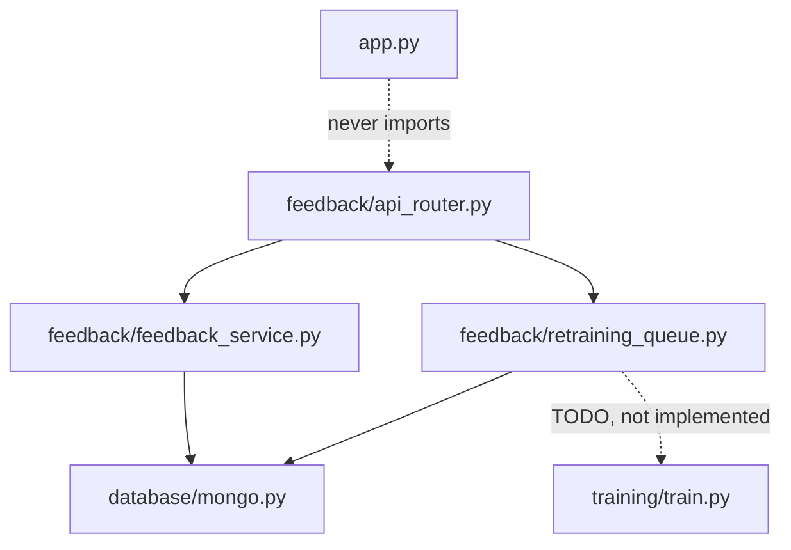
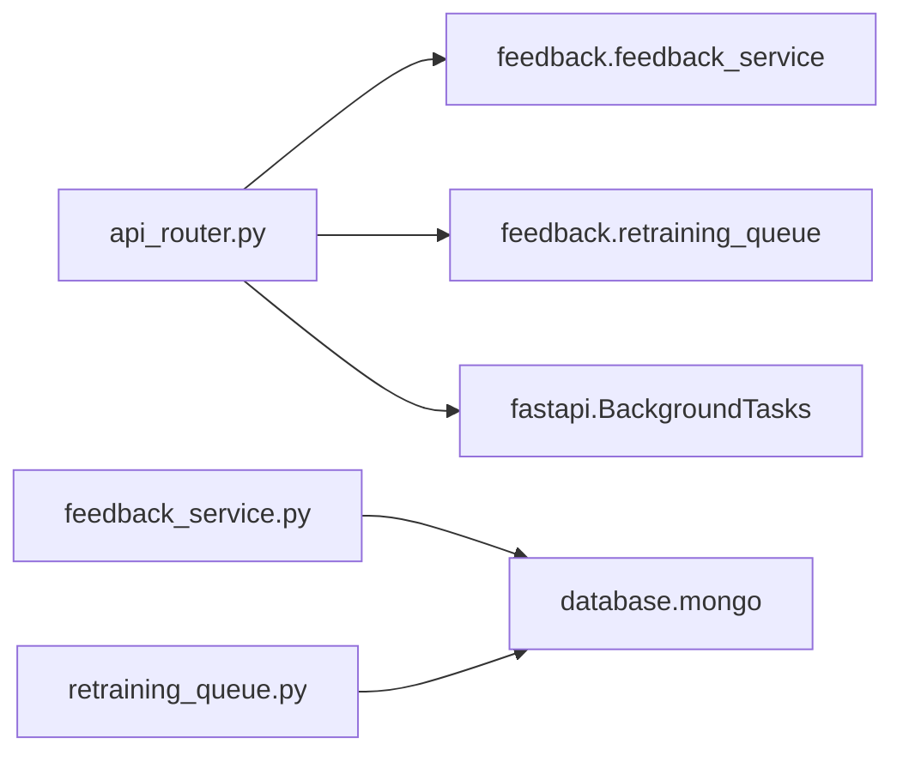
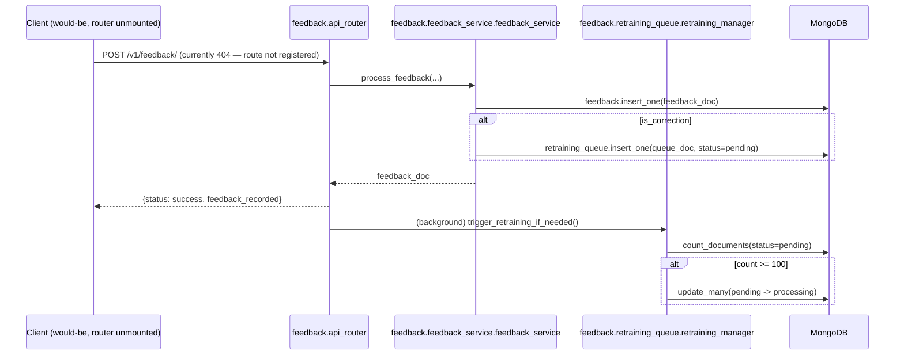

# Folder: `feedback/`

## Purpose
Phase 10's human-in-the-loop correction capture: log every human confirmation/correction of a prediction, and track when enough corrections have accumulated to justify retraining. Also holds a router that, notably, is never mounted onto the running app.

## Responsibilities
- Persist every feedback event (correction or confirmation) to `feedback`, and route actual corrections into `retraining_queue` (`feedback_service.py`).
- Track the retraining queue's size against a batch threshold and flip records to `"processing"` when the threshold is met (`retraining_queue.py`).
- Expose an HTTP endpoint for submitting feedback (`api_router.py`) — **defined but not connected to the running application**.

## Why this folder exists
This folder represents the "active learning loop" half of the system: the mechanism by which real-world corrections are supposed to feed back into future model improvements (`training/`). Keeping the HTTP-facing router (`api_router.py`) inside the same folder as its service logic (rather than in `routers/` alongside the other routers) is a minor structural inconsistency in this codebase, but conceptually groups "everything about the feedback feature" in one place.

## How it interacts with other folders
`feedback_service.py` and `retraining_queue.py` both depend on `database/mongo.py`. `api_router.py` depends on both service files in this folder. **No other folder calls into `feedback/`, and — critically — `app.py` never imports or mounts `feedback.api_router`**, meaning this entire folder is unreachable from outside a direct Python import (e.g., `test_api.py` hits `/v1/feedback/` and gets a 404, since the route was never registered). `feedback/retraining_queue.py`'s `TODO` comment references `training/train.py`'s `BaselineTrainer`, but no actual import or call connects the two folders.

## Major files
| File | Reachability |
|---|---|
| `api_router.py` | Defines `router` fully; **never mounted** in `app.py` |
| `feedback_service.py` | Fully functional, reachable only via the unmounted router |
| `retraining_queue.py` | Fully functional up to its `TODO`, reachable only via the unmounted router's background task |

## Important classes
- **`FeedbackService`** — singleton `feedback_service`; one public async method.
- **`RetrainingQueueManager`** — singleton `retraining_manager`; holds `batch_threshold = 100`.

## Important functions
- **`FeedbackService.process_feedback(transaction_id, original_prediction, corrected_category, confidence, user_id="system_user")`** — computes `is_correction` by string inequality, always writes to `feedback`, conditionally writes to `retraining_queue` via `_queue_for_retraining`.
- **`RetrainingQueueManager.check_retraining_status()`** — counts `status: "pending"` documents, compares to `batch_threshold`.
- **`RetrainingQueueManager.trigger_retraining_if_needed()`** — if threshold met, marks all pending records `"processing"`; stops there (the `TODO` marks the unfinished Celery/training hookup).
- **`submit_feedback` (router handler)** — calls `process_feedback`, then (if a correction) schedules `trigger_retraining_if_needed` as a FastAPI `BackgroundTask` so the retraining check doesn't block the response.

## Execution order
Intended per-request order (if mounted): `submit_feedback` → `feedback_service.process_feedback` (awaited, synchronous with the response) → response returned to client → **after** the response is sent, the `BackgroundTasks` runs `retraining_manager.trigger_retraining_if_needed` → if threshold met, a batch of records transitions `"pending" → "processing"` and then nothing further happens.

## Dependency graph

## Call graph

## Potential interview questions
- "Why is `POST /v1/feedback/` unreachable, and how would you discover this without being told?" (Grep `app.py` for `include_router` calls and `feedback` imports — neither exists. This is exactly the kind of gap that's invisible from reading `feedback/api_router.py` in isolation, since the file looks complete and correct on its own.)
- "`test_api.py::test_feedback_triggers_retraining_queue` only asserts inside `if response.status_code == 200:`. What does this mean for CI signal quality?" (The test passes trivially when the endpoint 404s, giving false confidence that the feature is tested when it's actually never exercised — a good example of why loose assertions can mask missing functionality.)
- "Why does `trigger_retraining_if_needed` mark records `'processing'` before actually launching a training job?" (To prevent double-processing if the check runs again — e.g., from a second concurrent correction — before a real training job existed; it's defensive locking for a step that was never finished.)
- "What happens to records stuck in `'processing'` state forever, given nothing ever moves them to `'completed'`?" (They become permanently invisible to `check_retraining_status`'s `status: "pending"` count, meaning a second batch of 100 corrections would need to accumulate from zero before triggering again — a silent, permanent backlog with no visibility or recovery path.)
- "If asked to wire this up end-to-end, what's the shortest path?" (Mount the router in `app.py`; replace the `TODO` with an actual call — even a synchronous `BaselineTrainer().run_benchmarks()` call would technically "close the loop," though a real system would want this off the request-handling process entirely.)

## Common mistakes
- Assuming `POST /v1/feedback/` works because the code for it exists and looks correct — always check `app.py`'s `include_router` calls before trusting a router file's reachability.
- Assuming `trigger_retraining_if_needed` actually retrains a model — it only changes a MongoDB field's value.
- Assuming feedback records where the human *confirmed* the prediction (no correction) also enter the retraining queue — only actual corrections (`is_correction=True`) do; confirmations are logged to `feedback` but otherwise ignored.
- Assuming `user_id` in feedback records reflects who submitted it — it's always `"system_user"`, since no caller overrides the default.

## Why this design is good
- Separating "record what happened" (`feedback_service`) from "decide whether to act on the backlog" (`retraining_queue`) means the feedback-logging path is never slowed down or coupled to retraining-trigger logic — a correction is durably saved even if the retraining-check step were to fail or be removed entirely.
- Using `BackgroundTasks` for the retraining-threshold check is the correct FastAPI pattern for "do this after responding, don't make the client wait" — a good instinct even though the thing it triggers isn't finished.
- Marking records `"processing"` before any real training starts is a reasonable defensive pattern against double-processing, even in its currently-incomplete form.

## If this folder disappeared
Given the router is already unmounted, removing this folder would have **zero impact on the live HTTP surface** — nothing currently reachable depends on it. The impact would be conceptual/future: there would be no code at all implementing the active-learning feedback loop described in `README.md`'s tech-stack narrative, and `test_api.py::test_feedback_triggers_retraining_queue` would need to be removed or rewritten since its import target would vanish (though the test itself doesn't import from `feedback/` directly — it only hits the HTTP endpoint, so it would continue to "pass" trivially via 404 either way).
