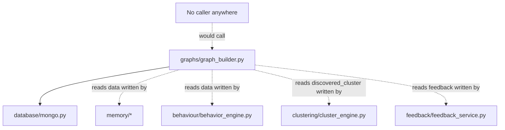
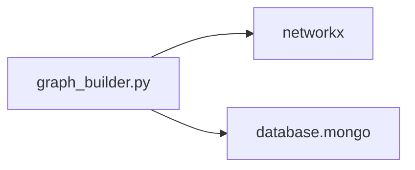
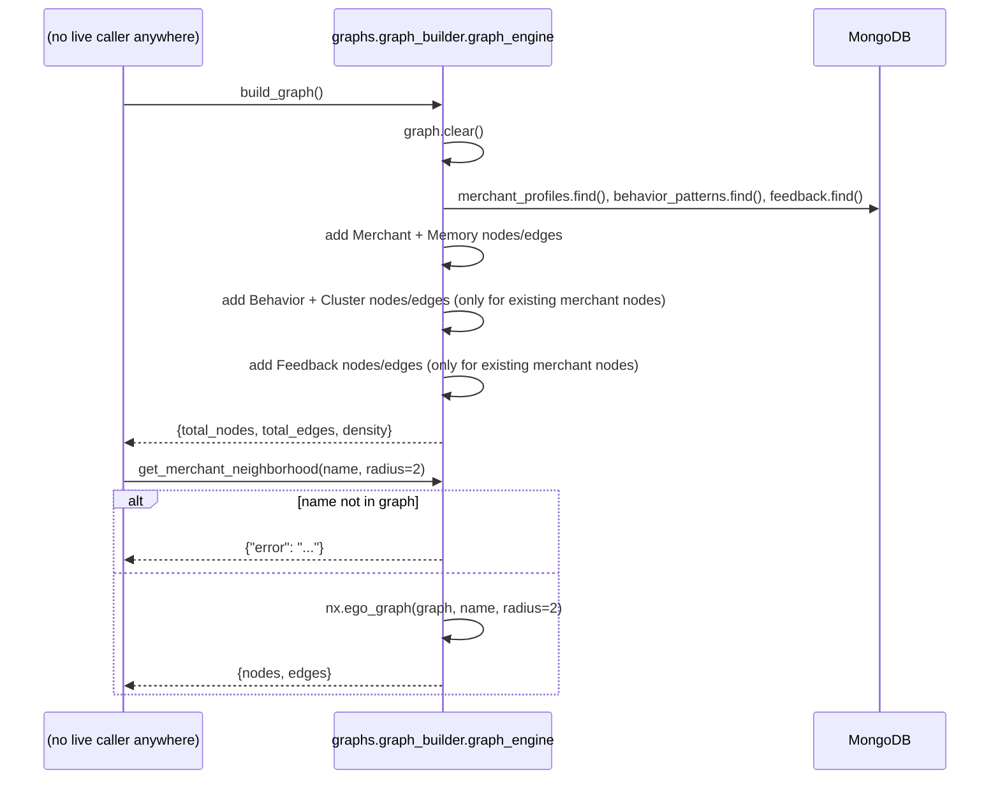

# Folder: `graphs/`

## Purpose
A cross-phase knowledge-graph model built on NetworkX, tying together merchants, their memory states, behavioral fingerprints, cluster assignments, and human feedback into one relational graph. The most architecturally isolated folder in the entire codebase.

## Responsibilities
- Build a directed graph from three MongoDB collections (`merchant_profiles`, `behavior_patterns`, `feedback`) in one pass.
- Compute basic graph topology metrics (node/edge counts, density).
- Extract a local neighborhood ("ego graph") around a specific merchant for visualization or downstream context use.

## Why this folder exists
This folder represents a synthesis layer — a way of seeing relationships *across* the outputs of Phases 4, 6, 8, and 10 that none of those phases' own storage models expose directly (MongoDB documents are siloed per collection; this graph explicitly models the edges between them). Its existence signals an intended future capability — richer relationship-aware querying or visualization — that the rest of the codebase hasn't yet grown into.

## How it interacts with other folders
Depends on `database/mongo.py` (three unfiltered collection reads: `merchant_profiles`, `behavior_patterns`, `feedback`) and on data that `memory/`, `behaviour/`, `clustering/`, and `feedback/` would produce (via the `discovered_cluster` field written by `clustering/cluster_engine.py` and the `is_correction`/`prediction` fields written by `feedback/feedback_service.py`). **No other folder in the codebase imports or calls anything from `graphs/`** — it is a pure sink with no upstream caller, not even from the other disconnected batch modules that reference each other (e.g., `clustering/` doesn't know `graphs/` exists, and vice versa).

## Major files
| File | Role |
|---|---|
| `graph_builder.py` | `KnowledgeGraphBuilder` class, singleton `graph_engine` |

## Important classes
- **`KnowledgeGraphBuilder`** — holds one instance attribute, `self.graph = nx.DiGraph()`, rebuilt from scratch (`self.graph.clear()`) on every `build_graph()` call. The graph is held entirely **in memory** for the lifetime of the `graph_engine` singleton — it is never persisted to disk or a database.

## Important functions
- **`build_graph()`** (async) — fetches all three collections unfiltered, then constructs nodes/edges in a fixed dependency order: merchants + memory-state nodes first, then behavior/cluster nodes (only for merchants that already have a node), then feedback nodes (only if their predicted merchant is already a node). Returns `{total_nodes, total_edges, density}`.
- **`get_merchant_neighborhood(merchant_name, radius=2)`** — `nx.ego_graph(self.graph, merchant_name, radius=2)`, serialized to plain `{nodes: [...], edges: [...]}` dicts. Returns an error dict if the merchant isn't in the (already-built) graph.

## Execution order
`graph_engine = KnowledgeGraphBuilder()` is instantiated at import time with zero I/O (just an empty `DiGraph`). `build_graph()` must be called explicitly before `get_merchant_neighborhood()` can find anything — there's no lazy "build on first neighborhood query" behavior; calling the neighborhood method against a never-built (empty) graph simply returns the "not found" error for every merchant name.

## Dependency graph

## Call graph

## Potential interview questions
- "This is the single most disconnected module in the codebase — no caller anywhere, not even from other disconnected modules. How would you have found that during review?" (A reverse dependency search — grep for `graph_engine` or `graph_builder` across the entire repo outside this file; finding zero hits is the signal.)
- "Why does `build_graph()` only add a `Behavior`/`Cluster`/`Feedback` node if the corresponding merchant node already exists?" (It guarantees graph connectivity is meaningful — a behavior or feedback record for a merchant that was never routed through the memory engine has no verified identity to attach to, so silently dropping it avoids polluting the graph with orphaned nodes.)
- "The graph is rebuilt from scratch on every `build_graph()` call and never persisted. What are the implications of exposing this as a live endpoint?" (Every request would trigger three full unfiltered collection scans and a full graph reconstruction — fine for a small dataset, but a clear scaling concern; a real implementation would likely cache the graph and rebuild on a schedule or on data-change events rather than per-request.)
- "The code comment in `get_merchant_neighborhood` mentions extracting context 'for the Phase 12 RAG LLM.' Is that actually wired up?" (No — `rag/retriever.py` sources its context directly from MongoDB queries, not from this graph at all. This is aspirational, undelivered intent recorded only in a comment.)
- "How would you decide whether this folder is worth finishing, versus removing it as dead code?" (A reasonable product/engineering judgment call — worth probing whether the candidate would look for evidence of planned features (e.g., a graph-visualization UI, or graph-based RAG context) before deciding either way.)

## Common mistakes
- Assuming this graph is queryable via any HTTP endpoint — there is no router anywhere that exposes `build_graph()` or `get_merchant_neighborhood()`.
- Assuming the graph reflects live, up-to-date state — it's a point-in-time snapshot from whenever `build_graph()` was last called, held only in the `graph_engine` singleton's memory, lost entirely on process restart.
- Assuming a feedback record's absence from the graph means it wasn't recorded — it's simply because its predicted merchant name doesn't yet have a corresponding `Merchant` node (e.g., the merchant was never processed through `memory/memory_manager.py`).
- Confusing `discovered_cluster` (written by the currently-broken `clustering/cluster_engine.py`) with something this folder computes itself — `graphs/` only reads that field; it never computes clusters.

## Why this design is good
- Modeling cross-collection relationships as an explicit directed graph (rather than requiring ad hoc multi-collection joins scattered across the codebase) is a genuinely elegant way to represent "how everything connects" for a domain with naturally relational structure (a merchant *has* a memory state, *has* a behavior signature, *belongs to* a cluster, *receives* feedback).
- Using NetworkX's `ego_graph` for neighborhood extraction is an appropriate, well-tested way to get a bounded local view of a potentially large graph without writing custom BFS/traversal logic.
- Defensively requiring a merchant node to pre-exist before attaching behavior/feedback nodes keeps the graph's structure honest and prevents dangling, unverifiable nodes.

## If this folder disappeared
No impact whatsoever on the currently running application — nothing imports from `graphs/` anywhere in the codebase. The only loss would be to any future work intending to build on this foundation (e.g., a graph-visualization endpoint, or richer RAG context assembled from graph traversal instead of flat MongoDB lookups).
