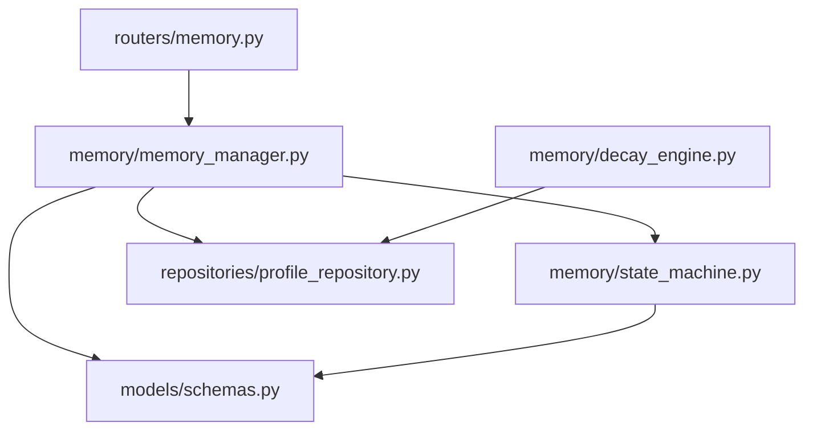
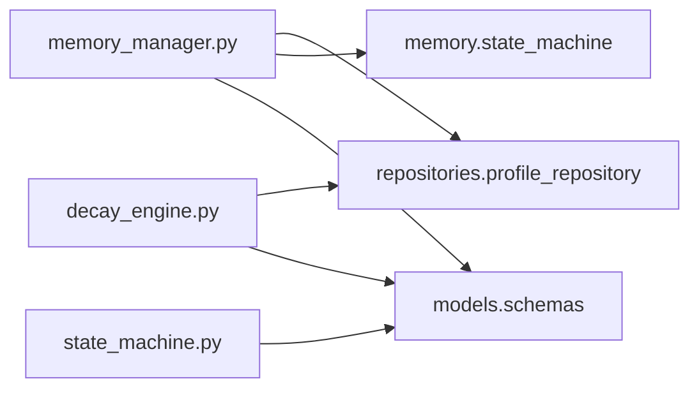
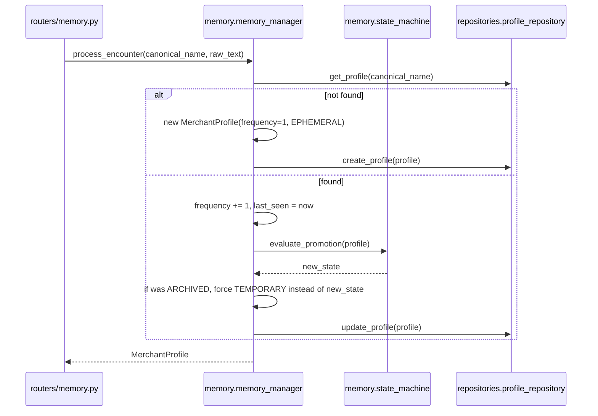

# Folder: `memory/`

## Purpose
Implements Phase 4's "trust must be earned" memory system: entities aren't treated as reliable the first time they're seen. This folder tracks how often an entity has been encountered and promotes it through a state machine as evidence accumulates.

## Responsibilities
- Orchestrate what happens on every entity encounter: create-or-update a profile, bump frequency, and evaluate state transitions (`memory_manager.py`).
- Encode the promotion rules themselves as a pure decision function (`state_machine.py`).
- Periodically demote long-inactive entities to `ARCHIVED` (`decay_engine.py`) — though nothing currently calls this.

## Why this folder exists
This is a genuinely distinct concern from persistence (`repositories/profile_repository.py` handles that) and from the schema itself (`models/schemas.py`). Splitting "what should happen on an encounter" (`memory_manager`), "what state should this entity be in given its history" (`state_machine`), and "when should stale entities be forgotten" (`decay_engine`) into three files is a clean separation of orchestration, policy, and maintenance concerns, respectively.

## How it interacts with other folders
`memory_manager.py` depends on `repositories/profile_repository.py` (for all persistence) and `memory/state_machine.py` (for the promotion decision) and `models/schemas.py`. `decay_engine.py` also depends on `repositories/profile_repository.py` directly. `routers/memory.py` is the sole HTTP-facing consumer of `memory_manager`. `rag/retriever.py` and `graphs/graph_builder.py` read `merchant_profiles` documents directly via `database.mongo.db` — bypassing this folder entirely — rather than going through `repositories/profile_repository.py`, meaning this folder's read path and other folders' read paths are not unified.

## Major files
| File | Role |
|---|---|
| `memory_manager.py` | `MemoryManager` — orchestrates encounter processing end to end |
| `state_machine.py` | `StateMachine` — pure promotion-decision logic |
| `decay_engine.py` | `DecayEngine` — archival sweep for inactive entities (never invoked) |

## Important classes
- **`MemoryManager`** — singleton `memory_manager`. Only method: `process_encounter`.
- **`StateMachine`** — singleton `state_machine`. Holds `TEMPORARY_THRESHOLD = 3`, `PERMANENT_THRESHOLD = 10`.
- **`DecayEngine`** — singleton `decay_engine`. Holds `ARCHIVE_DAYS = 180`.

## Important functions
- **`MemoryManager.process_encounter(canonical_name, raw_text)`** — the full lifecycle handler: fetch-or-create, increment frequency, append novel alias, evaluate promotion, apply the special `ARCHIVED → TEMPORARY` wake-up override, persist.
- **`StateMachine.evaluate_promotion(profile)`** — pure function of `profile.frequency` and `profile.memory_state`; `PERMANENT`/`ARCHIVED` are sticky (no further promotion computed for them); `frequency >= 10 → PERMANENT`; `frequency >= 3 → TEMPORARY`; else `EPHEMERAL`.
- **`DecayEngine.run_archive_sweep()`** — finds all non-archived profiles with `last_seen` older than 180 days and flips them to `ARCHIVED`, returning a count. No caller anywhere in the codebase.

## Execution order
Per encounter (`POST /memory/update`): `memory_manager.process_encounter` is called → it awaits `profile_repo.get_profile` → branches on existence → (if existing) synchronously calls `state_machine.evaluate_promotion` (no I/O, pure computation) → awaits `profile_repo.create_profile` or `update_profile`. The decay sweep, if ever invoked, would run independently and out-of-band (e.g., a cron job), with no interaction with `process_encounter` beyond both reading/writing the same `merchant_profiles` collection.

## Dependency graph

## Call graph

## Potential interview questions
- "Why does `MemoryManager` override the state machine's own output for `ARCHIVED` profiles instead of letting `evaluate_promotion` handle it?" (Because `evaluate_promotion` treats `ARCHIVED` as sticky by design — the override is a deliberate, separate business rule: "seeing an archived entity again means it's relevant again, so wake it to TEMPORARY, not back to EPHEMERAL despite its accumulated frequency." Worth probing whether resetting to TEMPORARY rather than re-evaluating from current frequency is the right call.)
- "What happens to `frequency` when an entity is archived and later reactivated?" (It's never reset — an entity archived at `frequency=50` and reactivated keeps `frequency=51` after the next encounter, immediately eligible for `PERMANENT` again on its very next natural evaluation, bypassing the `TEMPORARY` waiting period the override just forced it into.)
- "Why is `decay_engine.py` never called anywhere? What would you need to add to make it functional?" (A scheduler — cron, APScheduler, or a Celery beat task — since nothing in this synchronous-request-driven codebase currently runs background jobs on a timer.)
- "Is `evaluate_promotion` safe to call concurrently for the same merchant from two simultaneous requests?" (No explicit locking exists; `get_profile` → mutate → `update_profile` is a read-modify-write with no optimistic concurrency control, so two concurrent encounters for the same merchant could race and one increment could be lost.)

## Common mistakes
- Assuming `state_machine.evaluate_promotion` can *demote* a profile — it only ever promotes or holds steady; demotion for inactivity is `decay_engine`'s job (and that's disconnected).
- Assuming reactivating an `ARCHIVED` profile resets its `frequency` — it doesn't, which can cause it to jump straight back toward `PERMANENT` faster than a genuinely new entity would.
- Calling `decay_engine.run_archive_sweep()` expecting it to run automatically — it must be invoked manually or wired into a scheduler; nothing does this today.
- Assuming this folder is the only path that reads/writes `merchant_profiles` — `rag/retriever.py` and `graphs/graph_builder.py` also read that collection directly via `database.mongo.db`, bypassing `repositories/profile_repository.py`'s abstraction.

## Why this design is good
- Separating the promotion *policy* (`state_machine.py`) from the encounter *orchestration* (`memory_manager.py`) makes the threshold logic independently testable and easy to tune (change `TEMPORARY_THRESHOLD`/`PERMANENT_THRESHOLD` in one place) without touching persistence or request-handling code.
- The "trust must be earned" state machine is a sound design principle for noisy, high-volume ingestion — it prevents a single mis-parsed or fraudulent-looking entity from immediately being treated as a stable, well-known merchant for analytics or RAG purposes.
- Making `evaluate_promotion` a pure function (no I/O, no side effects) means it's trivial to unit test exhaustively across all `(frequency, current_state)` combinations, even though no such tests currently exist.

## If this folder disappeared
`routers/memory.py` would fail to import (`from memory.memory_manager import memory_manager`), taking down the `/memory` router and `app.py` startup. There would be no way to track how often an entity has been seen or to distinguish a one-off noisy string from a recurring, trusted merchant — every entity would need to be treated with equal (un)certainty, undermining the confidence-wall philosophy the rest of the system relies on. `rag/retriever.py` and `graphs/graph_builder.py` would still be able to read `merchant_profiles` directly (they don't call into this folder), but no new profiles would ever be created or updated, so those reads would return increasingly stale data.
