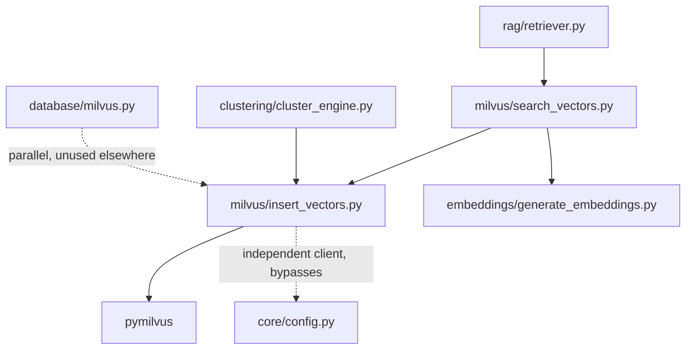
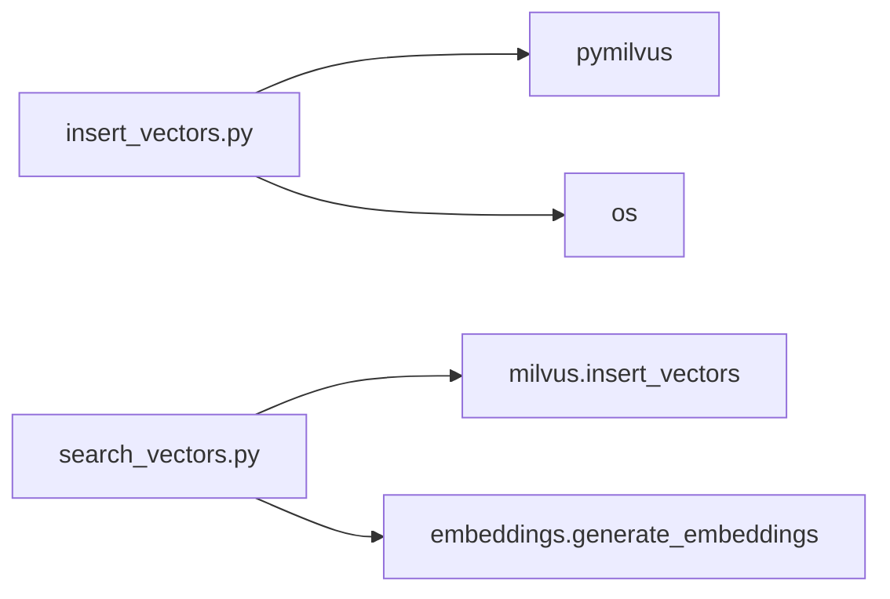
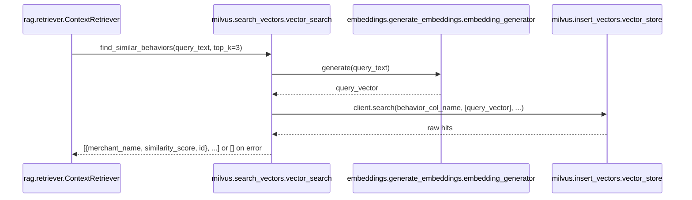

# Folder: `milvus/`

## Purpose
The actual, live-traffic-serving Milvus vector store integration: collection/index management, vector insertion, and semantic search. Despite `database/milvus.py` also existing and being connected via the app's `lifespan`, **this folder — not that one — is what every real Milvus read/write in the system goes through.**

## Responsibilities
- Define and lazily create the `behavior_vectors` collection and its HNSW index (`insert_vectors.py`).
- Provide an upsert method for writing a merchant's behavior embedding (`insert_vectors.py`).
- Embed a query string and perform a cosine-similarity search against stored vectors (`search_vectors.py`).

## Why this folder exists
This folder groups "everything needed to actually use Milvus as a working vector index," as opposed to `database/milvus.py`, which only manages a bare client connection for lifecycle/health-check purposes. The split appears to be an artifact of iterative development rather than a deliberate architectural boundary — see Known Issues for the resulting duplication.

## How it interacts with other folders
`insert_vectors.py` constructs its own `MilvusClient` directly from `os.getenv("MILVUS_URI", ...)`, bypassing `core.config.settings` and `database.milvus.vector_db` entirely. `search_vectors.py` depends on `insert_vectors.py` (for the shared `vector_store` client/collection handle) and `embeddings.generate_embeddings` (to embed the query text). `clustering/cluster_engine.py` reads directly from `vector_store.behavior_collection` (note: the actual attribute is `vector_store.client`/`vector_store.behavior_col_name`, not `behavior_collection` — see Common Mistakes). `rag/retriever.py` depends on `search_vectors.vector_search` for the live semantic-search step behind `/v1/explain`.

## Major files
| File | Role |
|---|---|
| `insert_vectors.py` | `VectorStoreManager` — collection/index lifecycle + upsert, singleton `vector_store` |
| `search_vectors.py` | `VectorSearchEngine` — query-time semantic search, singleton `vector_search` |

## Important classes
- **`VectorStoreManager`** — constructs a `MilvusClient` at `__init__` (import time), ensures the `behavior_vectors` collection and its HNSW index exist (`_ensure_collections`), then loads the collection into memory.
- **`VectorSearchEngine`** — no constructor state; wraps embedding + search + result formatting in one method.

## Important functions
- **`VectorStoreManager._ensure_collections()`** — idempotent create-if-missing: `VARCHAR(255)` primary key `id`, `VARCHAR(255)` `merchant_name`, `FLOAT_VECTOR(768)` `embedding`; HNSW index with `metric_type=COSINE`, `M=8`, `efConstruction=200`; always ends with `load_collection`.
- **`VectorStoreManager.insert_behavior_vector(pattern_id, merchant_name, vector)`** — `upsert` (not plain insert), so re-embedding an existing merchant safely overwrites its old vector.
- **`VectorSearchEngine.find_similar_behaviors(query_text, top_k=3)`** (async) — embed → `client.search(collection_name, data=[vector], limit=top_k, output_fields=["merchant_name"], search_params={"metric_type": "COSINE", "params": {"ef": 64}})` → reshape hits to `{merchant_name, similarity_score, id}`. Wraps the entire flow in `try/except Exception`, returning `[]` on any failure.

## Execution order
`VectorStoreManager()` runs at **import time** — the moment anything imports `milvus.insert_vectors` (directly, or transitively via `milvus.search_vectors` or `clustering.cluster_engine`), it attempts a live connection to Milvus and, if needed, synchronously creates the collection and index. This means the very first import of the RAG router chain (`app.py → routers.rag → rag.retriever → milvus.search_vectors → milvus.insert_vectors`) can block on or fail against a Milvus that isn't ready yet.

## Dependency graph

## Call graph

## Potential interview questions
- "Why does this codebase have both `database/milvus.py` and `milvus/insert_vectors.py`, each with their own `MilvusClient`?" (No good reason — organic duplication; `database.milvus.vector_db` is managed by the app lifespan but never actually used for reads/writes, while `milvus.insert_vectors.vector_store` does all the real work but bypasses `core.config.settings`, reading `MILVUS_URI` via `os.getenv` directly. This is a strong signal to consolidate into one client.)
- "What happens if `MILVUS_URI` is set correctly in `.env` (read by `core.config.settings`) but the equivalent process environment variable isn't separately exported?" (`VectorStoreManager` would silently fall back to its hardcoded default `http://localhost:19530`, since it reads `os.getenv` directly rather than through `core.config`, which loads `.env` via `pydantic-settings` — these are two different mechanisms for reading "the same" variable.)
- "Why is `insert_behavior_vector` an `upsert` rather than a plain `insert`?" (Behavior patterns are recomputed and re-embedded periodically per merchant; an upsert keyed by a stable `pattern_id` avoids accumulating duplicate stale vectors for the same entity.)
- "`find_similar_behaviors` catches every exception and returns `[]`. What's the risk of that broad a catch?" (It silently masks real infrastructure problems — a misconfigured collection name, a dimension mismatch, or a genuinely down Milvus all look identical to "no semantic matches found" from the caller's perspective, making debugging harder.)

## Common mistakes
- Assuming `database.milvus.vector_db` is what backs `/v1/explain`'s semantic search — it's `milvus.insert_vectors.vector_store`, a completely separate client instance.
- Assuming `os.getenv("MILVUS_URI", ...)` in `insert_vectors.py` reads the same value as `core.config.settings.MILVUS_URI` — they're both reading an environment variable named `MILVUS_URI`, but through different loading mechanisms (`pydantic-settings` `.env` loading vs. raw `os.getenv`), which can diverge depending on how the process environment is actually populated.
- Referencing `vector_store.behavior_collection` — the real attributes are `vector_store.client` (the `MilvusClient`) and `vector_store.behavior_col_name` (the collection name string); there is **no `behavior_collection` attribute defined anywhere in `VectorStoreManager`**. `clustering/cluster_engine.py` line 25 calls exactly `vector_store.behavior_collection.query(...)`, which would raise `AttributeError` at runtime — a second, independent bug in the clustering pipeline beyond the `davies_bouldin_index` import error documented in `docs/folders/clustering.md` and `docs/16-known-issues-tech-debt.md`. The import error currently masks this one, since the module fails to load before this line would ever execute.
- Assuming a similarity search returning `[]` means "no data exists" — it could equally mean an exception was silently swallowed.

## Why this design is good
- Lazily creating the collection/index on first use (`_ensure_collections`) means there's no separate manual provisioning step required for Milvus schema setup — the application is self-provisioning for this one collection.
- Using HNSW with COSINE metric is a sound, standard choice for semantic (embedding) similarity search at moderate scale, and the `M`/`efConstruction` parameters chosen are reasonable defaults for a small-to-medium vector count.
- Broad exception handling in `find_similar_behaviors` means a Milvus outage degrades the RAG pipeline to "no context available" (a safe, honest fallback) rather than a hard 500 error for the whole `/v1/explain` endpoint.

## If this folder disappeared
`rag/retriever.py` would fail to import (`from milvus.search_vectors import vector_search`), breaking `/v1/explain` entirely. `clustering/cluster_engine.py` would fail to import (`from milvus.insert_vectors import vector_store`), which already can't run due to its own separate `davies_bouldin_index` bug, but would compound the breakage. There would be no way to store or query any vector embeddings at all — the entire semantic-search dimension of the system (as opposed to the deterministic rule-engine and database-lookup resolution paths) would cease to exist.
