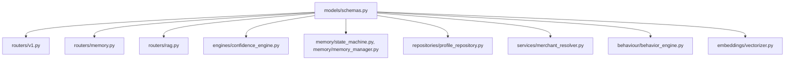
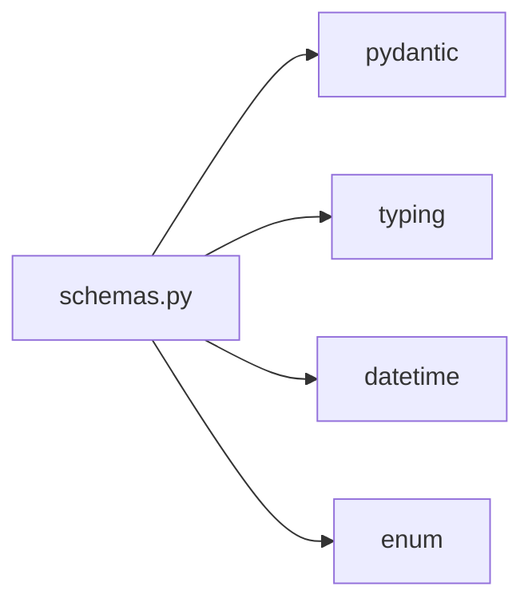

# Folder: `models/`

## Purpose
The single shared vocabulary of the system: every Pydantic schema, enum, and data-transfer object used across routers, engines, and services lives here, in one file.

## Responsibilities
- Define request/response contracts for the HTTP API (`CategorizeRequest`, `CategorizeResponse`, `ResolutionResult`, `ConfidenceEvaluation`).
- Define domain entities that map (loosely — see caveats) to MongoDB documents (`Merchant`, `Category`, `Transaction`, `Feedback`, `MerchantProfile`, `BehaviorPattern`).
- Define closed vocabularies via enums (`MemoryState`, `TransactionCategory`).

## Why this folder exists
Centralizing schemas prevents every router and service from defining its own ad hoc dict shapes, and gives FastAPI automatic request validation, OpenAPI schema generation, and response serialization for free. A single `models/schemas.py` (rather than per-feature model files) keeps the domain vocabulary in one place that's easy to audit for consistency — though as documented below, that consistency isn't fully realized in practice.

## How it interacts with other folders
Almost every other folder imports from `models.schemas`: `routers/` (all four routers), `engines/` (`rule_engine` implicitly via dict shape, `confidence_engine` directly), `memory/` (`state_machine`, `memory_manager`), `repositories/`, `services/merchant_resolver.py`, `behaviour/behavior_engine.py`, `embeddings/vectorizer.py`. It has **zero outgoing dependencies** on any other application folder — only `pydantic`, `typing`, `datetime`, `enum` from the standard library/third-party. This makes `models/` a true leaf dependency — everything depends on it, it depends on nothing internal.

## Major files
| File | Role |
|---|---|
| `schemas.py` | Every Pydantic model and enum in the system (116 lines) |
| `__init__.py` | Empty — package marker only |

## Important classes
- **`CoreModel(BaseModel)`** — base class setting `populate_by_name=True, arbitrary_types_allowed=True`; every other model inherits from it.
- **`MerchantProfile`** — the richest model in the system; backs the entire memory engine (`memory_state`, `frequency`, `first_seen`/`last_seen`, `aliases`).
- **`BehaviorPattern`** — the output contract of the feature-extraction pipeline (`avg_amount`, `periodicity_score`, `entropy_score`, distributions).
- **`MemoryState(str, Enum)`** — `EPHEMERAL`, `TEMPORARY`, `PERMANENT`, `ARCHIVED`.
- **`TransactionCategory(str, Enum)`** — the closed category vocabulary enforced by the confidence engine: `Food, Travel, Entertainment, Bills, Friends, Education, Healthcare, Unknown`.
- **`ConfidenceEvaluation`**, **`ResolutionResult`** — output contracts for the confidence wall and merchant resolver respectively.

## Important functions
None — this file contains only class/enum declarations, no free functions. Default-factory lambdas (e.g. `Field(default_factory=lambda: datetime.now(timezone.utc))`) are the closest thing to logic here.

## Execution order
Schemas are pure declarations with no side effects at import time (unlike `core/config.py` or `core/ollama_client.py`) — importing `models.schemas` never fails due to missing environment configuration or network state. It is always safe to import first, and typically is, transitively, by nearly every other module.

## Dependency graph

No internal (intra-repo) dependencies whatsoever — the only leaf node in the entire dependency graph with in-degree from most folders and out-degree zero.

## Call graph
Not applicable in the traditional sense — there are no functions to call, only types to instantiate/validate. The "call graph" here is really an instantiation graph: every `SomeModel(...)` construction across the codebase is a touchpoint with this folder.

## Potential interview questions
- "Why does `Merchant` (with a `name` field) not match what's actually stored in the `merchants` collection (which uses `canonical_name`)?" (Tests whether the candidate notices schema drift between declared models and actual persisted documents — see Known Issues; `Merchant` is effectively vestigial.)
- "`TransactionCategory` doesn't include `Subscription`, `Shopping`, or `Utility`, but other parts of the system produce those strings. What breaks?" (Anything routed through `ConfidenceEngine.evaluate()` with one of those categories gets force-rejected to `Unknown` as "invalid.")
- "Why put every schema in one file instead of splitting by domain (`transaction_schemas.py`, `memory_schemas.py`, etc.)?" (Trade-off: simplicity and single-source-of-truth for a small system vs. file-size/cohesion concerns as the system grows — 116 lines is still comfortably readable in one file.)
- "Since Mongo is schemaless and these models aren't validated against inserted documents, what value do they actually provide?" (API-boundary validation/serialization via FastAPI, and IDE/type-checker support — but not database-level guarantees, which is a real gap.)

## Common mistakes
- Assuming a Pydantic model here enforces what's actually in MongoDB — it doesn't; Motor reads/writes raw dicts, and several models (`Transaction`, `Feedback`) are missing fields (`user_id`, `is_mock`, `is_correction`) that are actually persisted.
- Adding a new category string (e.g. in `merchant_aliases.json`) without adding it to `TransactionCategory` — silently breaks confidence evaluation for that category.
- Forgetting `populate_by_name=True` matters when constructing a model from a dict keyed by `_id` vs. `id` — `CoreModel` handles this, but any new base class wouldn't automatically.

## Why this design is good
- A single shared schema module is easy to grep, easy to onboard from, and guarantees there's exactly one definition of "what a `MerchantProfile` looks like" — no risk of two slightly different `MerchantProfile` classes drifting apart in different routers.
- Using `str, Enum` (rather than plain `Enum`) for `MemoryState` and `TransactionCategory` means these enums serialize to plain strings in JSON automatically, which is exactly what FastAPI/Pydantic response serialization needs with no extra encoder configuration.
- Zero internal dependencies makes this folder trivially safe to import from anywhere without circular-import risk — an important property for a shared-vocabulary module.

## If this folder disappeared
Total, immediate failure across the entire codebase. Every router, every engine, `memory/`, `repositories/`, `services/merchant_resolver.py`, `behaviour/behavior_engine.py`, and `embeddings/vectorizer.py` import from `models.schemas` — all would fail with `ModuleNotFoundError` at their own import time, which cascades through `app.py`'s router includes. There would be no request/response validation, no OpenAPI schema, and no shared vocabulary for what a "merchant," "transaction," or "confidence evaluation" even means structurally.
