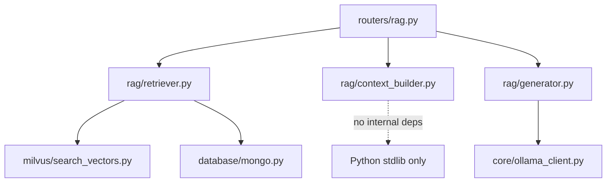
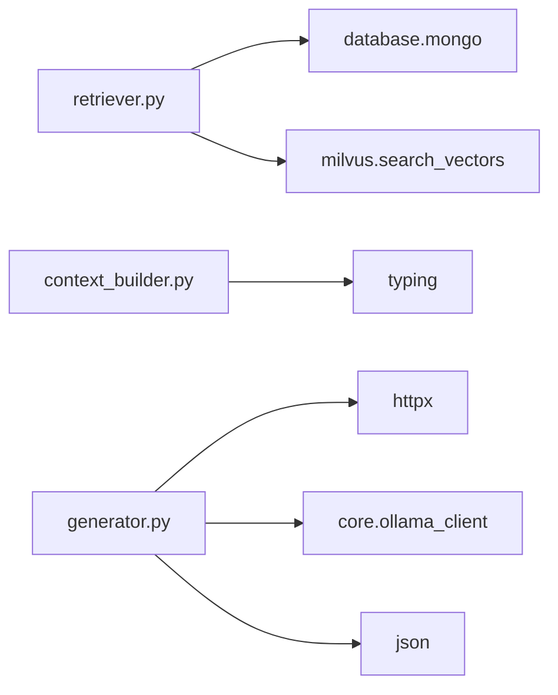
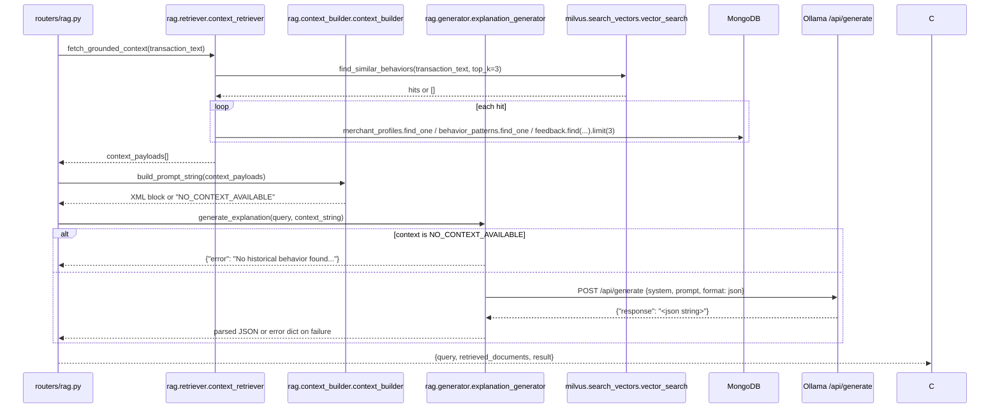

# Folder: `rag/`

## Purpose
Phase 12's grounded explainability pipeline — the one Ollama-dependent, semantic-search-dependent feature that is fully implemented and fully wired end-to-end to a live endpoint (`POST /v1/explain`). Retrieves structured evidence about a merchant and asks an LLM to explain a categorization using *only* that evidence.

## Responsibilities
- Retrieve grounded context: semantic search in Milvus, then structured lookups in MongoDB for each matched merchant (`retriever.py`).
- Format that context into an unambiguous, LLM-friendly prompt block (`context_builder.py`).
- Call the LLM with a strict system prompt and JSON-mode decoding, parse and return its structured answer (`generator.py`).

## Why this folder exists
This is a textbook three-stage RAG (Retrieval-Augmented Generation) pipeline, and the folder's internal structure mirrors that textbook shape exactly: one file per stage. Isolating "how do we find relevant data," "how do we present it to a model," and "how do we talk to the model and enforce its output contract" makes each concern independently swappable — e.g., the vector-search backend could change without touching prompt formatting, or the prompt format could be redesigned without touching retrieval logic.

## How it interacts with other folders
`retriever.py` depends on `milvus/search_vectors.py` (semantic search) and `database/mongo.py` (structured lookups against `merchant_profiles`, `behavior_patterns`, `feedback`). `generator.py` depends on `core/ollama_client.py` for the resolved LLM host/model name. `context_builder.py` has zero external dependencies beyond the standard library. `routers/rag.py` is the sole consumer, orchestrating all three stages inline in its `explain_transaction` handler.

## Major files
| File | Stage | Role |
|---|---|---|
| `retriever.py` | 1. Retrieve | `ContextRetriever`, singleton `context_retriever` |
| `context_builder.py` | 2. Build | `ContextBuilder`, singleton `context_builder` |
| `generator.py` | 3. Generate | `ExplanationGenerator`, singleton `explanation_generator` |

## Important classes
- **`ContextRetriever`** — one async method combining a vector search and three follow-up Mongo lookups per hit.
- **`ContextBuilder`** — static method only, no state.
- **`ExplanationGenerator`** — holds `self.api_url` (computed from `OLLAMA_HOST` at construction) and `self.system_prompt` (the hallucination-prevention contract).

## Important functions
- **`ContextRetriever.fetch_grounded_context(query_text, top_k=3)`** — embeds and searches via Milvus; for each hit, fetches `merchant_profiles`, `behavior_patterns`, and the 3 most recent `feedback` records where `prediction == merchant_name`; returns `[]` immediately if no semantic matches.
- **`ContextBuilder.build_prompt_string(context_data)`** — formats each merchant's data as a `<MERCHANT_DATA>` pseudo-XML block; returns the literal string `"NO_CONTEXT_AVAILABLE"` if given an empty list.
- **`ExplanationGenerator.generate_explanation(query, context_string)`** — short-circuits to an error dict (no network call) if `context_string == "NO_CONTEXT_AVAILABLE"`; otherwise POSTs to Ollama with `format: "json"` and parses the model's JSON response, catching all exceptions into a generic error dict.

## Execution order
Strict, non-branching pipeline within a single request: `fetch_grounded_context` (async, potentially multiple sequential Mongo round trips per matched merchant) → `build_prompt_string` (synchronous, no I/O) → `generate_explanation` (async, one HTTP call to Ollama, unless short-circuited by empty context). All three singletons are instantiated at import time; `ExplanationGenerator`'s constructor transitively depends on `core.ollama_client`'s import-time host resolution having already succeeded.

## Dependency graph

## Call graph

## Potential interview questions
- "Why does `build_prompt_string` use a hand-rolled pseudo-XML format instead of just dumping JSON into the prompt?" (Clear, unambiguous delimiters help keep an LLM "on rails" and reduce the chance it confuses structured data with conversational instructions — a common prompt-engineering pattern, though not empirically validated in this codebase.)
- "Walk me through every layer of hallucination defense in this pipeline." (1. Retrieval returns `[]` if nothing semantically relevant is found. 2. `build_prompt_string` converts that into the sentinel `"NO_CONTEXT_AVAILABLE"`. 3. `generate_explanation` checks for that sentinel and skips calling the LLM entirely. 4. If the LLM *is* called, the system prompt explicitly instructs it to output an error JSON if the context is insufficient. 5. `format: "json"` constrains decoding to valid JSON syntax at the model level, not just via instruction.)
- "Why does `<HUMAN_CORRECTIONS>` only report a count of feedback records, not their content?" (Simplification — the LLM can know "this merchant has been corrected before" but not *what* the correction was, limiting how specifically it can reference past corrections in its explanation. A good follow-up: how would you change `context_builder.py` to include the actual correction detail?)
- "Why is `fetch_grounded_context` making up to `top_k * 3` sequential Mongo round trips (profile + behavior + feedback per hit) instead of batching?" (Simplicity over performance at this pipeline's current scale — a production version might batch these into `$in` queries, but for `top_k=3` the sequential cost is small.)
- "If Ollama returns syntactically valid JSON but semantically wrong data (e.g., the wrong schema keys), what happens?" (Nothing validates the *shape* of the parsed JSON against the expected `{explanation, confidence_in_explanation, primary_data_source}` schema — it's returned to the client as-is; a malformed-but-valid-JSON response would pass through unchecked.)

## Common mistakes
- Assuming this pipeline can produce a plausible-but-fabricated explanation — its entire design is built specifically to prevent that by refusing to proceed without grounded data, at the cost of coverage (it will say "insufficient data" a lot in practice, given the embedding-write pipeline that would populate Milvus is disconnected — see `docs/folders/embeddings.md` and `docs/folders/milvus.md`).
- Assuming `retrieved_documents` in the API response counts feedback records or behavior patterns — it's actually just `len(raw_context)`, i.e., the number of *merchants* matched by the initial vector search.
- Assuming a Milvus or Ollama outage returns a 500 error — both are caught and converted into softer degraded responses (`[]` from Milvus search, an error dict from generation) rather than propagating exceptions.
- Forgetting that `generate_explanation`'s 30-second timeout is specifically for the *generation* call — the earlier *embedding* call (inside retrieval) has its own, shorter, 15-second timeout, set in `embeddings/generate_embeddings.py`.

## Why this design is good
- The strict retrieve → build → generate separation with an explicit "no context, no generation" short-circuit is a genuinely strong architectural choice for a system that must not hallucinate financial explanations — most naive RAG implementations skip this and call the LLM regardless of retrieval quality.
- Using the model provider's native structured-output mode (`format: "json"`) as a second, model-level enforcement layer on top of prompt instructions is a best-practice approach — instructions alone are not a reliable output-format guarantee.
- Keeping each stage's class free of the others' concerns (retriever doesn't know about prompt formatting; generator doesn't know where context came from) means any one stage can be tested or replaced independently.

## If this folder disappeared
`routers/rag.py` would fail to import (`from rag.retriever import context_retriever`, etc.), removing `/v1/explain` — the single most complete, correctly-implemented, hallucination-resistant feature in the codebase — from the API surface entirely. There would be no way to generate a natural-language explanation of a transaction categorization grounded in retrieved data anywhere in the system.
