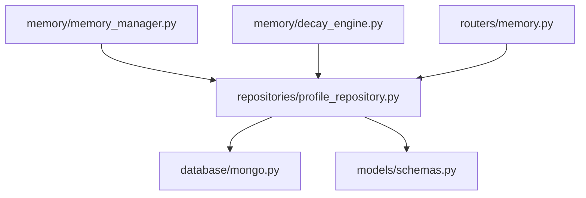
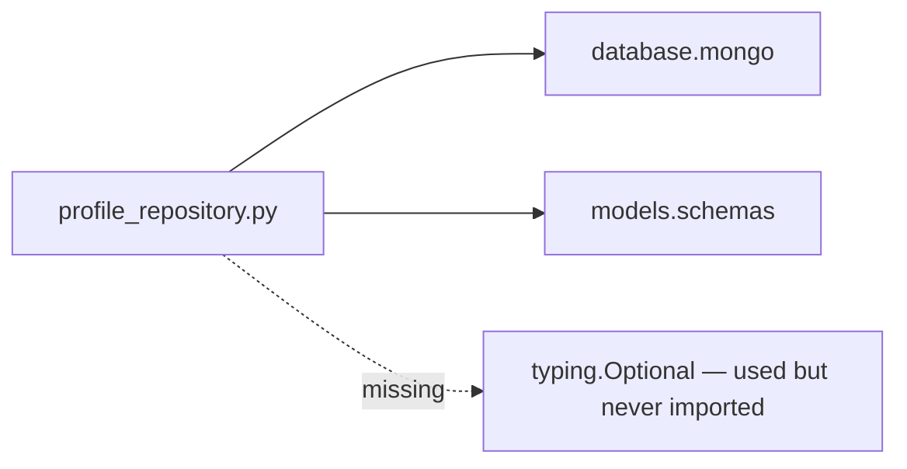
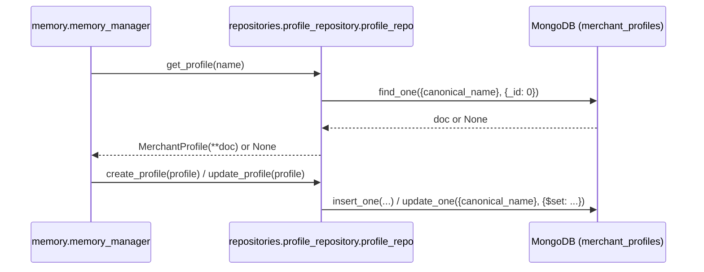

# Folder: `repositories/`

## Purpose
The persistence abstraction layer for merchant memory profiles — the single place that translates `MerchantProfile` Pydantic models to and from MongoDB documents in the `merchant_profiles` collection.

## Responsibilities
- CRUD operations for `MerchantProfile`: `get_profile`, `create_profile`, `update_profile`.
- Query support for the decay sweep: `get_stale_profiles(cutoff_date)`.
- Enforce which fields are immutable after creation (`first_seen`, `canonical_name` are excluded from `update_profile`'s `$set`).

## Why this folder exists
This is the Repository pattern: it exists so that `memory/memory_manager.py` (and `memory/decay_engine.py`) never construct a raw MongoDB query themselves — they ask for a profile by name and get a typed `MerchantProfile` back, or hand one over to be saved. This is the only folder in the codebase that implements this pattern explicitly (every other feature folder that touches Mongo — `analytics/`, `services/`, `rag/`, `feedback/` — queries `database.mongo.db` directly with raw dicts/aggregation pipelines, without a repository seam). That inconsistency is itself worth noting: this folder represents a more disciplined data-access style that wasn't applied uniformly across the codebase.

## How it interacts with other folders
Depends on `database/mongo.py` (for the `db.merchant_profiles` collection handle) and `models/schemas.py` (for `MerchantProfile`, `MemoryState`). Consumed by `memory/memory_manager.py` and `memory/decay_engine.py` exclusively — `routers/memory.py` also calls `profile_repo.get_profile` directly for its two read-only endpoints (`GET /memory/profile/{name}`, `GET /memory/state/{name}`), meaning this folder has two distinct callers at different layers (router and domain-orchestration), which is a minor layering blur but not harmful given how thin the repository methods are.

## Major files
| File | Role |
|---|---|
| `profile_repository.py` | `ProfileRepository` class, singleton `profile_repo` |

## Important classes
- **`ProfileRepository`** — no constructor state beyond what Python gives for free; every method is a thin, direct wrapper around a single Motor call.

## Important functions
- **`get_profile(canonical_name) -> Optional[MerchantProfile]`** — `find_one({"canonical_name": ...}, {"_id": 0})`, projecting out `_id` entirely (so every returned `MerchantProfile.id` is `None`). **Currently broken at import time** — see Common Mistakes / Known Issues below.
- **`create_profile(profile)`** — `model_dump(by_alias=True, exclude={"id"})` then `insert_one`.
- **`update_profile(profile)`** — `model_dump(by_alias=True, exclude={"id", "first_seen", "canonical_name"})` then `update_one({"canonical_name": ...}, {"$set": ...})`; deliberately protects `first_seen` and `canonical_name` from being overwritten.
- **`get_stale_profiles(cutoff_date) -> list[MerchantProfile]`** — `find({"last_seen": {"$lt": cutoff_date}, "memory_state": {"$ne": "ARCHIVED"}})`, materialized as a list comprehension over the async cursor.

## Execution order
`profile_repo = ProfileRepository()` is instantiated at import time with zero side effects (no I/O, no state) — in principle safe to import anywhere. In practice, however, the file currently references `Optional` in a type annotation (`get_profile`'s return type) without importing it from `typing`, and without `from __future__ import annotations` — Python evaluates function annotations eagerly at `def` time, so **this raises `NameError` the instant the module is imported**, before `profile_repo = ProfileRepository()` is even reached. Any module importing this one (directly or transitively) fails at that point.

## Dependency graph

## Call graph

## Potential interview questions
- "This file will raise `NameError` on import in its current state — walk me through exactly why, and what the fix is." (`Optional[MerchantProfile]` is evaluated eagerly as a function annotation at `def get_profile(...)` time since there's no `from __future__ import annotations`; fix is `from typing import Optional` at the top of the file. This is the single most impactful bug in the whole repository, since it likely prevents `app.py` from starting at all.)
- "Why does `get_profile` project out `_id` with `{"_id": 0}`? What's the trade-off?" (Simplifies constructing a `MerchantProfile` from the raw dict without handling the `_id` alias, but permanently discards the document's real identifier from the API's perspective — every profile fetched this way looks identity-less (`id: None`) to callers.)
- "Why does `update_profile` exclude `first_seen` and `canonical_name` from its `$set`, but not `id`?" (`id` is excluded because it's always `None` on an in-memory profile anyway per the projection above; `first_seen`/`canonical_name` are excluded because they represent facts that shouldn't change once recorded — the repository is the correct layer to enforce this invariant, not the caller.)
- "Is `get_stale_profiles` safe to call against a large collection?" (No index exists on `last_seen` or `memory_state` — see `database/mongo.py`'s lack of `create_index` calls — so this is a full collection scan at any meaningful scale.)

## Common mistakes
- Assuming this module can currently be imported without error — verify the `Optional` import bug is fixed before relying on anything downstream of it (`memory/memory_manager.py`, `routers/memory.py`, and transitively `app.py`).
- Assuming `get_profile`'s returned `MerchantProfile.id` is a usable Mongo `_id` — it's always `None` due to the `{"_id": 0}` projection.
- Calling `update_profile` expecting `canonical_name` to be changeable — it's explicitly excluded from every update, by design.
- Bypassing this repository and querying `db.merchant_profiles` directly from a new module (as `rag/retriever.py` and `graphs/graph_builder.py` already do) — this duplicates query logic and risks drift from the immutability rules enforced here (nothing stops a direct query from overwriting `first_seen`).

## Why this design is good
- The Repository pattern here correctly hides MongoDB-specific concerns (projections, `$set` semantics, alias handling) behind a typed, narrow interface — `memory/memory_manager.py` never has to know what a Mongo query looks like.
- Explicitly excluding immutable fields from updates at the persistence layer (rather than trusting every caller to remember not to touch them) is a good defensive pattern — it can't be bypassed by a careless caller of `update_profile`.
- Keeping the repository to exactly the four operations the memory system actually needs (no speculative CRUD surface) keeps it easy to audit end-to-end.

## If this folder disappeared
Even before considering "disappearance," the current `Optional` import bug already means this folder — as committed — likely breaks the whole application on startup (see Execution Order above). If the folder were genuinely removed, `memory/memory_manager.py` and `memory/decay_engine.py` would fail to import, taking down `routers/memory.py` and `app.py` with them. There would be no way to persist or retrieve merchant memory profiles at all, and the entire Phase 4 state machine would have nothing to operate on.
