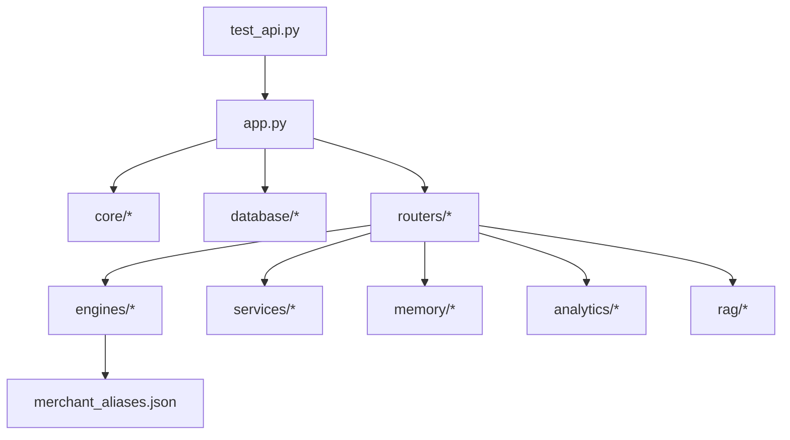
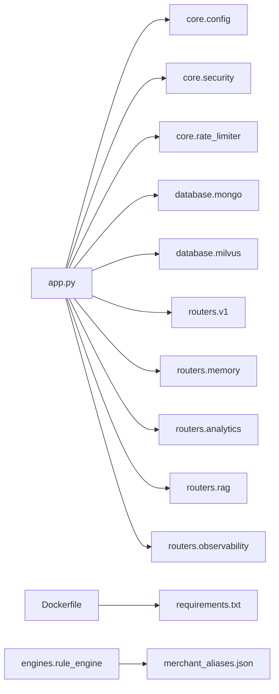
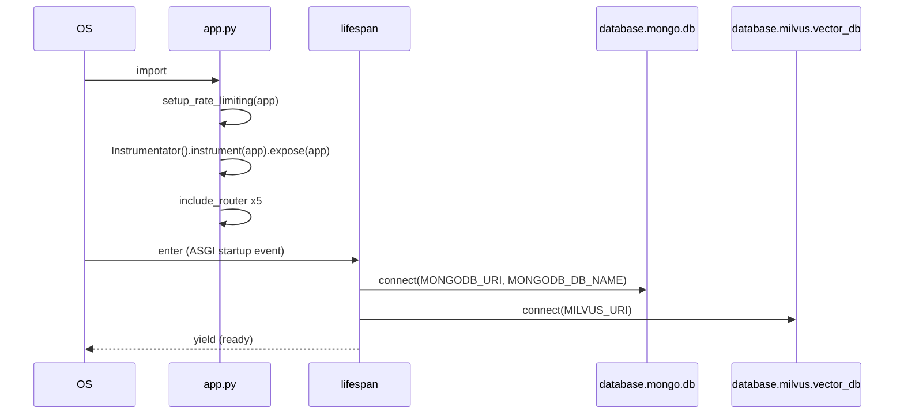

# Folder: `.` (repository root)

## Purpose
Holds the application entry point, container/orchestration definitions, dependency manifests, and static seed configuration that doesn't belong to any single subsystem. This is the composition root of the whole service.

## Responsibilities
- Boot the FastAPI process and wire together every router and lifespan-managed resource (`app.py`).
- Define how the service is packaged and run (`Dockerfile`, `docker-compose_local.yaml`, `docker-compose_production.yaml`).
- Declare Python dependencies (`requirements.txt`, `requirements-linux.txt`).
- Hold the static merchant→category lookup table consumed by the rule engine (`merchant_aliases.json`).
- Host the top-level automated test suite (`test_api.py`).
- Document the system for humans (`README.md`).

## Why this folder exists
Every project needs exactly one unambiguous entry point and one place to look for "how do I run this." Putting `app.py` and the deployment manifests at the root (rather than nested under, say, `src/`) is a deliberate simplicity choice common in small-to-medium FastAPI services — there's no package-namespacing benefit here since the app is deployed as a single container, not published as a library.

## How it interacts with other folders
`app.py` is the only file in the repo that imports from *every* router package (`routers/`) and both database singletons (`database/`). It is the sole consumer of `core/config.py`, `core/security.py`, and `core/rate_limiter.py` at the top level (individual routers/services pull their own `core` and `database` imports independently). `merchant_aliases.json` is read exclusively by `engines/rule_engine.py`. `test_api.py` imports `app` directly, exercising the full router graph transitively.

## Major files
| File | Role |
|---|---|
| `app.py` | FastAPI app, lifespan (DB connect/disconnect), router mounting, `/health`, Prometheus `/metrics`, dev entrypoint |
| `Dockerfile` | Single-stage `python:3.12-slim` build, `pip install -r requirements.txt`, `uvicorn app:app` |
| `docker-compose_local.yaml` | Local dev stack: MongoDB + velar-backend (no Milvus service defined) |
| `docker-compose_production.yaml` | Production stack targeting an external `coolify` network; contains a committed plaintext credential (see Known Issues) |
| `requirements.txt` / `requirements-linux.txt` | Declared dependencies — currently **do not** list the app's actual imports (see Known Issues) |
| `merchant_aliases.json` | Static merchant/category lookup table for the deterministic rule engine |
| `test_api.py` | pytest + `TestClient` suite covering most routers end-to-end |
| `README.md` | Human-facing setup and API overview |

## Important classes
None — the root contains no class definitions. `app.py` is purely procedural/declarative (FastAPI decorators and a lifespan function).

## Important functions
- `lifespan(app: FastAPI)` (`app.py`) — async context manager; `await db.connect(...)` then `vector_db.connect(...)` on startup, mirrored `disconnect()` calls on shutdown. This is the only place either database singleton's lifecycle is managed.
- `public_categorize(request, payload)` (`app.py`) — dead-code duplicate of `routers/v1.py`'s categorize handler; shadowed by router registration order.
- `health_check()` (`app.py`) — pings Mongo, checks Milvus client presence, HTTP-GETs the Ollama URI; aggregates into `healthy`/`degraded`.

## Execution order
1. Python imports `app.py` top-to-bottom: settings load (`core.config`), security/rate-limiter modules load, database singletons instantiate (no connection yet — just class definitions), routers import (each triggers its own dependency chain — e.g. importing `routers.rag` transitively resolves the Ollama host **at import time**, see `core/ollama_client.py`).
2. `logging.basicConfig` sets root logger to `DEBUG`.
3. `FastAPI(...)` instantiated with `lifespan=lifespan`.
4. `setup_rate_limiting(app)`, Prometheus instrumentation, five `include_router` calls, then the inline `/v1/categorize` and `/health` routes are declared.
5. On ASGI server startup, `lifespan` runs: Mongo connects, then Milvus connects (with up to 5 blocking retries).
6. App serves traffic until shutdown, at which point both `disconnect()` calls fire in the same order.

## Dependency graph

## Call graph (startup path only)

## Potential interview questions
- "Why is there a duplicate `/v1/categorize` route, and which one actually runs?" (Tests understanding of FastAPI/Starlette route-matching order — see `docs/16-known-issues-tech-debt.md`.)
- "Walk me through what happens if Milvus is unreachable at startup — does the app crash?" (No — `VectorDB.connect` retries 5x then sets `client = None`, degrading `/health` rather than failing startup. But `core/ollama_client.py`'s host resolution *does* raise and would crash startup.)
- "Why are database singletons implemented as classes with `@classmethod`s instead of instances passed via FastAPI `Depends()`?" (Simplicity trade-off — global mutable state vs. testability/DI purity.)
- "What's the blast radius of `requirements.txt` being wrong?" (Total — the container can't even boot.)
- "Why does importing `routers.rag` at app startup risk crashing the whole app if Ollama is down?" (Eager host resolution in `core/ollama_client.py` at import time, not lazily per-request.)

## Common mistakes
- Assuming `docker-compose_local.yaml` includes Milvus because `README.md` describes a compose file with a `milvus-standalone` service — the committed file only has MongoDB.
- Running `pip install -r requirements.txt` and assuming the app's dependencies are satisfied.
- Adding a new route directly on `app` (like `public_categorize`) instead of inside the appropriate router — creates path collisions and bypasses the router's auth/prefix conventions.
- Forgetting that `logging.basicConfig(level=logging.DEBUG)` applies globally — verbose logs in every environment unless explicitly overridden downstream.

## Why this design is good
- Single, obvious entry point (`app.py`) with no hidden bootstrapping elsewhere — anyone can read one file and understand the full router/middleware surface.
- Lifespan-based resource management is the FastAPI-idiomatic way to handle startup/shutdown of external connections, and it's used correctly here (async context manager, not ad hoc `@app.on_event`).
- Keeping deployment manifests at the root alongside the code they build makes the repo self-describing for a single-service deployment — no need to hunt through a separate infra repo.

## If this folder's contents disappeared
There is no application without `app.py` — the entire service ceases to exist as an importable/runnable program. Without `Dockerfile`/compose files, there is no reproducible way to build or run the service in a container. Without `requirements.txt`, there's no dependency manifest at all (though as documented, the current one is already largely useless for this purpose). Without `merchant_aliases.json`, `engines/rule_engine.py` would start with `self.rules = {}` (it degrades gracefully — logged warning, not a crash) and every categorization would fall through to `Unknown`. Without `test_api.py`, there is zero automated verification of the HTTP surface.
