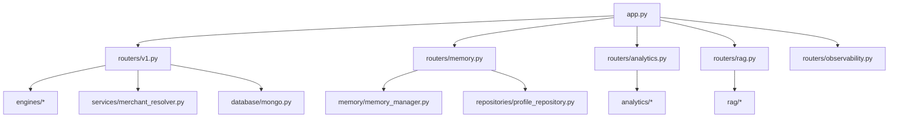
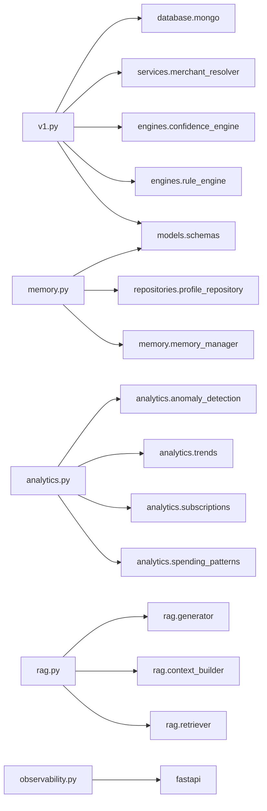
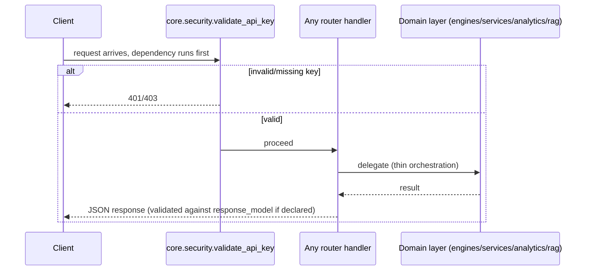

# Folder: `routers/`

## Purpose
The HTTP boundary of the system. Every FastAPI `APIRouter` that gets mounted onto `app` lives here (except `feedback/api_router.py`, which is misplaced in the `feedback/` folder and, notably, never actually mounted — see `docs/folders/feedback.md`). This folder translates HTTP requests into calls against the engines/services/analytics layers and back into JSON responses.

## Responsibilities
- Declare URL paths, HTTP methods, and Pydantic request/response models for every reachable endpoint.
- Perform the thinnest possible orchestration: parse input, call exactly one (or a short sequence of) domain-layer function(s), return the result.
- Group related endpoints under a shared path prefix and OpenAPI tag (`/v1`, `/memory`, `/v1/analytics`, `/v1/observability`).

## Why this folder exists
Separating "how a feature is exposed over HTTP" from "how a feature actually works" is a standard layered-architecture practice. It means `engines/confidence_engine.py` or `analytics/spending_patterns.py` can be unit-tested or reused (e.g., from a script or a future gRPC interface) without any FastAPI machinery involved. In this codebase the separation is real but thin — routers here do essentially zero business logic themselves, which is the correct amount for this layer.

## How it interacts with other folders
Routers are the top of the call stack for nearly everything: `routers/v1.py` calls into `engines/`, `services/`, and `database/` directly; `routers/memory.py` calls `memory/` and `repositories/`; `routers/analytics.py` calls all four `analytics/*.py` engines; `routers/rag.py` calls all three `rag/*.py` stages. `routers/observability.py` is self-contained (no downstream calls at all — pure stubs). `app.py` is the only consumer of this folder — it imports all four modules plus `observability`'s router object and mounts them with a shared auth dependency.

## Major files
| File | Prefix | Reachability |
|---|---|---|
| `v1.py` | `/v1` | Mounted; `/v1/categorize` broken at runtime, `/v1/resolve` and `/v1/confidence/evaluate` work |
| `memory.py` | `/memory` | Mounted; fully functional (modulo the `repositories/profile_repository.py` import bug — see that folder's doc) |
| `analytics.py` | `/v1/analytics` | Mounted; functional but several endpoints depend on unpopulated `behavior_patterns` |
| `rag.py` | `/v1` (adds `/explain`) | Mounted; fully wired end-to-end |
| `observability.py` | `/v1/observability` | Mounted; pure stubs, no real logic |

## Important classes
Only lightweight, router-local Pydantic request models, not reused elsewhere: `ResolveRequest`, `MockModelPrediction` (`v1.py`); `MemoryUpdateRequest` (`memory.py`); `ExplainRequest` (`rag.py`). None of these live in `models/schemas.py` — a minor inconsistency, since some request models are centralized and some aren't.

## Important functions
- **`categorize_transaction`** (`v1.py`) — broken; calls `.get()` on a Pydantic model and assigns module/function objects into a Mongo document (see `docs/16-known-issues-tech-debt.md`).
- **`resolve_transaction_merchant`** (`v1.py`) — thin delegate to `services.merchant_resolver.merchant_resolver.resolve(...)`.
- **`evaluate_prediction_confidence`** (`v1.py`) — thin delegate to `engines.confidence_engine.confidence_engine.evaluate(...)`.
- **`update_memory` / `get_profile` / `get_memory_state`** (`memory.py`) — thin delegates to `memory.memory_manager` / `repositories.profile_repository`.
- **`get_category_patterns` / `get_top_merchants` / `get_subscriptions` / `get_mom_trends` / `check_anomaly`** (`analytics.py`) — thin delegates to the four `analytics/*.py` singletons, using a hardcoded `TEST_USER = "user_123"`.
- **`explain_transaction`** (`rag.py`) — the one router function that orchestrates a real three-stage pipeline (retrieve → build → generate) inline rather than delegating to a single service call.
- **`trigger_drift_analysis` / `fetch_drift_report`** (`observability.py`) — fully self-contained stubs.

## Execution order
Router modules are imported by `app.py` in the fixed order `v1 → memory → analytics → rag → observability`, and `include_router` is called in that same order — this determines route-matching precedence for any path collisions (relevant for the `/v1/categorize` duplicate, since `v1.router` is included before the inline stub is even declared). Within a single request, execution is: FastAPI path routing → `Depends(validate_api_key)` (attached at `include_router` time, so it runs before the handler body) → the handler function itself → downstream domain-layer call(s) → response serialization against the declared `response_model` (where one is set).

## Dependency graph

## Call graph

## Potential interview questions
- "Why does `routers/analytics.py` hardcode `TEST_USER = "user_123"` instead of deriving the user from auth?" (Because `validate_api_key` doesn't actually resolve a real caller identity in any usable way — its return value, `"developer_id_789"`, is discarded since it's used via `dependencies=[...]` not `Depends(...)` bound to a parameter. There's no multi-tenant plumbing yet.)
- "Why is `routers/rag.py::explain_transaction` allowed to orchestrate three service calls inline, while every other router just delegates to one function?" (Arguably a design inconsistency — a `rag_service.explain(...)` facade would match the thin-router pattern used elsewhere; worth asking whether this was deliberate or organic.)
- "`feedback/api_router.py` looks and behaves exactly like the modules in this folder, but lives in `feedback/` instead. What does that suggest happened during development?" (Strongly suggests it was written but never finished being wired in — a good prompt to check `app.py`'s `include_router` calls before assuming a router is live.)
- "Which router endpoint is most dangerous to call in production right now, and why?" (`POST /v1/categorize` — it will 500 on every call due to the `.get()` bug; `/v1/observability/drift/analyze` is safe but misleading since it claims success while doing nothing.)

## Common mistakes
- Assuming every file that defines `router = APIRouter(...)` is reachable — always cross-check against `app.py`'s `include_router` calls (`feedback/api_router.py` is the counterexample).
- Treating `routers/analytics.py`'s `TEST_USER` constant as a template for real user-scoping — it's a testing shortcut, not a pattern to replicate.
- Calling `POST /v1/analytics/anomaly/check` with a JSON body — it takes `merchant`/`amount` as query parameters despite being a `POST`.
- Assuming router-level `dependencies=[Depends(validate_api_key)]` (set at `include_router` time in `app.py`) is visible by reading the router file alone — it isn't declared in `routers/*.py` at all, only in `app.py`.

## Why this design is good
- Consistent thinness across (most of) the routers makes the HTTP layer easy to audit — a reviewer can quickly confirm a router isn't hiding business logic that should be testable independently of FastAPI.
- Grouping by feature area (`v1`, `memory`, `analytics`, `rag`, `observability`) rather than by HTTP verb or generic CRUD gives the OpenAPI docs (`/docs`) a navigable, feature-oriented structure out of the box, purely from `tags=[...]` and `prefix=...`.
- Attaching the auth dependency once per `include_router` call in `app.py`, rather than repeating `Depends(validate_api_key)` on every individual route, avoids an entire class of "forgot to protect this endpoint" bugs.

## If this folder disappeared
`app.py` would fail to import (`from routers import v1, memory, analytics, rag` and `from routers.observability import router`), so the application could not start at all. Even if `app.py` were rewritten to not import them, there would be no HTTP surface whatsoever — the entire feature set (categorization, resolution, memory, analytics, RAG explanation, observability stubs) would only be reachable by direct Python import/REPL use, not over the network. This folder *is* the product's API.
