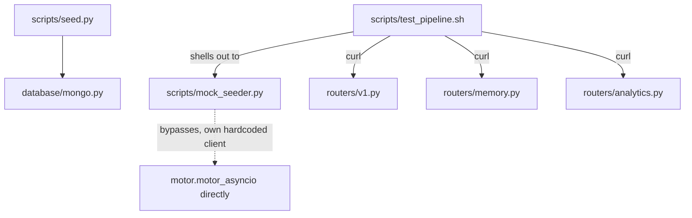
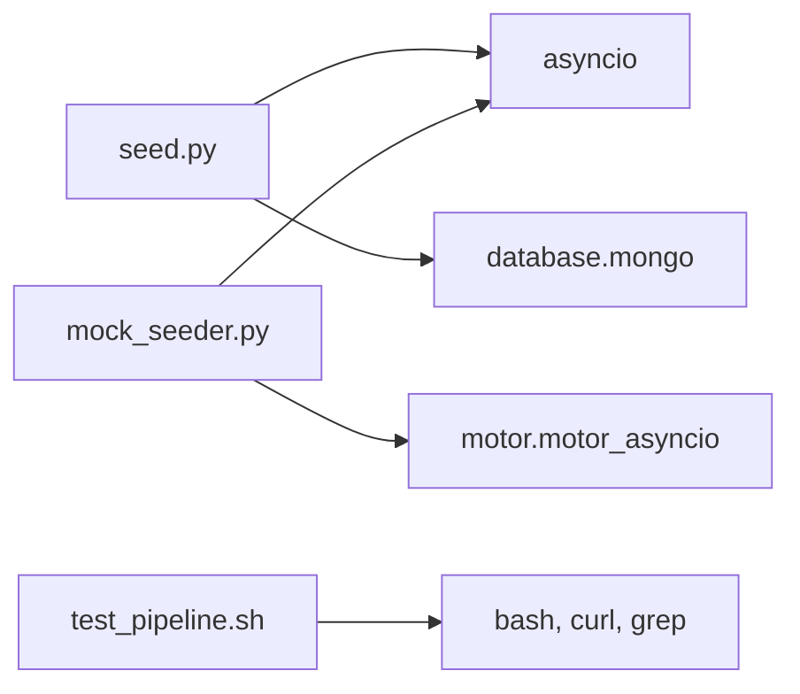
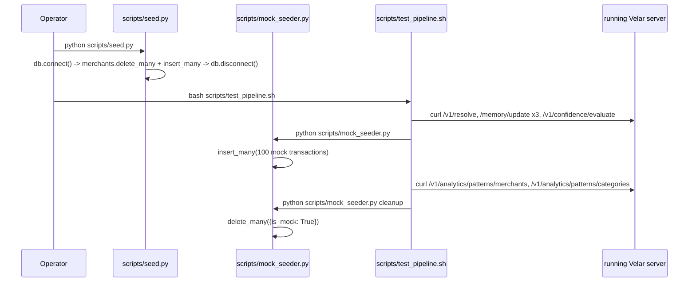

# Folder: `scripts/`

## Purpose
Manual, operator-invoked utilities for bootstrapping data and smoke-testing the running API. Nothing here is imported by the application itself — everything is a standalone entry point run with `python scripts/<file>.py` or `bash scripts/test_pipeline.sh`.

## Responsibilities
- Seed canonical merchant/alias records so `services/merchant_resolver.py` has data to match against (`seed.py`).
- Inject and clean up realistic, clearly-flagged (`is_mock: True`) synthetic transactions for exercising the analytics engine (`mock_seeder.py`).
- Drive a full curl-based end-to-end smoke test against a running server (`test_pipeline.sh`).

## Why this folder exists
The application has zero automatic data-bootstrapping (no migrations, no `on_startup` seed logic) — every collection starts empty. This folder exists to fill that gap manually, since a fresh MongoDB instance otherwise leaves nearly every endpoint returning trivial "Unknown"/empty results. Keeping these as separate, explicitly-invoked scripts (rather than folding seeding into `app.py`'s lifespan) is the correct choice — you never want production startup to silently reseed or inject mock data.

## How it interacts with other folders
`seed.py` imports `database.mongo.db` and writes directly to the `merchants` collection — but calls `db.connect()` with **no arguments**, relying on `MongoDB.connect`'s fallback to `settings.MONGODB_URI`/`settings.MONGODB_DB_NAME` (this works because `connect` explicitly defaults `uri`/`db_name` to `None` and falls back to `core.config.settings` internally). `mock_seeder.py` deliberately does **not** import `database/mongo.py` at all — it constructs its own raw `AsyncIOMotorClient` against a hardcoded `MONGO_URI = "mongodb://localhost:27017"`, bypassing `core.config.settings` entirely. `test_pipeline.sh` doesn't import anything (it's bash) but drives HTTP calls against every router in `routers/` and shells out to `mock_seeder.py`.

## Major files
| File | Purpose | Idempotent? |
|---|---|---|
| `seed.py` | Seeds `merchants` (Swiggy, Zomato, Netflix + aliases) | Yes — `delete_many({})` then `insert_many(...)`, safe to rerun |
| `mock_seeder.py` | Injects/cleans up 100 mock `transactions` for `user_id: "user_123"` | Yes — `cleanup` mode deletes exactly what `seed` mode marks `is_mock: True` |
| `test_pipeline.sh` | Curl-driven E2E smoke test | Mostly — creates a fresh `Zomato`-named memory profile each run rather than a unique name, so state accumulates across runs unless memory data is reset |

## Important classes
None — every file in this folder is procedural (top-level `async def seed()`/`cleanup()` functions or, for the shell script, sequential `curl` commands).

## Important functions
- **`seed.py::seed()`** — `db.connect()` → clear and repopulate `merchants` → `db.disconnect()`.
- **`mock_seeder.py::seed()`** — generates 100 transactions across a random pool of 10 merchant/category pairs, random amounts (₹50–2500), random dates within the last 60 days, all tagged `is_mock: True`.
- **`mock_seeder.py::cleanup()`** — `delete_many({"user_id": "user_123", "is_mock": True})`.
- **`test_pipeline.sh`** — sequential curl calls: resolve → memory update ×3 (to trigger `TEMPORARY` promotion) → confidence evaluate → invoke `mock_seeder.py` → analytics queries → invoke `mock_seeder.py cleanup`.

## Execution order
These scripts have no relationship to `app.py`'s startup at all — they must be run manually, and in a specific order relative to each other for a fully realistic demo: `seed.py` (merchants) should run before exercising `/v1/resolve` meaningfully; `mock_seeder.py` should run before exercising `/v1/analytics/*`; and `behaviour/behavior_engine.py` (not itself a script — no CLI wrapper exists for it) would need to run after `mock_seeder.py` and before `/v1/analytics/subscriptions`/`anomaly/check` for those specific endpoints to return non-trivial results. `test_pipeline.sh` encodes part of this ordering (seed mock data → query analytics → clean up) but not the `behaviour/` step, since that step has no script entry point at all.

## Dependency graph

## Call graph

## Potential interview questions
- "Why does `mock_seeder.py` construct its own MongoDB client instead of using `database/mongo.py`?" (No stated reason in the code — likely written independently/earlier, or deliberately avoiding the app's settings-driven connection in favor of a hardcoded local default for quick manual testing. Worth flagging as inconsistent with how the rest of the codebase accesses Mongo.)
- "`test_pipeline.sh` always uses the literal merchant name `'Zomato'` for its memory-engine test. What happens if you run it twice in a row?" (The `Zomato` profile's `frequency` keeps incrementing across runs rather than starting fresh at `EPHEMERAL` each time — after enough runs, it would already be `PERMANENT` before the script's own encounters even begin, changing the state-transition assertions' meaning silently.)
- "Why tag mock transactions with `is_mock: True` instead of just deleting all transactions for `user_123` during cleanup?" (Protects against accidentally deleting real, non-mock data that might legitimately exist for that same test user ID — a defensive habit worth having even in a test/seed script.)
- "`test_pipeline.sh` hits `http://localhost:8080` by default. Does that match how the app is actually started elsewhere in this repo?" (No — `Dockerfile`'s `CMD` and `docker-compose_local.yaml`'s internal port are `8000` (external `9850`), and `app.py`'s dev entrypoint also uses `8000`. `README.md`'s manual `uvicorn` instructions use `8080`. This script's `BASE_URL` needs manual adjustment depending on how you started the server — a small but real friction point.)

## Common mistakes
- Running `mock_seeder.py` against a different MongoDB instance than the one the app is actually configured to use — it hardcodes `mongodb://localhost:27017`, ignoring `.env`'s `MONGODB_URI` entirely.
- Forgetting to run `mock_seeder.py cleanup` after manual testing, leaving synthetic `is_mock: True` transactions mixed into `user_123`'s data (though `is_mock` at least makes them identifiable for later manual cleanup).
- Assuming `test_pipeline.sh`'s `BASE_URL=http://localhost:8080` matches your local setup — check which port you actually started the server on first.
- Assuming these scripts are exercised in CI — there is no CI configuration in this repository; these are 100% manual-invocation tools.

## Why this design is good
- Keeping seed/mock data generation as standalone scripts, entirely separate from application startup, is the correct safety boundary — there's no risk of a misconfigured environment variable accidentally triggering destructive `delete_many`/`insert_many` calls against production data during a normal deploy.
- Tagging synthetic data with an explicit `is_mock` flag is a simple, effective convention that makes cleanup safe and auditable, and is a good practice worth replicating in any future seed scripts.
- `test_pipeline.sh` reading `VELAR_API_KEY` from a local `.env` (with a documented fallback) makes it portable across environments without hardcoding a secret directly into the script.

## If this folder disappeared
No impact on the running application itself (nothing in `app.py` or any router imports from `scripts/`). The practical impact would be entirely operational: there would be no way to seed canonical merchant data for `/v1/resolve` to find beyond `"Unknown"`, no easy way to inject realistic mock transaction volume for testing the analytics engine, and no scripted end-to-end smoke test to run after making changes — every one of those steps would need to be done by hand via raw `curl`/Mongo shell commands.
